# 应用详情

为了更深入地理解内容浏览的性质，你决定调查公司 X 的桌面应用。你发现他们通过提供大约十个通用顶级类别来引导用户完成浏览过程。在每个顶级类别下，大约有 100 个子类别。选择子类别后，你可以看到内容对象，据你观察，数量可达数千个。

桌面应用使用的交互模型非常直接。你看到一个选项网格，每个主要类别都占据网格中的一个单元。选择一个类别后，网格会刷新，显示子类别项目。选择一个子类别后，网格再次刷新，显示你可继续可视化浏览的内容对象，此时你可以在该子类别所含内容对象的多个页面之间导航。

你还注意到，该应用在管理这种空间导航时有些笨拙。虽然有全局导航的概念，但它只在你至少深入一层体验时才出现。当深入到内容级别时，你只能访问顶级类别。在你看来，这是一个重大疏忽：用户如果不完全退出，就无法导航回上一级或切换到其他类别。此外，在内容级别，用户缺乏上下文信息；浏览内容对象时，并不清楚你当前处于哪个子类别。

需要特别指出的是，当你经历这样的过程（例如审查现有应用或其他用户体验）时，你应该记得花时间记录你的观察和想法。你的笔记可能对指导新交互模型的开发大有裨益。正如我们在本章早期的实验中看到的，即便是看似微不足道的想法种子，也可以毫不费力地扩展成一个更大的概念。在某些情况下，你可能希望将基于这些观察得出的一些基础性思考纳入你的交互建模文档中，以支持你可能提出的想法。

就本案例研究而言，你应特别记录公司 X 内容层次结构的性质，因为这很可能对你的解决方案的性质产生重大影响。因此，在审查应用后，你感觉到他们的内容结构可以这样理解（参见图 6-15）：

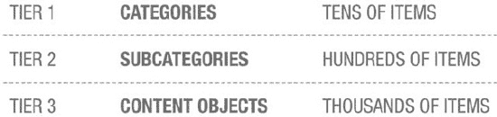

**图 6-15.** 公司 X 的内容结构及其对对象浏览的影响

这似乎是整体结构的准确呈现。你注意到当前交互模型的一个根本问题是，用户必须始终退出层次结构的第三层，才能回到子类别或类别导航。这似乎不太对劲。但这只是冰山一角。你仍然不确定这种网格模型是否适用于 iPhone 体验，但鉴于导航模型的视觉特性，你决定尝试一下。

鉴于我们已经构想了一个网格概念，让我们尝试重复利用这个概念。让我们使用之前尝试过的相同的交互机制，并将其应用于在层次结构中移动的概念（参见图 6-16）。

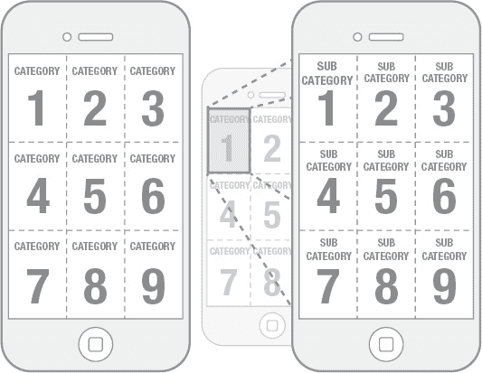

**图 6-16.** 显示导航到第二层对象的网格概念

这个模型与现有应用体验有非常密切的关系，因为它明确使用了对象网格。这可能对已经熟悉桌面应用的用户有利。然而，在这个模型中，我们必须应对平台的限制，特别是屏幕尺寸，因此我们将主视图限制为二乘二的配置。在桌面应用中，网格是十乘至少十五，具体取决于你应用窗口的宽度。

与我们创建的其他示例一样，这个模型可以支持展开手势或简单的点击来向下导航类别。在这种情况下，我们稍微不同地使用了展开阈值。我们不是将该阈值设置得相对较高以创建中间状态，而是希望展开阈值非常低。一旦系统解读到手势，我们就希望过渡到下一个类别。

这个交互模型的关键在于用户穿越层次结构时呈现的视觉过渡。我们希望内容感觉像是嵌套在其子类别中，而子类别又嵌套在其顶级类别中。当你展开一个单元时，你会看到底层内容浮现并填充空间。这非常直接地代表了信息在应用内的组织方式，并且极大地帮助向用户呈现一个非常清晰的模型。

不幸的是，这个模型存在一些问题，其中最不严重的是关于向上导航回层次结构的问题。你可以使用反向手势向上导航一层，但这至少可以说显得不整洁且笨拙。因此，尽管这个概念具有一些非常有趣的视觉交互潜力，但这些交互并不能很好地映射到应用的需求上。换句话说，这个解决方案不可扩展；这是我们需要警惕的重大危险信号之一。

另一个担忧是，该模型代表了一个双手操作的解决方案，意味着用户必须一只手拿着手机，用另一只手来导航应用。这未必是坏事，但考虑到我们最终为之设计的移动场景，这并非理想解决方案。

那么，我们还可以探索哪些其他替代方案呢？让我们再次退后一步，思考一下列表的可能性。列表非常适合单手操作，并且可以结构化地非常简单地管理层次级别的导航。这一事实使得它们在 iPhone 上的应用几乎是普遍适用的解决方案，但这将是一种差异化程度非常低的解决方案。有没有不同的方式来处理这个新的列表概念？

我们之前将列表概念推向了极端，所以也许这次我们可以更直接一些，想办法包含一些额外的价值。我们不需要为了与众不同而差异化，至少在还有需要解决的问题时不必如此。之前的交互模型没有有效地支持向上返回层次结构的导航，所以这次我们需要解决这个问题。桌面应用中还观察到类别上下文的问题；也就是说，很难确定你当前的位置，更不用说你必须完全退回到顶层才能进入另一个类别了。让我们仔细分析一个可能解决这些问题的模型。

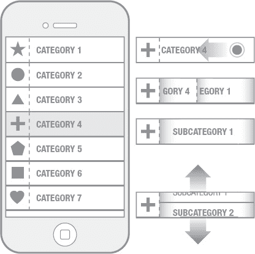

**图 6-17.** 一个具有独特交互的典型列表。用户可以向左滑动，以显示隐藏在原始列表元素下的第二层对象列表。

好的，我们这里有一个解决方案，乍一看是一个相当简单的类别列表，可以通过上下滚动来浏览。然而，这个方案在许多方面偏离了标准的 iOS 列表处理方式。前两层的导航在同一个基本视图中管理。如果用户选择一个列表元素，不会导航到另一个屏幕，而是列表元素本身会显示下一层子类别（参见图 6-17）。所以，基本上我们只是对列表项实现了一个状态变化，以在可用区域内暴露另一层导航。用户可以在这个区域内滚动浏览子类别，同时通过出现在该区域上方的类别标签来保持上下文。与此同时，用户仍然可以看到并访问顶级类别。

触发列表元素的状态变化可以通过直接在列表项上向左滑动来完成，或者我们可以指定一个离散的目标来触发显示子类别的展开动画。如果我们决定实现这个设计，有必要探索这两种选项，以了解哪种交互感觉更自然，哪种更不容易出错。

这个模型呈现了一种非常高效的浏览技术，其主要优点是使用户能够同时访问层次结构的前两层，但这里也存在一些显著的挑战。将子类别的浏览限制在屏幕的较小部分本身效率不高，尤其是当我们一次最多只能看到两个项目时。除此之外，这个特定的模型只处理到子类别级别的导航；内容层需要使用另一个可以利用最大可用空间的模型。因此，这个解决方案可能同样不适用于公司 X 的应用。

有没有一种方法既能向用户提供同样级别的导航灵活性，又能让可用内容占据更显著的位置？先前的设计方案还使用了不成比例的屏幕空间来显示顶级类别，这感觉有点违反直觉。让我们也尝试找到一个提供方便单手操作的解决方案。请记住，需求说明我们需要为用户提供一种快速高效浏览其内容的方法。

让我们继续在列表概念上工作，但这一次，我们来思考为列表添加一些不同的属性，这些属性可能使浏览更流畅。在这种情况下，屏幕上没有离散状态变化的概念。这是一个更动态的解决方案，能够响应用户的交互。

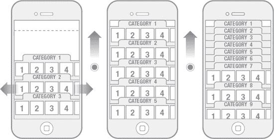

**图 6-18.** 结合第一层和第二层对象以提供更快的内容访问。用户垂直滚动浏览第一层，水平滚动浏览第二层。

这个概念与其他概念略有不同，因为在其初始状态中，我们为专用导航和其他需要考虑的核心功能预留了一些空间。你会注意到我没有在该模型中说明那些特定的功能。原因很简单：交互建模练习并不需要也不应该展示应用的所有细节。这项工作的主要目的是帮助你开始构思将构成应用体验基础的高级交互。考虑到这一点，你需要集中精力首先解决内容浏览问题，同时为辅助交互提供高级考虑。

这个模型从一个初始状态开始，显示有限数量的顶级类别，为一个实用区域留出空间，该区域在我们项目后期规划其余用户界面时会派上用场。在这个模型中，顶级类别仅被视为标签，为用户提供对第二层组织的即时访问。用户可以在查看第二层的同时快速浏览所有顶级类别（参见图 6-18）。这为用户提供了对所有类别组织的非线性访问。

要从应用的初始状态暴露更多类别，用户只需将对象数组滚动到屏幕顶部。当类别到达其在屏幕上的边界极限时，它们会折叠起来，为显示其他类别腾出空间。用户无需采取任何直接操作来让类别折叠；类别会根据其在屏幕上的位置自动折叠。其效果类似于手风琴的风箱。

子类别级别的内容浏览也能很好地映射到这个模型。当用户在第一视图中选择一个子类别时，他们会被过渡到一个内容网格，该网格可以支持像我们在顶层看到的额外内容分类，也可以是一个无标签的网格（参见图 6-19）。查看内容只需用户在网格上做出选择，然后他们就会进入内容的全屏视图。

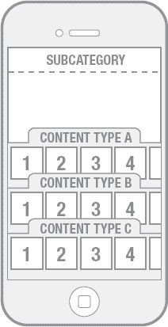

**图 6-19.** 在这个模型中，只需一次触摸即可展示内容。

向上返回层次结构的导航在屏幕顶部管理。就本模型而言，这可以简单如一个返回按钮，也可以复杂如一个面包屑导航路径。重要的是，从交互模型的角度来看，我们有一个机制来处理导航控制。

有了这个解决方案，我们现在可以回到公司 X 的关键利益相关者那里，向他们详细解释这个模型。交互模型文档出色地从用户角度解释了这些交互的好处，同时展示了该应用如何与竞争对手区分开来。所有这些都是在无需制作详细线框图、设计原型或功能原型的情况下完成的。

既然你已经了解了基本流程，并看到了它能实现什么，请自行练习一些概念，看看它能带你走到哪里。

### 摘要

#### 惊艳因素

为你的应用营造惊艳感，意味着你正在尝试设计一种能够引发用户特定反馈的解决方案。这种反馈可以定义为用户与应用的互动超越某个关键情感阈值的时刻。要确保跨越这一情感阈值，你的设计必须满足三个基本目标：

- **即时冲击力：** 设计必须能够立即引发用户的反应。
- **新颖性或可辨识差异的认知：** 用户必须能够识别出特定设计的新颖性，或至少察觉其与传统体验的不同之处。
- **积极反馈：** 解决方案必须具有内在吸引力，以缓解可能因陌生或奇特体验带来的冲击。

当你的设计在以下三个属性中至少有一个表现出色时，就能实现上述目标：

- **外观：** 这描述了特定设计方案的美学属性，通过屏幕结构、布局、渲染以及其他构成应用静态视觉的元素来体现。
- **交互机制与行为：** 这指的是与应用程序界面元素交互所需的物理操作、独特手势或其他动作。
- **视觉交互、动态与动画：** 这些指代设计方案中赋予其生命力的响应式或动态元素。它们可能通过用户输入的反馈或响应，与特定的交互机制或行为紧密相关，但也涵盖了设计中的环境氛围，甚至与交互无直接关联的过渡状态。

专注于单个属性也能实现目标，但力求兼顾三者则更有可能成功。

#### 交互建模

交互建模是一种方法，通过它你可以制定出构成应用体验基础的基本交互机制和关键视觉交互。这可以分解为四个关键的线性活动，在进行交互建模本身之前，必须先完成前三项：

- **需求定义**
- **用例和/或场景开发**
- **应用工作流**
- **交互建模**

创建一个高度差异化的交互模型颇具挑战，但有一些基本技巧可以使过程更高效：

- **抽象化：** 将已知的交互、用户界面控件及其他交互组件还原至其基础逻辑层面。
- **重构与复用：** 利用基础逻辑重构视觉交互，并探索如何在你的应用中加以运用。
- **验证：** 对照现有工作流检验该交互的可行性。
- **解决：** 通过思考空间、时间和状态的其他映射方案，解决交互中的概念冲突及限制，并相应地进行修改。
- **扩展：** 寻找能够将你的交互扩展到应用所有功能领域的方法。
- **记录：** 记录你的思考过程，并广泛地记录你的探索。
- **重复：** 重复此过程，直到满意为止。
- **归档：** 创建清晰的文档，以文字描述并辅以视觉方式说明你逐渐成型的交互模型。

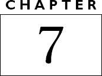

### 控件映射与触摸屏人体工学

触摸屏无疑比几年前更为普及，但即便已成为主流，对于如何正确处理与这些设备的物理交互，人们仍然缺乏足够的理解。市面上许多应用拥有非常酷的功能，但从人体工学角度来看，其设计之糟糕令人震惊。这些应用或许看起来足够吸引人而让人下载，但使用起来却如此别扭和不舒服，以至于很快就会被用户从设备上删除。别让这种情况发生在你身上！在为 iPhone 或 iPad 进行设计时，花点时间回顾一些基本的考量因素是非常值得的。如果你花时间理解了本章概述的概念，你将拥有一个坚实的基础，从而做出正确的设计决策。

#### 对物理性的认知

本书到目前为止所讨论的内容，大多关注于创造突破性的想法和概念，但本章将偏离这些关注点，转而探讨一些基本原则，这些原则将有助于确保你的应用成功。

你们许多人可能是首次为移动领域进行设计，但在其他环境下的应用设计方面已有相当丰富的经验。除了全面了解输入和输出的限制之外，为移动设备进行设计还意味着你必须意识到与操作这些设备相关的物理性和运动机能学。如果你曾为 Web 或客户端应用进行过设计或开发，我想你大概从未考虑过用户与输入设备的物理交互会如何影响你的设计。这是因为与桌面系统的交互在很大程度上被视为理所当然。键盘、显示器和鼠标的基本形态在过去 30 年间几乎没有改变。这些基本上是固定的硬件输入，你对此几乎没有控制权，因此你当然无需在担心应用工作流的同时，还要考虑鼠标的人体工学。

过渡到移动设备要求你将设计思维拓展到传统边界之外。我们现在面对的情况是，不再使用固定的硬件输入来控制应用，而是在虚拟环境中以高度灵活性来呈现控件。基本输入方式是触摸，但这种触摸可以指向任意数量的、任何形式、任何位置的控件。这几乎相当于，除了专注于应用本身的设计活动之外，你现在还需要为所创建的每一个应用重新设计键盘和鼠标！这为设计师打开了众多可能性，但并非所有这些选择都是好的。

### iPhone

iPhone 小巧的外形使其易于单手掌握，它是当代移动计算的精髓。用户可单手操控所有实体按键。设备上四个按钮和一个开关的物理控件布局经过了深思熟虑。这些实体控件的摆放位置暗示了设备只有一种主要握持方式，尽管我们知道实际情况并非如此。

鉴于你正试图创建差异化的交互模型，你很有可能找到一个能满足所有目标、但最终使用起来并不舒适或实用的潜在方案。如图 7-1 至 7-6 所示，iPhone 存在六种基本握持模式，你在设计应用时应始终加以考虑。这并不意味着你的应用布局需要适配每一种模式（尽管能做到会很好），而是说你的设计至少应针对一种握持模式进行优化。

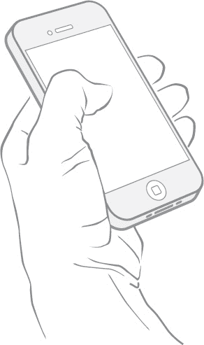

图 7-1：单手竖持 iPhone。

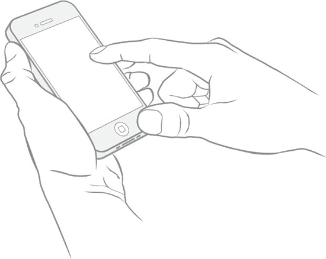

图 7-2：单手辅助竖持 iPhone。

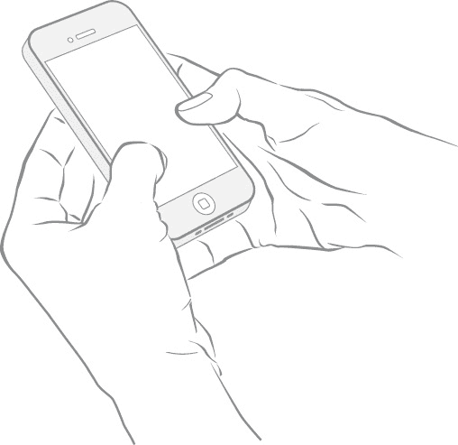

图 7-3：双手竖持 iPhone。

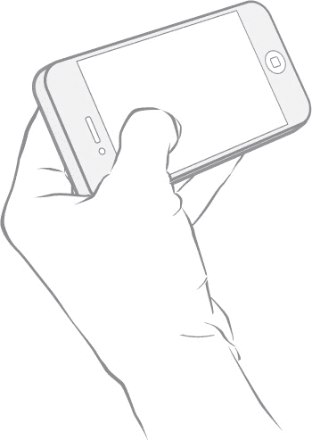

图 7-4：单手横持 iPhone。

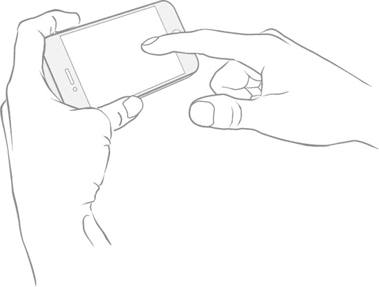

图 7-5：单手辅助横持 iPhone。

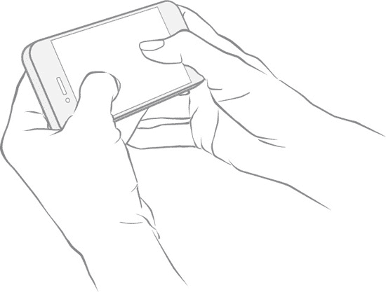

图 7-6：双手横持 iPhone。

显然，握持和操作 iPhone 的方式远不止这六种，但我认为它们代表了最可能遇到的典型场景。每种握持方式都可能影响控件的布局或手势机制的设计。用户手部位置和设备方向会对交互的整体效率产生巨大影响。尽早并频繁地尝试所有这些握持姿势，以了解它们如何影响或改变你的设计方案。

### iPad

在物理交互方面，iPad 呈现出略有不同的情况。iPad 明显大于 iPhone，正如我在第 4 章中介绍的那样，它针对的是不同的使用场景，这很可能对其最终形态起到了决定性作用。我们知道 iPad 更侧重于休闲导向的计算体验。这种体验通常需要用户投入更长的使用时间，这给我们带来了以下需要应对的场景：

- 这是一款更大的设备
- 它被用于更长时间的使用

这两个因素意味着，很少有 iPad 会被单手使用的场景。我并不是说不可能单手使用（尤其是在放在平面上时），但所有双手使用的场景要重要得多。让我们看看图 7-7 至 7-10 中所展示的双手使用模式：

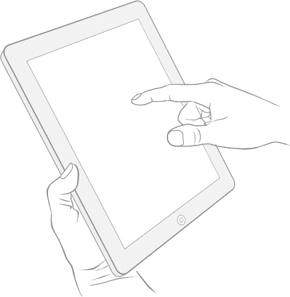

图 7-7：竖持 iPad（单手辅助）。

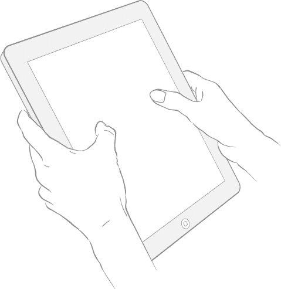

图 7-8：竖持 iPad（双手握持）。

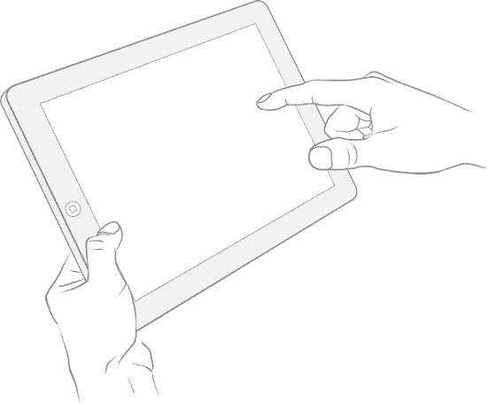

图 7-9：横持 iPad（单手辅助）。

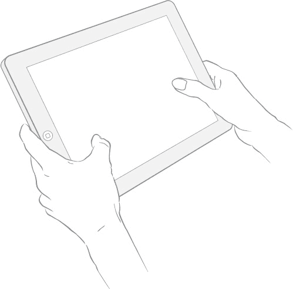

图 7-10：横持 iPad（双手握持）。

与 iPhone 一样，在设计时需要留意控件位置与用户可能握持设备方式之间的关系。

### 基本布局考量

我在第 2 章中简要提到了尺寸和间距的概念，但由于这是一个非常重要的主题，值得更详细地回顾，以便你能就用户界面的布局和控件的呈现方式做出明智决策。澄清一下，我所说的“控件”是指所有出现在 iOS 设备屏幕上的可交互对象。

在设计任何基于触摸的控件时，有两个基本因素需要考虑：

- **尺寸**：所设计控件的触摸区域大小
- **间距**：该控件与周围其他用户界面元素的接近程度

这些概念同样适用于 iPhone 和 iPad，并且在某种程度上与显示分辨率无关。之所以说“某种程度上”，是因为 iPad 和 iPhone 的整体分辨率密度已经足够高，分辨率不再是一个关键因素。

因此，我们有两个基本关注点：目标尺寸和目标间距。在 iPhone 时代之前，我会对触摸目标的大小给出非常明确的建议。直到几年前，传统的观点还认为，触摸目标不能小于某个特定的最小尺寸，否则会给用户带来严重的可用性问题。这个最小尺寸通常被定为 1 cm² 到 1.5 cm² 之间。想想看，那是一个相当大的按钮，比 iOS 的应用图标还要大。此外，当时的建议还要求触摸目标之间也应间隔相同的最小面积；也就是说，每个轴向上至少有 1 厘米的间隙。这有其原因。驱动某些较旧触摸屏系统的技术并不那么精确。在许多情况下，触摸感应机制在空间上与实际显示屏存在偏移。为了拥有可用的系统，你必须考虑各种可能的差异，包括触摸传感器未对齐以及偏移表面带来的视差。此外，用户也需要心理上的保障，即控件足够大，看起来易于触摸。

幸运的是，我们不再需要处理所有这些问题了。然而，你仍然需要注意尺寸和间距，以免给用户带来过多挑战。尺寸本身并不是一个大问题。iOS 设备中使用的电容式触摸技术高度精确且分辨率高。你可能在 iPhone 上浏览网页时已经注意到了这一点。即使不放大视图，你也能用小指边缘点击网页上那些很小的链接。因此，我并不想对触摸目标的最小尺寸过于教条，至少不能脱离实际情况。理解间距才是关键所在。

间距之所以重要，是因为触摸目标彼此越近，用户出错的可能性就越大。这应该是常识。但同样，我认为我们也不需要对手间距绝对教条，因为在我看来，绝对数值既不实用也不相关。

以下是考虑控件间距的方式：

- **触摸目标之间的间距应与相邻目标的大小成反比（见图 7-11）。**

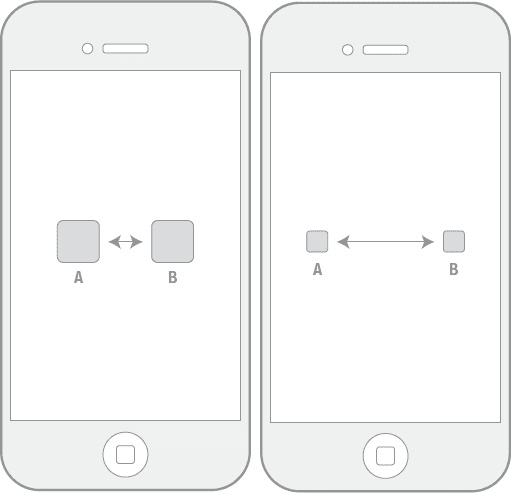

图 7-11：触摸目标之间的间距应与相邻目标的大小成反比。

也就是说，触摸目标越大，它们之间的排列可以越紧密。反之，触摸目标越小，它们之间的间距应该越大。较小的目标更难点击，当密集排列在一起时，容易导致用户操作失误。大的目标易于点击，因此可以排列得更紧密，用户出错的概率也更低。

所以，尽管去尝试：把按钮做成单个像素那么大也可以，只是要知道，当一切尘埃落定时，它很可能就是屏幕上唯一的按钮！

### 反馈与响应

我想补充几点关于时机和响应的内容，因为它们可能适用于设计中的交互。我之前已经探讨了如何运用时间概念来解决潜在的设计问题，以及为什么动画始终是需要考虑的重要因素。但在此，我将更详细地探讨如何思考对输入的响应。

为用户的操作提供有效反馈是任何完善设计解决方案的基础。反馈确认事件已发生，并且系统已捕捉到该事件。通常，这表现为对代表特定控件交互点的图形应用简单的状态变化。从这个意义上说，反馈服务于一个非常实用的目的，在任何交互场景中都有效。

然而，反馈也提供了另一个设计差异化的点，如果处理得当，可以为应用增添一层情感共鸣。因此，除了交互模型的差异化方法之外，还要对模型本身嵌入的单元级交互保持敏感。我这么说的意思是，你仍然需要意识到特定交互（例如点击按钮）的细节如何影响你的整体设计方案。

我从首次转向移动领域的设计师那里听到的最常见抱怨之一是缺少"经过"或"悬停"状态。设计师认为这是个问题，因为`over`状态带来了一些有趣的创意可能性。事实是，`over`只是一种反馈机制，在其他地方还有很多机会融入优雅且富有创意的反馈。让我们想想触摸屏场景中最基本的事件：触摸本身。大多数情况下，传统触摸事件反馈方法只是对控件外观进行简单的状态更改。我认为，缺乏超越基本外观切换的创造性思维，是先前技术的遗留问题——在那些技术中，"鼠标按下"或"鼠标点击"事件凌驾于所有其他系统活动之上，从而限制了可能发生的视觉交互。iOS 通过将状态设为控件本身的固有属性，允许轻松实现基本反馈，从而加剧了这种惯例。

现实世界中的触摸概念意味着反应和反馈。我们生活在一个由既定物理定律支配的世界。我们应该借鉴自己在这个世界中的经验，为界面设计中的响应性质提供依据。认识到这一点，我们可以对设备上的触摸事件应用更多东西，为用户增加真实感或趣味性。我们不仅可以改变控件的外观，还能随时间推移改变这种外观。你能将动画反应应用到你的单元级交互中吗？当然可以。我们能在执行手势操作时，为屏幕上的接触点提供实时的视觉反馈吗？当然。

如果你计划将更强大的反馈和响应集成到设计中，请始终对时机保持敏感。时机指事件触发的速度、显示的速度以及显示效果的持续时间。这些都是非常重要的因素，因为你需要了解动画或效果如何影响任务的整体流程。如果用户必须等待一个序列结束，系统才能过渡到工作流程的下一个点，那么用户可能会感到沮丧。与其他任何事物一样，沮丧和投入之间可能只有一线之隔，所以始终准备好完善你的解决方案，以求恰到好处。

### 隐藏控件的提示

总会有一些用户界面解决方案要求你主动管理屏幕上控件的呈现。我指的是高度状态驱动的用户界面，用户必须先调用控件集合，然后才能对这些控件执行操作。这类用户界面解决方案可能存在问题，因为它们向用户隐藏了控件。从可用性的角度来看，这似乎违反直觉，但在许多合理的情况下，这种做法很有用。

让这类解决方案成功的关键在于，认识到必须为显示控件的操作提供某种提示或暗示。这可能很简单，比如在应用首次启动时让所有隐藏的控件集可见，让用户知道它们的存在，然后以某种方式将它们动画移出屏幕。你甚至可以在初始启动状态下向用户提供明确指示，描述这些功能以及将它们重新召唤到屏幕上所需的交互。这在用户需要执行特定手势（而不仅仅是轻点屏幕）的情况下尤其有用。

当控件处于隐藏状态时，包含一个微妙的、透明的图标或其他视觉指示器来标识控件的位置可能会很有用。你还可以利用时间和状态，因此提示可能在工作流程的关键点出现，或按预设的时间间隔出现。

一旦用户熟悉了你的应用，这些提示将不再需要，因此可以考虑在应用内或"设置"应用中提供一些用户控制来管理此功能。记得告知用户他们可以控制这一点，以免日后感到沮丧。

### 总结

让我们回顾一下本章关于控件映射与触摸屏人体工程学的内容：

-   始终考虑你所设计设备的物理属性，以及这些属性可能如何影响应用程序的使用。
-   在应用内映射控件时，注意控件的尺寸和间距。触摸目标之间的间距应与相邻目标的尺寸成反比，以最大程度减少用户出错的可能性。
-   将动态视觉反馈集成到应用中有许多方法。不要忽视单元级交互；该层面可以应用许多创造性的可能性。
-   如果你的设计方案包含隐藏控件的可能性，请始终提供提示机制，以传达能显示该控件集的行为。

## 易用性与功能自动化

这最后一章将讨论自动化，我认为这是过去几年用户体验设计中一个非常有趣的方面。自动化的想法引人注目，因为它主动尝试向用户隐藏与应用程序操作相关的关键细节。广泛的自动化正开始进入各种类型的消费类应用，并且它是一种新兴技术，与移动和便携式使用场景都有高度相关性。

我将概述一些基本指导，以帮助你了解在何处以及如何将功能自动化应用于用户体验，以及在此过程中需要考虑哪些因素。

### 为何需要自动化？

我们正处于一个技术变革极其迅猛的时代。正如第 3 章所回顾的，这正导致用户认知和期望发生重大转变，并且从整体来看，随着市场的发展，用户已变得愈发成熟。

由此产生的显著趋势之一，便是用户渴望在所有类型的软件中获得更强的控制力。这种控制既可以发生在应用内相当精细的层面（例如功能细节得到更充分的展现），也可以发生在更高层面（例如用户在使用过程中自行决定应用内显示哪些功能）。在许多情况下，随着用户对应用的使用变得愈发熟悉和娴熟，他们自然会寻求对应用拥有更多控制权，并希望优化自己的工作流程。从用户体验的角度来看，交互设计师常常发现自己需要在应用中暴露更多可由用户定义的参数，以满足用户日益增长的掌控欲。

然而，这只是问题的一个方面。另一方面，则是后台自动化运作的程度不断提高，极大地简化——或至少澄清了——我们与技术的交互。在让产品更易用的不懈追求中，自动化堪称交互设计的巅峰，它让交互退居幕后，让系统承担起更多控制责任。但坦白说，这目前还不是一条普遍适用的公理。

许多 iOS 应用所固有的自动化程度，与设备本身极高的技术密度直接相关。我之所以说“高技术密度”，是因为这些设备不仅包含计算和交互所需的全部组件，还集成了多种通信技术。再加上大量的额外输入与传感技术，就构成了一台技术密度极高的设备。当你将计算、通信与进出设备的其他所有数据结合起来时，就能开始做一些非常有趣的事情，而其中最基本的，就是为用户优化工作流程。

在本章中，我会从抽象层面提及辅助技术，但仍有必要概述一下这些技术是什么，以便你思考它们可能对你的用户体验产生何种影响。这些技术包括：

##### GPS 卫星数据

-   用户的空间和时间位置
-   长时间跨度下的宏观运动、速度与加速度
-   运动矢量

##### 三轴加速度计

-   设备的方向与旋转
-   相对于先前位置的微观运动、速度与加速度，其精度远超 GPS

##### 陀螺仪传感器

-   设备方向

##### 数字指南针

-   相对于地球磁场的设备方向
-   运动矢量

##### 距离传感器

-   物体与设备表面的距离

##### 摄像头

-   图像捕捉
-   视频捕捉

##### 麦克风

-   音频捕捉

需要明确的是，自动化为用户提供了许多显著的好处，如果运用得当，它可以帮助用户跨越情感门槛，体验到应用令人惊艳的元素。

### 何时适用自动化

当我在应用的语境中谈论自动化时，我指的是消除用户为执行特定工作流程所需执行的离散步骤、任务或决策点。消除这些元素的目的，是为了简化用户的整体工作流程。我认为可以这么说，一般而言，简化后的工作流程更容易操作，而“更容易”正是你应该持续追求的目标。

然而，从用户角度来看已经简化的工作流程，并不意味着设计师达成这个解决方案很容易。从设计角度看，从工作流程图中移除一个步骤并宣告完成是件容易的事，但这不是正确的做法。

只有当辅助传感和输入技术允许你对用户在特定工作流程中的特定位置处的意图做出非常合理的推测时，自动化才会变得适用。在几乎所有情况下，解析系统对用户行为的假设都是一项极具挑战性的技术任务——以至于可能根本不值得去做。作为交互设计师，你需要与你的开发人员和工程师密切合作，识别出工作流程中那些可能由辅助技术支持的点位。

这个想法如何以及应用于应用的何处，应该作为你用户体验策略的一部分来加以规划。请注意，自动化可以在多种不同层面、以多种不同方式应用于设计方案。你可能有一款应用，其核心价值主张就在于无需用户干预，仅凭设备当前位置就能显示天气信息。这种情况下，自动化的理念是其价值主张的基础。但你也可以在更精细的层面使用自动化技术。我们以 iOS 为例。用户可以通过多种方式持握 iOS 设备（参见第 7 章）。当用户改变设备方向时，所查看的内容会自动重新调整方向并排版，以适应新的持握方式。这就是自动化的体现。

让我们考虑一下另一种情况。即使没有加速度计或指南针，重新定向的任务也可以通过界面中包含的方向切换控件来实现。但由于我们确实具备判断方向的能力，我们可以假设：当物理方向发生变化时，用户希望以新的视角查看内容。在这种情况下，自动化并非价值主张的核心驱动力；它只是一个无需与特定控件交互的单一特性。

除了关键的工作流程改进之外，是否加入自动化特性的关键指标之一，是功能细节的高度复杂性。同样，这很大程度上也是一个与具体上下文相关的问题，但如果你正在为缺乏技术素养的消费者用户画像进行设计，你几乎总是希望减少应用中呈现的功能细节数量。例如，如果你正在设计一款相机应用，你或许在技术上具备暴露非常精细的 ISO 设置和光圈控制的能力。这很好，但该应用的目标最终用户可能不熟悉这些设置的操作。在这种情况下，你可能需要考虑将功能整合成适用于常见摄影场景的预设方案。更进一步，你或许需要寻找方法，根据环境因素和相机捕捉到的图像特性，来自动激活相应的预设。

一如既往，iPhone 的移动使用场景应为您提供塑造设计决策的视角。移动办公、多任务处理以及利用冲动行为，都意味着您在功能呈现上应采取非常精简的方法。此外，iPhone 缺乏足够的物理空间来展现高度密集的功能。因此，您可能希望在可能的情况下，更多倾向于自动化。

iPad 更大的外形尺寸及其相关的使用模式表明，不同的思维模式可能更为相关，但作为交互设计师，您的特权应始终引导您找到更优雅的解决方案，这些方案很可能包含通过使用辅助传感技术实现的增强功能。

请记住，网络连接在此也扮演着重要角色。iPad 和 iPhone 都具有强大的计算能力，但来自辅助传感技术的信息综合可能超出了应用自身能处理的范畴。复杂的自动化可能需要连接更大规模的系统。某些操作，例如复杂的图像处理，可能需要卸载到基于云的服务上，以便在应用内提供所需的性能水平。

## 如何处理功能自动化

到目前为止，我回顾的大部分内容实际上只关注了功能自动化的一种方法。这就是我们寻求在流程的适当节点绕过用户控制的情况。然而，还有一种可能同样重要的更细致的方法。

分解来看，思考应用中功能自动化有两种基本方式：

- **绕过用户控制**：基于关于用户意图的关键假设，直接移除用户需要的特定输入
- **增强用户控制**：基于关于用户意图的关键假设，主动简化或主动引导用户控制

这两种方法都需要您对几个关键领域进行明确分析，以完全理解您可以实现某个功能自动化的程度。首先从查看这些细节开始：

- 用户在应用中的流程位置
- 所有与流程或任务相关的可能的用户意图
- 设备提供的与用户意图相关的可用数据
- 根据已知意图验证意图或综合应用结果所需的数据处理

如您所见，这些活动都聚焦于理解您能确定多少用户意图。当意图已知，或者当可以推断出意图时，您就可以将适当程度的功能自动化应用到您的应用中。

### 总结

虽然应用复杂性和用户熟练度都在提升，但易用性仍是首要任务。从交互设计的角度来看，只要有机会，简化和优化交互、流程或应用总是有意义的。对于移动应用尤其如此，它们可以从精简的操作方式中显著受益。

iOS 设备上丰富的技术提供了无与伦比的数据量，可用于帮助实现应用多个方面的自动化。这在技术上可能具有挑战性，但必须将挑战与自动化可能为用户带来的潜在利益进行权衡。

功能自动化有潜力产生高度的情感冲击。当与差异化的外观、视觉交互和行为结合使用时，您几乎可以保证获得您所追求的“惊艳”效果。

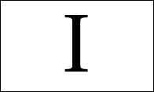

## 索引

### A, B

自动化, 125

增强用户控制, 130

绕过用户控制, 130

摄像头, 127

数字指南针, 127

GPS 卫星数据, 126

陀螺仪传感器, 127

麦克风, 127

接近传感器, 127

三轴加速度计, 127

工作流程, 127–129

### C, D, E, F

轮播视图空间模型, 19

Core Animation, 62, 67

Core Graphics, 62, 67

### G

手势, 13–14

### H

人机界面指南 (HIG), 1

审美完整性, 5

缺点与局限, 4–5

市场碎片化, 2, 3

内存可用性, 2

平台特性, 3

处理器能力, 2

标志性交互, 3

智能手机, 2

主题, 3

### I, J

交互建模, 69

应用工作流程, 73

对象数组, 78

桌面应用, iPhone

娱乐, 92

全局导航, 96

需求, 93, 95

揭示概念, 99

子类别, 96

超级擦除器概念, 101, 102

层级概念, 97

视觉过渡, 99

文档, 90–91

横向列表选项, 77

iOS 空间模型, 75

列表对象, 76

多轴和行滚动, 80

问题解决技巧, 80–88

动画, 81

行为, 88

交互, 87

模式, 88

潜在交互模型, 84

缩放文本 *vs.* 截断文本, 82

时间, 81

截断文本 *vs.* 跑马灯文本, 83

需求, 72

滚动行为, 79

标志性交互, 88–90

用例与场景开发, 73

垂直滚动, 79

工作流程, 74

“惊艳”因素定义, 70

iPad

iPad 横向使用

单手使用, 117

双手使用, 118

休闲导向的计算体验, 115

iPad 纵向使用

单手使用, 115

双手使用, 116

iPhone

现代移动计算, 108

iPhone 横向使用

单手使用, 113

单手持握, 112

双手使用, 114

iPhone 纵向使用

单手使用, 110

单手持握, 109

双手使用, 111

### K, L

- 杀手级应用，45
- 重要性，46–47
- 移动体验 *vs* 便携体验，47–49
- 翻译，56–57
- 用例，49
- 商业，53–54
- 通信，50–51
- 娱乐，52
- 基于位置的服务，53
- 综合与移动相关性，55–56
- 实用工具，54–55

### M, N

- 富有隐喻的图形用户界面，8

### O, P, Q, R, S

- `OpenGL ES`，67
- `OpenGL ES` 含义，63

### T

- 触控屏，107
- 控制间距，120
- 反馈与响应性，121–122
- 隐藏控件，122
- iPad
    - 水平使用 iPad，117
    - 垂直使用 iPad，115
- iPhone，108
    - 水平使用 iPhone，112
    - 垂直使用 iPhone，109
- 实体感，107
- 目标接近度，119
- 目标尺寸，119

### U, V

- `UIKit`，61–62，67
- 用户体验，31
    - 自定义皮肤，64
    - 解构，7
    - 应用模式，27
    - 品牌与身份弱化，26
    - 轮播视图空间模型，20
    - 受限的控制映射，25
    - 受限的控制数量，25
    - 内容对象，9
    - 控件清晰度，26
    - 默认平面，17，18
    - 直接操作，11–12
    - 有限导航，25
    - 手势约束，27
    - 手势，13–14
    - 层级约束，27
    - 主屏幕按钮，14–16
    - 隐式保存，27
    - 交互模型，16
    - 隐喻 *vs* 实用性，8–10
    - 移动与交互行为，21
    - 操作系统卸载，26
    - 渐进式呈现，26
    - 简洁性，25
    - 状态持久化与恢复，26
    - 叠加平面，17，18
    - 底层平面，17，18
    - 用户界面抑制，26
- 差异化
    - 转变的认知与期望，32–33
    - 可用性与采纳度，33–35
- 移动网络解决方案，66
- 策略
    - 应用体验，41
    - 竞争对手，40–41
    - 定义，36–37
    - 产品差异化，37–38
    - 用户画像，39–40
- 技术
    - 核心动画，62
    - 核心图形，62
    - `OpenGL ES`，63
    - `UIKit`，61–62
- 通用应用，65

### W, X, Y, Z

- WiiMote，33
