# 关于作者

 **马丁·特劳特肖德**是 Made Simple Learning 的创始人兼首席执行官，该公司是 Apple iPad、iPhone、iPod touch、BlackBerry、Android 和 Palm webOS 图书及视频教程的领先提供商。自 2001 年以来，他一直是移动设备培训与软件行业的成功企业家。通过 Made Simple Learning，他利用简短精炼的视频教程帮助培训了数千名智能手机用户。马丁现已合著了二十多本“Made Simple”系列指南图书。他还共同创立并运营了一家移动设备软件公司三年，随后将其出售。在此之前，马丁在美国和日本从事了 15 年的技术与商业咨询工作。他拥有普林斯顿大学的工程学学位和西北大学凯洛格管理学院的 MBA 学位。马丁与妻子朱莉娅育有三个女儿。他喜欢在佛罗里达州代托纳比奇与哈利法克斯赛艇协会一起划船，并和朋友们一起骑行。可通过 `martin@madesimplelearning.com` 联系马丁。

 **加里·马佐**是 Made Simple Learning 的副总裁。加里于 2008 年加入 Made Simple Learning，并合著了 Made Simple 系列中的后十九本书。加里与马丁以及来自 CrackBerry.com 的凯文·米查鲁克共同撰写了《CrackBerry：黑莓使用与滥用的真实故事》——一本关于黑莓成瘾以及如何掌控黑莓使用的书。加里还在凤凰城大学教授写作、哲学、技术写作等课程。他拥有布兰迪斯大学的人类学学士学位。加里获得了希伯来文学硕士学位，并在俄亥俄州辛辛那提的希伯来联合学院-犹太宗教研究所被任命为拉比。他曾服务过俄亥俄州代顿、新泽西州樱桃山以及马萨诸塞州科德角的教会团体。不写作或教学时，加里喜欢骑行和弹钢琴。加里与格洛丽亚·施瓦茨·马佐结婚，育有六个孩子。可通过 `gary@madesimplelearning.com` 联系加里。

## 关于技术审校

 雷内·里奇是 TiPb.com 的编辑，该网站是专注于 iPhone、iPod touch 和 iPad 的博客，涵盖全面的新闻、操作指南以及应用、游戏和配件评测。作为 Smartphone Experts 网络的一部分，TiPb 还提供全面的帮助和社区论坛，并拥有一个活跃的 YouTube 频道（[`www.youtube.com/theiphoneblog/`](http://www.youtube.com/theiphoneblog/)）、Facebook 页面（[`www.facebook.com/tipbcom/`](http://www.facebook.com/tipbcom/)）以及 Twitter 关注者（[`http://twitter.com/tipb`](http://twitter.com/tipb)）。作为一名平面设计师、网页开发者和作家，雷内在蒙特利尔生活和工作。可通过 `rene@tipb.com` 或在 Twitter 上通过 `@reneritchie` 联系他。

## 第一部分

## 快速入门指南

您手中拿着的，是自初代版本以来最令人兴奋的设备之一：全新的 iPad 2。本快速入门指南将帮助您和您的全新 iPad 2 快速启动并运行。您将了解所有按钮、开关和端口。您还将学习如何使用创新且反应灵敏的触摸屏，以及如何使用新的应用切换器栏进行多任务处理。我们的应用参考表格会向您介绍内置应用以及来自 App Store 的一些有价值的应用——并为您提供快速了解如何完成某项任务的途径。我们还会向您展示一些流行的配件，帮助您更好地利用 iPad。

## 快速入门指南

本快速入门指南旨在成为这样一个工具——一个能帮助您快速上手、在本书中查找信息，并学习基本操作，从而立即享受使用 iPad 乐趣的工具。

我们从“熟悉您的设备”部分的基础知识开始——了解 iPad 上所有按键、按钮、开关和符号的含义及功能。您将看到一些实用的功能，例如如何双击 `Home` 按钮进行多任务处理；如何配置 `旋转锁定/静音` 开关；以及如何在菜单、子菜单和设置开关中进行交互——您在 iPad 上几乎每个应用中都会用到这些操作。您还将了解如何查看连接状态，以及在飞机上旅行时该如何处理。

**提示：** 请查看第 2 章：“打字技巧、复制/粘贴与搜索”以获取绝佳的打字技巧等更多内容。

在“触摸屏基础”部分，我们帮助您学习如何触摸、滑动、轻拂、缩放等操作。

在“应用参考表格”中，我们将应用图标组织成通用类别，以便您快速浏览图标并跳转到书中的相应章节，以了解更多关于特定图标所代表的应用的信息。以下是表格：

*   快速上手（表 2）
*   保持井然有序（表 3）
*   享受娱乐（表 4）
*   保持信息灵通（表 5）
*   社交网络（表 6）
*   高效工作（表 7）

在“其他有趣功能”部分，我们向您展示了电子相框功能以及如何在 iPad 上欣赏视频。

在“iPad 配件”部分，我们简要概述了一些您可能会感兴趣的常见配件。

那么，让我们开始吧！

### 熟悉您的设备

为了帮助您熟悉 iPad，我们从基础知识开始——按钮、按键和开关的功能——然后介绍如何启动应用和浏览菜单。iPad 上最重要的状态指示器（除了电池之外）可能就是左上角显示网络状态的指示器。您将了解如何快速识别网络状态图标。

#### 按键、按钮和开关

图 1 展示了您可以使用 iPad 上的按钮、按键、开关和端口执行的所有操作。继续尝试一些操作，看看会发生什么。尝试按住 `降低音量` 键两秒钟，双击 `Home` 按钮，使用 `旋转锁定/静音` 开关，以及按住 `电源/睡眠` 键。尽情熟悉您的设备吧。

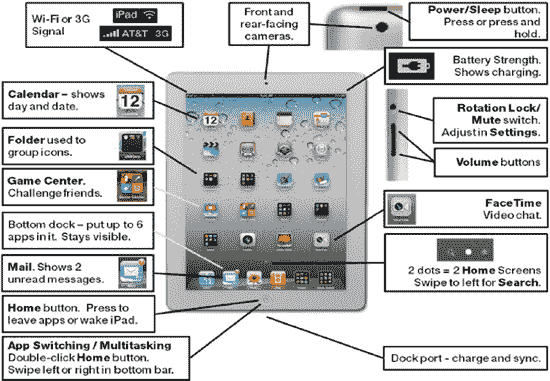

**图 1.** *iPad 2 的按钮、端口、开关和按键*

#### 锁定屏幕旋转或使 iPad 静音

当您开始触摸 iPad 时，您会注意到屏幕旋转速度惊人地快。但有时您不希望它旋转（这称为`旋转锁定`或有时称为`方向锁定`）——例如，当您将其放在腿上或桌子上时。位于 iPad 右上边缘、音量按钮上方的开关可设置为执行两种不同的功能。一种功能启用`旋转锁定`，而另一种功能则允许您将设备`静音`。（例如，您可以将来电`FaceTime`视频通话的铃声静音。）您可以在“设置”应用中调整此侧边开关要使用的功能。在该应用中，选择`通用  使用侧边开关  旋转锁定`或`静音`。有关如何使用此开关的更多详细信息，请参阅第 8 章：“多任务处理与静音/锁定开关”。

#### 启动应用与使用软键

有些应用在屏幕底部设有软键，例如图 2 所示的`iPod`应用。

要让`iPod`应用中的软键正常工作，你的 iPad 上必须存有内容（如音乐、视频和播客）。请参阅第 3 章：“与 iTunes 同步”，了解如何同步音乐、视频等内容。按照以下步骤使用`iPod`应用中的软键：

1.  轻点`iPod`图标，启动`iPod`应用。
2.  轻点底部的`专辑`软键，查看专辑。
3.  轻点`艺术家`软键，查看艺术家列表。
4.  尝试`iPod`及其他应用中的所有软键。

**提示：** 你可以通过软键的突出显示（深灰色或彩色）来判断哪个被选中，未选中的软键则显示为浅灰色或白色。

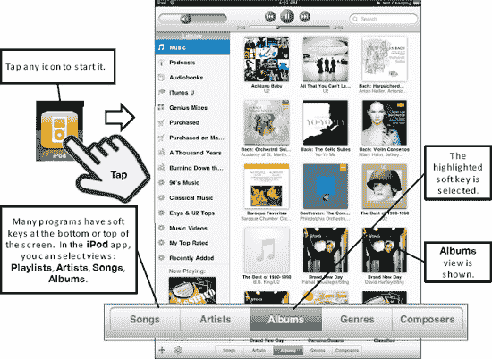

**图 2.** *在应用中操作软键*

#### 菜单、选项与开关

进入程序后，只需轻点即可选择任何菜单项。在`设置`应用中，轻点左栏中的任意项目，右栏便会显示更多选项。轻点带有`大于号`符号（`>`）的任意项目，即可进入另一个包含可调节选项的屏幕，例如`每张照片显示时间`（见图 3）。

**提示：** 如果菜单项旁边有`大于号`符号（`>`），说明其下还有选项列表。

如何返回上一级屏幕或菜单？轻点`选项`屏幕左上角显示上一级屏幕名称的按钮。例如，如果你在`每张照片显示时间`屏幕中，可以轻点`相框`按钮。

你会在 iPad 上看到许多开关，例如图 3 中`面孔放大`旁边的开关。要设置开关（例如从`开`切换到`关`），只需轻点它即可。

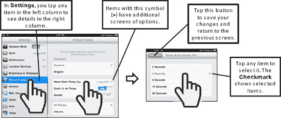

**图 3.** *选择菜单项、浏览子菜单及设置开关*

#### 解读连接状态图标

由于 iPad 上的大部分功能（如电子邮件、网页、`App Store`和`iTunes`）只有在连接互联网时才能使用，因此你需要了解何时处于连接状态。学会解读状态栏可以节省时间，避免困扰。

**蜂窝（3G）数据信号强度（1-5 格）：**

| **强** |  |
| 弱 |  |
| 无线电关闭——飞行模式 |  |

**Wi-Fi 网络信号强度（1-3 个符号）：**

| **强** |  |
| 弱 |  |
| 关闭 |  |

通过查看 iPad 顶部状态栏的左端，你可以判断是否已连接到网络以及连接的大致速度。表 1 显示了可能看到的内容。

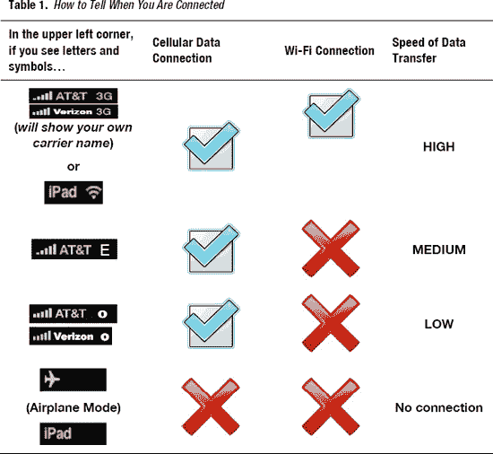

第 5 章：“Wi-Fi 与 3G 连接”将介绍如何将 iPad 连接到 Wi-Fi 或 3G 蜂窝数据网络。

#### 携带 iPad 出行——飞行模式与 Wi-Fi

乘坐飞机时，乘务员通常会要求你在起飞和降落时关闭所有便携式电子设备。进入巡航高度后，他们会告知可以重新开启“所有经批准的电子设备”。

你可以通过按住 iPad 右上边缘的`睡眠/唤醒`按钮直到滑块出现来关闭 iPad。然后用手指滑动`滑动来关机`开关。

如果你使用的是 3G/蜂窝数据版 iPad，可以按以下步骤在`设置`图标中开启`飞行模式`：

1.  轻点`设置`图标。
2.  将左栏顶部的`飞行模式`旁边的开关设置为`开`。

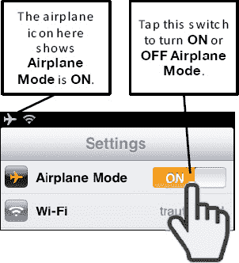

**提示：** 有些航空公司确实提供机上 Wi-Fi 网络；在这种情况下，你可能希望保持 Wi-Fi 开启。

关闭 Wi-Fi 连接也很简单（见图 4）：

1.  轻点`设置`图标。
2.  轻点左栏顶部的`Wi-Fi`。
3.  将右栏顶部的`Wi-Fi`旁边的开关设置为`关`。

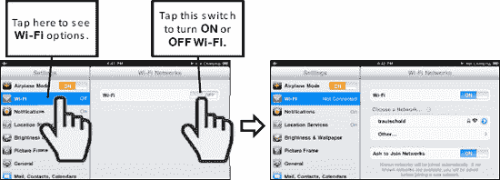

**图 4.** *将 Wi-Fi 设置为`关`或`开`*

### 多任务处理或应用切换

iPad 的一大出色功能是能够*多任务处理*，即在应用之间跳转，同时让音乐等任务在后台继续播放（见图 5）。

更多信息请参阅第 8 章：“多任务处理与静音/锁定开关”。

双击`主屏幕`按钮，调出屏幕底部的`应用切换器`应用。然后向右滑动，查看更多正在运行的应用图标。轻点你想要启动的任何应用的图标。如果没有看到想要的图标，则轻点`主屏幕`按钮查看整个`主屏幕`。重复这些步骤可以跳回刚刚离开的应用。好处是，你刚离开的应用始终显示在`应用切换器`栏的第一个位置。向左滑动可查看音乐控制以及你为侧边开关设置的功能的相反项。例如，如果你将侧边开关设置为`旋转锁定`，那么这里会显示`静音`控制（反之亦然）。

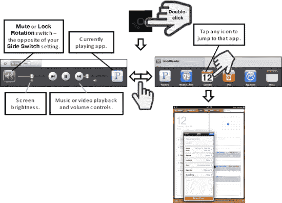

**图 5.** 双击`主屏幕`按钮可在 iPad 上切换应用或多任务处理。

### 触控屏基础

本节介绍如何与 iPad 触控屏进行交互。

#### 触控屏手势

iPad 拥有极其灵敏和直观的触控屏。以制造易于使用的 iPhone、iPod touch 和 iPod 而闻名的苹果公司，推出了一款出色的更大尺寸触控设备。

如果你习惯于物理键盘和轨迹球或触控板，或者 iPod 直观的滚轮，那么掌握这个触控屏需要花些功夫。不过，稍加练习，你很快就能舒适地操作 iPad。

通过组合使用以下方式，你可以在 iPad 上完成几乎所有操作：

*   触控屏*手势*
*   轻点屏幕上的图标或软键
*   轻点底部的`主屏幕`按钮

以下部分将介绍各种手势。

### 轻点和轻拂

要启动应用、确认选择、选择菜单项或选择答案，只需轻点屏幕。要在联系人、列表和`列表`模式下的音乐资料库中快速移动，可左右或上下轻拂以滚动浏览项目（见图 6）。

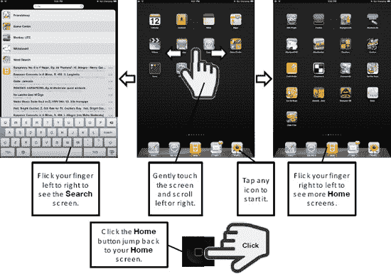

**图 6.** *基本的触控屏手势*

### 轻扫

轻扫时，轻轻触摸并移动手指（见图 7）。你也可以用这种方式在打开的`Safari`网页和图片之间切换。轻扫同样适用于列表，例如`通讯录`列表。

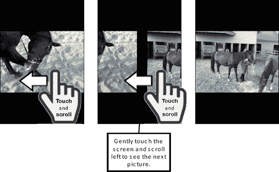

**图 7.** *触摸并轻扫可在图片和网页之间切换。*

#### 滚动

只需轻点并滑动手指即可在屏幕上移动或滚动（见图 8）。你可以在信息（电子邮件）、`Safari`网页浏览器、菜单等场景中使用此手势。

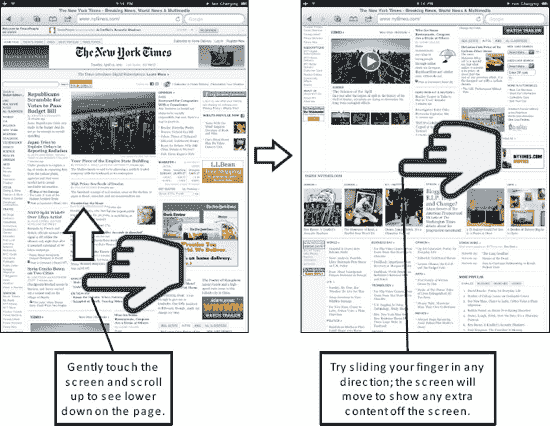

**图 8.** *触摸并滑动手指可在网页、放大后的图片等视图内滚动。*

#### 双击缩放

你可以双击屏幕放大，再次双击则缩小。此功能适用于许多场景，如网页、邮件信息和图片（见图 9）。

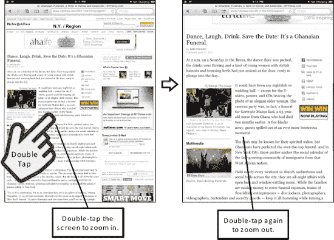

**图 9.** *双击放大或缩小*

## 捏合

您也可以通过双指捏合或张开来进行缩放。该手势在诸多场景下均适用，例如网页、邮件和图片（参见图 10）。请按照以下步骤使用捏合手势：

1.  若要放大，将两个手指同时放在屏幕上。
2.  逐渐展开手指。屏幕随之放大。
3.  若要缩小，将两个手指分开放在屏幕上。
4.  逐渐收拢手指直至相触。屏幕随之缩小。

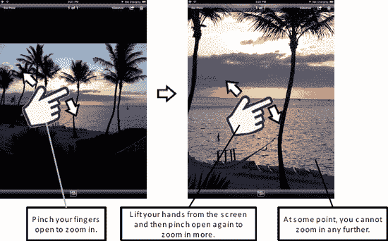

**图 10.** *张开双指以放大，捏合双指以缩小。*

### 双指旋转

此技巧适用于所有`iWork`应用（`Pages`、`Numbers`和`Keynote`）。如果您已开启`辅助功能`  `Web 转子`或`语言转子`，此功能也同样有效。同时用两个手指触摸一张图像，然后在屏幕上旋转您的手部即可旋转图像（参见图 11）。在`照片`应用中，此操作也可暂时生效，但当您松手后，图像会恢复到原来的方向。

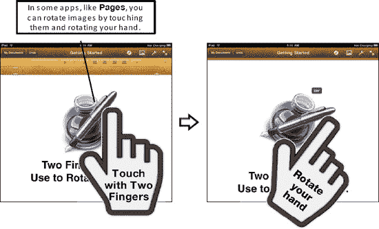

**图 11.** *双指扭转以旋转图像。*

## 应用参考表

本节为您提供了若干表格，将您 iPad 上的应用以及其他可下载的应用分组整理成方便的参考表。每个表格都提供了该应用的简要说明，并告知您在哪里可以找到本书中关于它的更多信息。

### 入门指南

表 2 提供了一些快速链接，帮助您将 iPad 连接到网络（使用 Wi-Fi 或 3G）、购买和欣赏歌曲或视频（`iTunes`、`iPod` 和 `视频`）、退出应用、休眠、关机、解锁 iPad、使用电子相框功能等等。

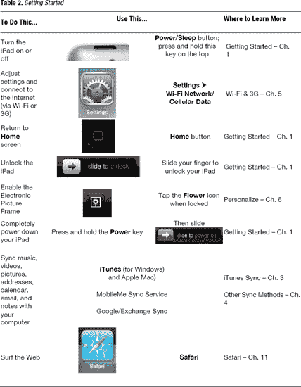

### 保持条理

表 3 为您提供了从整理和查找联系人到管理日历，从阅读和回复电子邮件到获取驾车路线等各方面的链接。

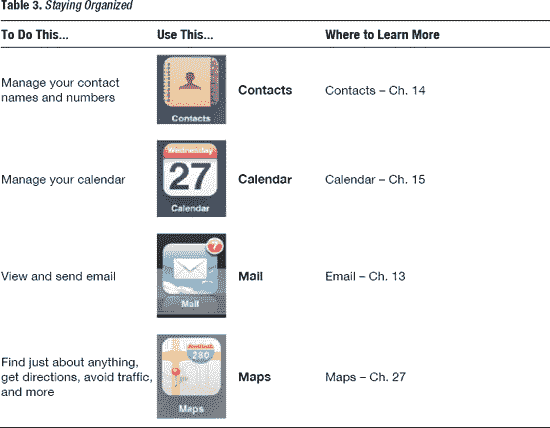

### 享受娱乐

您的 iPad 能带来无穷乐趣；表 4 将向您展示如何实现。您可以购买或租赁电影，通过 `Pandora` 收听免费的互联网广播，还可以使用 `iBooks` 购买书籍并以全新的方式享受阅读。如果您已经在使用 Kindle，可以将所有 Kindle 书籍同步到您的 iPad 上立即阅读。从 App Store 超过 35 万个应用中进行选择，让您的 iPad 变得更加出色、有趣和实用。从 Netflix 或 iTunes 服务中租赁一部电影并立即下载，以便稍后观看（例如在飞机或火车上）。如果您有喜欢的 ABC 电视节目，很有可能您可以通过 `ABC` 应用找到并观看它。

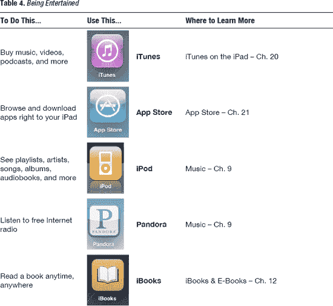

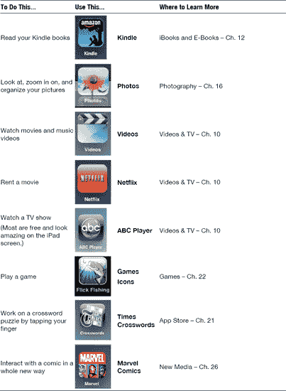

### 保持资讯灵通

您还可以使用 iPad 来保持信息灵通。例如，您可以用它来阅读您喜爱的杂志或报纸，其中包含最新的、生动的图片和视频（参见表 5），或者以前所未有的方式查看最新天气。您能做的远不止浏览网页——您还可以使用 iPad 上的 `Safari` 与之进行交互。

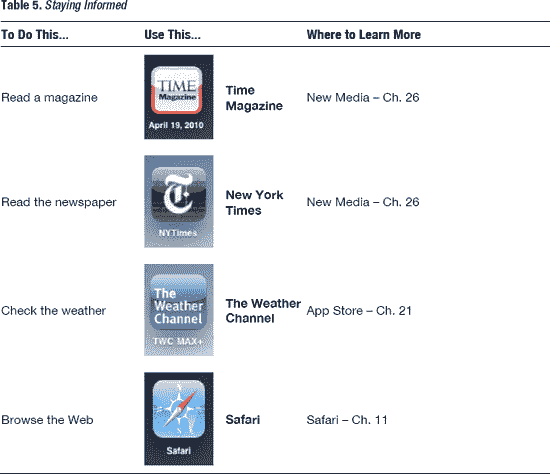

### 社交网络

您的 iPad 还允许您使用各种社交网络工具与朋友、同事以及专业人脉保持联系并获取最新动态（参见表 6）。

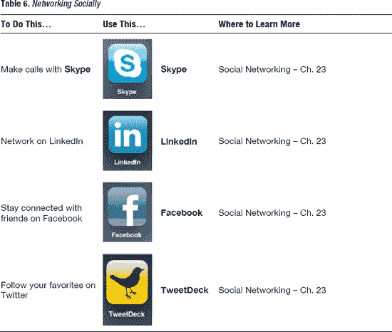

### 高效工作

您可以使用 `Pages`、`Numbers`、`Keynote` 应用以及 iPad 的触摸屏界面来处理文档、电子表格和演示文稿文件。您只需用手指拖拽、展开或旋转，即可在文档和演示文稿中调整图像大小、旋转或移动位置。您可以使用 `GoodReader` 应用访问和阅读几乎任何 PDF 文件或其他文档。您还可以使用基础的 `笔记` 应用做笔记，或升级到功能强大的 `Evernote` 应用，该应用具有整合音频、图片和文本笔记的惊人能力，并能将所有内容同步到一个网站（参见表 7）。

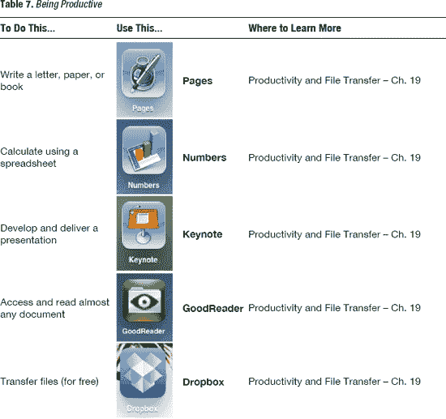

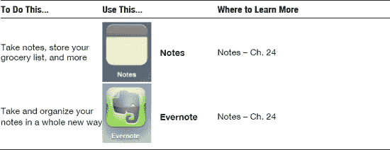

## 其他有趣的功能

iPad 可以作为一个绝佳的电子相框——我们在此为您介绍基本用法。您也会爱上它作为视频播放器的表现！在本节中，我们为您提供一些关于操作视频和音乐播放器的快速技巧，以及如何充分利用嵌入在网页中的视频。

### 将 iPad 用作电子相框

您可能想知道当锁定 iPad 时，“滑动来解锁”开关旁边那个小小的`花朵`图标是做什么用的。点击它即可启动电子相框功能——这是与他人分享照片或单纯欣赏自己照片的好方法。要使用电子相框功能，您需要执行以下操作：

1.  使用 `iTunes` 将您的照片加载到 iPad 上（参见第 3 章：“将 iPad 与 iTunes 同步”中的“照片——自动同步”部分）。
2.  轻点`相框`图标以开启电子相框功能。
3.  再次轻点该图标以关闭此功能。

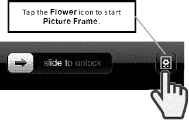

电子相框会循环播放您所有的照片，也可以设置成仅显示选定的相册。

**提示：** 您可以自定义相框的运作方式、选择特定相册等。请参阅第 6 章：“个性化与保护您的 iPad”中的“个性化您的相框”部分。

### 操作您的音乐和视频播放器

播放歌曲或视频时，只需轻点屏幕中央任意位置，即可显示或隐藏屏幕顶部的控制项，如图 12 所示。

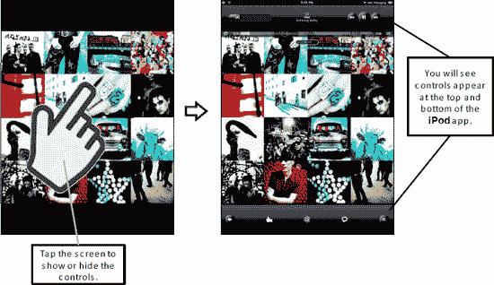

**图 12.** *操作您的音乐和视频播放器。*

### 在网页中观看视频

一件非常有趣的事情是直接在网页中观看支持的视频格式。遗憾的是，iPad 不支持许多网站使用的 Adobe Flash 视频格式。但仍有许多视频可供观看，例如《纽约时报》网页首页上的视频，如图 13 所示。请按照以下步骤在该网站的网页中观看视频：

1.  轻点 `Safari` 图标。
2.  轻点顶部的地址栏并输入：[`www.nytimes.com`](http://www.nytimes.com)。
3.  找到并轻点任意视频；通常您会在图片中央看到一个像这样的`播放`图标 。
4.  视频将直接在网页中开始播放。
5.  要将视频扩展至全屏，请在视频内部张开双指。将两个手指放在视频上，并在屏幕上滑动的同时展开手指。
6.  要以宽屏模式观看视频，请将 iPad 倾斜至`横屏`模式。

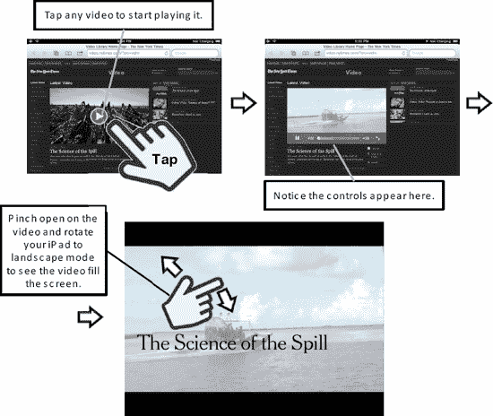

**图 13.** *如何在网页中欣赏视频。*

## iPad 配件

现在让我们简要介绍一些您可以购买来增强 iPad 功能的配件。您可以在任何 Apple Store 零售店、[Apple.com](http://www.apple.com) 或其他配件商店购买到其中大部分产品。

**注：** 我们在第 1 章：“入门指南”中向您展示了更多配件，例如保护壳。

### Apple 键盘

如果您打算在 iPad 上进行大量文字输入，应该投资购买一款 Apple 的两款键盘之一（参见图 14）。每款售价约为 70.00 美元。我们在第 2 章：“键入、拷贝/粘贴与搜索”中向您展示了更多关于如何使用这些键盘的信息。

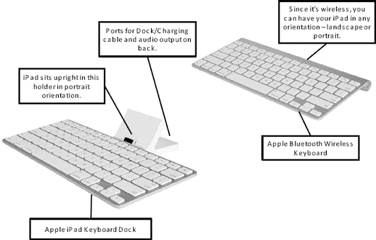

**图 14.** *Apple iPad 键盘基座与 Apple 无线蓝牙键盘*

