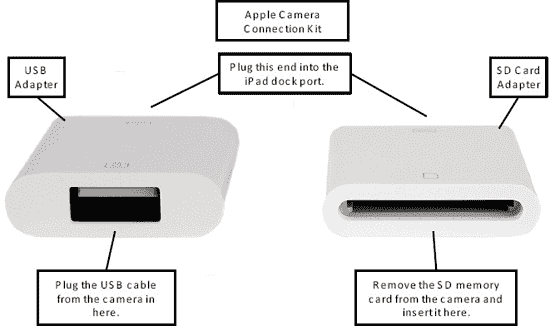
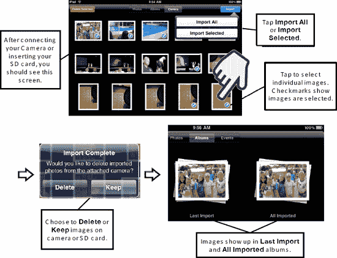

# Apple 相机连接套件

如果你想将数码相机中的照片直接传输到 iPad，而不必先传输到电脑，可以使用相机连接套件这款配件。这款售价 29.00 美元的配件包含两个小配件——图 16 左侧所示的是 USB 适配器；另一个是 SD 卡适配器。两者均插入 iPad 底部的底座连接端口。

**图 16.** *Apple 相机连接套件*

要使用这些适配器导入照片，请按照以下步骤操作：

1. 将 USB 或 SD 卡配件插入 iPad 底部的底座端口。
   1. 如果使用 USB 连接器，请将相机上的 USB 线缆插入连接器。
   2. 如果使用 SD 卡连接器，请从相机中取出 SD 存储卡并插入连接器。
2. iPad 应处于开机状态。如果已开机，它将立即显示**导入照片**屏幕（参见图 17）。
3. 要导入所有照片，请轻点右上角的 **全部导入** 按钮。
4. 要导入选定的照片，请先轻点照片进行选择。然后轻点 **导入** 按钮并选择 **导入所选项目**。
5. 随后，你可以选择**保留**或**删除**相机或 SD 卡上的照片。
6. 最近导入的照片将显示在**最近导入**相簿中。所有导入的照片将显示在**已导入**相簿中。

**图 17.** *使用相机连接套件导入照片。*

