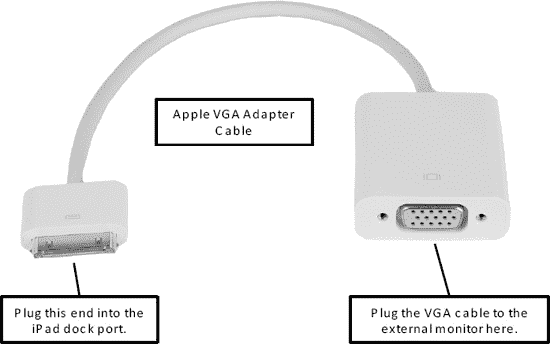

# VGA 适配器线缆

如果你正在使用 **Keynote** 应用，并希望通过 iPad 在更大的外接 VGA 显示器上播放演示文稿，或者你想播放从 iTunes Store 租赁或购买的电影，那么 VGA 适配器线缆就是为你准备的。

**注意：** 在发布时，VGA 适配器线缆配件仅在非常有限的应用和场景下有效。例如，它仅适用于**播放**模式下的 **Keynote** 应用，以及从 iTunes 购买或租赁的特定电影。然而，它并不能在插入后立即显示 iPad 屏幕。

这款 VGA 适配器线缆售价 29.00 美元。将一端插入 iPad 底部的底座连接器，另一端连接到连接外接显示器的 VGA 线缆，如图 18 所示。当你在 **Keynote** 中播放演示文稿时，可以使用 iPad 向前或向后切换幻灯片。

**图 18.** *适用于 iPad 的 VGA 适配器线缆*

