# 引言

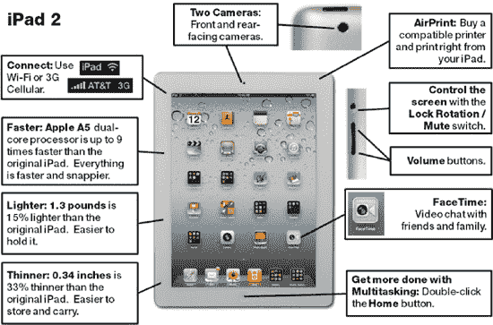

### 恭喜您拥有 iPad 2！

您手中的是全新增强版的 iPad 2——比初代 iPad 更小、更薄、更强大。它可以说是当今市面上功能最强大、最优雅的媒体播放器、电子书阅读器、游戏机、生活管理工具，几乎无所不能。

iPad 2 可以完成您在电脑上所做的近 90% 的工作——而且体验更佳。iPad 2 还可以完成您在智能手机上能做的几乎所有事情。您甚至可以通过 Apple 专有的 **FaceTime** 应用或 **Skype** 应用，从 iPad 2 进行视频通话。然而，iPad 既不是电脑也不是智能手机——它介于两者之间，恰是我们许多人的日常使用之选。

**注意：** 请查看第 18 章：“FaceTime 视频通话与 Skype”，其中我们将向您展示如何在 iPad 上使用 **FaceTime** 和 **Skype**！

使用您的 iPad，您可以查看照片，并使用与 iPhone 或 iPod touch 相同的触控手势与之交互。您可以捏合缩放、旋转以及通过电子邮件发送照片——所有这些都只需简单的轻点手势。

您还可以以前所未有的方式与内容互动。报纸看起来和读起来既像报纸又像网站，浑然一体。您可以浏览故事、视频和图片，并与新闻互动。

在 iPad 上阅读时，您会真正感觉像在读一本书。翻页可以慢速或快速（当您使用 **iBooks** 应用时，甚至可以在翻页时看到页面背面的文字）。

您可以以前所未有的方式管理您的媒体库。**iTunes** 和 **iPod** 应用在 iPad 上拥有精美的界面。在大尺寸、高清质量的屏幕上，选择音乐、观看视频、整理播放列表等操作变得轻松而有趣。

您有 Netflix 帐户吗？您可以在精美的 iPad 显示屏上观看您最喜爱的电视节目和电影。您还可以直接在 iPad 上管理内容和整理您的播放队列。

您也无需再在智能手机的小屏幕上更新您的 Facebook 状态——有了 iPad，您可以在大屏幕上浏览网站，并访问桌面版网站的许多功能，同时还能利用 iPad 的触摸屏以前所未有的方式与 Facebook 互动。

最后，通过内置的 Wi-Fi 连接或可选的 3G 连接，您可以随时与网络和电子邮件保持连接。支持所有最新的高速协议，因此您可以随时保持联系并获取最新内容。当您在**横向**模式下使用 iPad 时，甚至还有一个近乎“全尺寸”的键盘用于输入电子邮件。

### 充分利用 *iPad 2 Made Simple* 这本书

本书可以从头到尾通读，但您也可以按章节或章节内的主题进行模块化阅读。也许您只是想了解 **App Store**，试试 **iBooks** 应用，或者设置您的电子邮件或通讯录。又或者您只想加载音乐。通过我们的书，您可以做到所有这些，甚至更多。

您很快就会意识到您的 iPad 2 是一个功能非常强大的设备。然而，本书中还有许多“锁在”内部的秘密，我们将帮助您“解锁”它们。

慢慢来——这本书可以帮助您学习如何最好地使用、操作并享受您的新 iPad。回想一下您第一次尝试使用 Windows 或 Mac 电脑时的情景。熟悉操作方法需要一点时间。iPad 也是如此。使用本书帮助您快速上手，并更快地学习所有最佳技巧和秘诀。

请记住，如此强大的设备一开始并不总是那么容易掌握。

如果您每次阅读书中的一个部分，然后尝试您读到的内容，您将从 iPad 中获得最大收益。我们都知道，阅读后进行实践的记忆保持率远高于单纯阅读。

因此，为了学习和记住您所学的内容，我们建议您执行以下操作：

***读一点，在您的 iPad 上试一点，然后重复！***

### 本书的组织方式

了解本书的组织方式将帮助您更快地找到对您重要的内容。这里我们向您展示本书的主要组织结构。请记住利用我们的精简目录、详细目录以及全面的索引，帮助您快速定位感兴趣的内容。

#### iPad 用户的日常

翻开书籍的前后封面，你会发现一条条便于查阅、相互参照的章节编号所构成的精妙资讯。因此，若你看到想学的内容，只需翻到对应章节，数分钟内即可掌握。

#### 第 1 部分：快速入门指南

快速入门指南的第 1 部分涵盖以下主题：

- **触摸屏基础：** 大量视觉效果图助你快速学会在 iPad 触摸屏上进行触摸、滑动、轻拂、缩放等操作。
- **应用参考表格：** 按分类快速浏览图标或应用。在可跳转至本书详述各应用详解章节的列表旁，你将看到所有`iPaddo`应用的缩略图。
- **其他趣味功能：** 了解 iPad 作为音乐播放器、视频播放器和电子相框的用法。
- **iPad 配件：** 简要概述键盘、摄像头等常见配件，以及用于将 iPad 连接至高清电视的新型数字影音转换器。（详见第 1 章更多配件信息。）

#### 第 2 部分：引言

你现在正身处此处……

#### 第 3 部分：你与你的 iPad

这是本书的核心内容，共 28 个易于理解的章节，配有大量插图全程指引你每一步操作。

#### 第 4 部分：iPad 的灵魂伴侣——iTunes

作为给读者的特别赠礼，我们在第 29 章中提供了详尽的 iTunes 用户指南，教你如何熟练运用`iTunes`并探索这款桌面应用的全部潜能。你对`iTunes`越熟悉，就越能在 iPad 上更好地整理和使用电脑中的内容，从而获得更愉悦的用户体验。

##### 快速定位提示、警告和注意事项

翻阅本书时，你一眼就能根据格式识别出提示、警告和注意事项。例如，若你想查找所有日历相关的提示，只需翻到**日历**章节就能快速找到。

**提示、警告**和**注意事项**均采用这种灰色背景的格式，方便你快速识别。

##### iPad 邮件提示与视频教程

请访问作者网站[`www.madesimplelearning.com`](http://www.madesimplelearning.com)，获取一系列非常实用的“碎片化”iPad 技巧与窍门。我们从本书中精选了一些优秀技巧，并额外添加了一些新内容。点击“免费技巧”栏目并注册，即可在 iPad 收件箱中每周收到一条技巧。碎片化学习是掌握 iPad 的绝佳方式！

有时候，观看视频比阅读文字更容易理解概念。作者深谙此道，正在忙于为此书制作配套视频教程系列。请访问[`www.madesimplelearning.com`](http://www.madesimplelearning.com)或发邮件至`info@madesimplelearning.com`，了解更多关于 iPad 视频教程的信息。

## 第 III 部分

### 你与你的 iPad 2……

这是《iPad 2 化繁为简》的核心部分。在本部分中，你将看到标签清晰的章节，每一章都阐释了 iPad 2 的关键功能。你会发现大部分章节专注于单个应用或特定类型的应用。许多章节讨论了 iPad 2 自带的应用，但也包含了一些可从 App Store 下载的有趣且实用的应用。当然，iPad 2 是为了娱乐而生，但它的用途远不止于此。最后，我们还提供了一些实用的故障排除技巧，以防你的 iPad 2 出现异常。

## 第 1 章

### 开始使用

在本章中，我们将带你逐步熟悉 iPad 2，从充电到首次激活`iTunes`应用。在本章末尾的“iPad 基础”部分，我们将展示在 iPad 上进行基本操作的方法，让你能快速上手并运行。

### 认识你的 iPad 2

在本部分中，我们将向你展示如何使用 iPad 2 包装盒内的所有物品。同时，我们还会提供一些 iPad 电池和充电技巧，帮助你判断 iPad 是否已激活，并介绍**滑动来解锁**功能。

#### 包装盒内有什么

装有 iPad 2 的纸盒仅比 iPad 本身稍大一些；如果你初次接触苹果产品，可能会觉得包装略显单薄。然而，里面确实包含了上手使用 iPad 2 所需的一切——除了一本好的用户手册，而这也正是我们撰写本书的原因！

打开盒子后，最上面映入眼帘的就是你崭新的 iPad 2。

在 iPad 下方的塑料支架下，你会发现一本纸质小册子，上面印着“加州苹果设计”。包装盒内还包含以下物品：

- **一页参考指南**：只有一页？！没错——正反两面仅一页！正面展示了按钮位置，背面则要求你下载`iTunes`并将 iPad 连接到电脑以开始使用。
- **iPad 产品信息指南**：这是一本小册子，字体小到难以阅读。里面包含了与 iPad 相关的所有法律条款、条件、警告和免责声明。
- **苹果标志贴纸**：你会得到两张漂亮的白色苹果标志贴纸，有时你会在车窗上看到它们。尽情使用吧！

盒子底部是其余配件，如图 1-1 所示。

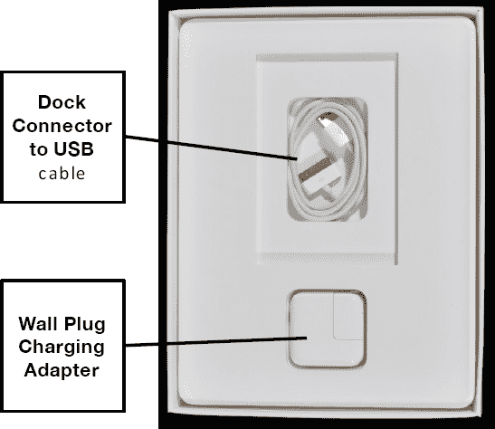

**图 1-1.** *盒子底部的 USB 连接线和壁式充电适配器*

##### 基座接口转 USB 连接线

你的 iPad 包装盒内附带了一条基座转 USB 连接线。这根线用于连接电脑，同时也兼作电源线。

##### 壁式充电器（10 瓦）

iPad 还附带了一个实用的硬件组件——壁式充电器（见图 1-1）。该适配器让你无需电脑，直接将 iPad 通过墙上插座充电。你只需将基座转 USB 连接线插入此壁式充电器，另一端连接 iPad 即可。

**提示：** 再购买一个适配器，一个放在家里，一个放在办公室。目前这款充电器在折扣在线商店的售价低于 10 美元。

##### 预期电池续航与充电时间

苹果公司表示，配备先进 25 瓦可充电锂聚合物电池的新款、更快的 iPad 2，其电池续航应与原始 iPad 相同（见表 1-1）。

**表 1-1.** 苹果官方电池续航规格

| **视频与音频播放** | 10 小时 |
| **网页浏览** | Wi-Fi 环境下 10 小时，3G 蜂窝网络下 9 小时 |
| **充电时间** | 快速充电 2 小时可充至 80%，完全充满需 4 小时 |

以上续航时间是在理想条件下，使用全新充满电的电池得出的。你会注意到，随着时间的推移，实际电池续航会下降。

**提示：** 如果你发现 iPad 电池无法良好保持电量，或远达不到预期的 10 小时续航，可以联系苹果更换电池。请访问苹果网站[`www.apple.com/batteries/replacements.html`](http://www.apple.com/batteries/replacements.html)了解如何为 iPad 获取新电池。本书出版时的费用为 99 美元加运费。

##### 电池与充电技巧

没有什么比在急需使用时电量耗尽更糟糕的事了。关键问题是：如何最大限度地延长电池续航，确保 iPad 随时待命？以下是一些有用的技巧。

###### 充分利用每次充电

要延长电池续航时间，请尝试以下技巧：

- **将 iPad 置于睡眠模式。** 点击设备右上角的 `电源/睡眠` 按钮，将其置于睡眠模式。
- **在不使用时关闭 Wi-Fi 或 3G。** 即使未连接 Wi-Fi 或 3G 网络，Wi-Fi 和 3G 天线也会消耗电量，因此在不需使用时请关闭它们。点击 `设置`，然后将 `飞行模式` 设为开启。
- **降低屏幕亮度：** 点击 `设置`，然后点击 `亮度与墙纸`。使用滑块将亮度调低至不到一半但仍适合您使用的水平。同时，确保 `自动亮度` 设为开启。
- **关闭定位服务：** 如果您不需要将实际位置传输给应用程序，可以将其关闭。点击 `设置`，然后点击 `定位服务`。将 `定位服务` 设为关闭。如果启动需要您位置的应用程序，系统会提醒您重新开启。
- **设置较短的自动锁定时间：** 缩短 iPad 在不使用时关闭屏幕并进入睡眠模式的时间，有助于节省电量。操作方法是：点击 `设置`、`通用` 和 `自动锁定`。将 `自动锁定` 设置为尽可能短的时间——如果您喜欢，可以短至 2 分钟。
- **关闭推送邮件和推送通知：** 点击 `设置`，然后点击 `邮件、通讯录、日历`。接着点击 `获取新数据`，并将 `推送` 设为关闭。
- **了解更多关于电池续航的信息**，并从 Apple 网站 [`www.apple.com/batteries/ipad.html`](http://www.apple.com/batteries/ipad.html) 获取更多实用的 iPad 相关技巧。

###### 延长电池使用寿命

可充电电池保持电量的能力会随时间推移而下降，并且在其使用周期内的充放电次数是有限的。您可以通过确保每月至少将电池完全耗尽一次来延长 iPad 电池的使用寿命。如果定期进行完全放电，可充电电池的寿命会更长。

###### iPad 充电配件

无论您做什么，如果您经常使用 iPad，您会希望找到更多地方和更多方式来为其充电。表 1-2 列出了除使用电源线或连接电脑之外的一些其他充电选项。

**表 1-2.** *为 iPad 充电的其他地点和方式*

| 机场充电站 | 如今大多数机场都有墙上插座，您可以在候机时给 iPad 充电。有些机场设有指定的充电站，而其他机场只有墙上插座，甚至可能隐藏在椅子或其他物体后面。您可能需要费点功夫，才能抢在那些同样需要充电的旅客前面！ |
| 外接电池组 | 这种配件可以将 iPad 的电池续航时间延长两到三倍。您可以用大约 70 到 150 美元的价格购买此类电池组。在网络上搜索“ipad 外接电池组”，即可找到最新、最出色的选择。 |
| 车载充电器 | 如果您白天大量使用 iPad 进行通话，可能想投资一个车载充电器或其他方式，在漫长一天的中途为它补充电量。有些充电器可以通过汽车点烟器插座提供供电的 USB 接口，而其他充电器则提供一个基座端口连接器，用于插入 iPad 底部。大多数售价约为 15 到 30 美元。 |
| 车载电源逆变器 | 如果您进行长途汽车旅行，可以购买一个电源逆变器，将 12V 汽车电源插座转换为普通电源插座，以便插入 iPad 充电器。在网上搜索“车载电源逆变器”，可以找到许多价格为 50 到 100 美元的选择。 |
| 其他配件 | 如前所述，您也可以在具有其他功能（如通过扬声器播放音乐）的许多配件中为 iPad 充电。只需寻找插头或闪电图标，以确保您的 iPad 在此类配件中正在充电。 |

#### 充电与电池小贴士

您的 iPad 可能已有一些电量，但您可能希望将其完全充满，这样便可享受数小时不间断的使用。这段时间恰好可以浏览本章剩余内容、安装或更新 iTunes，或者在 iTunes App Store 中浏览所有酷炫的 iPad 应用（请参见第 21 章：“令人惊叹的 App Store”）。

基座转 USB 连接线也可兼作充电线。它位于 iPad 下方那个印有“Designed by Apple in California”字样的白色小册子下面。将连接线较宽的一端插入 iPad 底部（靠近 `主屏幕` 按钮的位置），然后将 USB 连接线的一端插入带有可折叠插头的小白盒。

| 要确保设备正确连接并正在充电，请查看 iPad 屏幕右上角电池指示器内的小插头图标。如果屏幕空白，请点击一次 `主屏幕` 按钮点亮屏幕。您会看到此图片右侧电池图标旁边的 100% 字样，这是因为我们进入了 `设置` （`通用` 并将 `电池百分比` 设为开启。 |  |

**将 iPad 连接到电脑时，它会充电吗？**

答案是：“这得看情况。”

当您通过 USB 连接线将 iPad 连接到电脑时，如果在电池图标内看到插头图标，说明 iPad *正在*充电。大多数 Mac 电脑、部分 Windows 电脑以及部分有源 USB 集线器（一种可购买的插入墙插并带有 USB 端口的配件）在 iPad 处于“唤醒”状态（屏幕亮起）时能够提供足够电力为其充电。

当 iPad 处于睡眠模式（屏幕关闭）时，这一点更难判断，因为将 iPad 连接到电脑后，您可能会在电池图标旁看到“未在充电”的信息。在这种情况下，iPad 在睡眠模式下很可能仍会充电。您需要亲自用电脑和 iPad 进行试验，才能针对特定情况做出准确判断。我们发现，在使用 Windows 笔记本电脑时，即使 iPad 在唤醒状态下显示“未在充电”，它在睡眠模式下也肯定能正常充电。

#### 您的 iPad 激活可能已完成

例如，当您开启 iPad 或点击 `主屏幕` 按钮（位于设备底部）时，可能会看到 `滑动以解锁` 屏幕或主屏幕上的图标屏幕。如果是这样，说明您的 iPad 已经激活。如果您看到黑色屏幕上显示需要插入 iTunes 的 USB 连接线（参见图 1-3），则说明您仍需激活设备。

#### 滑动以解锁

首次开启 iPad 时，您会看到 `滑动以解锁` 屏幕。只需沿着箭头图标的方向，轻轻向右滑动解锁按钮即可。

完成此操作后，您将看到主屏幕。

您会看到底部程序坞中有四个锁定的图标（参见图 1-2 右下角），而其余图标则可以在底部程序坞上方的 *页面* 中来回移动。了解如何在第 7 章：“个性化设置与保护您的 iPad”中的“移动图标”部分，将您喜爱的图标移动到底部程序坞中。

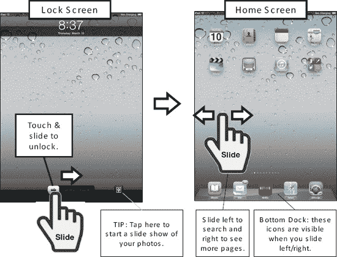

**图 1-2.** *滑动以解锁、浏览主屏幕以及底部程序坞*

### iTunes 与您的 iPad

要激活您的 iPad 并加载内容（例如音乐、图片、视频等），您需要将设备连接到电脑上的 `iTunes` 应用。备份（以及日后恢复）您的 iPad 也需要使用 `iTunes` 应用。

如果您没有 `iTunes` 应用，或者不确定是否拥有最新版本，则需要进行升级。首次将 iPad 连接到 `iTunes` 服务时，将会激活您的 iPad，或将其与您的 Apple ID 关联。完成此操作后，您就可以直接在 iPad 上或电脑的 `iTunes` 中购买歌曲、影片、图书以及几乎任何其他内容。

#### 在电脑上安装或更新 iTunes

如果您的 iPad 屏幕上显示一个指向 `iTunes` 的 USB 插头，那么您需要将 iPad 连接到电脑上的 `iTunes` 应用（请参见图 1-3）。

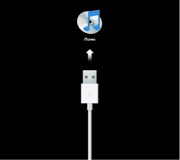

**图 1-3.** *显示需要连接至 iTunes 才能开始的 iPad 屏幕*

通常，您需要确保安装了最新版本的 `iTunes` 程序。

如果需要更新程序，请启动 `iTunes`。如果您是 Windows 用户，请选择 `帮助`，然后选择 `检查更新`。如果您是 Mac 用户，请选择 `iTunes`，然后选择 `检查更新`。按照提供的说明来更新 `iTunes`。

需要详细说明？请参阅第 29 章：“您的 iTunes 用户指南”中的“iTunes 更新”部分。

如果您的电脑上没有安装 `iTunes` 程序，请打开网络浏览器，访问 [`www.itunes.com/download`](http://www.itunes.com/download)。从提供的链接下载该软件。

需要详细说明？同样，请参阅第 29 章：“您的 iTunes 用户指南”中的“如何下载并安装 iTunes”部分。

#### 将 iPad 连接到 iTunes

一旦您安装或升级到最新版本的 `iTunes` 程序，就可以将您的 iPad 连接到电脑上的 `iTunes` 服务了。

**提示：** 使用 `iTunes` 应用的“家庭共享”功能，您可以在 iPad 上以及家庭网络中已授权的电脑之间，共享来自同一 iTunes 帐户的已购内容（音乐、应用、视频、iBooks 等）。此外，您可以将任何相同的内容同步到同一 iTunes 帐户下的任何 iPod/iPhone/iPad。要了解更多关于使用 `iTunes` 同步内容的信息，请参阅第 3 章：“将 iPad 与 iTunes 同步”，并了解关于家庭共享的信息，请参阅第 29 章：“您的 iTunes 用户指南”。

通过将 iPad 连接到 `iTunes`，您可以将您的 iPad（通过设备序列号）注册或关联到特定的 iTunes 帐户（Apple ID）。

**提示：** 这样做的好处是，如果您已为 iPhone 或 iPod touch 购买了应用和其他内容（例如音乐、视频等），那么您可以在 iPad 上运行其中的大部分应用——尽管屏幕尺寸会稍小一些。请注意，您可以在多个 iTunes 帐户上授权一台 iPad；但是，您同步到该 iPad 的所有内容都必须来自同一台电脑。因此，您需要选择您的“主”电脑来与 iPad 同步。

如果您还没有 iTunes 帐户（Apple ID），请不要担心——您可以在注册 iPad 时创建一个。

#### 启动 iTunes

如果 `iTunes` 应用尚未运行，请双击桌面上的 `iTunes` 图标：

*   Mac 用户：点击 `Finder` 图标，选择 `前往` 菜单，然后选择 `应用程序` 以查找 `iTunes`（快捷键：`Shift`+`Command`+`A` 用于打开 `应用程序`）。
*   Windows 用户：点击左下角的 `开始` 菜单或 `Windows` 徽标，选择 `所有程序`，然后选择 `iTunes`。

#### 首次注册您的 iPad

一旦 `iTunes` 应用已安装或更新并在电脑上运行，您就可以准备首次连接您的 iPad 并进行注册或激活了。完成这些操作后，您就可以开始使用您的新 iPad 了。

**注意：** 如果您的 iPad 已经注册，您可以跳过此注册部分，直接跳至本章后面的“设置您的 iPad”部分。如果您在屏幕底部看到 `滑动来解锁`，或者在按下设备底部的 `主屏幕` 按钮时看到图标屏幕，则表明您的 iPad 已经注册。

请按照以下步骤连接您的 iPad 并进行注册或激活：

1.  将 iPad 附带的白色 USB 连接线插入电脑上的可用 USB 端口。

    **注意：** 首次将 iPad 连接到电脑时，Windows 电脑应会自动安装必要的驱动程序。如果您使用的是 Mac 电脑，根据您安装的操作系统版本，Apple 可能会建议您在开始使用 iPad 之前，先将操作系统升级到最新版本。

2.  点击 iTunes 左侧栏中 `设备` 下的 `iPad`，以开始操作。
3.  如果您尚未注册 iPad，您应该会看到一个 `欢迎` 屏幕（请参见图 1-4）。点击 `继续` 以开始注册您的 iPad。

    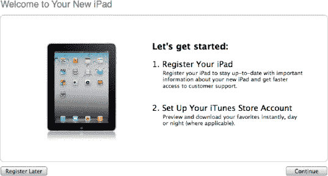

    **图 1-4.** *`iTunes` 中的 iPad `欢迎` 屏幕*

4.  接下来您会看到 `iPad 软件许可协议`。
5.  如果您同意这些法律条款，请勾选标有 `我已阅读并同意 iPad 软件许可协议` 的方框，并点击 `继续` 按钮。
6.  接下来，您将有机会使用您的 Apple ID 登录，或创建一个新的 Apple ID。输入您的 Apple ID 和密码，或者点击 `我没有 Apple ID` 并选择您的国家/地区（请参见图 1-5）。

    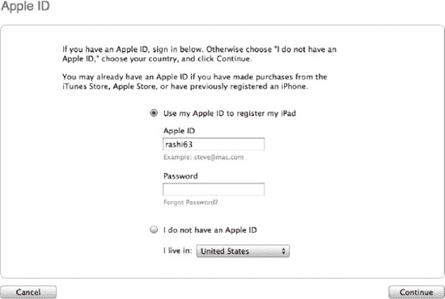

    **图 1-5.** *`iTunes` 中的 `Apple ID` 屏幕*

7.  点击 `继续` 按钮。
    *   如果您尝试输入 Apple ID 和密码后收到一条错误信息，提示“需要额外的安全信息”，请阅读第 29 章：“您的 iTunes 用户指南”中的“故障排除：修复 Apple ID 安全错误”部分。
8.  现在您应该会看到 `注册您的 iPad` 屏幕（请参见图 1-6）。

    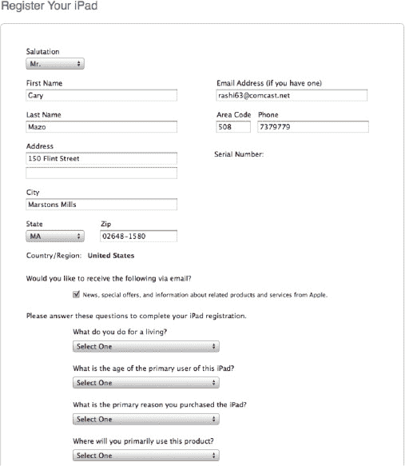

    **图 1-6.** *iTunes 中的 `注册您的 iPad` 屏幕*

9.  输入或核验您的信息是否正确，然后点击 `提交` 以完成注册。

#### 设置“查找我的 iPad”服务

注册 iPad 后，您可能会看到一个类似的屏幕，询问您是否要设置免费的“查找我的 iPad”服务（参见图 1-7）。点击**设置“查找我的 iPad”**按钮，然后按照屏幕上的说明开始操作。这项服务让您能够通过 MobileMe 苹果网站 ([`http://me.com`](http://me.com)) 定位您的 iPad（只要它处于开机状态并连接到网络）。

**提示：** 请查阅第 4 章：“其他同步方法”中的 MobileMe 服务详细说明，以了解该服务的各项功能。

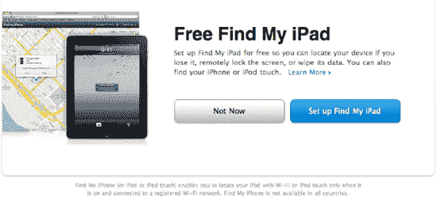

**图 1-7.** *设置免费的“查找我的 iPad”服务*

如果您没有看到此屏幕，请按照以下步骤在您的 iPad 上进行设置：

**提示：** 您还可以在苹果官网观看视频并了解更多信息：[`www.apple.com/ipad/find-my-ipad-setup/`](http://www.apple.com/ipad/find-my-ipad-setup/)。

1. 此时，您的 iPad 可能正忙于与 **iTunes** 同步。您需要等待同步完成，直到看到**主屏幕**或**滑动以解锁**屏幕；这时，您就可以开始操作了。
2. 轻点**设置**应用。
3. 轻点**邮件、通讯录、日历**。
4. 轻点**添加帐户**，然后选择 **Mobile Me**。
5. 输入您的 **Apple ID** 和**密码**，然后轻点**下一步**进行登录。如果您没有 Apple ID，可以点击链接免费创建一个。如果这是您首次将 **Apple ID** 用于 MobileMe 服务，您可能需要同意**服务条款**。
6. 随后，您应会收到一封发送至您与 Apple ID 关联的主邮箱的电子邮件。您需要点击收到的邮件中的链接以**验证**您的帐户。
7. 成功登录后，您会看到一个小弹出窗口，询问**是否允许 MobileMe 使用您 iPad 的位置？** 您可能已经猜到，要使此服务正常工作，您必须回答**好**。
8. 确保将**查找我的 iPad** 设置为**开启**，如图所示。然后轻点**存储**以完成设置过程。

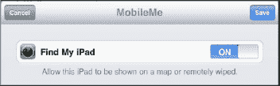

#### 停用或调整“查找我的 iPad”功能

您也可以停用此服务或更改所使用的 MobileMe 帐户，方法是返回 MobileMe 的**帐户**屏幕，具体操作如下：

1. 轻点**设置**应用。
2. 轻点**邮件、通讯录、日历**。
3. 在右侧栏的**帐户**屏幕下，轻点 **Mobile Me** 帐户。

   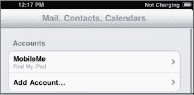

4. 在此屏幕上，您可以：
   - 轻点**帐户**以调整使用的帐户。
   - 将**查找我的 iPad** 设置为**开启**或**关闭**。
   - **删除**此 iPad 上的 MobileMe 帐户。
5. 轻点**完成**以保存更改。

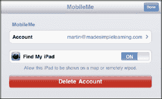

#### 通过 Me.com 网站使用“查找我的 iPad”

您几乎可以通过任何网页浏览器使用“查找我的 iPad”服务，无论是在电脑上还是其他移动设备上。请按照以下步骤使用该服务：

1. 打开网页浏览器，访问 [`www.me.com`](http://www.me.com)。
2. 使用相同的 Apple ID 和密码登录。

   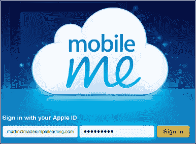

3. 您现在应该会看到**查找我的 iPad**（或 iPhone）屏幕，它会立即显示您设备的最后已知位置。请注意，如果您有多台设备，可在左侧栏中选择另一台设备进行定位。

   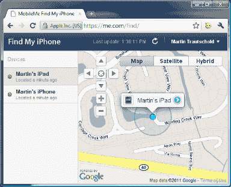

   **注意：** 地图上设备名称旁边的**时钟**图标 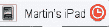 表示距离上次更新已有一段时间。如果您的设备已关机，则最后已知位置将是其关机时在地图上标记的位置。

4. 点击设备名称可查看更多选项。您可以执行以下操作：

   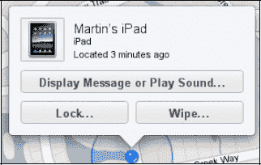

   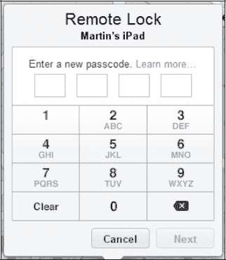

   - 点击**锁定**以远程锁定您的 iPad。这会通过添加四位数字密码来保护您的私人信息。
   - 点击**抹掉**以远程清除您的所有私人信息。请记住，您电脑上会保留从上次备份到 iTunes 时的所有数据，通常这是您上次将 iPad 连接到电脑上 iTunes 的时间。勾选底部的复选框，然后点击**抹掉所有数据**以完成此过程。

     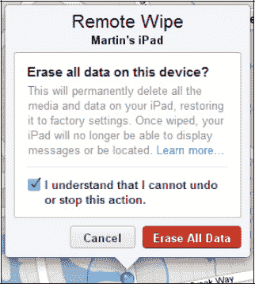

   - 点击**显示信息**或**播放声音**，以发送一条消息显示在您的 iPad 上，或播放持续 2 分钟的声音以帮助您定位设备。这个声音类似于船上的声纳音，非常独特！

     如果您勾选此框，右侧的消息将显示在您的 iPad 上，并且几秒钟内会播放声音——这是一个非常不错的功能！

     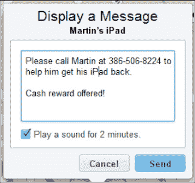

     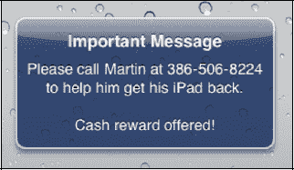

#### 通过其他 iOS 移动设备使用“查找我的 iPad”

您也可以使用从 App Store 下载的免费应用（名为**“查找我的 iPhone”**）来访问“查找我的 iPad”服务。请按照以下步骤使用该应用：

| **注意：** 在本书出版时，该应用的原名为 **“查找我的 iPhone”**。因此，如果您在 App Store 中只找到这个应用，请放心下载到您的 iPad 上使用。 | 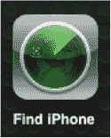 |

1. 轻点**查找 iPhone** 应用，并使用您的 **Apple ID** 和**密码**登录。
2. 系统会立即将您带到**地图**视图，并显示您的 iPad。
3. 与前面描述的网页版类似，您可以点击设备名称以**显示信息**/**播放声音**、远程**抹掉**（擦除）或远程**锁定**（使用四位数字密码）设备。

   **注意：** 如果您正在使用 iPad 查看自身位置，则这些选项（即**显示**、**抹掉**或**锁定**）均无效。

4. 与在 [`me.com`](http://www.me.com) 网站上一样，如果您有多个运行 iOS 4.2 或更高版本的苹果设备（例如 iPhone 或 iPod touch），您可以直接在 iPad 上的应用中查看这些设备。只需轻点右上角的**设备**按钮即可查看您所有的设备。

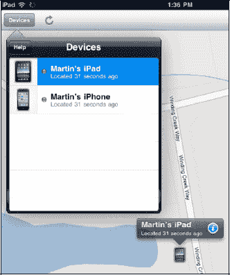

#### 苹果的 MobileMe 同步服务

第一次注册 iPad 后，您可能会看到一个宣传苹果 MobileMe 无线同步服务的屏幕。要继续设置您的 iPad，请点击**不了，谢谢**按钮以进入下一个屏幕。

**什么是 MobileMe？**

正如您在之前的“查找我的 iPad”部分所见，MobileMe 免费提供 iPad 定位服务。然而，MobileMe 的功能远不止于此；它还提供了一种在您所有电脑和移动设备之间共享电子邮件、通讯录、日历和网页书签的方式。在本书出版时，照片共享仅限于安装了 MobileMe **iPhoto** 文件夹的 Mac 电脑。MobileMe 在有限时间内（目前为 60 天）免费使用，之后单人计划费用为 99.00 美元，家庭计划费用为 149.00 美元。请参阅第 4 章：“其他同步方法”中的“MobileMe 导览”部分。

## 设置你的 iPad

首次连接 iPad 时，你可以为其命名并选择其他一些选项（参见图 1-8）。

如果你看到的屏幕询问是否要从备份恢复，请直接跳至本章稍后的“从备份设置或恢复”部分。

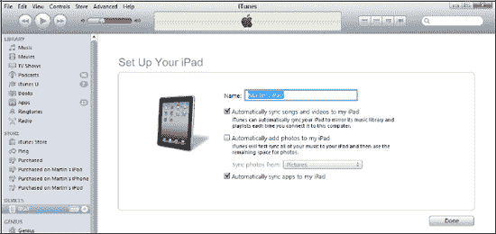

**图 1-8.** 设置 iPad 屏幕

**注意：** 如果你打算同时使用两台 iPad，我们建议你将第二台 iPad 设置为新设备，而不要从备份文件恢复。否则，两台 iPad 可能具有相同的设备名称，导致混淆。

1. 为你的 iPad 起一个**名称**。每次你将 iPad 连接到这台电脑或其他任何电脑时，iPad 都会显示你在此处选择的名称。在此例中，我们将这台 iPad 命名为：`Martin's iPad`。

   **提示：快速设置 iPad**

   要快速完成设置，请取消选中图 1-9 所示屏幕上的所有三个复选框，然后单击**完成**。你稍后可以在 `iTunes` 应用的标签页中勾选或取消勾选这些复选框。我们将在第 3 章：“将 iPad 与 iTunes 同步”和第 29 章：“你的 iTunes 使用指南”中介绍具体细节。

2. 如果你希望将电脑 `iTunes` 资料库中的所有音乐和视频同步到新 iPad 上，请勾选**自动将歌曲和视频同步到我的 iPad** 旁边的复选框。

   **警告：** 你的 iPad 内存不如电脑大，因此如果你的电脑 `iTunes` 资料库中有成千上万首歌曲、照片或许多视频，在选择自动同步时请务必小心。

3. 如果你希望将电脑特定文件夹中的所有照片同步到新 iPad 上，请勾选**自动将照片添加到我的 iPad** 旁边的复选框。

4. 如果你希望在 iPad 上购买的应用能备份到电脑上，请勾选**自动将应用同步到我的 iPad** 旁边的复选框。此选项允许你从电脑上的 `iTunes` 应用更新应用；同时，你也可以使用电脑上的 `iTunes` 应用来管理和排列应用图标及**主**屏幕。我们建议你勾选此复选框。

5. 单击**完成**以完成**设置**屏幕。

### 从备份设置或恢复

如果你已经将类似设备（如 iPhone 或 iPod touch）与 iTunes 同步过，那么你很可能会看到**设置你的 iPad** 屏幕，其中包含**设置为新 iPad** 或从备份恢复的选项（参见图 1-9）。

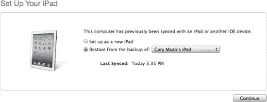

**图 1-9.** 设置或恢复 iPad

1. 现在，根据你的具体情况，有几种选择：
   1. 如果你是首次使用 iPad，请选择**设置为新 iPad**。
   2. 如果你之前已将电脑与另一台 iPad 同步过，并希望从该备份文件恢复，请选择**从以下备份恢复**，然后从下拉列表中选择正确的 iPad 备份文件。
   3. 如果你已备份过除 iPad 以外的其他 iOS 设备（例如 iPhone 或 iPod touch），我们建议你选择**设置为新 iPad**。 稍后，你可以将应用、图片、歌曲等内容从 iTunes 同步到 iPad；这种方法比使用非 iPad 设备的备份文件更安全。

   **警告：** 我们听说有人在将非 iPad 设备（iPhone/iPod touch）的备份恢复到 iPad 时遇到了问题（如死机、电池续航缩短等）。此外，在此处选择恢复，前提是你已对旧设备（iPhone/iPod touch）进行过备份，以便将最新信息恢复到新 iPad 上。

2. 单击**继续**按钮。

**注意：** 如果你想保留现有的 iPhone 和/或 iPod Touch 并设置新的 iPad，则应选择**设置新 iPad**。

### 设置完成：iPad 摘要屏幕

确认你的选择并单击**完成**（参见图 1-8），或从**设置/恢复**屏幕单击**继续**（参见图 1-9）后，你将进入主**摘要**屏幕（图 1-10）。

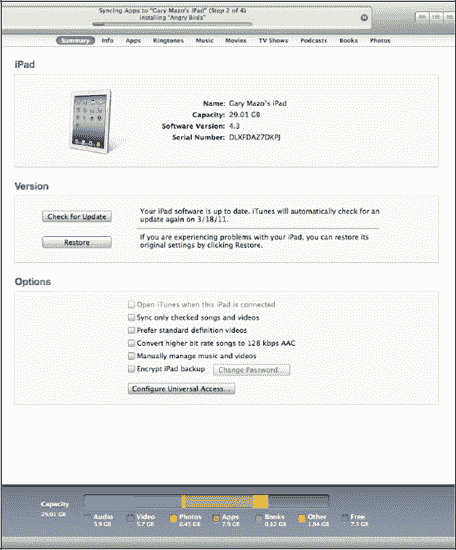

**图 1-10.** iTunes 中的 iPad **摘要**屏幕

### 维护你的 iPad

设置好 iPad 后，你将需要了解如何安全地清洁屏幕，以及如何使用各种保护壳来保护它。

#### 清洁你的 iPad 屏幕

使用 iPad 一段时间后，你会发现手指（可能还有其他人的手指）在原本光洁的屏幕上留下了污迹和油渍。你需要知道如何安全地清洁屏幕。一种全天保持屏幕清洁的方法是在 iPad 上贴一张保护膜，这还可能额外减少反光（下一节将讨论）。

我们还建议执行以下操作：

1. 按住顶部边缘的**睡眠/电源**键关闭 iPad，然后使用**滑动**条将其关机。
2. 拔下所有线缆，例如 USB 同步线。
3. 用柔软、干燥、不起毛的布（例如用于清洁眼镜的布或类似物品）擦拭屏幕。
4. 如果干布不起作用，可尝试加少量水将布微微润湿。如果使用湿布，请注意不要让水进入任何开口。

**警告：** 切勿使用家用清洁剂、研磨性清洁剂（如 `Soft Scrub`）、含氨清洁剂（如 `Windex`）、酒精、喷雾剂或溶剂。

#### iPad 的保护壳和保护套

当你拿到 iPad 时，你会注意到其构造多么精美。你也会注意到它相当光滑，可能会从手中滑落或轻微晃动。当你使用 iPad 打字时，其背面也可能被刮花。

我们建议为你的 iPad 购买一个保护壳。普通保护壳的价格大约在 10-40 美元之间，高档皮革保护壳的价格可能达到 100 美元或以上。花点小钱来保护你花费 500 美元或更多购买的 iPad，是非常明智的。

#### 购买保护壳的地点

你可以在以下任何地点购买 iPad 保护壳：

* Amazon.com ([`www.amazon.com`](http://www.amazon.com))
* Apple 配件商店 ([`http://store.apple.com`](http://store.apple.com))
* iLounge ([`http://ilounge.pricegrabber.com`](http://ilounge.pricegrabber.com))
* TiPB – The iPhone + iPad Blog Store ([`http://store.tipb.com/`](http://store.tipb.com/))

你也可以在网上搜索“iPad 保护壳”或“iPad 保护套”。

**提示**：你*可能*可以将为其他类型电脑设计的保护套用于你的 iPad；例如，为上网本或小型平板电脑设计的保护套可能效果不错。不过，如果你选择这种节省开支的方式，请务必确保你的 iPad 能牢固地放入保护套或保护壳中。

##### 选购保护壳类型

以下部分列出了几种可供选择的保护壳类型及其价格范围。

###### Apple iPad Smart Cover（塑料款约 40 美元，皮革款约 70 美元）

**功能：** 保护壳上的磁铁可瞬间吸附在 iPad 上，实现稳固贴合。将保护壳向后折叠，即可形成一个舒适的低角度支架。

**优点：** 颜色多样、重量轻，且由 Apple 专为 iPad 2 设计——这还需要我们多说什么吗？

**缺点：** 无法很好地保护 iPad 免受磕碰或凹陷（设备背面无保护）。

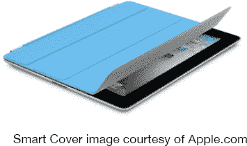

###### 内置键盘的金属保护壳（约 100 美元）

**功能：** 提供坚固的保护壳和内置蓝牙键盘。如果你经常在 iPad 上输入文字，这是一个非常小巧便捷的选择。

**优点：** 相比单独购买保护壳和键盘更便宜。打字方便。

**缺点：** 会增加设备的体积和重量。

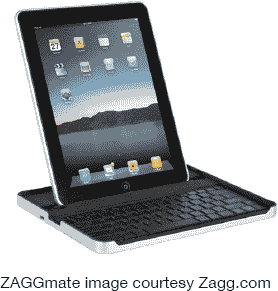

###### 橡胶/硅胶保护壳（10-30 美元）

**功能：** 提供缓冲握持感，可吸收 iPad 受到的碰撞和震动。

**优点：** 价格低廉、颜色鲜艳、握持舒适。

**缺点：** 外观不如皮革保护壳专业。

###### 防水保护壳（10-40 美元）

**功能：** 为 iPad 提供防水保护，让你可以在靠近水的地方（雨天、泳池边、海滩、船上等）安全使用 iPad。

**优点：** 提供良好的防水保护。

**缺点：** 可能使触摸屏更难操作；通常无法防止跌落或碰撞。

###### 硬塑料/金属保护壳（20-100 美元）

**功能：** 提供坚硬牢固的保护，防止刮擦、碰撞和短距离跌落。

**优点：** 提供良好的保护。

**缺点：** 会增加一些体积和重量。

###### 皮革书本式或翻盖保护壳（40-100 美元以上）

**功能：** 提供更奢华的手感，并保护正面、侧面以及背面。

**优点：** 提供皮革的奢华手感，同时保护正面和背面。

**缺点：** 价格更贵，且会增加体积和重量。

###### 屏幕和背膜保护（5-40 美元）

**功能：** 保护 iPad 屏幕和背面免受刮擦。

**优点：** 有助于延长 iPad 的使用寿命并防止刮擦。此外，大多数此类保护膜还能减少屏幕眩光。

**缺点：** 有些可能会增加眩光或影响屏幕触摸灵敏度。

### iPad 基础操作

现在，你的 iPad 已经充满电、屏幕干净、完成注册并装上了崭新的保护壳，接下来让我们了解一些基础操作，帮助你快速上手。

#### 开机/关机与睡眠/唤醒

若要开启 iPad，按住 iPad 顶部边缘的`电源/睡眠`按钮几秒钟（参见图 1-11）。如果 iPad 完全关机，仅快速轻点此按钮是无法开机的——你必须按住它，直到看到 iPad 开机。

当你不再使用 iPad 时，有两个选择：可以将其置于`睡眠`模式，或者完全关机。

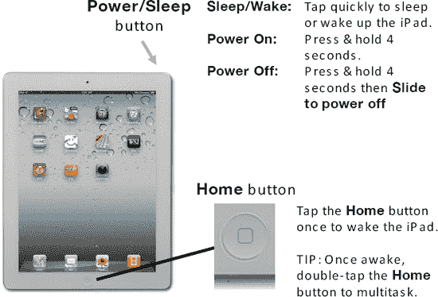

**图 1-11.** *`电源/睡眠`按钮与`主屏幕`按钮*

`睡眠`模式的优势在于，当你想再次使用 iPad 时，只需快速轻点`电源/睡眠`按钮或`主屏幕`按钮，即可唤醒 iPad。据 Apple 称，iPad 的待机时间可长达一个月。

如果你想最大限度地节省电量，或者知道会有相当长一段时间不使用 iPad（例如睡觉时），你可能想将其完全关机。操作方法是：按住`电源/睡眠`按钮，直到出现`滑动来关机`滑块。只需向右滑动滑块，iPad 就会关机。

#### 主屏幕按钮

|  | 你最常用的按键就是`主屏幕`按钮（参见图 1-11）。此按钮将开启你在 iPad 上的一切操作。按一下即可唤醒 iPad（假设它处于`睡眠`模式）。 |

按下`主屏幕`按钮将退出任何应用程序，并带你回到`主屏幕`。

**提示：** 双击`主屏幕`按钮可以设置为执行不同的操作，例如启动 iPad 功能、搜索等（请参阅下一节了解如何配置此按钮）。

#### 双击主屏幕按钮进行多任务处理

iPad（iOS 4.2 及更高版本的新功能）的亮点之一是多任务处理。此功能让你可以同时打开多个应用。要进行多任务处理，只需双击`主屏幕`按钮，然后前后滑动手指即可选择要跳转到的应用。

**提示：** 关于多任务处理的更多详细信息，请参见第 8 章：“多任务处理与语音控制”。

#### 音量键

iPad 右上侧设有简单的`音量增大`/`音量减小`键，你会发现它们非常方便（参见图 1-12）。在许多地方，你也可以通过在屏幕音量控制上滑动手指来控制歌曲、视频、`FaceTime`通话或播客的音量。

##### FaceTime 铃声音量

如果你没有播放歌曲、视频或其他内容，按下这些`音量`键将调整你的`FaceTime`应用的铃声音量。

**提示：** 按住`音量减小`键约两秒钟，可快速将 iPad 静音。

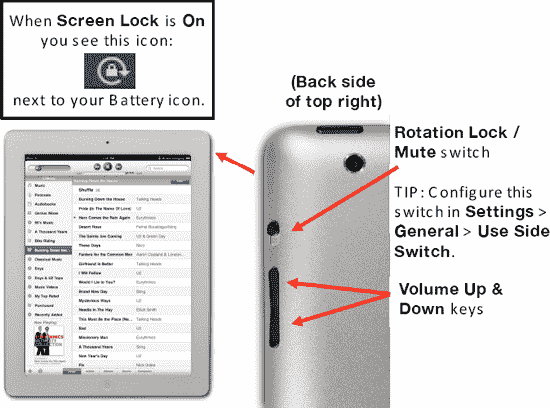

**图 1-12.** *`静音`/`屏幕旋转锁定`开关、`音量增大/减小`键及`主屏幕`按钮*

| **提示：** 你也可以使用`ipod`应用左上角的`滑块`控制来调整音乐播放的音量。 | 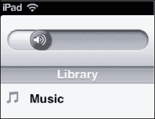 |

#### 旋转锁定/静音开关

就在`音量`键的上方，你可以找到`静音`/`屏幕旋转锁定`开关（参见图 1-12）。

这个开关在 iPad 上有着多变的功能。如果你拥有初代 iPad，就会知道这个开关最初是作为`屏幕旋转锁定`开关使用的。然后 Apple 在 iOS 4.2 中将其改为单纯的`静音`开关。在 iOS 4.3 及更高版本的设备中，你现在可以配置此开关的功能。

要更改此开关的功能，请按以下步骤操作：

**5.** 轻点`设置`，然后轻点`通用`。

**6.** 在`使用侧边开关：`部分，选择`锁定屏幕旋转`或`静音`。

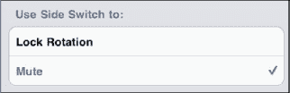

当你想要将 iPad 静音或强制其停止旋转屏幕时，可使用此开关。当你的 iPad 平放在桌面上或腿上时，`旋转锁定`非常有用，你可以强制它保持`竖屏`或`横屏`方向。

**提示：** 这是在床上阅读 iBooks 的好方法。将 iPad 旋转到`横屏`模式，锁定屏幕旋转，然后开始阅读你的书籍。更多信息请参见第 12 章：“iBooks 与电子书”。

#### 调整或禁用自动锁定超时功能

你会注意到，iPad 在闲置一小段时间后会自动锁定并进入`休眠`模式，屏幕变黑。你可以更改此前的间隔时间，或者使用`设置`图标完全禁用此功能：

1.  从`主屏幕`触摸`设置`图标。
2.  触摸左侧栏中的`通用`，然后触摸右侧栏中的`自动锁定`。
3.  你会看到此页面上`自动锁定`旁边的当前时间间隔（图 1-15）。默认设置是 iPad 在闲置五分钟后锁定（以节省电池寿命）。此设置的选项范围从两分钟到十五分钟，或`永不`。

    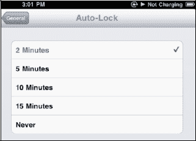

4.  触摸所需设置以选中它——当你看到它旁边出现`勾号`图标时，即表示已选中。
5.  然后，点击顶行的`通用`按钮返回`通用`屏幕。你应该会看到你的更改现在已反映在`自动锁定`旁边。

**电池寿命小贴士：**

将`自动锁定`时间设置得更短（例如，2 分钟）将有助于节省电池寿命。

#### 调整日期和时间

通常情况下，日期和时间会在你连接 iPad 到电脑时自动设置或调整，我们在第 3 章：“将 iPad 与 iTunes 同步”中介绍过。不过，你也可以非常轻松地手动调整日期和时间。当你在旅途中使用 iPad 并需要在降落后调整时区时，你可能需要这样做。请按以下步骤操作：

1.  触摸`设置`图标。
2.  触摸左侧栏中的`通用`和右侧栏中的`日期与时间`以查看`日期与时间`设置屏幕。
3.  如果你更喜欢看到 09:30 和 14:30，而不是上午 9:30 和下午 2:30，请将`24 小时制`设置开关拨到`开启`。

    

    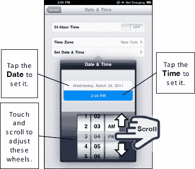

4.  要设置日期和时间，请触摸`设置日期与时间`按钮，查看弹出的滚轮窗口，触摸并移动滚轮即可转动。
5.  触摸并滑动`小时`、`分钟`和`上午/下午`滚轮，使其上下移动。
6.  同样地，要更改日期，请点击`日期`（在此图片中为`2011 年 3 月 23 日，星期三`）。

#### 设置时区

请按照以下步骤设置时区：

1.  在上节显示的同一`日期与时间`屏幕上点击`时区`。
2.  开始输入所需城市的名称（参见图 1-13）。
3.  触摸城市名称以选中它，屏幕将自动返回`日期与时间`屏幕。

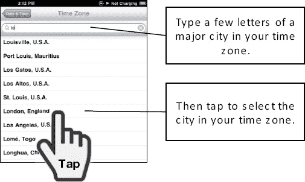

**图 1-13.** *设置时区*

#### 调整亮度

你的 iPad 带有`自动亮度`控制功能，通常默认设置为`开启`（参见图 1-14）。此功能使用内置光线传感器来调整屏幕亮度。通常，我们建议你将其保持为`开启`状态。

如果你想调整亮度，当然可以。从`主屏幕`触摸`设置`图标。然后触摸靠近左侧栏顶部的`亮度与墙纸`标签，并移动`滑块`控制来调整亮度。

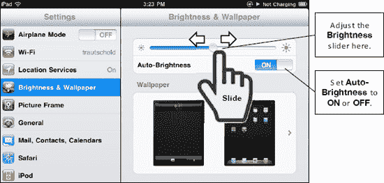

**图 1-14.** *设置 iPad 的亮度*

**小贴士**：将亮度调低将有助于节省电池寿命。将滑块调整到略低于一半的位置似乎效果不错。

## 第 2 章

## 输入技巧、复制/粘贴和搜索

在本章中，我们将向你展示一些在 iPad 上高效输入和节省宝贵时间的好方法，无论你是使用`竖屏`（垂直/较小）键盘还是`横屏`（水平/较大）键盘。我们将介绍如何选择不同的语言键盘、如何输入符号以及其他技巧。我们还将展示在使用各种适用于 iPad 的外部键盘配件时的一些技巧和诀窍。

在本章后面，我们将介绍`聚焦搜索`和`拷贝与粘贴`功能。`拷贝与粘贴`将为你节省大量时间，同时提高你在使用 iPad 时的准确性。

### 在 iPad 上输入

你很快就会在 iPad 上发现两个屏幕键盘：一个是垂直方向持握 iPad 时可见的较小键盘，另一个是水平方向持握 iPad 时可见的较大`横屏`键盘。好处是你可以选择最适合你的键盘。如果你更喜欢实体键盘，我们还将为你介绍 Apple 和 ZAGG 的几款不错配件键盘的详情（参见图 2-1）。

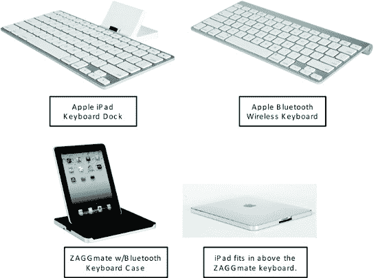

**图 2-1.** *来自 Apple 和 ZAGG 的几款键盘配件*

#### 使用竖屏键盘在屏幕上输入

你会发现，刚开始使用 iPad 时，用一根手指（通常是食指）输入最方便，同时用另一只手握住 iPad。

过一小段时间后，你应该可以尝试用拇指输入（就像你看到很多人用 iPhone 或黑莓智能手机那样）。稍加练习后，用两个拇指输入会比单指输入大大提升速度。请耐心些；要熟练地用双拇指快速输入确实需要练习。

实际上，过一段时间你会注意到，键盘的触摸灵敏度会假定你正在用两个拇指输入。这意味着键盘左侧的字母应由左手按压，右侧的按键应由右手按压（参见图 2-2）。

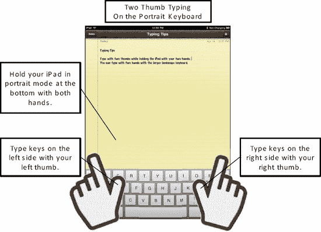

**图 2-2.** *在`竖屏`模式下持握 iPad 时用两个拇指输入*

**小贴士：** 如果你的手比较大，觉得在较小的竖屏键盘上输入有挑战性，那么把你的 iPad 侧转过来，就能得到更大的`横屏`键盘（参见图 2-3）。

#### 使用更大的横屏键盘在屏幕上输入

几乎在任何应用中，只需将 iPad 侧转，键盘就会变为更大的`横屏`键盘，使输入更容易（参见图 2-3）。请按照以下步骤在`横屏`键盘上输入：

1.  将 iPad 稍微倾斜放置会有助于输入；这样能更容易看到屏幕。你也可以简单地将 iPad 平放在平坦表面上。通常，将 iPad 放在保护套中（参见第 1 章：“开始使用”以了解各种保护套）或放在柔软的表面上会有所帮助，这样在输入时它不会晃动。
2.  像在普通电脑键盘上一样用双手输入。经过一些练习后，你几乎可以像在普通实体键盘上一样快速地在较大的屏幕上输入。

**小贴士：** 尝试重复利用旧的鼠标垫作为你输入时 iPad 的垫子。

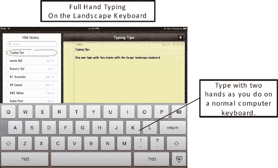

**图 2-3.** *在`横屏`方向时用双手输入*

**小贴士：** 对于经常旅行的人来说，与任何笔记本电脑相比，使用 iPad 上的虚拟键盘能在拥挤的飞机座位上节省大量空间！

#### 使用外部键盘（需另行购买配件）

如果你需要大量输入，或者只是不习惯虚拟键盘那种“在玻璃上输入”的感觉，你可以购买适用于 iPad 的外部键盘。我们已经测试过 Apple 的两款，但我们知道还有更多的键盘底座和蓝牙选项可供选择。我们在本章前面展示过但未测试过一款名为 ZAGGmate 的键盘/保护套组合（参见图 2-1）。请查看 iPad/iPhone/iPod 博客或在线商店（例如 [`www.amazon.com`](http://www.amazon.com)）来寻找键盘和其他配件。你也可以快速搜索“iPad external keyboard”来找到其他选择。

### 外接键盘快捷键

当您将外接键盘连接到 iPad 后，即可使用许多您在电脑键盘上已熟悉的快捷键。以下快捷键能让您在 iPad 上输入时节省一些时间：

-   **使用方向键选择文本：** `Command-Shift-方向键`
-   **剪切所选文本：** `Command + X`
-   **复制所选文本：** `Command + C`
-   **粘贴所选文本：** `Command + V`
-   **撤销：** `Command + Z`
-   **重做：** `Command + Y`

**提示：** 如果您打算在 iPad 上进行大量文本输入，那么投资购买一款这样的外接键盘绝对是物超所值的！在我们的测试中，我们更偏好 Apple iPad 键盘底座，因为它能让 iPad 保持一个非常舒适的输入角度。如果您使用蓝牙键盘，那么您确实需要投资购买一个能将 iPad 以一定角度支撑起来的保护壳，这样在输入时阅读屏幕会更方便。

**警告：** 少数 iPad 应用程序只支持横屏模式，因此无法与键盘底座配合使用，因为当 iPad 处于竖屏方向时，整个应用界面会横向显示——**Apple Keynote** 就是一个典型的例子。

### Apple 无线键盘（蓝牙）——约 70 美元

外接键盘除了让输入更轻松、更快速之外，还有一个额外的好处：由于虚拟键盘消失，您能看到更多的 iPad 屏幕内容。

**提示：** 如果您拥有另一台 Apple 电脑，您可能已经拥有一款无线键盘——它就是 Apple 多年来一直在生产的同一款无线键盘。

#### 将您的 iPad 连接起来

您的 iPad 使用无线蓝牙连接，因此您首先需要将此键盘与 iPad 进行连接，或称*配对*（更多信息请参见第 25 章：“蓝牙”）。您可以通过以下步骤将几乎任何无线键盘连接到您的 iPad：

1.  轻点**设置**图标（参见图 2-4）。
2.  轻点左栏中的**通用**。
3.  轻点右栏中的**蓝牙**。
4.  如果蓝牙接收器显示为**关闭**，请轻点开关将其设置为**开启**。
5.  按下键盘顶部下方圆管右侧边缘的**开/关**按钮，开启您的 Apple 无线键盘。当键盘已开启且装有电池时，键盘右上角的绿色指示灯会亮起或闪烁。
6.  无线键盘通电后，您应该会在 iPad 的**蓝牙**屏幕上的**设备**列表中看到它。轻点**设备**下列出的键盘，让 iPad 生成一个配对码（参见图 2-4）。
7.  在无线键盘上输入 iPad 上显示的配对码，然后按键盘上的 **回车/Return** 键。
8.  有时需要尝试两到三次才能让键盘与 iPad 成功配对。请继续尝试，最终会成功的！

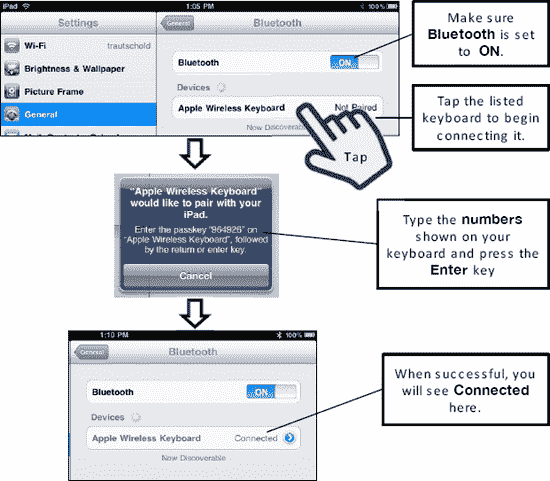

**图 2-4.** *将蓝牙无线键盘与 iPad 配对*

#### 在无线键盘与屏幕键盘之间切换

在无线键盘和内置屏幕键盘之间来回切换非常容易。只需按下键盘右上角的**弹出**键 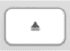，即可暂时断开无线键盘的连接并显示屏幕键盘。

再次按下**弹出**键即可重新连接无线键盘并隐藏屏幕键盘。

### Apple iPad 键盘底座——约 70 美元

除了提供实体键盘供您输入外，键盘底座还有一个额外的好处：它能将您的 iPad 像普通电脑屏幕一样以一定角度支撑起来。体验非常棒！

**说明：** 在本书出版时，Apple 尚未更新初代 iPad 底座，因此它既能支撑 iPad 也能支撑 iPad 2（虽然可能有点松）。我们相信 Apple 可能很快就会推出专门为 iPad 2 设计的新款底座。

此键盘的其他好处在于，它是由 Apple 专门为 iPad 设计的，因此拥有特殊设计的按键，如图 2-5 所示。在这些按键的右侧，沿着顶部还有媒体控制键：**上一曲**、**播放/暂停**、**下一曲**和**音量**。此外，您还有一个**锁定**键。

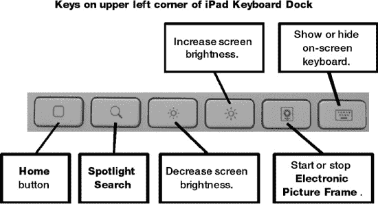

**图 2-5.** *iPad 键盘底座上的特殊按键*

**提示：** 要唤醒处于休眠状态的 iPad，您只需轻按 iPad 键盘底座上的任意按键即可。

与笔记本电脑不同，iPad 在底座中的角度是固定的，无法调整；不过，我们在测试中发现这个角度用起来非常舒适。

**警告：** iPad 在键盘底座中可能有点不太稳定。我们建议将其放在一个平整、稳固的表面上。另外，如果有小朋友（或大狗）在身边跑来跑去时要格外小心——他们很容易意外碰倒 iPad 使其从底座上掉落。

#### 将您的 iPad 连接到键盘底座

将 iPad 连接到键盘底座非常简单——只需将其放置在底座上，插入 iPad 底部的端口即可，如图 2-6 所示。

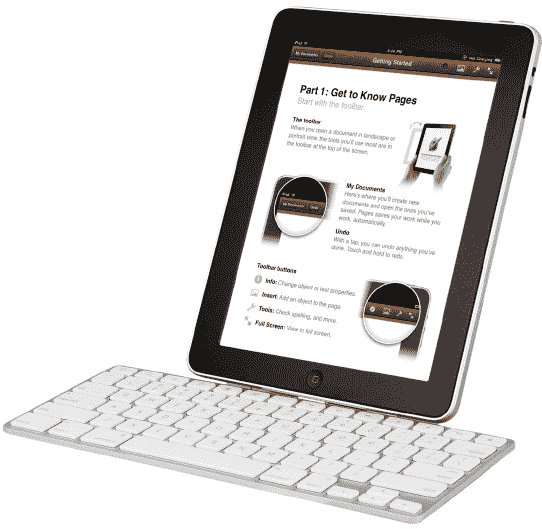

**图 2-6.** *放置在键盘底座中的 iPad——非常适合输入长文挡*

**说明：** 如果您给 iPad 装了保护壳，那么很可能需要先取下保护壳，才能将 iPad 连接到键盘底座。这样做还有一个额外的好处：当您在底座上给 iPad 充电时，有助于其散热。

然后，您可以将 USB 同步和充电线缆插入键盘底座背部，以便同时将 iPad 连接到电脑，或通过墙插为其充电。

要断开连接，只需将 iPad 从键盘底座中向上拔出即可。

**警告：** 在本书出版时，标准的键盘快捷键，例如 `Command-C` 用于复制、`Command-V` 用于粘贴，在这两款键盘配件上均可使用；但是，iPad 的自动大写、自动更正以及双击**空格**键输入句号的快捷键功能无法使用。

#### 同时连接两个键盘

如果您恰好同时拥有无线键盘和键盘底座，我们发现您可以在 iPad 上同时使用这两个键盘进行输入。因此，您甚至可以在同一份文档上轮流输入，进行键盘对决，甚至尝试二重奏式的输入。无论如何，这都是这些键盘一项奇怪但真实存在的功能。

#### 利用自动纠正节省时间

当你打字一段时间后，就会注意到正在输入的某些单词正下方会出现一个小弹出窗口——这被称为自动纠正功能。（如果你从未见过这个弹出窗口，则需要在 iPad 上的 `设置` 图标中启用自动纠正。）当你看到弹出窗口猜出了正确的单词时，只需按下键盘底部的 `空格键` 选择该单词，就能节省时间。

在这个例子中，我们开始输入单词“especially”。当我们输到这个单词中的字母 `c` 时，正确的单词——*especially*——就会出现在下方的弹出窗口中。要选择它，我们只需按下键盘底部的 `空格键`（见图 2-7）。

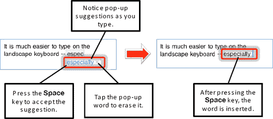

**图 2-7.** *使用自动纠正和建议单词*

你的第一反应可能是点击弹出的单词，但那样做只会将它从屏幕上清除。实际上，更快的做法是继续打字，或者当看到正确的单词时按下 `空格键`，因为在许多情况下，随着你继续输入，单词要么本来就是正确的，要么会变成正确的。长远来看，这种方法能减少手指的移动距离。

学会使用 `空格键` 后，你就会发现这个弹出式猜测功能能节省不少时间。毕竟，你本来就需要在单词末尾输入一个空格！

**提示：** 利用自动纠正，你可以避免在许多常见缩略词中输入撇号，例如“won't”和“can't”。自动纠正会在弹出的窗口中显示拼写正确的缩略词；你只需按下 `空格键` 即可选择纠正后的单词。

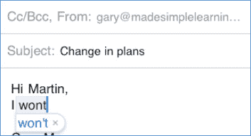

##### 听取自动纠正单词的读音

你可以将 iPad 设置为在自动文本和自动纠正单词出现时朗读它们。这有助于你选择正确的单词。请按以下步骤启用此朗读功能：

1.  点击 `设置` 图标。
2.  点击左侧栏中的 `通用`。
3.  点击右侧栏底部的 `辅助功能`。
4.  将 `朗读自动文本` 旁边的开关设置为 `开启`。

启用此功能后，每次打字时弹出自动纠正的单词，你都会听到它被朗读出来。如果你喜欢听到的单词，就按下 `空格键` 接受它；否则，继续打字。此功能可以帮你省去从键盘上抬头查看的麻烦，从而节省时间。

### 辅助功能选项

iPad 上有许多有用的功能可以辅助操作。 `旁白` 选项能为你朗读屏幕上的文本。它会告诉你触摸了什么、选中了哪些按钮以及所有选项。它还可以朗读整屏的文本。如果你想让屏幕显示更大，也可以按下一节所述，开启 `缩放` 功能。

#### 大文本

有时，标准字体太小，阅读起来很费力。这种情况下，`大文本` 功能就非常有用了。

从 `辅助功能` 选项中点击 `大文本`，可以调整 `通讯录`、`邮件` 和 `备忘录` 中的字体大小。

你可以从 `关闭`（默认约为 12 磅文本）一直选择到 56 磅文本。

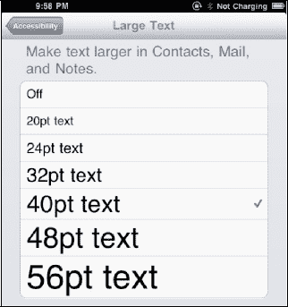

#### 旁白——让 iPad 为你朗读

iPad 的一个很酷的功能是可以开启 `旁白` 功能，这样 iPad 就会朗读屏幕上显示的任何内容。你甚至可以让它为你朗读任何电子邮件、文本文档，甚至是 iBook 页面中的内容。

请按以下步骤启用 `旁白`：

1.  点击 `设置` 图标。
2.  点击左侧栏中的 `通用`。
3.  点击右侧栏底部的 `辅助功能`。
4.  点击左侧栏中的 `旁白`。
5.  将 `旁白` 开关设置为 `开启`，然后在弹出窗口中点击 `确定` 确认。

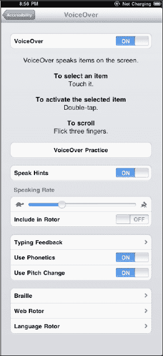

**注意：** 如右侧屏幕所示，`旁白` 的手势与正常手势不同。请点击 `练习旁白手势` 按钮来熟悉它们。

请注意，你可以从慢到快调整 `朗读速率`，并进行其他调整，例如 `键入反馈`、`使用语音` 和 `使用音调变化`。不妨尝试一些这些选项，看看哪些最适合你。

点击 `盲文` 可以通过蓝牙将 iPad 连接到盲文设备。

点击 `网页转子` 可以调整各种网页功能，以便在 *网页转子* 中包含这些功能（稍后你将了解更多相关信息）。

类似地，点击 `语言转子` 可以选择用于 `旁白` 的语言（同样，稍后你将了解更多相关信息）。

在启用 `旁白` 的情况下打字时，默认情况下，你输入的每个字符都会被朗读出来。你可以在刚才提到的设置屏幕中更改这一设置。你可以将其设置为仅朗读单词、仅朗读字符，或者不朗读任何内容。

要在 `iBooks` 应用中让 iPad 为你朗读整个页面，你需要同时触摸屏幕上文本块的上方和下方。如果你用一根手指点击文本，则只会为你朗读单行文本。

在 `备忘录` 应用中点击笔记的顶部，会为你朗读整篇笔记。

##### 网页转子与语言转子

使用 `旁白` 时的两个有趣功能是网页转子和语言转子。你可以在之前显示的 `旁白` 设置屏幕中自定义这些转子中出现哪些项目。

| 要使用网页或语言转子，你需要将两根手指放在屏幕上，同时旋转它们（就像用手指指尖转动刻度盘一样）。完成此操作后，屏幕上会出现一个小型的 `旋转刻度盘` 图标（请参见右侧图片，其中 `旋转刻度盘` 设置为 `标题`）。接着，用一根手指在屏幕上向下轻扫，就会跳转到所选列表中的下一个项目。例如，如果你将网页转子设置为 `标题`，然后用一根手指向下轻扫，`旁白` 会跳转到页面的下一个标题。向上轻扫则跳回上一个标题。 | 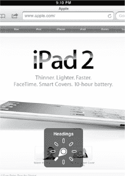 |
| 要切换语言，首先在 `旁白` 的“语言转子”设置屏幕中选择若干种语言。将两根手指放在屏幕上并旋转，直到看到指针指向 `语言`。接着，向下轻扫以选择下一个 `旁白` 语言。向上轻扫则返回之前选择的一种语言。 | 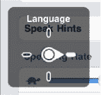 |

#### 使用缩放放大整个屏幕

如果你觉得屏幕上的文本、图标、按钮或任何东西看得稍微有些困难，你可以开启 `缩放` 功能。开启 `缩放` 功能后，你可以将整个屏幕放大到几乎两倍大小。这会让所有内容更容易阅读。

**注意：** `旁白` 和 `缩放` 不能同时使用；你需要选择其中之一。

请按以下步骤启用 `缩放`：

1.  点击 `设置` 图标。
2.  点击左侧栏中的 `通用`。
3.  点击右侧栏底部的 `辅助功能`。
4.  点击右侧栏中的 `缩放`。
5.  将 `缩放` 旁边的开关设置为 `开启`。

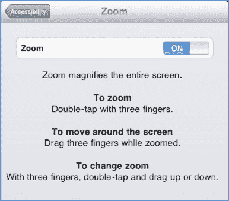

与 `旁白` 类似，`缩放` 使用三指手势。在离开屏幕前，请务必记下这些手势。

#### 白底黑字

如果对比度和颜色难以辨认，那么你可能想要开启 `白底黑字` 设置。请按照以下步骤更改此设置：

1.  如前所示，进入 `设置` 应用中的 `辅助功能` 屏幕。
2.  将 `白底黑字` 开关设置为 `开启`。

当此设置开启时，屏幕上所有浅色部分都会变成黑色，而所有深色或黑色部分则会变成白色。

#### 三次点击主屏幕按钮选项

你可以设置三次点击 `主屏幕` 按钮来执行与辅助功能相关的各种操作：

1.  进入 `设置` 应用中的 `辅助功能` 屏幕，如前所示。
2.  轻点右侧列底部附近的 `三次点击主屏幕按钮`。
3.  从 `关闭`、`切换旁白`、`切换黑底白字` 或 `询问` 中选择。

### 用于编辑文本/放置光标的放大镜

你是否曾多次在输入文字时，想要将光标精确地放置在两个单词或字母之间？在你掌握放大镜技巧之前，这可能很难做到。具体操作如下：用手指按住你想要放置光标的位置（参见图 2-8）。一两秒后，你会看到 `放大镜` 图标出现。然后，在手指按住屏幕的同时，滑动手指来定位光标。当你松开手指时，会看到 `拷贝/粘贴` 弹出菜单，但你可以忽略它。

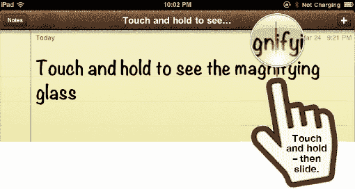

**图 2-8.** *按住屏幕以调出 `放大镜` 图标并放置光标。*

### 输入数字和符号

你可能想知道如何使用 iPad 屏幕键盘输入数字或符号。输入时，轻点左下角的 `.?123` 键即可看到数字和常用符号，例如 `$ ! ~ & = # . _ - +`。如果你需要更多符号，请从数字键盘上轻点 `#+=` 键，该键位于左下角 `ABC` 键的正上方（参见图 2-9）。

**提示：** 当你按下 `.?123` 键时，甚至会出现一个 `撤销` 键——对任何键盘来说都是一个不错的补充！

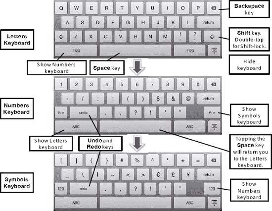

**图 2-9.** *在字母、数字和高级符号键盘之间切换*

**提示：** 请注意，`数字` 和 `符号` 键盘将保持激活状态，直到你按下 `空格` 键或轻点另一个键盘（如 `ABC`）的按键为止。

#### 触控并滑动技巧

以下技巧由 iPhone/iPad Blog（[`www.tipb.com`](http://www.tipb.com)）的 Rene Ritchie 提供。

##### 输入大写字母

| 通常，你需要先轻点 `Shift` 键，再轻点字母来输入大写字母。然而，对于需要 `Shift` 键的单个大写字母或符号，更快的输入方法是：触摸 `Shift` 键，手指不离开键盘，滑动到你想要的按键上，然后松开。例如，要输入大写字母“M”，触摸右侧的 `Shift` 键，然后滑动到“M”键上并松开。 |  |

##### 快速输入单个数字

如果你只需输入一个数字，那么请触摸 `.?123` 键，并将手指向上滑动到该数字上。但是，要连续输入多个数字，最好先轻点 `.?123` 键并松开手指，然后逐个轻点每个数字。

##### 输入需要 Shift 键的符号

问号和感叹号亦是如此，它们需要你在字母键盘上按下 `Shift` 键。触摸 `Shift` 键，然后滑动并松开手指于 `?` 键上。

##### 输入撇号

按住 `逗号/感叹号` 键可看到撇号弹出窗口。撇号会以蓝色高亮显示，因此只需松开按键即可输入它。

**提示：** 对于大多数常见的缩略词，你的自动纠正词典应能自动插入撇号。例如，输入“dont”，然后按下 `空格` 键即可插入撇号，变成“don't”。

#### 长按键盘快捷键以输入符号等

| 你可能还想知道如何输入键盘上未显示的其他符号。**提示：** 你可以输入的符号比屏幕上显示的要多。你只需长按与你想要的符号相关的字母、数字或符号；这将调出一个特殊的上下文菜单。 |  |
| 例如，如果你想输入欧元符号（€），请按住 `$` 键，直到看到其他选项。接着，向上滑动手指以高亮显示，然后在欧元符号上松开手指。 |  |
| 这个技巧也适用于 `Safari` 浏览器中的 `.com` 键。你可以通过按住此键来获取更多的网站后缀。右侧的屏幕显示其选项中有 `.co.uk` 和 `.ie` 键。这些键在标准的美式键盘上没有出现，但在这里存在，是因为我们安装了英语（英国）国际键盘（有关国际键盘的帮助，请参考本章前面的部分）。 |  |

**提示：** 在 `数字` 屏幕上有一个很好的圆点符号（或度数符号，取决于你如何看待它）。你可以通过按住 `零` 键（`0`）来访问它。你也可以按住 `?` 和 `!` 键来获取它们对应的西班牙语倒置符号。

#### 左右箭头（国际语言）

| 如果（且仅当）你激活了从右向左输入的国际语言键盘（例如希伯来语或日语），你会注意到在文本上方的弹出窗口右端出现一个带有一对箭头的按钮。点击这个 `箭头`  按钮，你可以调整文本在 iPad 上的输入方式——从右向左或从左向右。 |  |

### 键盘选项与设置

| 有一些键盘选项可以让你的 iPad 输入更加轻松。键盘选项位于 `设置` 应用的 `通用` 标签中。请按照以下步骤更改你的键盘设置：
1.  轻点 `设置` 图标。
2.  轻点右侧列中的 `通用`。
3.  轻点左侧列中的 `键盘` 以查看此屏幕。
 |  |

#### 自动大写

| 当你开始一个新句子时，如果 `自动大写` 设置为 `开`，第一个单词将自动大写。此外，常见的专有名词也会被正确大写。例如，如果你输入“New york”，系统会提示你将其更改为“New York”——同样，只需按下 `空格` 键即可执行更正。如果你用退格键删除了一个大写字母，iPad 会假定你接下来输入的字母也应该是大写。此功能默认也为 `开`。 |  |

#### 自动纠正 开 / 关

使用内置词典，“自动纠正”功能会自动对常见的拼写错误进行更改。

**提示：** 如果“自动纠正”功能错误地更改了一个单词，你可以立即按 `退格` 键，调出一个包含原始单词（在自动纠正之前）的弹出窗口。

例如，如果你输入“wont”，自动纠正会即时将其更改为“won't”。如果你希望此功能生效，需要确保“自动纠正”设置为 `开`（默认设置为 `开`）。

#### 检查拼写

你的 iPad 会自动检查你的拼写，因为此选项的默认设置为 `开`。但是，如果你更想禁用拼写检查，只需将 `检查拼写` 切换到 `关` 即可。

**提示：** 当拼写检查开启时，拼写检查器认为拼写错误的任何单词都会被加下划线。轻点任何带下划线的单词即可查看建议的更正值列表。

#### 启用大写锁定

有时在输入时，你可能想像在电脑键盘上一样，通过按住 `大写` 键（`上箭头` 键）来锁定大写。启用 `大写锁定` 可以让你做到这一点。此功能默认设置为 `关`。

#### “.” 快捷键

如果你是 iPhone 或 BlackBerry 用户，你可能熟悉双击 `空格` 键会在句子末尾自动输入句号的功能。这正是你在 iPad 上可以启用的相同功能。默认情况下，此功能也设置为 `开`。

#### 使用其他语言输入——国际键盘

截至本书出版时，iPad 支持你使用超过十几种语言进行输入。部分亚洲语言（如日语和中文）提供了两到三种键盘，对应不同的输入法。

若要启用多种语言键盘，请按照以下步骤操作：

1.  轻点`设置`图标（请参阅图 2-10）。
2.  在左侧栏中轻点`通用`。
3.  在右侧栏底部附近轻点`键盘`。
4.  轻点`国际键盘`。
5.  轻点`添加新键盘`以添加其他国际键盘。
6.  轻点列表中的任意键盘/语言以添加该键盘。
7.  此时该键盘将出现在可用键盘列表中。
8.  若要调整键盘选项，请轻点列表中的键盘。

**图 2-10.** *添加并自定义国际键盘*

##### 编辑或删除国际键盘

编辑或删除国际键盘也十分简单：

1.  返回到显示所有键盘列表的`键盘`屏幕（见图 2-11）。
2.  轻点右上角的`编辑`以更改键盘顺序或删除键盘。
3.  若要更改键盘列表的顺序，请向上或向下拖动列表键盘的左边缘。
4.  若要删除键盘，请轻点`红色减号`图标，然后轻点`删除`。

**图 2-11.** *编辑和删除国际键盘*

一旦你启用了多个键盘，轻点`地球`键即可在所有语言之间循环切换（请参阅图 2-12）。

日语和其他一些语言提供了多个键盘选项，以满足你的输入偏好。

在某些语言中（例如图 2-12 中显示的日语），你会看到输入的字母自动转换为字符。你还会在键盘上方看到一行其他字符组合。看到你想要的组合时，轻点它即可。

**图 2-12.** *轻点`地球`键在国际键盘之间循环切换。*

#### 拷贝与粘贴

拷贝和粘贴文本有多种方法。例如，`拷贝和粘贴`功能对于从日历中获取文本并放入电子邮件中非常有用。它也很适合将笔记放入电子邮件或日历中。你甚至可以从你的`Safari`网页浏览器中拷贝文本，然后粘贴到笔记或邮件中。

#### 选择文本

如果你正在阅读或输入文本，可以通过几种方式选择文本。例如，你可以轻点或双击文本以开始选择文本进行拷贝。此操作在邮件、信息和笔记中均有效。

##### 双击并拖动蓝色手柄

选择文本的一种方式是双击一个单词，然后拖动蓝色手柄。

你会看到一个带有蓝色圆点（手柄）的选框位于对角。只需拖动这些手柄即可选择你想要高亮显示并拷贝的文本，如图 2-13 所示。

**图 2-13.** *双击开始选择文本，然后拖动蓝色圆点以扩展选区。*

##### 使用“选择”或“全选”

| 在输入内容时选择文本的另一种方法是轻点文本一次，然后从弹出窗口中选择`选择`或`全选`。除了在文本本身之外，如果你在屏幕上的任意位置双击，也会出现相同的弹出窗口。 |  |

#### 使用双指触摸选择文本

另一种选择文本的方法要求你同时用两根手指触摸屏幕。如果你用一只手握住 iPad，用另一只手的拇指和食指触摸屏幕，这种方法效果最佳。你要做的是在你想要选择文本的开始和结束位置同时触摸屏幕。如果第一次触摸未能精确选中，请不要担心。在第一次触摸后，使用蓝色手柄将选区的起始和结束位置拖动到正确位置（请参阅图 2-14）。

**图 2-14.** *通过同时用两根手指触摸屏幕来选择文本。*

#### 通过长按选择网站或其他不可编辑文本

| 在`Safari`网页浏览器以及其他无法编辑文本的地方，你可以将手指放在某些文本上，一个单词或整个段落将会被高亮显示，并在每个角落出现手柄。如果你想要选择更多文本，可以拖动这些手柄。

**注意：** 向上或向下拖动可快速选择整个段落或更多内容。你可以拖动小于一个段落的距离，以使用带有蓝色手柄的精细文本模式选择器。 |  |

#### 剪切或拷贝文本

| 一旦你想要拷贝的文本被高亮显示，只需轻点屏幕顶部的`拷贝`选项卡。该选项卡会变为蓝色，表示文本已在剪贴板上。**注意：** 如果你之前已经剪切或拷贝过文本，那么你还会看到`粘贴`选项，如图所示。 |  |

#### 粘贴文本

如果你要将文本粘贴到同一个笔记或邮件中，请按照以下步骤操作：

1.  用手指将光标移动到你想要粘贴文本的位置。请记住使用“放大镜”技巧（本章前面已描述）来帮助你定位光标。
2.  松开屏幕后，你应该会看到一个弹出窗口，询问你是要`选择`、`全选`还是`粘贴`。
3.  如果没有看到这个弹出窗口，请双击屏幕。
4.  选择`粘贴`以粘贴你的选择内容。

#### 将文本或图像粘贴到另一个应用

按照以下步骤将你拷贝的文本或图像粘贴到另一个应用：

1.  按下`主屏幕`按钮（见图 2-15）。
2.  轻点你想要粘贴文本的目标应用。在此例中，我们轻点`邮件`。
3.  轻点`编写`图标  以撰写新电子邮件。
4.  在邮件正文中的任意位置双击。
5.  轻点`粘贴`。

**图 2-15.** *通过双击或按压、按住并松开的方式调出`粘贴`命令。*

将光标移动到文本正文处，然后双击或触摸、按住并松开手指。这将调出`粘贴`弹出窗口。轻点`粘贴`，剪贴板上的文本便会立即粘贴到电子邮件正文中。

#### 摇动以撤销粘贴或输入

| 拷贝和粘贴功能中的一个出色新特性是能够撤销输入或刚刚粘贴的文本。你只需在粘贴后摇晃 iPad。一个新的弹出窗口会出现，让你选择撤销刚才的操作。

轻点`撤销粘贴`或`撤销输入`来纠正错误。**提示：** 键盘上也有一个`撤销`按钮。只需按下`.?123`键；它位于左下角。 |  |

**提示：通过选择文本并按退格键来删除文本**

如果你想用一两次轻点来删除多行文本、一个段落甚至所有刚输入的文本，这个技巧对你会有帮助。使用前面介绍的方法选择你想要删除的文本。然后，只需按下键盘左下角的`删除`键  即可删除所有选中的文本。

### 使用 Spotlight 搜索查找内容

iPad 上一个非常出色的信息查找功能是`Spotlight 搜索`，这是苹果专有的搜索方法。此功能让你的 iPad 能够全局搜索姓名、事件或主题。

其概念很简单。假设你在寻找与 Martin 相关的内容。你不记得它是邮件、笔记还是日历事件；但你确定它与 Martin 有关。

此时正是使用`Spotlight 搜索`功能在 iPad 上查找所有与 Martin 相关内容的绝佳时机。

### 启动聚焦搜索

首先启动**聚焦搜索**，它位于**主屏幕**第一页的左侧。

在第一个圆点（表示**主屏幕**的第一页）的左侧，你可以看到一个非常小的**放大镜**图标。从这第一页图标向右滑动，即可进入**聚焦搜索**页面。

#### 搜索应用

使用**聚焦搜索**的一个好方法是快速查找应用。如果你的**主屏幕**超过两到三页，你可能会想用它。启动搜索并输入应用名称的几个字母，例如**天气**。这将找到所有与天气相关的应用。

#### 搜索网页或维基百科

如果你确定要搜索网页或维基百科，可以跳过打开**Safari**浏览器并在**搜索**栏中输入信息的步骤。通过跳过进入维基百科网站的步骤，你可以节省更多时间。

例如，你可能想知道美国邮政编码 10708 的位置。只需在**聚焦搜索**中输入`"10708"`，然后轻点**搜索网页**（见图 -16）。

**图 2-16.** *从**聚焦搜索**中搜索网页或维基百科。*

#### 搜索邮件、通讯录、视频、歌曲、日程等

**聚焦搜索**的美妙之处在于，它几乎可以搜索 iPad 上的任何内容。你可能想查找联系人、视频、歌曲、日历日程或其他项目。使用起来很简单：只需在**搜索**页面中开始输入即可（见图 -17）。

**提示：** 如果你在找人，请输入其全名，以便更精确地只找到与该人相关的项目（例如`"Martin Trautschold"`）。这将会排除 iPad 中所有其他叫 Martin 的人，确保只找到与 Martin Trautschold 相关的项目。

在搜索结果中，你会看到搜索找到的所有电子邮件、日程、会议邀请和联系信息。轻点列表中的某个结果即可查看其内容。

**图 2-17.** *使用**聚焦搜索**在你的 iPad 上搜索所有类型的内容。*

你的搜索结果会一直保留，直到你手动清除，因此你可以随时从**主屏幕**向右滑动，再次回到**聚焦搜索**。

要清除**搜索**栏，只需轻点**搜索**栏中的 **X** 按键。要退出**聚焦搜索**，只需按下**主屏幕**按键或向左滑动。

#### 自定义聚焦搜索

有时你可能希望有选择地只搜索特定项目。另一些时候，你可能希望从搜索中移除某些特定项目（例如邮件）。你可以通过调整**设置**应用中的**聚焦搜索**选项来实现。请按照以下步骤操作：

1.  轻点**设置**图标。
2.  轻点**通用**。
3.  轻点右侧栏中的**聚焦搜索**，即可看到此处所示的屏幕。
4.  轻点任意项目以勾选或取消勾选。
5.  长按每个项目右侧边缘的图标，在列表中向上或向下拖动。

## 第 3 章

## 用 iTunes 同步你的 iPad

在本章中，我们将向你展示如何设置，以便在 iPad 与 Windows 或 Mac 电脑之间同步信息。除了同步功能外，iTunes 还能做更多事情，比如整理音乐、创建播放列表、购买歌曲和视频；它还具备家庭共享和 Genius 功能。要了解这些功能，请查看第 29 章。

**注意：** 如果你的电脑或其他地方没有维护日历或通讯录，电脑上也没有照片、视频、音乐、有声读物或图片，你仍然需要将 iPad 连接到电脑上的 iTunes，至少要为 iPad 进行备份，并在有可用更新时进行软件更新。

我们还将向你展示同步前需要考虑的事项、如何设置个人信息的自动同步，以及如何手动传输信息。通过 iTunes，你可以同步或传输通讯录、日历、备忘录、应用、音乐、视频、文档和照片库。iTunes 还有一个额外的好处，那就是只要你将 iPad 连接到电脑，它就会自动备份你的 iPad。如果同步出现问题，我们甚至还会向你展示一些简单的故障排除技巧。最后，我们将向你展示如何检查更新以及为 iPad 安装更新的操作系统软件。

**提示：** 如果你是 iTunes 新手，我们强烈建议你查看第 29 章，“你的 iTunes 用户指南”，以帮助你充分利用 iTunes。

### 在设置 iTunes 同步之前

在开始使用 iTunes 同步之前，你需要准备几样东西。我们将介绍先决条件，并回答一些关于为何使用 iTunes 的常见问题。我们还将帮助你了解，如果你拥有其他 Apple 设备（如 iPhone 或 iPod），并与 iPad 同步时会发生什么。

#### 同步前的先决条件

在开始使用 iTunes 同步你的 iPad 之前，你只需要准备好以下几样东西。

1.  确保你的电脑上安装了最新版本的 iTunes。关于如何安装或更新 iTunes，请参见第 29 章：“你的 iTunes 用户指南”。
2.  创建一个 iTunes 账户（Apple ID）；请参阅第 29 章中的“创建 iTunes 账户”部分。
3.  找到 iPad 附带的白色同步线缆。线缆的一端插入 iPad 底部靠近**主屏幕**按键的底座接口，另一端插入电脑的 USB 端口。

#### 我可以在 iPad 与另一部 iPhone、iPod touch 或 iPod 之间同步 iTunes 吗？

**可以！** 只要你是同步到同一台电脑，就可以将多个 Apple 设备（Apple 说最多五个，但我们听说有人同步了更多）同步到单台电脑上的同一个 iTunes 账户。

**警告：** 你不能将同一部 iPad、iPhone 或 iPod 同步到两台不同的电脑。当你尝试这样做时，会看到类似这样的信息：“是否要擦除此设备（iPad、iPhone、iPod）并重新同步新资料库？” 如果你选择“是”，那么该设备上的所有音乐和视频都将被抹掉。

#### 其他同步选项：MobileMe 和 Exchange/Google

还有其他同步个人信息和电子邮件的方法，例如 Exchange/Google 和 MobileMe，我们将在第 4 章：“其他同步方法”中介绍。然而请记住，即使你选择使用这些其他的同步方式，你仍然需要使用 iTunes 来：

*   备份和恢复你的 iPad。
*   更新 iPad 操作系统软件。
*   同步和管理你的应用程序，也称为“应用”。
*   同步你的音乐资料库和播放列表。
*   同步电影、电视节目、播客和 iTunes U 内容。
*   同步图书。
*   同步照片。

#### 考虑其他同步选项

表 3–1 总结了你的其他同步选项。你选择使用哪种同步方式，应该取决于你当前存储电子邮件、通讯录和日历的地方——也就是你的使用环境。

**注意：** 正如你在表 3–1 中所见，在某些环境下，你可以将通讯录和日历无线同步到你的 iPad。

### 设置你的 iTunes 同步

我们将向你展示使用 iTunes 对 iPad 执行自动同步和手动传输信息的所有步骤。

