# iPad 摘要屏幕

将 iPad 连接到电脑后，您可以查看重要信息，例如 iPad 的 GB 容量、已安装的软件版本和序列号。您还可以检查软件版本更新或恢复 iPad 上的数据。此屏幕上提供了其他几个选项。

### iTunes 导航基础

熟悉左侧导航栏。点击左侧导航栏中的各个项目，并注意主显示窗口会随之变化（参见图 3-1）。

主窗口顶部的导航栏也会根据您在左侧导航栏中选择的内容而变化。

例如，当您在左侧导航栏中点击您的 iPad 时，主窗口顶部会显示与您设备相关的标签。

当您在左侧导航栏中单击 iTunes Store 时，主窗口中会显示与商店相关的标签。

要查看 `iPadSummary` 屏幕：

1. 在您的电脑上启动 iTunes 软件。
2. 使用设备附带的白色 USB 数据线将 iPad 连接到电脑。将线的一端插入 iPad 底部靠近 `Home` 按钮的位置，另一端插入电脑的 USB 端口。
3. 如果连接成功，您应该在左侧导航栏的 `DEVICES` 下看到您的 iPad。
4. 点击左侧导航栏中的 iPad，然后点击主窗口左侧边缘的 `Summary` 标签（参见图 3-1）。
5. 如果您希望能够将音乐和视频拖放到 iPad 上，则需要勾选 `Manually manage music and videos` 旁边的复选框。
6. 如果您希望每次连接 iPad 时自动打开 iTunes 并进行同步，请勾选 `Open iTunes when this iPad is connected` 复选框。

**注意：** 您可能会在摘要屏幕的“选项”区域看到 `Open iTunes when this iPad is connected` 旁边的文本和复选框呈灰色（不可点击）。这是因为在 iTunes“编辑”>“偏好设置” “设备”标签屏幕中，`Prevent iPods, iPhones and iPads from syncing automatically` 旁边的复选框已被勾选。如果您在“偏好设置” “设备”标签中取消勾选此框，则可以使 `Open iTunes when this iPad is connected` 再次变为可点击项目。

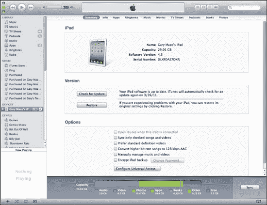

**图 3-1.** *iTunes 中的 iPad 摘要屏幕*

### iTunes 导航基础

熟悉左侧导航栏。点击左侧导航栏中的各个项目，并注意主显示窗口会随之变化。

主窗口顶部的导航栏也会根据您在左侧导航栏中选择的内容而变化。例如，当您在左侧导航栏中点击您的 `iPad` 时，主窗口顶部会显示与您设备相关的标签。当您在左侧导航栏中点击 `iTunes Store` 时，主窗口中会显示与商店相关的标签。

## 进入同步设置屏幕（信息标签）

您的第一步是进入同步联系人、日历、电子邮件等内容的设置屏幕。您可以按照前面描述的进入 `Summary` 屏幕的相同步骤操作，但现在需要在主 iTunes 窗口顶部点击 `Info` 标签来查看联系人（以及其他同步设置）。

## 同步您的联系人和日历

让我们从设置联系人和日历的同步开始。

1. 勾选 `Sync Contacts with` 复选框，并调整下拉菜单以选择存储联系人的软件或服务。在本书出版时，Windows 电脑上可用的选项有 Outlook、Google 联系人、Windows 联系人和 Yahoo! 通讯录。参见图 3-2。您还可以选择 `All contacts` 或 `Selected groups`。
2. 要同步日历，请勾选 `Sync Calendars with` 复选框，并调整下拉列表以匹配您在电脑上存储日历的软件，如图 3-2 所示。您还可以选择 `All calendars` 或 `Selected calendars`。

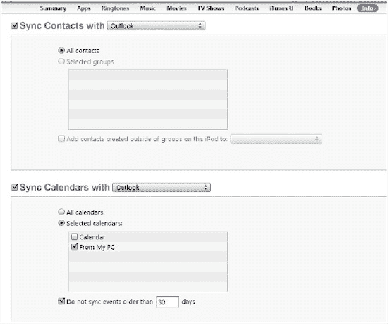

**图 3-2.** *选择用于同步联系人的软件 (Windows)*

**警告**: 每当您在这些同步设置屏幕（称为同步提供商）中的软件和服务之间切换时，都会影响到连接到您 iTunes 帐户的每一个移动设备。例如，如果您将联系人同步到 iPhone 或 iPod touch（除了您的 iPad 之外），这些更改也会影响到 MobileMe。您将更改您的 iTunes 帐户所连接的任何其他设备同步联系人的方式。

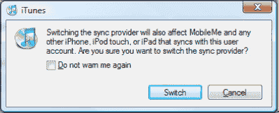

### Google 和 Yahoo! 同步

如果您选择 Google 或 Yahoo! 同步，系统将提示您输入您的 Google ID 或 Yahoo! ID 和密码。

**注意**：您在 `Info` 标签和其他下拉框中看到的选项会根据您电脑上安装的软件略有不同。例如，在 Mac 上，联系人同步没有下拉列表；相反，其他服务（例如 Google 联系人和 Yahoo!）会显示为单独的复选框。

要继续设置您的电子邮件帐户、书签等，请向下滚动页面。如果您不想设置其他任何内容进行同步，请点击 iTunes 屏幕右下角的 `Apply` 按钮开始同步。

**提示**：如果您是使用 Microsoft Entourage 的 Mac 用户，则需要启用 Entourage 与 iCal 的同步。为此，请进入 Entourage 的“偏好设置”，然后转到“同步服务”并勾选与 iCal 和通讯簿同步的复选框，如图 3-3 所示。如果您是 Office for Mac 2011 的用户，则需要安装 SP1（Service Pack 1）才能通过 iTunes 同步到您的 iPad。在本书撰写之时，SP1 更新尚未发布。根据 Microsoft 的 Office for Mac 网站，您应该能够使用 Apple 同步服务来同步 Outlook 的日历、联系人、备忘录和任务。

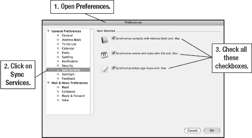

**图 3-3.** *Microsoft Entourage 和 Outlook 设置 (Apple Mac)*

### 同步电子邮件账户、浏览器书签和笔记

向下滚动页面，以同步电子邮件账户设置、浏览器书签和笔记。

**注意**：将电子邮件账户设置同步到 iPad 后，您仍需在 **设置** > **邮箱、通讯录、日历** 中为每个电子邮件账户输入密码。在 iPad 上，每个账户只需执行一次此操作。

1.  在 iTunes 的同一 **信息** 选项卡上，向下滚动到日历设置下方，以查看 **邮件** 账户设置。
2.  勾选 **同步邮件账户来源** 复选框，并调整下拉菜单，选择存储电子邮件的软件或服务（图 3–4）。这可能是 Windows 电脑上的 Outlook，或 Mac 上的 Entourage 或 Mail。

    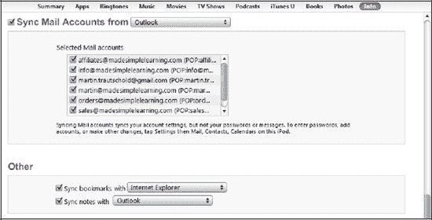

    **图 3–4.** *设置要同步的电子邮件账户、浏览器书签和笔记*

    **注意**：截至出版时，iTunes 仅支持两种用于同步的网页浏览器：Microsoft Internet Explorer 和 Apple Safari。如果您使用 Mozilla Firefox 或 Google Chrome，仍可以同步书签，但需要安装免费的书签同步软件（例如来自 [`www.xmarks.com`](http://www.xmarks.com) 的 `xmarks`），以将书签从 Firefox 或 Chrome 同步到 Safari 或 Explorer。然后，您可以通过两步过程同步浏览器书签。`Firefox Home` 应用是 Firefox 用户同步书签的一个不错选择（请访问 [`http://itunes.apple.com/ca/app/firefox-home/id380366933?mt=8`](http://itunes.apple.com/ca/app/firefox-home/id380366933?mt=8)）。

3.  要同步浏览器书签，请勾选 **同步书签来源** 复选框，并调整下拉菜单，选择您使用的网页浏览器（参见 图 3–4）。目前，您只能选择 Internet Explorer 或 Safari。
4.  要同步笔记，请勾选 **同步笔记来源** 复选框，并选择存储笔记的软件或服务。
5.  点击 iTunes 屏幕右下角的 **应用** 按钮，开始同步。

**注意**：根据您拥有的信息量（尤其是联系人和日历信息），首次同步可能需要 15 分钟或更长时间。

### 将 iPad 与 iTunes 同步

当您将 iPad 连接到电脑的 USB 端口时，同步通常是自动进行的。唯一的例外是您禁用了自动同步。

#### 跟踪同步过程

在 iTunes 顶部的状态窗口中，您可以查看同步的进展情况。您可能会看到 **正在将联系人同步到 [您的姓名] 的 iPad** 或 **正在将日历同步到 [您的姓名] 的 iPad**，这能让您了解当前正在同步的内容。

#### 处理同步冲突

有时，iTunes 同步会检测到电脑和 iPad 上数据之间的冲突，例如两个公司名称不同的相同联系人条目，或两个笔记不同的相同日历条目。处理这些冲突相当简单。

1.  在 **冲突解决器** 窗口中，点击正确的信息。这会将背景变为浅蓝色，而未选中的一侧则为白色。参见 图 3–5。
2.  如果还有更多冲突，请点击 **下一个** 按钮，直到解决所有冲突。

    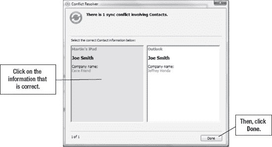

    **图 3–5.** *iTunes 同步冲突解决器*

3.  点击 **完成** 关闭窗口。
4.  您所做的所有选择将应用于下一次与 iPad 的同步。系统会为您提供 **立即同步** 或 **稍后同步** 的选项。

**注意**：冲突可能导致同步过程中止。联系人是首先同步的，然后才是日历。因此，如果发现联系人同步冲突，则在解决联系人冲突之前，日历将不会同步。解决冲突后，请务必重新同步您的 iPad 以完成同步。

#### 取消正在进行的同步

您可以从 iTunes 或 iPad 上取消同步。

**要取消电脑上 iTunes 的同步：**

点击同步状态窗口中的 **X** 按钮，如 图 3–6 所示。

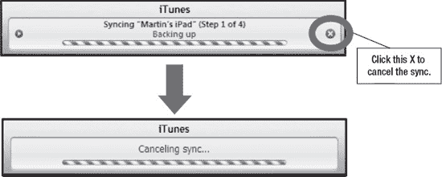

**图 3–6.** *点击 iTunes 状态窗口中的 **X** 按钮以取消同步*

**要从 iPad 取消同步：**

滑动屏幕底部的滑块条，该滑块条显示 **滑动来取消**。其位置与常规的 **滑动来解锁** 消息相同。

#### 为什么您可能不希望 iTunes 自动同步？

可能有一些原因需要手动同步而非自动同步：

1.  您不想用过多的音乐和视频文件填满 iPad。
2.  同步和备份过程耗时较长，因此您不希望每次连接 iPad 到电脑时都执行此操作。
3.  您将 iPad 连接到不同的电脑为其充电，但不希望每次都被询问是否要抹掉并重新同步音乐。

**注意**：如果您想拖放音乐和视频，请务必在 iTunes 的 **摘要** 选项卡中勾选 **手动管理音乐和视频** 复选框。

#### 在自动同步开始前手动阻止

有时您可能希望在连接 iPad 到电脑时不触发自动同步。这可能是因为您时间不多，只想快速拖放几首新歌到 iPad 上，而无需同步其他所有内容。

要阻止 iPad 的常规自动同步，您可以在连接 iPad 到电脑时，按住电脑键盘上的某些按键。

**在 Windows PC 上**：

> 在将 iPad 连接到电脑时，按住 **Shift** + **Ctrl** 键。

**在 Mac 上**：

> 在连接 iPad 时，按住 **Command** + **Option** 键。

#### 永久关闭自动同步

您可以在 iTunes 中永久关闭自动同步。如果您更希望对所有同步过程进行手动控制，可能需要这样做。

**警告**：关闭自动同步还会禁止每次将 iPad 连接到电脑时的自动备份。此设置最适合于辅助电脑，您可能仅用它为 iPad 充电，但绝不希望进行同步。

要在 iTunes 中关闭自动同步，请执行以下步骤：

1.  从 iTunes 菜单中，选择 **编辑**，然后选择 **偏好设置**。
2.  点击顶部的 **设备** 选项卡。
3.  勾选 **防止 iPod、iPhone 和 iPad 自动同步** 复选框（参见 图 3–7）。
4.  点击 **确定** 按钮保存您的设置。

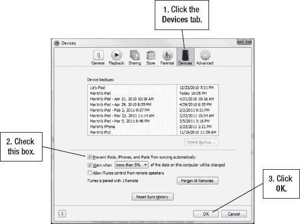

**图 3–7.** *在 iTunes 中禁用自动同步*

#### 同步功能的全新开始

有时你会遇到同步问题，只需重新开始即可。在 iTunes 中，你可以采取以下措施：清除或重置同步历史记录，让 iTunes 认为它是第一次与你的 iPad 同步；你也可以强制 iPad 上的所有信息被电脑上的信息所替换。

##### 重置同步历史记录（让 iTunes 认为它正在首次同步）

要在 iTunes 中重置同步历史记录，请按以下步骤操作：

1.  选择**编辑**菜单，然后点击**偏好设置**。
2.  在 iTunes 偏好设置窗口顶部，点击**设备**选项卡。
3.  点击底部的**重置同步历史记录**按钮，如图 3–8 所示。
4.  在弹出的窗口中点击**重置同步历史记录**以确认你的选择。

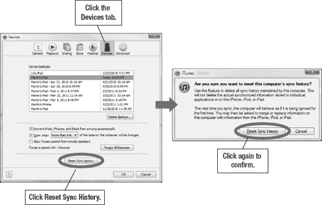

**图 3–8.** *在 iTunes 中重置同步历史记录*

##### 替换 iPad 上的所有信息（仅限下一次同步）

有时你可能需要让 iPad 上的信息焕然一新。无论出于何种原因，你想清除 iPad 上一个或所有已同步应用中的信息，然后重新开始。请按以下步骤操作：

1.  与之前设置同步一样，将 iPad 连接到电脑，启动 iTunes，在左侧导航栏中点击你的**iPad**，然后在主窗口顶部点击**信息**选项卡。
2.  向下滚动到底部的**高级**区域（参见图 3–9）。
3.  根据需要勾选一个、几个或所有复选框。

    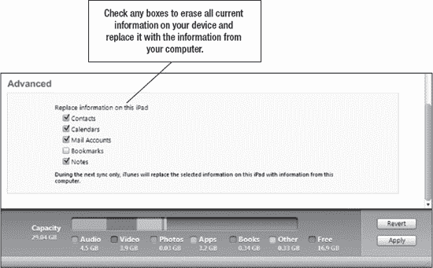

    **图 3–9.** *在高级区域中，选择你要替换的信息。*

4.  准备就绪后，点击右下角的**应用**按钮。同步应立即开始。你勾选的应用的所有信息将从 iPad 中删除，并替换为电脑中的信息。

### 应用：同步与管理

通过 iTunes，你可以同步和管理 iPad 上的应用。你可以轻松地在某个特定**主**屏幕页面上拖放应用图标，甚至可以在 iPad 的页面之间拖放。

#### 在 iTunes 中同步应用

请按以下步骤同步和管理应用：

1.  与之前设置同步一样，将 iPad 连接到电脑，启动 iTunes，在左侧导航栏中点击你的**iPad**。
2.  点击主窗口顶部的**应用**选项卡。
3.  勾选**同步应用**复选框，即可查看存储在 iPad 上的所有应用以及你的**主**屏幕，如图 3–10 所示。

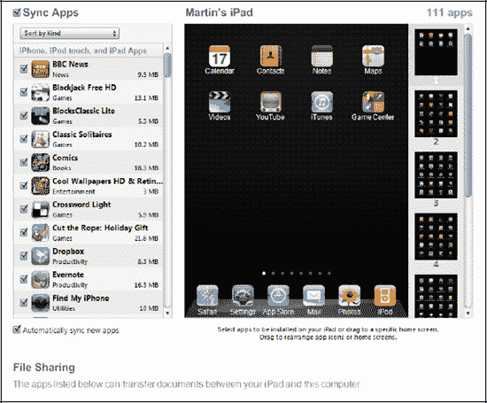

**图 3–10.** *iTunes 中的同步应用屏幕*

#### 移动应用、处理文件夹或删除应用图标

在此 iTunes 屏幕中，你可以轻松移动并整理应用图标。

**在屏幕内移动应用：** 点击它并将其在屏幕内拖拽。

**在主屏幕页面之间移动应用：** 点击并将其拖拽到右栏中的新页面。该新页面会展开；将其放到新页面上。

**将应用停靠到底部程序坞：** 如果已有六个图标，请先移除一个。然后点击并将图标拖拽到程序坞上。

| **移除图标：** 将鼠标悬停在其上，看到 X 后点击该 X。**注意：你无法移除通讯录、设置、Safari 浏览器和其他预装的核心图标。** |  |
| **创建新文件夹：** 将一个图标拖拽到另一个图标上。**将应用移入现有文件夹：** 将图标拖拽到文件夹图标上。**将应用移出文件夹：** 点击文件夹以将其打开。然后将图标拖拽到文件夹外部。**查看另一个主屏幕页面：** 在右栏中点击该页面。**删除文件夹：** 从该文件夹中移除所有应用（将它们拖出），文件夹便会消失。 | 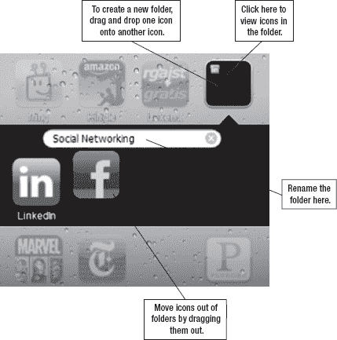 |

#### 移除与重新安装应用

要从 iPad 上移除应用，只需取消勾选它旁边的复选框并确认你的选择，如图 3–11 所示。无需担心——由于你在 iTunes 中将应用同步到了电脑，你在 iTunes 中仍然保留着一份应用副本。

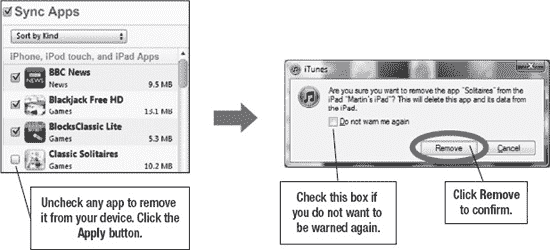

**图 3–11.** *取消勾选应用以将其从 iPad 中删除*

**提示**：即使你从 iPad 上删除了某个应用，只要你已按图示选择同步应用，你仍可通过重新勾选其旁边的复选框来重新安装该应用。该应用将在下一次同步期间重新加载到你的 iPad 上。

#### 将下载的内容导入 iTunes 进行同步

如果在 `iTunes` 内从 `iBookstore`、`iTunes Store` 或 `App Store` 购买或下载内容，这些内容会自动出现在你的 `iTunes` 资料库中。但如何将从网络下载的内容导入 `iTunes` 呢？（它们不会自动出现在 `iTunes` 中。）如果下载的内容是压缩文件（如有声书 `.zip` 文件），该怎么办？在本节中，我们将帮助你了解从网络下载内容到电脑，再将其导入 `iTunes`，以便同步到 `iPad` 的基本步骤。

**提示**: 你还可以从 `Audible.com` 找到很棒的免费和付费有声书。

##### 第 1 步：将内容下载到电脑

| 访问想要下载内容的网站。本例中，我们要从 [`http://librivox.org`](http://librivox.org) 下载一本免费有声书。我们搜索了马克·吐温的作品，并希望下载《苦行记》*Roughing It* 的全套章节。点击左侧链接栏中的 `整本书的 Zip 文件` 链接。（这个 488 MB 的文件根据你的网速需要 15 分钟到 4 小时完成下载。） | 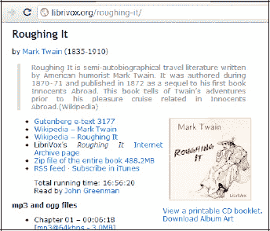 |

##### 第 2 步：必要时解压文件

| 接下来，找到刚下载的文件。它通常位于你的 `Downloads` 文件夹中。解压所有文件。 | 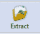 |
| 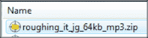 解压过程因电脑或 Mac 上安装的软件而异。但通常只需双击打开 zip 文件。然后选择 `Unzip`、`Unzip All`、`Extract` 或 `Extract All`。大多数情况下，这些文件会直接解压到 `Downloads` 文件夹，或 `Downloads` 文件夹中一个以 zip 文件命名的子文件夹内。 | 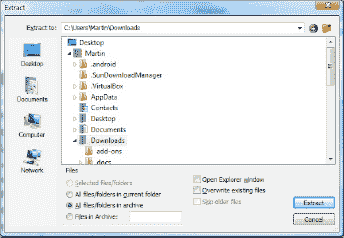 |

##### 第 3 步：将内容拖拽到 iTunes

| 接下来，找到解压后的文件并全部选中。可以按住键盘上的 `Shift` 键，先点击列表中的第一个文件，再点击最后一个文件，即可选中列表中的所有文件。然后，将整个高亮列表拖拽到 `iTunes` 左侧栏顶部的资料库上释放。也可以使用 `文件`  `将文件添加到资料库` 菜单命令来代替拖放操作。 | 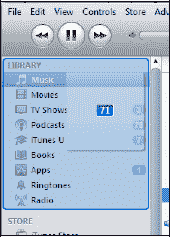 |

##### 第 4 步：选择要同步到设备的内容

按照本章后续小节中的步骤，将下载的内容同步到 `iPad`。

##### 如何确保有声书显示为有声书（而非音乐）

**提示：** 某些有声书文件会出现在你的 `音乐` 资料库中。以下是修正方法。如果你从 `Librivox.org` 下载了免费有声书，它可能出现在 `音乐` 资料库中，但你可以更改这一设置。要将其放入正确的 `有声书` 资料库，请执行以下步骤。

1.  用专辑视图查看有声书，以便轻松一次选中所有章节或部分。
2.  然后右键点击有声书专辑封面，选择 `显示简介`，或按快捷键 `Command + I`（Mac）或 `Control + I`（PC）。如果看到关于编辑多个项目信息的警告弹窗，点击 `是`。
3.  点击 `多个项目简介` 窗口顶部的 `选项` 标签。
4.  勾选 `媒体种类` 旁的复选框，并选择 `有声书`。（见上图。）

| 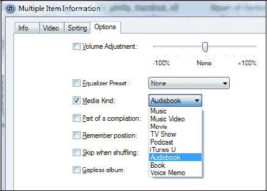 |

### iPad 与电脑之间的文件共享（文件传输）

只要安装了支持文件的应用（如 `GoodReader` 或 `Stanza`），就可以使用 `iTunes` 在电脑和 `iPad` 之间传输文件。文件传输通过 `iTunes` 中 `App` 标签页底部（所有应用图标屏幕下方）进行。

**提示**：某些应用（如 `GoodReader`）自带无线传输和共享文件的方法。有关更多信息，请查看第 27 章：“新媒体：阅读报纸、杂志等”中的 `GoodReader` 部分。

#### 将文件从电脑复制到 iPad

要将文件从电脑复制到 `iPad`，请按以下步骤操作：

1.  如同设置之前的同步一样，将 `iPad` 连接到电脑，启动 `iTunes`，然后点击左侧导航栏中的 `iPad`。
2.  点击主窗口顶部的 `App` 标签。
3.  向下滚动到应用下方的 `文件共享` 部分，如图 3–12 所示。

    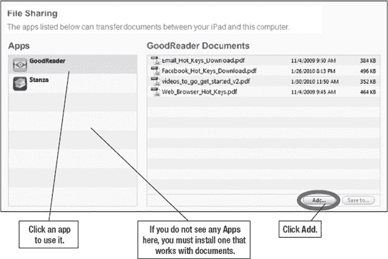

    **图 3–12.** *将文件传输到 iPad*

4.  点击左侧栏中的任意应用，然后点击右下角的 `添加` 按钮。
5.  弹出一个窗口。选择要传输的文件并点击 `打开`。文件将立即传输到你的 `iPad`。

#### 将文件从 iPad 复制到电脑

要将文件从 `iPad` 复制到电脑，请按以下步骤操作：

1.  将 `iPad` 连接到电脑，启动 `iTunes`，然后点击左侧导航栏中的 `iPad`。
2.  点击主窗口顶部的 `App` 标签。
3.  向下滚动到应用下方的 `文件共享` 部分（见图 3–13）。

    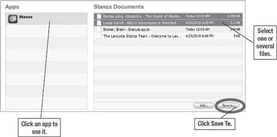

    **图 3–13.** *从 iPad 传输文件*

4.  点击左侧栏中要传输文件的应用。
5.  使用以下任意方法选择一个或多个文件：
    1.  单击单个文件。
    2.  按住 `Control` 键（Windows）或 `Option` 键（Mac），再单击多个文件。
    3.  按住 `Shift` 键，点击列表中的第一个和最后一个文件，以选中该列表中的所有文件。
6.  选中文件后，点击右下角的 `存储到` 按钮。
7.  弹出一个窗口，要求你在电脑上选择一个文件夹来接收来自 `iPad` 的文件。找到并点击该文件夹，然后点击 `选择文件夹`。文件将立即传输到你的电脑。

### 同步媒体及其他内容

现在来看看如何为音乐、电影、`iBooks`、`iTunes U` 等内容设置自动同步。

**注意**：请确保你在 `iTunes` 中登录的账号与 `iPad` 上使用的 `iTunes` 账号一致，因为受数字版权管理（`DRM`）保护的内容（音乐、视频等）只有在账号匹配时才能同步。你可以在电脑和 `iPad` 上分别退出并重新登录 `iTunes`，以确保登录了正确的账号。

#### 关注容量（可用空间）

当开始选择要同步的铃声、音乐、视频、图书、播客等内容时，请留意每个 `iTunes` 同步屏幕底部的容量条。如果发现任何选择已接近或超出容量，就需要做出调整。有时你无法将所有内容都带走！图 3–14 显示我们的 `iPad` 上目前还有 15.6 GB（吉字节）可用空间——所以空间很充裕。

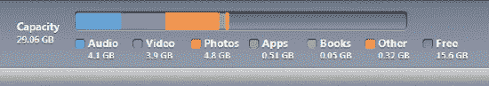

**图 3–14.** *在 iTunes 中进行同步选择时，注意可用空间*

### 同步铃声

当你点击`Ringtones`（铃声）标签时，可以选择同步整个铃声库或选定的项目。铃声用于 iPad 上的 `FaceTime` 通话。

1. 将 iPad 连接到电脑，启动 iTunes，然后点击左侧导航栏中的 `iPad`。
2. 点击主窗口顶部的 `Ringtones`（铃声）标签。
3. 勾选右侧显示的 `Sync Ringtones`（同步铃声）复选框。
4. 默认设置为同步所有铃声。若只同步特定铃声，请点击 `Selected ringtones`（选定的铃声）旁边的单选按钮。
5. 完成选择后，点击 `Apply`（应用）按钮开始同步铃声。

| 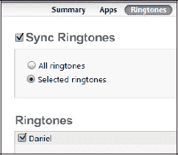 |

**提示**：了解如何在第 18 章：“FaceTime 视频消息和 Skype”中为联系人分配铃声、购买自定义铃声以及从音乐中创建自己的铃声。

### 同步音乐

当你点击 `Music`（音乐）标签时，可以选择同步整个音乐库或选定的项目。

**警告**：如果你已经手动将部分音乐、音乐视频或语音备忘录传输到 iPad，你将会收到一条警告信息，提示 iPad 上的所有现有内容将被移除，并替换为从电脑选定的音乐库。

要将音乐从电脑同步到 iPad，请按照以下步骤操作：

1. 将 iPad 连接到电脑，启动 iTunes，然后点击左侧导航栏中的 `iPad`。
2. 点击主窗口顶部的 `Music`（音乐）标签。
3. 勾选 `Sync Music`（同步音乐）复选框（参见图 3–15）。
4. 仅当你*确定*你的音乐库不会太大而无法容纳在 iPad 上时，才点击 `Entire music library`（整个音乐库）旁边的按钮。
5. 如果不确定音乐库是否过大，或者只想同步特定的播放列表或艺人，请点击 `Selected playlists, artists, and genres`（选定的播放列表、艺人和风格）旁边的按钮。
6. 你可以通过勾选相应复选框来选择是否包含音乐视频和语音备忘录。
7. 你还可以选择自动用歌曲填充剩余空间。

    **警告**：我们不建议勾选此选项，因为它会占用 iPad 上的所有空间，导致无法安装那些很酷的应用程序！

8. 现在勾选屏幕底部两列中的任何播放列表或艺人。你甚至可以使用 `Artists`（艺人）列顶部的搜索框搜索特定艺人。

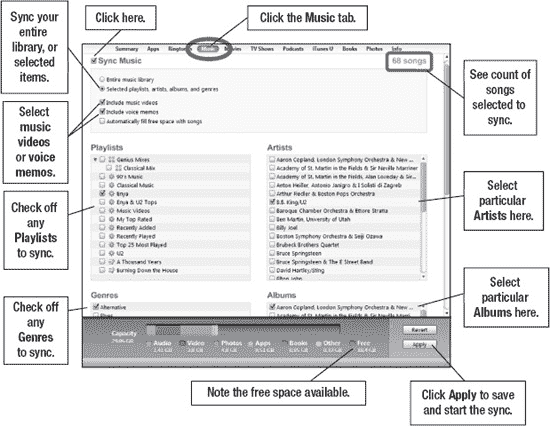

**图 3–15.** *与 iPad 同步音乐*

### 同步影片

当你点击 `Movies`（影片）标签时，可以选择同步特定影片、最近影片、未观看影片或全部影片。

要将影片从电脑同步到 iPad，请按照以下步骤操作：

1. 将 iPad 连接到电脑，启动 iTunes，然后点击左侧导航栏中的 `iPad`。
2. 点击主窗口顶部的 `Movies`（影片）标签。
3. 勾选 `Sync Movies`（同步影片）复选框（参见图 3–16）。
4. 如果你希望同步最近或未观看的影片，请勾选 `Automatically include`（自动包含）复选框，并使用下拉菜单选择 `All`（全部）、`1 most recent`（最近 1 个）、`All unwatched`（所有未观看）、`5 most recent unwatched`（最近 5 个未观看）等。

    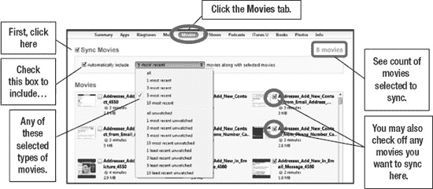

    **图 3–16.** *配置影片同步以自动包含选择内容*

5. 如果你选择了 `All`（全部）之外的任何项目，则可以选择将特定影片或视频同步到 iPad。只需勾选你想要包含在同步中的影片旁边的复选框即可。

### 同步电视节目

当你点击 `TV Shows`（电视节目）标签时，可以选择同步特定节目、最近节目、未观看节目或全部节目。

要将电视节目从电脑同步到 iPad，请按照以下步骤操作：

1. 将 iPad 连接到电脑，启动 iTunes，然后点击左侧导航栏中的 `iPad`。
2. 点击主窗口顶部的 `TV Shows`（电视节目）标签。
3. 勾选 `Sync TV Shows`（同步电视节目）复选框（参见图 3–17）。
4. 如果你希望同步最近或未观看的电视节目，请勾选 `Automatically include`（自动包含）复选框，并使用下拉菜单选择 `All`（全部）、`1 newest`（最新 1 个）、`All unwatched`（所有未观看）、`5 oldest unwatched`（最早 5 个未观看）、`10 newest unwatched`（最新 10 个未观看）等。

    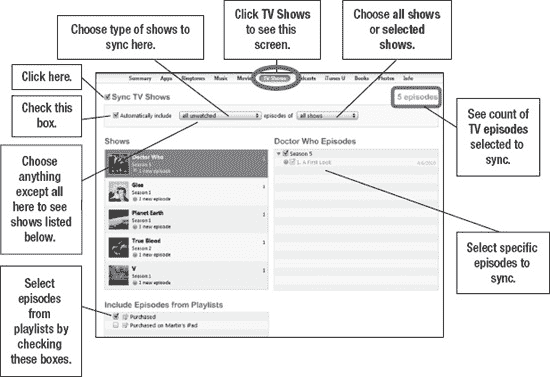

    **图 3–17.** *配置电视节目同步以自动包含选择内容*

5. 在 `episodes of`（...的剧集）旁边选择 `all Shows`（所有节目）或 `selected Shows`（选定的节目）。
6. 如果选择 `Selected Shows`（选定的节目），你可以在屏幕中间的两个区域中选择单个节目甚至单个剧集。
7. 如果你有电视节目的播放列表，可以通过勾选屏幕底部区域的复选框来选择包含这些节目。

### 同步播客

当你点击 `Podcasts`（播客）标签时，可以选择同步特定播客、最近播客、未播放播客或全部播客。

**提示**：播客是通常定期更新的音频或视频节目（例如每日、每周或每月更新）。大多数都可以在 iTunes Store 免费订阅。当你订阅并按照本节所述设置自动同步后，你将在 iPad 上收到所有喜爱的播客。

许多你喜爱的广播节目都会以播客形式录制和播出。我们鼓励你浏览 iTunes Store 的 `Podcast`（播客）部分，看看哪些内容可能让你感兴趣。你会找到电影评论、新闻节目、法学院考试复习、游戏节目、老式广播节目、教育内容等众多播客。

要将播客从电脑同步到 iPad，请按照以下步骤操作：

1. 将 iPad 连接到电脑，启动 iTunes，然后点击左侧导航栏中的 `iPad`。
2. 点击主窗口顶部的 `Podcasts`（播客）标签。
3. 勾选 `Sync Podcasts`（同步播客）复选框（参见图 3–18）。
4. 如果你希望同步最近或未播放的播客，请勾选 `Automatically include`（自动包含）复选框，并使用下拉菜单选择 `All`（全部）、`1 newest`（最新 1 个）、`All unplayed`（所有未播放）、`5 newest`（最新 5 个）、`10 most recent unplayed`（最近 10 个未播放）等。

    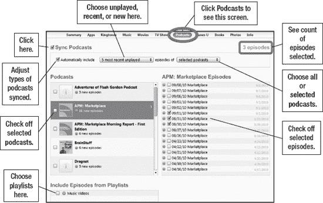

    **图 3–18.** *配置播客同步以自动包含选择内容*

5. 在 `episodes of`（...的剧集）旁边选择 `All Podcasts`（所有播客）或 `Selected Podcasts`（选定的播客）。
6. 如果选择 `Selected Podcasts`（选定的播客），你可以在屏幕中间的两个区域中选择单个播客甚至单集。
7. 如果你有播客的播放列表，可以通过勾选屏幕底部区域的复选框来选择包含这些节目。

**提示**：同步这些播客后，你可以在设备上的 `Music`（音乐）应用中的 `Podcasts`（播客）部分欣赏它们。

#### 同步 iTunes U

当你点击 `iTunes U` 标签页时，可以选择同步特定、最近或未播放的 iTunes U 内容，或者同步所有内容。

**提示**：`iTunes U` 播客与其他音频或视频播客类似，但侧重于教育内容，且大多由高校制作。在 iTunes Store 中，大多数可免费订阅。当你按照本节的说明订阅并设置自动同步后，你将在 iPad 上收到所有你喜爱的 `iTunes U` 播客。

请务必查看 iTunes Store 中的 `iTunes U` 版块。你可能会发现你心仪的大学或学院提供了教授生物学、天文学或更多知识的节目。甚至还有斯坦福大学关于如何开发 iPad 应用的课程！许多顶尖大学都在 `iTunes U` 中播放知名教授的课堂讲座。快去看看吧——你会发现的内容令人惊叹！

要将 `iTunes U` 内容从电脑同步到 iPad，请按照以下步骤操作：

1.  将 iPad 连接到电脑，启动 iTunes，然后在左侧导航栏中点击你的`iPad`。
2.  点击主窗口顶部的 `iTunes U` 标签页。
3.  勾选 `同步 iTunes U` 复选框（参见图 3–19）。
4.  如果你想同步最近或未播放的项目，请勾选 `自动包含` 复选框，并使用下拉菜单选择 `全部`、`最新 1 个`、`所有未播放`、`最新 5 个`、`最近 10 个未播放` 等选项。

    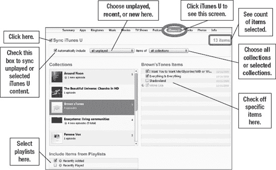

    **图 3–19.** *配置 iTunes U 同步以自动包含所选内容*

5.  在 `项目` 旁边选择 `所有合集` 或 `所选合集`。
6.  如果选择 `所选合集`，你可以选择单个合集，甚至可以选择屏幕中间两个区域中的单个项目。
7.  如果你有 `iTunes U` 播客的播放列表，可以通过勾选屏幕底部 `从播放列表中包含项目` 下的复选框来选择包含这些播放列表。

#### 同步 iBooks、PDF 文件和有声读物

当你点击 `图书` 标签页时，可以选择同步全部或部分的图书及有声读物。

**提示**：iPad 上的图书是纸质图书的电子版。它们采用一种名为 `ePub` 的特定电子格式。你可以在 iPad 上的 iBookstore 中购买，或从其他来源获取，并使用此处描述的步骤将其同步到 iPad。从其他来源获取的图书必须没有保护或“无 DRM”才能同步到 iPad。你可以在 iPad 上的 `iBooks` 应用或其他图书阅读器中阅读这些图书。详见第 12 章：“iBooks 与电子书”。

要在电脑和 iPad 之间同步图书、PDF 文件或有声读物，请按照以下步骤操作：

**提示**：你可以在 iBookstore 中搜索“project gutenberg”来查找免费的 iBooks。你也可以通过电脑浏览器访问 [`http://librivox.org`](http://librivox.org)，下载公共领域的有声读物，从而获得免费的音频书。（这些免费有声读物通常并非由专业演员录制，而是由志愿者录制，因此质量可能参差不齐。）请参阅本章中的“将下载的项目导入 iTunes 以进行同步”部分，了解如何下载和同步免费有声读物的具体方法。

1.  将 iPad 连接到电脑，启动 iTunes，然后在左侧导航栏中点击你的`iPad`。
2.  点击主窗口顶部的 `图书` 标签页。
3.  勾选 `同步图书` 和 `同步有声读物` 复选框（参见图 3–20）。
4.  如果你想同步所有图书，请保留默认的 `所有图书` 选项。
5.  否则，请选择 `所选图书`，并勾选窗口中的特定图书以进行选择。

    **提示**：为了将 iBooks、PDF 文件和其他类似文档同步到 iPad，你需要先将文件从电脑拖放到你的 iTunes 资料库中。从电脑上的任何文件夹中抓取文件，然后将其直接拖放到 iTunes 左上角列中的资料库上。

    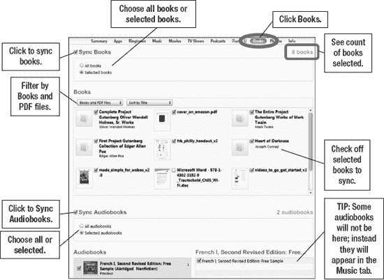

    **图 3–20.** *配置图书和有声读物同步以自动包含所选内容*

6.  如果你想同步所有有声读物，请保留默认的 `所有有声读物` 选项。
7.  否则，请选择 `所选有声读物`，并通过勾选此选项下方窗口中的特定有声读物进行选择。

**提示**：同步这些图书后，你可以在设备上的 `iBooks` 应用中享受阅读。你可以在 `iPod` 应用中收听有声读物，该应用左侧有 `有声读物` 标签页。

**注**：来自 `Audible` 的有声读物要求你首先使用你的 `Audible` 账户对电脑进行授权，然后才能从电脑将其同步到 iPad。

#### 同步照片

当你点击 `照片` 标签页时，可以选择同步所有文件夹或所选文件夹中的照片，甚至还可以包含视频。

**提示**：你可以在令人惊艳的 iPad 屏幕上创建精美的电子相框并分享你的照片（参见第 16 章：“iPad 摄影”）。你甚至可以使用照片来设置背景墙纸和锁定屏幕墙纸（更多信息请参见第 7 章：“个性化你的 iPad 并确保其安全”）。

要将照片从电脑同步到 iPad，请按照以下步骤操作：

1.  将 iPad 连接到电脑，启动 iTunes，然后在左侧导航栏中点击你的`iPad`。

    **提示**：Mac 用户也可以使用 `iPhoto` 或 `Aperture` 同步照片，包括事件（基于时间的同步）、面孔（基于人的同步）和地点（基于位置的同步）。

2.  点击主窗口顶部的 `照片` 标签页。
3.  勾选 `同步照片来源` 复选框（参见图 3–21）。

    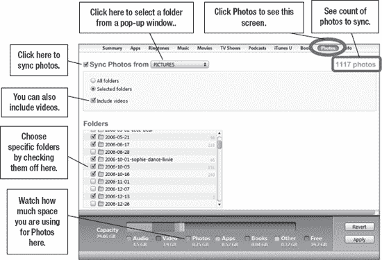

    **图 3–21.** *配置照片同步以自动包含所选内容*

4.  点击 `同步照片来源` 旁边的下拉菜单，选择存储照片的文件夹。如果你想抓取所有照片，请选择最高层级的文件夹（例如，Windows 电脑上的 `C:` 或 Apple Mac 上的 `/`）。
5.  如果你想同步电脑上选定文件夹中的所有照片，请选择 `所有文件夹`，如图 3–21 所示。

    **警告**：由于电脑上的照片资料库可能过大而无法容纳在 iPad 上，因此勾选 `所有文件夹` 时请务必谨慎。

6.  否则，请选择 `所选文件夹`，并通过勾选下方窗口中的特定文件夹进行选择，如图 3–21 所示。
7.  你还可以通过勾选 `包含视频` 复选框来包含文件夹中的任何视频，如图 3–21 所示。
8.  完成要同步的照片选择后，点击 `应用` 按钮以保存设置并开始同步。
9.  当同步开始时，你将在 iTunes 中间顶部的状态窗口中看到同步状态。

### 如何了解 iTunes 中哪些是新的或未播放的

你可能会注意到 iTunes 左侧导航栏中项目旁边的小数字（参见图 3–22）。主窗口中项目的右上角也有类似的蓝色小数字。这些数字显示了有多少项目未播放、未观看，或者对于应用而言，需要更新。

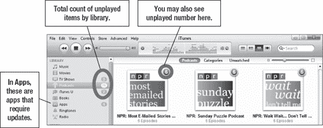

**图 3–22.** *快速查看未播放项目的数量*

### 在 iPad 上手动传输音乐、影片、播客等（拖放法）

“自动同步”部分展示了如何自动将内容同步到 iPad。这里你将学习如何手动传输歌曲、视频、图书、有声读物等内容。所有类型内容的传输过程都相同，因此我们仅以其中一种类型为例进行说明。

**提示**：使用相同的拖放技巧可将项目添加到播放列表中。

要将内容从电脑手动传输到 iPad，请按照以下步骤操作：

**注意**：在尝试拖放音乐或视频之前，请务必在 iTunes 的“摘要”标签页中勾选“手动管理音乐和视频”。如果你已选择自动同步内容（例如音乐、影片、播客等），则无法使用此拖放方法将项目复制到 iPad。

1. 将 iPad 连接到电脑，并启动 iTunes。
2. 在左侧导航栏中，点击你的 `iPad`。然后点击顶部的“摘要”标签页。在屏幕底部附近，确保勾选了“手动管理音乐和视频”复选框。如果你之前在 iPad 上同步过音乐或视频，可能会出现一条警告消息，提示所有先前同步的音乐和视频将被你的 iTunes 资料库替换。这没有关系。

   

3. 在左侧导航栏的“资料库”标题下，点击你要传输的内容类型（“音乐”、“影片、电视节目、播客、iTunes U”等）。
4. 在主窗口中，你将看到你的内容资料库。通常最简单的方法是选择 iTunes 顶部的“列表视图”，如图 3–23 所示。这使你能够以列表形式查看所有内容，并轻松选择单个项目或一组项目。

   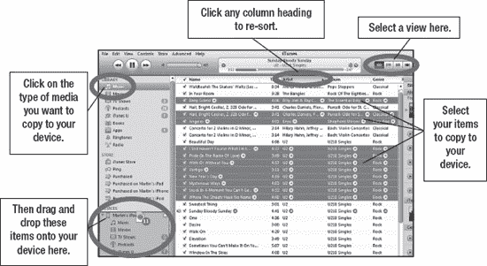

   **图 3–23.** *选择要拖放到设备上的媒体*

5. 以下是如何单独、以列表形式或分散选择内容的方法：
   1. 要选择单个项目，只需单击它将其高亮显示。

      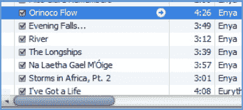

   2. 要选择不连续列表中的项目，Windows 用户请按住 `Control` 键并同时单击项目，Mac 用户请按住 `Command` 键并同时单击项目。

      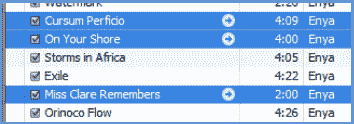

   3. 要选择连续列表中的项目，请按住 `Shift` 键，先单击列表中的第一个项目，再单击最后一个项目。中间的所有项目将被选中。

      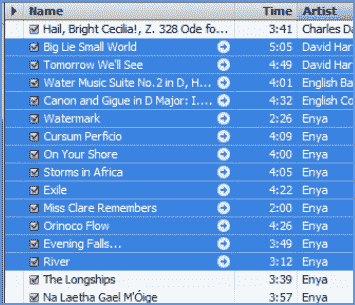

6. 然后，要将这些项目复制到 iPad，只需单击选中的项目并将其拖到你的 iPad 上，然后松开鼠标按钮。所有选中的项目将被复制到左侧“设备”栏下的 iPad 中。

### iTunes 与同步故障排除

有时 iTunes 的行为可能并不完全如你所预期，因此这里提供一些简单的故障排除技巧。

#### 查阅 Apple 知识库获取有帮助的文章

遇到问题时的第一步是查阅 Apple 的支持页面，那里有大量有用信息。在 iPad 或电脑的网页浏览器中，访问以下网页并点击某个主题或设备以获取帮助：

[`www.apple.com/support/ipad/`](http://www.apple.com/support/ipad/)

#### iTunes 无响应并锁定（Windows 电脑）

1. 同时按下键盘上的 `Ctrl` + `Alt` + `Del` 键，调出“Windows 任务管理器”。“任务管理器”应类似于图 3–24 所示。

   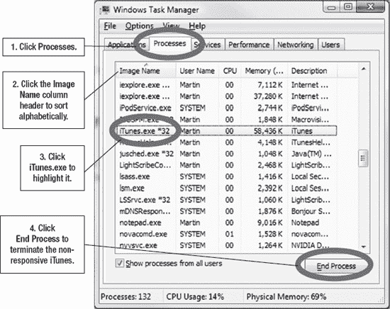

   **图 3–24.** *在 Windows 任务管理器中定位 `iTunes.exe` 以终止它*

2. 然后，要结束该进程，从弹出窗口中点击“结束进程”。
3. 现在，iTunes 应被强制关闭。
4. 尝试重新启动 iTunes。
5. 如果 iTunes 无法启动或再次锁定，请重启电脑并重试。

#### iTunes 无响应并锁定（Mac 电脑）

**提示**：按下 `Command` + `Option` + `Escape` 是调出图 3–25 所示“强制退出应用程序”窗口的快捷键。

1. 向上点击顶部 iTunes 菜单。
2. 点击“退出 iTunes”。
3. 如果这不起作用，请转到任何其他程序，点击左上角的小苹果图标。
4. 点击“强制退出”，将显示正在运行的程序列表。
5. 高亮 iTunes 并点击“强制退出”按钮。
6. 如果这仍无帮助，请尝试重启你的 Mac。

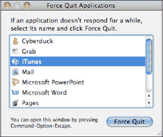

**图 3–25.** *Mac 电脑上的“强制退出应用程序”窗口*

### 更新 iPad 操作系统

你可以使用 iTunes 检查更新的软件并安装更新的操作系统（称为“iOS”）。

**注意**：请在你不介意至少 30 分钟无法使用 iPad 时进行此更新，具体时间取决于 iPad 上的信息量以及你的电脑和网络连接速度。

通常，iTunes 会按照设定计划（大约每两周）自动检查更新。如果未找到更新，iTunes 会告知你下次检查更新的时间。

要手动检查 iTunes 中的 iOS 更新软件并安装，请执行以下步骤，并参见图 3–26：

1. 启动 iTunes。
2. 将 iPad 连接到电脑。
3. 在左侧导航栏的“设备”下，点击你的 `iPad`。
4. 点击顶部导航栏中的“摘要”标签页。
5. 在屏幕中央的“版本”部分，点击“检查更新”按钮。

   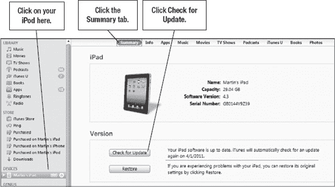

   **图 3–26.** *检查更新软件*

6. 如果你已拥有最新版本，你将看到弹出窗口提示类似“此 iPad 软件版本 (4.x.x) 为当前版本”。点击“确定”关闭窗口。更新过程就此完成。
7. 如果你没有最新版本，右侧会显示类似窗口，告知有新版本可用，并询问是否要更新。点击“下载并更新”。

   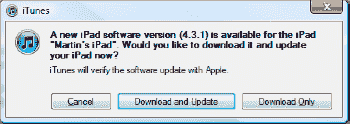

8. iTunes 将引导你浏览几个屏幕，其中描述更新并要求你同意软件许可。如果你同意，点击“下一步”和“同意”，以下载 Apple 提供的最新 iOS 软件。这大约需要 5–10 分钟。

   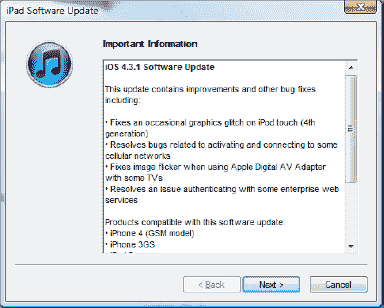

   **提示**：我们将在第 29 章“故障排除”的“重新安装 iPad 操作系统”部分，展示此更新过程中你可能会看到的所有屏幕。

9. 接下来，iTunes 将备份你的 iPad，如果你的 iPad 存有大量数据，这可能需要 10 分钟或更长时间。
10. 现在将安装新的 iOS，你的 iPad 数据将被擦除。
11. 最后，你将看到屏幕，允许你将 iPad 设置为新设备或从备份恢复。
    1.  如果你想在更新过程后擦除所有数据，请选择“设置为新的 iPad”。
    2.  选择“从以下备份恢复”，并确保选择了正确的备份文件（通常是最新的那个）。

现在你的 iPad 将按照你的选择进行恢复或设置，iPad 操作系统更新完成。

## 其他同步方式

在第 3 章“用 iTunes 同步你的 iPad”中，你学习了如何将 iPad 连接到电脑并使用 iTunes 同步你的个人信息、音乐、视频等。在本章中，我们将探索一些替代方法，用于将信息无线同步到你的 iPad。无线方式的好处在于，你无需将 iPad 连接到电脑即可更新信息。一切通过无线网络自动完成。我们将涵盖的两种方法是 Apple 的 MobileMe 服务和 Exchange/Google 同步。

**注**：如果你使用`Gmail`账户设置（而非本章所述的`Exchange`）来设置你的 Gmail，你将能够无线同步你的电子邮件、日历和备忘录，但不能同步你的 Google 通讯录。因此，如果你不需要同步 Google 通讯录，可以使用`Gmail`设置来代替`Exchange`。

### 无线同步你的 Google、Hotmail 或 Exchange 信息

使用我们在此描述的步骤，你的 iPad 可以通过 Microsoft Exchange 账户或 Google 账户无线同步你的电子邮件、通讯录和日历。

**提示**：你现在可以在 iPad 上无线同步多个 Exchange 账户。如果你有多个 Google、Hotmail 或 Microsoft Exchange 账户，你可以同时将它们全部无线同步到你的 iPad。

#### 为什么我们说 Google/Exchange？

我们在此交替使用 Google 和 Exchange 这两个词，因为你是在 iPad 上使用`Exchange`设置来配置你的 Google 同步功能。Google 已获得 Microsoft Exchange ActiveSync 的授权，因此你现在可以像设置 Exchange 账户一样设置你的 Google 账户，并享受同样的推送电子邮件、通讯录和日历功能。我们知道这有点令人困惑，但无论是 Google 账户还是 Exchange 账户，你都是以完全相同的方式，在 iPad 上使用`Exchange`设置来配置的——所以我们说 Google/Exchange。

从编写原版 iPad 图书到编写这本 iPad 2 图书期间，Hotmail 也增加了 ActiveSync 功能，因此我们在本章中加入了关于如何设置 Hotmail 的内容。

#### 如果你需要一个 Google 账户，就创建一个

如果你没有 Microsoft Exchange 账户，但仍希望进行无线同步，那么你应该设置一个免费的 Google 账户来存储你的通讯录和日历。该账户将允许你开始使用 Google 邮件 (Gmail)、通讯录和日历。

若要设置你的 Google 账户，请按照以下步骤操作：

1.  在你的电脑浏览器中（你无法在 iPad 上创建 Gmail 账户）输入：[`www.gmail.com`](http://www.gmail.com)。
2.  点击**创建账户**按钮。

    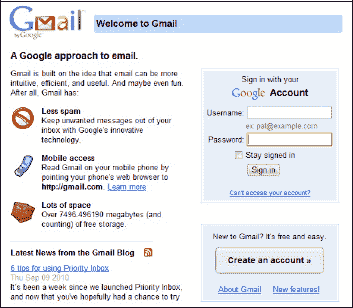

3.  在下一个屏幕上，输入要求的信息，然后点击页面底部的按钮，该按钮显示**我接受。创建我的账户。**
4.  如果成功，你将看到一个显示**恭喜！**的屏幕。点击**显示我的账户**按钮以开始使用。
5.  若要查看你的日历，请点击左上角的**日历**链接（参见图 4–1）。
6.  若要查看你的通讯录，请点击 Gmail 收件箱页面左侧的**通讯录**链接。

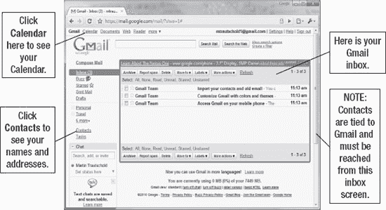

**图 4–1.** *导航查看你的 Gmail 收件箱、通讯录和日历*

一旦你按照本章所示设置了同步，你就会开始看到来自 Google 的通讯录和日历的所有更改神奇地出现在你的 iPad 上。同样，你在 iPad 上所做的任何更改或添加内容，也会在片刻之后自动出现在 Google 中。

**提示**：你的 Google 通讯录列表非常容易增长到数千条，因为它会自动包含你曾经用 Gmail 账户发过邮件的每个人。你可能希望在设置与 iPad 同步之前先清理一下你的通讯录列表。

#### 在你的 iPad 上设置你的 Google、Hotmail 或 Exchange 账户

以下步骤向你展示如何为你的 Exchange 账户或你的 Google 通讯录和日历设置无线同步：

1.  触摸 iPad 上的**设置**图标。
2.  点击**邮件、通讯录、日历**。
3.  在右侧列中，你将看到你的电子邮件账户列表，在其下方是**添加账户**选项。

    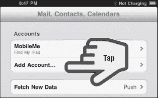

    如果你没有设置任何账户，你将只看到**添加账户**。无论哪种情况，均点击**添加账户**。

4.  在下一个屏幕上，选择**Microsoft Exchange**。

    **注**：如果你想与你的 Google 通讯录和日历进行无线同步，你应该选择 Microsoft Exchange。如果你选择`Gmail`，你将无法无线同步你的 Google 通讯录，并且备忘录也无法与你的日历同步。

    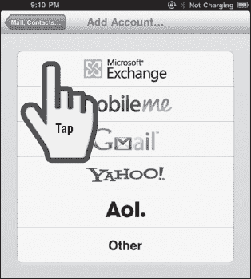

5.  输入你的电子邮件地址。

    **提示**：要在电子邮件地址中输入 **.com**（或 `.net`、`.edu`、`.org` 等），请按住句点键，直到看到 **.com** 键出现在其上方。滑动手指并按下 **.com**。

    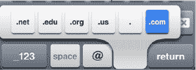

    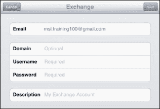

6.  很多时候，你的电子邮件地址也是你的用户名。如果是这样，复制粘贴比重新输入更容易。要将你的电子邮件地址复制到用户名字段，请按照以下步骤操作：
    1.  按住**电子邮件地址**，直到看到黑色弹出窗口出现在其上方。点击**全选**。

        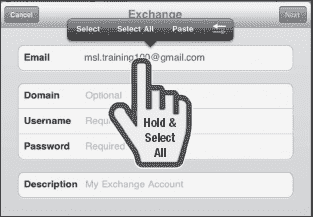

    2.  点击**拷贝**。

        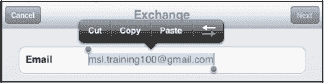

    3.  在**用户名**字段中双击（你也可以按住），直到看到弹出窗口出现，然后点击**粘贴**。

        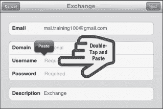

7.  对于 Gmail，将**域**字段留空。

    对于 Exchange 电子邮件，你可能需要输入由你的管理员提供的域名。

    输入你的**密码。**

    如果你愿意，可以调整账户的**描述**，该描述默认为你的电子邮件地址。

    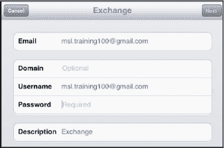

8.  点击右上角的**下一步**按钮。
9.  你可能会看到一个**无法验证证书**屏幕，如下所示。如果看到了，请点击**接受**以继续。

    

10.  对于 Gmail，在**服务器**字段中输入 `m.google.com`。

    对于 Hotmail，在**服务器**字段中输入 `m.hotmail.com`。

    对于 Exchange 电子邮件，请输入你的服务器地址。（示例：`mobile.servername.com`）

11.  点击右上角的**下一步**。

    

12.  在此屏幕上，你可以选择将**邮件**、**通讯录**和**日历**的无线同步**开启**或**关闭**。对于你想要开启的每个同步，点击开关将其更改为**开启**。

    

    

    **注**：如果你的 iPad 上已有通讯录或日历项目，在点击通讯录和日历旁边的**是**之后，你可能会看到警告弹出消息。

    你的选择是**保留在 iPad 上**或**删除**。如果你选择**取消**，则会停止设置你的 Exchange 账户。

    选择**保留在 iPad 上**以保留 iPad 上所有现有的通讯录和日历事件。这些项目不会出现在你的 Google 或 Exchange 账户中——它们将保留在你的 iPad 上。

    如果你的 Google 或 Exchange 账户中已存在相同的通讯录或日历事件，你的 iPad 上最终可能会出现一些重复的通讯录或日历事件。

    如果你已经在你的 Exchange 或 Google 账户中有这些通讯录或日历项目，并且不希望重复，请选择**删除**。

13.  点击**存储**以保存你的设置。

    

14.  你已完成账户的初始设置。你应该会在**邮件、通讯录、日历**屏幕上的**账户**标题下看到你的新账户被列出。

    

#### 编辑或删除您的 Google、Hotmail 或 Exchange 账户

在 iPad 上设置好 Google、Hotmail 或 Exchange 账户后，您可能需要调整一些默认设置，例如同步哪些邮件文件夹（默认仅同步收件箱）、同步多少天内的邮件（默认为三天）以及其他设置。您也可以按照此处所示的步骤来移除或删除该账户。

1.  进入邮件设置界面，就像首次设置账户时那样（轻点`设置`图标，轻点`邮件、通讯录、日历`）。
2.  轻点您想要调整或移除的邮件账户。

    

3.  若要更改您的账户用户名、账户名称或密码，请轻点顶部的`账户`。您将看到首次设置此账户时所看到的信息。
4.  若要从 iPad 上移除该账户，请轻点底部的`删除账户`并确认您的选择。

    

5.  若要启用或禁用`邮件`、`通讯录`和`日历`项目的无线同步，请将对应的开关设为`开`或`关`。

    **注意**：如果将这些项目中的任一开关设为“关”，它们都将从您的 iPad 中删除。例如，所有已同步的通讯录联系人会立即从您的`通讯录`应用中删除。

6.  若要调整同步到 iPad 上的邮件数量，请轻点`邮件同步天数`并根据需求进行调整（您可以选择从`1 天`到`无限制`，默认设置为 3 天）。

    轻点左上角的`电子邮件账户名称`按钮，以保存您的选择并返回上一屏幕。

    

7.  `轻点要推送的邮件文件夹`，以指定哪些邮件文件夹应同步到您的 iPad。

    默认情况下仅同步`收件箱`，但您可以轻点选择任意数量的文件夹。（每个选中的文件夹会显示一个勾选标记。）

    **提示**：只有当您在此处选择了要同步的文件夹后，您才能在 iPad 上在这些文件夹之间移动邮件。

    

8.  轻点左上角的`电子邮件账户名称`，以保存您的选择并返回上一屏幕。
9.  然后轻点右上角的`完成`按钮，以完成此账户的设置并返回`设置`。
10. 按下`主屏幕`按钮，返回到`主屏幕`。

    

#### 在 iPad 上使用无线同步的数据

设置好无线同步后，您的通讯录和日历信息将迅速流入您的 iPad。如果您有成千上万的联系人，首次同步完成可能需要几分钟。

您可能想先查阅一下第 14 章：“使用通讯录”以及第 15 章：“您的日历”，以了解使用这两个应用的详细信息。

**注意**：由于与 Google 或 Exchange 的同步是无线进行的，您需要确保 iPad 拥有有效的网络连接。请查看第 5 章：“Wi-Fi 与 3G 连接”了解更多信息。

##### 用于 Google/Exchange 联系人新添加的分组

您添加到 iPad 的每个 Google/Exchange 账户，最终都会在您的`通讯录`应用中形成一个独立的分组。如果您已将某些联系人添加到 iPad，或至少已通过 iTunes 同步过一次，那么您可能最终会获得额外的联系人分组（参见图 4–2）。

**图 4–2.** *您可能会在通讯录中看到不同的分组。*

`通讯录`列表的默认视图是显示所有已同步账户中的所有联系人。您可以有选择地查看来自不同账户的联系人。要查看您的 Google 或 Exchange 联系人，请按以下步骤操作：

1.  轻点`通讯录`图标。
2.  轻点左上角的`分组`标签。
3.  如果您添加了新联系人，或同步了您的通讯录，您会在顶部看到一个`来自我的 PC`或`来自我的 Mac` 分组。在它下面，您会看到您的 Google 或 Exchange 电子邮件地址，或者设置该账户时为其分配的描述性名称。在我们的示例中，`Exchange - Gmail` 和 `Exchange` 是两个已同步的 Google/Exchange 账户（参见图 4–2）。
4.  轻点列在您的 Google 或 Exchange 电子邮件地址/账户名称下的`通讯录`，以查看所有已同步的联系人。

##### 使用通讯录

要在您的 Google 或 Exchange 联系人分组中添加、编辑或删除联系人，请执行以下操作：

1.  按照步骤查看您的 Google 或 Exchange 联系人分组。
2.  **添加联系人**：轻点`通讯录`列表视图右上角的`+`按钮。添加联系人详细信息（详见第 14 章：“使用通讯录”）。然后轻点右上角的`完成`。
3.  **编辑联系人**：在列表中找到该联系人，并轻点联系人详细信息底部的`编辑`按钮。进行任何更改，然后轻点`完成`按钮。
4.  **删除联系人**：找到您想要移除的联系人。轻点联系人详细信息下的`编辑`按钮。滚动到详细信息底部，然后轻点`删除联系人`按钮。
5.  **在 iPad 上搜索联系人**：
    1.  如果您没有看到顶部的`搜索`窗口，请用手指沿着右侧的字母索引一直拖到顶部。
    2.  轻点`搜索`窗口，输入某人名字、姓氏或公司名称的几个字母来查找他们。
    3.  您的`通讯录`列表将立即根据您输入的内容进行过滤。如果您看到了想要的名字，请轻点它。否则，轻点右下角的`搜索`按钮。
6.  **执行全局地址列表搜索**：
    1.  轻点左上角的`分组`标签（参见图 4–2）。
    2.  轻点 Google/Exchange 联系人分组下的第二个按钮，即`全局地址列表`搜索按钮。如果您的电子邮件地址很长，那么此按钮上只会显示您的电子邮件地址；但是，如果您有一个简短的电子邮件地址或提供了一个简短的描述性名称，那么您会看到类似`Exchange - 全局地址列表`的内容（参见图 4–2）。
    3.  轻点`搜索`窗口，输入某人名字、姓氏或公司名称的几个字母来查找他们。
    4.  按下`搜索`按钮开始搜索。

最棒的是，您在 iPad 上对 Google 或 Exchange 联系人所做的任何更改都会在几秒钟内通过无线方式同步，并出现在您的 Google 或 Exchange 账户中。

**注意**：要在其他分组（非 Google 或 Exchange 分组）中添加、编辑或删除联系人，请先转到该分组（`来自我的 PC` 或 `来自我的 Mac`），然后进行所需的更改。这些添加、编辑或删除操作不会影响您的 Google 或 Exchange 联系人——它们彼此独立。

##### 使用日历

在 iPad 上设置与 Google 或 Exchange 日历的同步后，所有日历事件都会出现在您的 iPad 上——无需有线连线或同步线缆。您还可以邀请他人参加会议并回复会议邀请。

您在 iPad 上更改或更新的任何事件都将与 Google 或 Exchange 进行无线同步。

###### 每个日历都有不同的颜色

| 您还会注意到，添加到 iPad 的每个新的 Google 或 Exchange 账户都会创建一个带有新颜色的独立日历。要查看每个日历使用的颜色，请轻点左上角的`日历`按钮。在此屏幕上，您可以看到每个日历的颜色。您可以通过轻点`电子邮件地址`有选择地显示日历。要隐藏一个日历，请轻点`电子邮件地址`以取消勾选标记。要显示一个日历，请轻点`电子邮件地址`以添加勾选标记。 |  |

###### 从你的 iPad 邀请人员参加会议

现在，你可以邀请他人参加你的日历事件。请遵循以下步骤：

1.  点击你的`日历`图标以启动日历。
2.  点击右下角的`+`按钮来安排一个新事件。
3.  在`添加事件`屏幕上，输入会议标题和地点，并根据需要调整开始和结束时间。
4.  点击`受邀人`标签以邀请他人（见图 4–3）。
5.  要邀请某人，你有几种选择。
    1.  输入其`电子邮件地址`（所有邀请均通过电子邮件发送）。
    2.  输入其名字和姓氏的若干个字母（用空格分隔），如果此人在你的通讯录中，即可快速定位。
    3.  或者，点击`蓝色加号`，通过浏览你的通讯录来查找某人。
6.  点击你想使用的`姓名`和`电子邮件地址`。如果某人有多个电子邮件地址，你需要选择一个。
7.  如果需要，添加更多受邀人，然后点击`完成`退出`添加受邀人`窗口。
8.  在`添加事件`屏幕上调整其他项目，然后点击`完成`进行保存。
9.  会议邀请将立即通过电子邮件发送给你邀请的所有人。

**图 4–3.** *如何邀请人员参加会议。*

###### 在日历上查看受邀人的状态

| 你可以通过查看日历左栏中的邀请状态，来了解谁已接受、拒绝或尚未回复你的邀请。你将看到每位受邀人的回复状态显示在其姓名旁边。你会看到的各种状态指示符包括：
*   `未回复`
*   `已接受`
*   `可能参加`
*   `已拒绝`

 |  |

###### 从你的 iPad 回复 Exchange 会议邀请

| 当你连接到 Exchange 电子邮件服务器，并且邀请你参加会议的人也在同一个 Exchange 服务器上时，你将能够使用日历应用中的`邀请`收件箱。你将在`日历`图标上收到通知，如图所示。在图中，有四个新的会议邀请。 |  |

请遵循以下步骤来处理日历邀请收件箱中的 Exchange 会议邀请。你的 iPad 屏幕上还会弹出一个类似图 4-4 所示的提醒窗口。如果你准备立即回复会议，请从弹出提醒中点击`查看`。

**图 4–4.** *通过弹出提醒窗口回复会议邀请*

如果你想稍后回复，只需点击提醒中的`关闭`。然后你可以使用`日历`中的`邀请`收件箱进行回复。

1.  启动你的`日历`应用。
2.  点击`日历`屏幕左上角的`邀请`收件箱按钮（见图 4–5）。
3.  如果你只有一个邀请，它将直接打开。如果你有多个邀请，你将看到所有邀请的列表。点击你想回复的邀请。
4.  要回复邀请，请点击事件屏幕底部的三个按钮之一：`接受`、`可能参加`或`拒绝`。
5.  如果你选择`接受`或`可能参加`，该日历事件将被添加到你的 iPad 日历中，回复会立即通过电子邮件发送给会议组织者。完成。

**图 4–5.** *使用日历邀请收件箱回复 Exchange 会议邀请*

###### 从你的 iPad 回复 Google 或 Hotmail 会议邀请

如果你使用支持 Exchange 同步的 Google 或 Hotmail 日历，你将能够在 iPad 上的`邮件`应用中回复会议邀请。

1.  点击你的`邮件`图标以启动程序。
2.  导航到包含会议邀请的`收件箱`。
3.  找到该邀请。

    大多数邀请看起来类似于下图所示。它们通常以`邀请`字样开头。

    

    **提示**：要快速在收件箱中找到所有会议邀请，请在搜索框中输入单词`meet`或`invitation`。点击`主题`按钮，以便仅搜索邮件主题。

4.  点击`会议邀请`以打开它。
5.  点击`参加？`旁边的`是`、`可能`或`否`来回复邀请。
6.  一旦你点击了其中一个选项，你的回复就会被发送。你可能会看到一个 Google 或 Hotmail 日历网页，用于在你的邀请回复中输入可选的详细信息。

    

### 使用 MobileMe 服务进行无线同步

如果你不使用 Google 或 Exchange，但仍希望无线同步信息，另一个选择是使用 Apple 的 MobileMe 服务。MobileMe 服务提供了一项出色的服务，可以在你的电脑（PC 或 Mac）与你的 iPad 及其他移动设备（如 iPad）之间无线同步你的个人信息。

**MobileMe 云端**：MobileMe 服务使用有时被称为云端的机制来同步你的所有信息。MobileMe 云端是一个术语，用于描述存储你所有 MobileMe 信息的互联网网络服务器。这些服务器以及你在电脑（PC 或 Mac）和移动设备（iPhone、iPad 等）上安装的相关软件，有助于让你的所有移动设备与你的电脑保持同步。其理念是，已更改的信息（如新的日历事件、新的联系人姓名）会从你的 iPad 发送到云端。然后，云端将这些已更改的信息分发到你 MobileMe 账户中的所有设备，例如你的电脑、iPhone 或 iPad。

一旦你在电脑上设置好 MobileMe，然后在 iPad 上设置好访问权限，你所有的个人信息（联系人、日历，甚至书签）都将在你的电脑和 iPad 之间进行无线共享。

除了个人信息的无线同步，MobileMe 还允许你执行以下操作：

*   创建基于 Web 的相册，你可以从 iPad 访问并向其添加内容。
*   创建一个`iDisk`，便于你在 iPad 和电脑之间共享文档。你也可以用它来共享那些因体积过大而无法通过电子邮件发送的文件（某些电子邮件系统会阻止大于 5MB 的文件）。
*   使用`查找我的 iPad`功能（在第 1 章：“快速入门”中描述）查找丢失的 iPad。
*   使用`远程擦除`功能远程擦除丢失 iPad 上的所有个人数据。
*   如果你在家庭或公司中拥有多台 Mac，MobileMe 还允许你在这些 Mac 之间同步`程序坞`、`设置`、`密码`和`其他信息`，并使用`返回我的 Mac` 远程桌面来检索文件或共享屏幕。

**注意**：在本书出版时，经过 60 天免费试用后，Apple 对个人 MobileMe 服务收费 $99/年，家庭套餐收费 $149/年。

然而，同样在出版时，网络上流传着 Apple 可能将 MobileMe 变为免费服务的传言。请查看 MobileMe 网站 (`www.mobileme.com`) 以获取最新信息。

