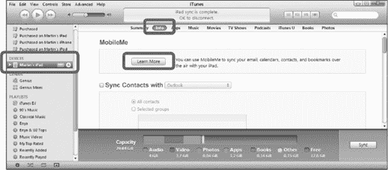
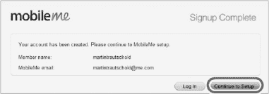

# 注册 MobileMe 服务（PC 或 Mac）

在注册 iPad 或首次将 iPad 连接到电脑后，Apple 让您能轻松地从 iTunes 了解 MobileMe。您很可能会看到一则带有“`Try It Free`”按钮的 MobileMe 广告。

如果您使用 iTunes 同步 iPad，您还会在“`Info`”标签页顶部看到一个“`Learn More`”按钮（参见图 4–6）。

1. 将 iPad 连接到电脑。
2. 在 iTunes 左侧导航栏中点击`your iPad`。
3. 点击顶部的“`Info`”标签页。
4. 点击 MobileMe 区域中的“`Learn More`”按钮。

**图 4–6.** *从 iTunes 的 Info 标签页开始使用 MobileMe*

您也可以直接通过 MobileMe 网站进行注册。

1. 输入您的个人信息以设置帐户，然后点击“`Continue`”按钮。接着输入您的账单信息，并点击底部的“`Sign Up`”按钮。
2. 如果所有信息都正确输入，您将看到一个类似下图所示的“`Signup Complete`”屏幕。

   

现在您已成功创建 MobileMe 帐户。接下来，您将在 Mac 或 PC 以及 iPad 上设置 MobileMe。

如果您是 Windows PC 用户，请跳至“在 PC 上设置 MobileMe”部分。

