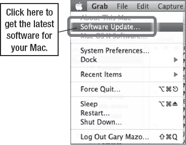
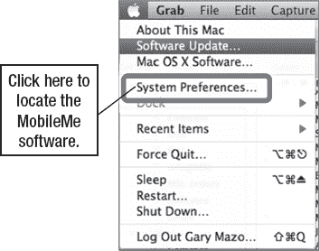
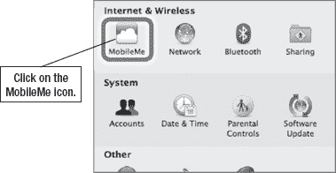
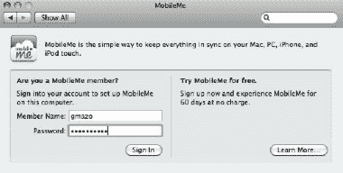
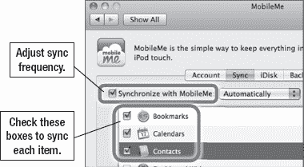
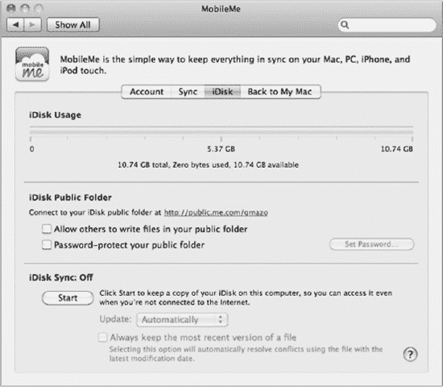

# 在 Mac 上设置 MobileMe

创建 MobileMe 帐户后，您就可以在 Mac 上设置相关软件了。在 Mac 上运行的 MobileMe 软件包含在最新版本的 Leopard（v10.5.8 或更高版本）或 Snow Leopard（v10.6.3 或更高版本）操作系统中。

如果您没有最新版本的 Mac 系统软件，则必须先安装它，然后配置 MobileMe 软件以同步到 MobileMe 云端，才能开始使用。

1. 点击“`Apple menu`”并选择“`Software Update`”，如图所示。

   **提示**：您可以在第 30 章“您的 iTunes 用户指南”中找到关于如何在 Mac 上安装或升级软件的详细分步说明。

   

2. 按照步骤完成软件更新。
3. 成功安装软件更新后，点击“`Apple menu`”并选择“`System Preferences`”。

   

4. 在“系统偏好设置”的“Internet 与无线”部分，点击“`MobileMe`”图标。

   

5. 输入您的 MobileMe“`Member Name`”和“`Password`”。
6. 点击“`Sign In`”。

   

7. 点击顶部的“`Sync`”标签页，查看此处所示的屏幕。
8. 勾选“`Synchronize with MobileMe`”旁边的复选框。
9. 此复选框旁边有一个用于配置同步频率的下拉菜单。默认设置为“`Automatically`”，但您也可以选择每“`Hour`”、“`Day`”、“`Week`”同步一次，或选择“`Manually`”。

   

10. 要同步书签，请勾选“`Bookmarks`”旁边的复选框，并选择您的“`web browser`”。
11. 要同步通讯录，请勾选“`Contacts`”旁边的复选框。
12. 要同步日历，请勾选“`Calendars`”旁边的复选框。
13. 您还可以通过勾选其他项目来同步它们。设置好同步后，您可以点击“`iDisk`”标签页并完成屏幕操作（参见图 4–7）来配置您的 iDisk。
14. 完成后，关闭“`MobileMe`”控制面板。

**图 4–7.** *显示 iDisk 标签页的 MobileMe 控制面板*

关闭 MobileMe 控制面板后，MobileMe 将立即开始将您选定的项目（通讯录、日历和书签）发送到 MobileMe 网站。

现在您可以跳至“访问 MobileMe 的多种方式”部分，而我们将在下面讨论 Windows 用户如何配置 MobileMe。

