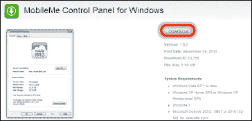
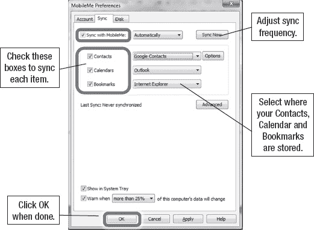

# 在 Windows PC 上设置 MobileMe

创建 MobileMe 帐户后，您需要在 PC 上完成软件设置。您需要在 PC 上安装最新版本的 iTunes 和 MobileMe 软件，然后将其配置为同步到 MobileMe 云端，才能开始使用。

1. 在您的网页浏览器中，前往 [`www.apple.com/mobileme/setup/pc.html`](http://www.apple.com/mobileme/setup/pc.html)。
2. 如果您没有 iTunes 10 或更高版本，请点击“`iTunes`”链接进行下载。

   **提示**：我们在第 30 章“您的 iTunes 用户指南”中提供了安装或升级 iTunes 的分步说明。

   点击链接下载适用于 Windows 的 MobileMe 控制面板。

3. 点击此屏幕上的“`Download`”按钮下载安装文件。
4. 按照屏幕上的步骤在您的电脑上安装软件。

   

5. 软件安装完成后，通过以下两种方法之一启动它：
   * 双击 Windows 桌面上的“`MobileMe`”图标
   * 通过“`Start`”按钮启动，或通过左下角的“`Windows`”图标进行搜索。输入“`MobileMe`”，该图标应出现在“开始”菜单顶部的“`Programs`”下。点击它。
6. 点击顶部的“`Sync`”标签页。
7. 勾选“`Sync with MobileMe`”旁边的复选框。
8. 此复选框旁边有一个用于同步频率的下拉菜单。默认设置为“`Automatically`”，但您也可以选择每“`Hour`”、“`Day`”、“`Week`”同步一次，或选择“`Manually`”。
9. 要同步通讯录，请勾选“`Contacts`”旁边的复选框，并选择通讯录的存储位置（例如“`Outlook`”、“`Google Contacts`”、“`Yahoo!`”或“`Windows Contacts`”）。对于 Google 和 Yahoo!，您需要点击出现的“`Options`”按钮来输入您的用户名和密码（参见图 4–8）。

   

   **图 4–8.** *显示“同步”标签页的 MobileMe for Windows 偏好设置控制面板*

10. 要同步日历，请勾选“`Calendars`”旁边的复选框，并选择日历的存储位置（例如“`Outlook`”或其他位置）。
11. 要同步书签，请勾选“`Bookmarks`”旁边的复选框，并选择您电脑上的网页浏览器（截至出版时，仅支持 Safari 和 Internet Explorer 同步书签）。
12. 完成后点击“`OK`”。

点击“`OK`”后，MobileMe 将立即开始将您选定的项目（通讯录、日历和书签）发送到 MobileMe 网站。

