# MobileMe 网站快速导览

通过 MobileMe 网站，您可以完成许多实用且令人惊叹的操作。您可以定位您的 iPad、向其发送信息、让它大声响铃，甚至远程锁定或擦除它。以下是快速导览。

1.  在电脑的网页浏览器中，输入网址 [`www.me.com`](http://www.me.com) 访问 `MobileMe`。
2.  输入您的用户名和密码，然后点击 `Log In`。

    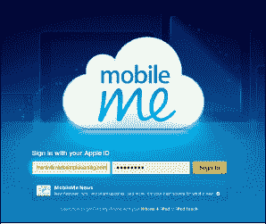

3.  若要查看您的邮件，请点击左上角的`云朵`图标 ，然后点击`邮件`图标。

    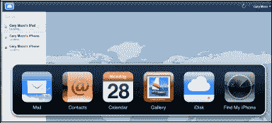

4.  这将显示您所有发送到 MobileMe 邮箱地址 [`(membername)@me.com`](http://(membername)@me.com) 的`收件箱`。

    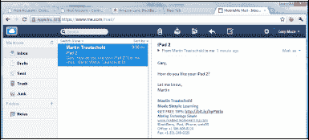

5.  若要查看您的通讯录，请点击`云朵`图标 ，然后点击`通讯录`图标。

    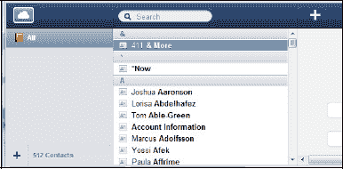

6.  若要查看您的日历，请点击`云朵`图标 ，然后点击`日历`图标。请注意顶部有各种用于日历视图的按钮：日、周、月和列表。

    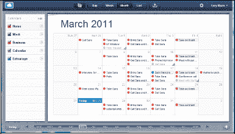

7.  若要查看您的相册，请点击`云朵`图标 ，然后点击`图库`图标。
8.  若要创建新相册，请点击左下角的`+`。

    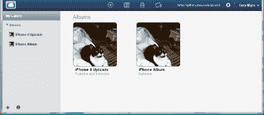

9.  输入您的`相册名称`，并勾选您想要的`允许`和`显示`设置。此外，对于 Mac 用户，请决定是否要与 `iPhoto` 或 `Aperture` 同步。
10. 点击`创建`按钮来创建您的新相册。

    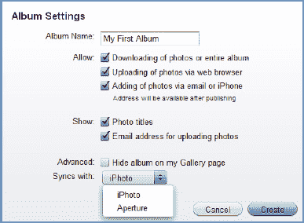

11. 点击`上传箭头`以选择要上传到您 MobileMe 相册的照片或视频。
12. 浏览至电脑上存储图片的文件夹，点击选中图片或视频，然后点击`打开`按钮。

    **注意**：支持以下图像文件格式：`.png`、`.gif`、`.jpg`、`.jpeg`。支持以下视频类型：`.mov`、`.m4v`、`.mp4`、`.3gp`、`.3g2`、`.mpg`、`.mpeg`、`.avi`。

    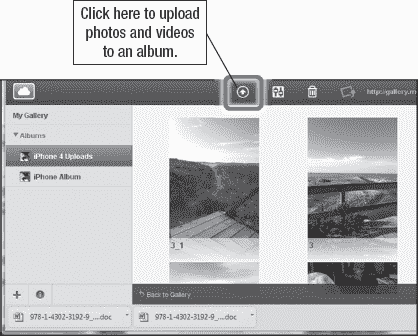

    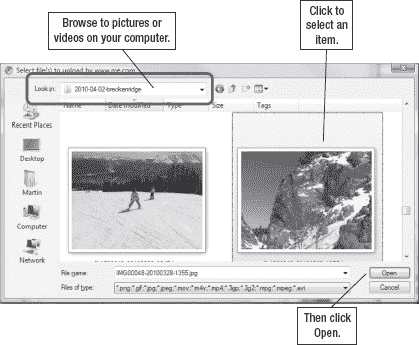

13. 点击`云朵`图标 ，然后点击 `iDisk` 图标，查看位于 MobileMe iDisk 上的文件。

    **提示**：您可以轻松地在此 iDisk 上从电脑和 iPad 存储和检索文件。您甚至可以分享因文件过大而无法通过邮件发送的文件，或使用`公共`文件夹从 iPad 打印的文件。

    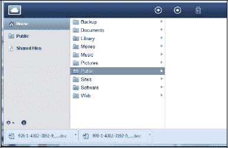

14. 点击`云朵`图标 ，然后点击`查找我的 iPad` 图标来定位您的 iPad。出于安全目的，您需要重新输入密码。此功能假设您已从 iPad 上的`设置`应用登录了 MobileMe。

    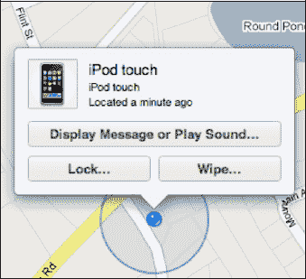

15. 点击右上角的您的姓名，然后从下拉列表中选择`帐户`。在您的帐户页面中，您可以调整选项、查看您的帐户类型和试用到期日期（如果您使用的是免费试用版）、获取帮助，或检查 MobileMe 服务是否正在运行。

    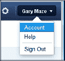

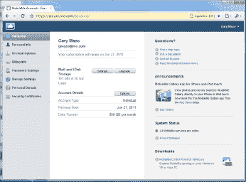

## 设置您的 iPad 以访问您的 MobileMe 帐户

现在您已经设置好了 MobileMe 帐户，可以准备从 iPad 登录了。我们将在第 1 章：“开始使用”的“查找我的 iPad”部分向您展示如何操作。

1.  点击您的`设置`图标。
2.  点击`邮件、通讯录、日历`。
3.  点击`添加帐户`。
4.  对于帐户类型，点击 `MobileMe`。
5.  输入您的`名称`以及您的 MobileMe `电子邮件地址`和`密码`，然后点击`下一步`。
6.  现在您将看到 MobileMe 配置屏幕，其中显示您的同步选项。
7.  要打开或关闭任何同步项目，请点击开关。
8.  要打开`查找我的 iPad`（该功能会在 MobileMe 网站的地图上显示您的 iPad），请将开关拨到`开`。

    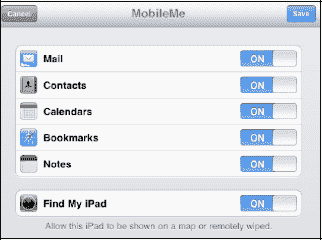

    **注意**：如果您在 iPad 上有任何现有的联系人、日历或其他信息，这些信息将与您的 MobileMe 联系人和日历分开保存。

9.  完成后，点击`存储`。您应该会返回到“设置”屏幕，并看到您的 MobileMe 帐户已列出，且选定的项目已开启同步。

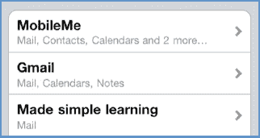

## 设置后使用 MobileMe

一旦设置完成，使用 MobileMe 会相当无缝。您在 iPad 上更新联系人和日历，更改会自动出现在您的电脑上。而且，如果您在同一帐户上设置了其他移动设备（如另一台 iPad），更改也会出现在那里。所有内容都会通过无线方式自动保持同步。

MobileMe 有一些非常酷的功能，我们接下来将重点介绍。

### 查找我的 iPad、发送信息和远程擦除

从任何网页浏览器中，您都可以使用 MobileMe 的`查找我的 iPad`功能来定位您的 iPad。您可以发送信息并播放响亮的声音来提醒 iPad 的持有者，即使 iPad 处于锁定状态。您可以使用四位数字代码远程锁定您的 iPad，并远程擦除 iPad 上的所有信息。

请参考第 1 章：“开始使用”中的“查找我的 iPad”部分。

### Google/Exchange 或 MobileMe 的附加设置

设置好 Google/Exchange 或 MobileMe 同步后，您可能会在“设置”屏幕上看到一些除了第 14 章：“处理联系人”和第 15 章：“您的日历”中所示选项之外的新选项。

1.  点击`设置`图标。
2.  点击左侧栏中的`邮件、通讯录、日历`。
3.  向下滚动右侧栏至底部，可以看到此处显示的图像。
4.  通讯录部分的新选项是`默认帐户`。您可以将其设置为 Exchange/Google 帐户或您的电脑帐户。
5.  请注意，您可以打开或关闭`新邀请提醒`。
6.  日历部分的新选项是`同步`，它允许您设置同步日历的时间范围（`2 周`、`1 个月`、`3 个月`、`6 个月`或`所有事件`）。

    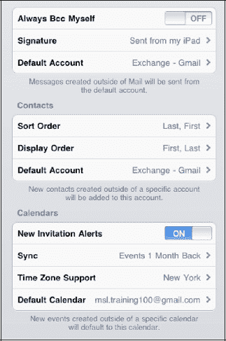

7.  您还可以选择添加到 iPad 的新事件的`默认日历`。创建新事件时，您可以更改此日历。

## 第 5 章

好的，作为高级文档工程师和翻译员，我将遵循您提供的注意事项和示例，将以下英文文本翻译成中文。

