# Wi-Fi 与 3G 连接

我们生活在一个互联的世界。无线网络（Wi-Fi）接入已经成为常态，而非例外——您很可能正在家中或办公室使用 Wi-Fi。现在，您可以利用它来连接您的 iPad。如果您的 iPad 配备了 3G 模块，那么您还可以在任何有蜂窝网络信号覆盖的地方（这比 Wi-Fi 网络的覆盖范围要广得多）连接到互联网。

在本章中，我们将讨论您的 iPad 的两种连接方式的区别：Wi-Fi（无线局域网）和 3G（蜂窝服务——您的手机所使用的广域数据网络）。我们将向您展示连接或断开这两种网络的所有方法。有时，您可能希望禁用或关闭 3G 连接，仅使用 Wi-Fi，以节省数据连接费用。

iPad 的美妙之处在于它内置了无线互联网接入功能。一旦将您的 iPad 连接到无线（Wi-Fi 或 3G）网络，您就可以在几分钟内发送电子邮件和上网冲浪。而一旦您发现了所有可用的出色应用程序和书籍，您将再也不希望断开连接。

**注意：** 您的 iPad 可能不具备 3G 连接功能。某些 iPad 仅支持 Wi-Fi 连接，不具备连接 3G 蜂窝网络的能力。

如何知道您拥有的是哪款 iPad？支持 3G 的 iPad 在顶部边缘会有一条黑色塑料条，在 iPad 背面更为显眼；该条有助于数据接收（请参见图 5-1）。

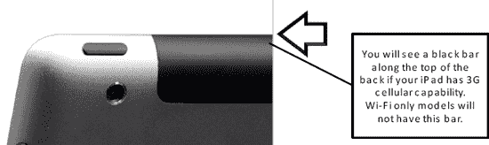

**图 5-1.** *如何判断您的 iPad 是否具备 3G 蜂窝功能*

### 连接到 Wi-Fi 或 3G 网络后，我可以做什么？

以下是连接到 Wi-Fi 或 3G 网络后可以执行的一些操作：

-   从 `App Store` 访问和下载应用程序（程序）。
-   使用 iPad 上的 `iTunes` 应用访问和下载音乐、视频、播客等内容。
-   使用 `Safari` 浏览网页。
-   发送和接收电子邮件。
-   使用需要互联网连接的社交网站，如 Facebook、Twitter 等。
-   使用 `Skype` 应用将您的 iPad 当作电话使用（请参见第 22 章：“社交网络”）。
-   玩需要实时互联网连接的游戏。
-   其他任何需要互联网连接的操作。

## Wi-Fi 连接

每台 iPad 都内置了 Wi-Fi 功能。如果您有 3G 型号，那么您同时拥有 3G 和 Wi-Fi 功能。那么，让我们来看看如何连接到 Wi-Fi 网络。关于 Wi-Fi 连接需要考虑的事项包括：

-   网络接入和数据下载没有额外费用（如果您在家中、办公室或免费的 Wi-Fi 热点使用 iPad）。
-   Wi-Fi 通常比蜂窝数据 3G 连接速度更快。
-   包括飞机在内的越来越多的地方提供 Wi-Fi 接入，但您可能需要支付一次性或月度服务费。

### 设置您的 Wi-Fi 连接

要设置您的 Wi-Fi 连接，请按照以下步骤操作：

1.  点击 `设置` 图标。
2.  点击左侧栏中的 `Wi-Fi` 以查看右侧显示的画面。
3.  确保 `Wi-Fi` 开关已设置为 `开`。
4.  一旦 Wi-Fi 打开，iPad 将自动开始搜索无线网络。
5.  可访问的网络列表会显示在 `选择网络...` 选项下方。在此屏幕截图中，您可以看到我们有两个可用网络。

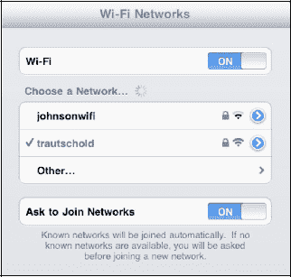

要连接到列出的任何网络，只需点击它。如果该网络是不安全的——即它不需要密码——您将自动连接。

**注意：** 某些地方，如咖啡店，使用基于网页的登录界面，而不是用户名/密码界面。在这种情况下，当您点击一个网络（或尝试使用 `Safari`）时，iPad 会滑出一个浏览器界面，您将看到网页以及登录选项。

### 安全 Wi-Fi 网络——输入密码

| 某些 Wi-Fi 网络需要密码才能登录。这由网络管理员在创建无线网络时设置。您必须知道确切的密码，包括是否区分大小写。如果网络确实需要密码，您将进入密码输入界面。请按提供的格式准确输入密码，然后按下屏幕键盘上的 `回车` 键（此时该键标记为 `加入`）。 | 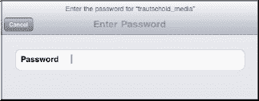 |
| 在 `选择网络...` 界面上，您会看到一个`勾选`图标，表示您已连接到该网络。 | 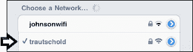 |

**提示：** 您可以将文本粘贴到密码对话框中。因此，对于较长或随机字符的密码，您可以先将密码传输到您的 iPad（例如通过电子邮件），然后直接复制粘贴。请记得在执行此操作后立即删除该电子邮件以确保安全。

### 切换到不同的 Wi-Fi 网络

有时，您可能想要更改当前的 Wi-Fi 网络。这种情况可能发生在您身处酒店、公寓或其他地方，而 iPad 选择的网络并非信号最强的网络，或者您希望使用安全的网络而非不安全的网络时。

要从当前选定的 Wi-Fi 网络切换，请点击 `设置` 图标，点击左侧栏中的 `Wi-Fi`，然后点击您想加入的 Wi-Fi 网络名称。如果该网络需要密码，您需要输入密码才能加入网络（请参见图 5-2）。

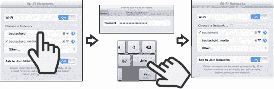

**图 5-2.** *切换到不同的 Wi-Fi 网络*

一旦您输入正确的密码（或点击一个开放网络），您的 iPad 将加入该网络。

### 验证您的 Wi-Fi 连接

| 要验证您是否已连接到 Wi-Fi 网络，请查找旁边带有`勾选`图标的网络名称。当您返回 `设置` 界面时，您应该在 `选择网络...` 下方的列表中看到您的 Wi-Fi 网络名称旁边有一个`勾选`图标。 | 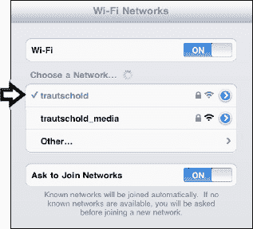 |

## 高级 Wi-Fi 选项（隐藏或不可发现的网络）

有时，您可能看不到您想加入的网络，因为其名称已被管理员隐藏。在下一节中，您将学习如何在 iPad 上加入此类网络。一旦您加入，下次进入该网络覆盖范围时，您的 iPad 将自动加入，无需询问。您也可以设置让 iPad 每次加入网络时都询问您；我们也会向您展示如何操作。有时，您可能想要擦除或遗忘某个网络。例如，假设您参加了一次性的会议，并且想要删除相关联的网络——您也将学习如何做到这一点。

### 为什么我看不到我想要加入的 Wi-Fi 网络？

有时，出于安全原因，人们不会让他们的网络被发现，您必须手动输入名称和安全选项才能连接。

如 图 5-3 所示，您的可用网络列表包含 `其他`... 点击 `其他` 选项，即可手动输入您想要加入的网络名称。

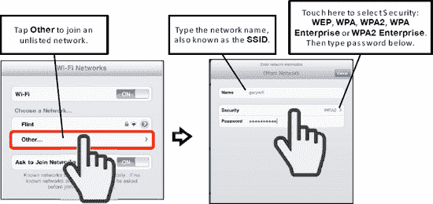

**图 5-3.** *您可以手动输入 Wi-Fi 网络的名称。*

输入 Wi-Fi 网络名称，点击 `安全性` 选项，然后选择该网络正在使用的安全类型。如果不确定，您需要向网络管理员确认。

当您拥有所需信息后，将其与正确的密码一同输入。这个新网络将被保存到您的网络列表中，以便将来访问。

#### 重新连接之前加入的 Wi-Fi 网络

iPad 的妙处在于，当你回到某个之前加入过 Wi-Fi 网络的区域时（无论是开放网络还是需要密码的安全网络），你的 iPad 会自动加入该网络，无需你再次输入密码或提供其他连接信息。当然，你也可以自由关闭此自动加入功能，具体方法将在下一节介绍。

##### 询问是否加入网络

默认情况下，`询问是否加入网络`开关设置为`开`，这意味着你会自动加入已知或可见的 Wi-Fi 网络。如果有你不认识的可用网络，系统会先询问你是否连接。

| 如果开关设置为`关`，你只会自动连接到已知网络，并且必须按照我们之前描述的手动加入未知网络步骤进行操作。为何有人会关闭自动加入网络功能？例如，如果你不想让孩子在不知情的情况下用 iPad 加入无线网络，这可能是一个很好的安全措施。 | 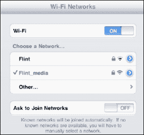 |

##### 忽略（或删除）网络

如果你发现不想再连接到列表中的某个网络，你可以“忽略”它，即将其从网络列表中移除。请按以下步骤操作：

1.  在`设置`应用的`Wi-Fi`屏幕中，点击该网络旁边的`蓝色`小箭头。随后出现的屏幕会显示该特定连接的详细信息（见图 5-4）。
2.  点击屏幕顶部的`忽略此网络`。
3.  系统会弹出警告提示。点击`忽略网络`，该网络将不再显示在你的列表中。

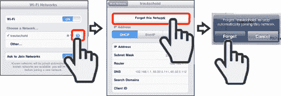

**图 5-4.** *如何忽略 Wi-Fi 网络*

### 3G 蜂窝数据连接

如果你拥有 3G iPad，你还可以连接到蜂窝数据网络；这与 iPhone 或其他手机连接的是同一网络。以下是关于蜂窝数据连接需要考虑的一些事项：

*   3G 蜂窝网络的覆盖范围比 Wi-Fi 更广——你可以在汽车内或远离城市的地方连接 3G，而这些地方通常没有 Wi-Fi。
*   使用蜂窝数据网络需要支付额外的月服务费。
*   在美国，根据你购买的 iPad 型号不同，你有两种蜂窝数据选择：AT&T 和 Verizon。
    *   AT&T 当前套餐：每月 250MB 收费 15 美元，每月 2GB（约 2000 MB）收费 25 美元。
    *   Verizon 当前套餐：每月 1GB 收费 20 美元，每月 3GB 收费 35 美元，每月 5GB 收费 50 美元，每月 10GB 收费 80 美元。

以下是使用 1GB 无线数据可以做的事情：

*   浏览 6,500 个网页
*   下载 300 首歌曲
*   观看 65 个 YouTube 视频
*   下载 2,000 张照片

**注意：** 英国 Orange、英国 Vodafone、O2、加拿大 Rogers 及其他国际运营商可能提供不同的定价方案。

#### 设置你的 3G 连接

在连接到 3G 蜂窝网络之前，你需要从无线运营商处购买蜂窝数据套餐。如前所述，在美国，目前你为 iPad 选择的运营商是 AT&T 和 Verizon。

**提示：** 你可以通过以下方法节省蜂窝数据套餐的费用：

*   尽可能使用 Wi-Fi。
*   从成本较低、容量较小的蜂窝数据套餐开始。
*   整月监控你的蜂窝数据用量，确保不会超出低成本数据套餐的限制。

你可能会发现，如果大多数数据需求都使用 Wi-Fi，那么低成本套餐就够用了。

请按照以下步骤连接到蜂窝数据网络：

1.  点击 iPad 上的`设置`图标。
2.  点击左侧栏中的`蜂窝数据`。
3.  将`蜂窝数据`旁边的开关设置为`开`（见图 5-5）。
4.  首次执行此操作时，会弹出一个窗口要求你设置账户：
    1.  输入你的个人信息、用户名和密码，这些信息仅用于这个新的蜂窝数据套餐。此账户与你的电子邮件账户、手机套餐或任何其他账户无关，因此你可以输入相同的信息，也可以设置不同的信息。

        **注意：** 在本书出版时，美国的无线运营商（AT&T 和 Verizon）提供定期计费套餐。这意味着你只需设置一次套餐，之后每月都会扣费，直到你取消套餐为止。

    2.  向下滚动查看屏幕其余部分，轻点屏幕选择你的数据套餐。
    3.  输入你的信用卡信息。
5.  点击`下一步`按钮。

    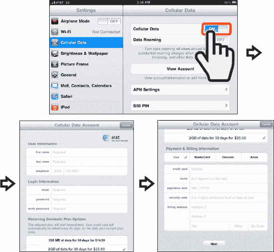

    **图 5-5.** *购买蜂窝数据套餐*

6.  在下一个屏幕上，你需要滑动到协议底部，并点击`同意`才能继续——当然，前提是你同意该协议。
7.  如果你要携带 iPad 出行，点击`添加国际数据`并按照下一节的步骤操作。

    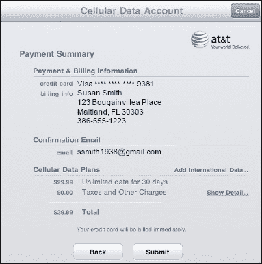

8.  如果此时不想添加国际套餐（你可以随时稍后添加），点击`提交`完成操作。
9.  点击`提交`后，你会看到一个类似下方的窗口。点击`确定`关闭窗口。

    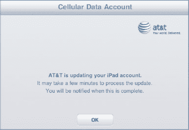

10.  最后，当你的新蜂窝数据套餐设置完成后，你会看到类似下方的弹出消息。

    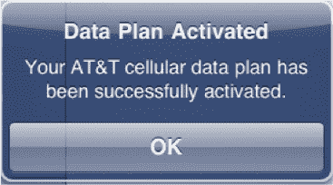

#### 添加国际数据套餐

如果你计划外出旅行，可能想为 iPad 添加一个国际数据套餐。只需按照以下步骤即可轻松操作：

**注意：** 并非所有运营商都为你的 iPad 提供国际漫游套餐。请与你的运营商确认以确保能购买到套餐。如果不行，你可能需要考虑在出国期间关闭 3G 连接，只使用免费的 Wi-Fi。

1.  点击`设置`图标。
2.  点击左侧栏中的`蜂窝数据`。
3.  点击右侧栏中的`查看账户`。
4.  输入你在创建此账户时使用的蜂窝数据用户名和密码登录账户。
5.  点击`添加国际套餐`（见图 5-6）。
6.  在`国际数据套餐`窗口中执行以下操作：
    1.  选择你的`一次性国际套餐`。
    2.  调整你的套餐`开始日期`以匹配你的旅行需求。
    3.  点击底部的`查看所有支持国家/地区列表`链接，确认该套餐支持你所需的国家/地区。
    4.  点击`完成`。
    5.  你可能需要在下一个屏幕上确认你的选择。

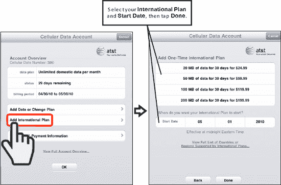

**图 5-6.** *购买国际蜂窝数据套餐*

