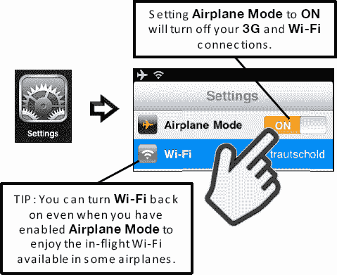
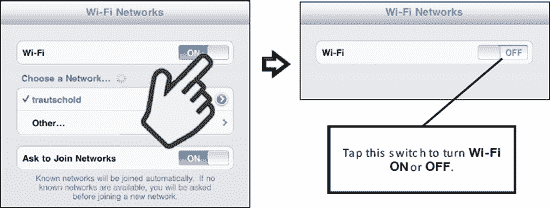

# 监控蜂窝数据用量与更改套餐

如果你购买了限量数据套餐（15 美元/月，含 250MB 流量），则需要定期检查每日数据使用量。

操作方法如下：

1.  轻点`设置`图标。
2.  轻点左侧栏中的`蜂窝数据`。
3.  轻点右侧栏中的`查看账户`。
4.  输入创建账户时使用的蜂窝数据用户名和密码登录账户（参见图 5-6）。
5.  查看顶部`账户概览`区域列出的`数据套餐`、`状态`和`计费周期`。只有购买了限制数据用量的套餐（例如 250MB）时，才会看到以兆字节（MB）为单位的实际数据用量。
6.  如需更改套餐或增加数据，请轻点`增加数据或更改套餐`，然后按照步骤调整套餐。

**注：** 当你的 250MB 套餐剩余流量达到 20%、10%和 0%时，iPad 会发出通知。你也可以选择以 14.99 美元续费该套餐，或升级至 30 美元的不限流量套餐。

## 国际旅行——如何避免高额蜂窝（3G）数据漫游费用（仅限 3G 版 iPad 机型）

我们听说有些人出国旅行后，收到 300 到 400 美元的月度漫游账单时非常惊讶。只需在旅行前和旅行中采取几个简单步骤，即可避免这些费用：

1.  尽量在海外使用免费 Wi-Fi 网络的 Wi-Fi 连接；这样可以将蜂窝数据漫游费用降至最低。
2.  如前文“添加国际数据套餐”部分所述，订阅一次性国际数据套餐。在大多数情况下，激活国际数据套餐可以比标准数据漫游费用节省一些钱。
3.  了解可能产生的数据漫游费用。向你的蜂窝数据供应商咨询数据漫游费用。你可以尝试在手机公司的网站上搜索，但通常需要致电客服，并明确询问你将要访问的国家/地区的 iPad 数据漫游费用。如果你打算使用电子邮件、地图、网页浏览或任何其他数据服务，应明确询问这些服务是否单独收费。

探索购买和使用外国 SIM 卡（MicroSIM 规格）。

你的 iPad 蜂窝数据供应商可能不提供国际数据漫游套餐的特别优惠，或者费率过高。在这种情况下，你可以插入在国外购买的 SIM 卡。

**警告：** iPad 使用 MicroSIM，而几乎所有其他手机都使用 MiniSIM。这可能导致很难找到提供合适尺寸 SIM 卡的国际运营商。

通常，插入你所处国家/地区的 SIM 卡可以消除或大幅降低数据漫游费用。不过，请仔细检查该外国 SIM 卡的数据费用。使用外国 SIM 卡可以为你节省数百美元，但最好事先做一些网络调查，或尝试咨询近期去过同一国家/地区的人士以确保无误。

## 飞行模式——关闭 3G 和 Wi-Fi

通常在飞机上飞行时，机组人员会要求你在起飞和降落时关闭所有便携式电子设备。当飞机达到巡航高度后，机组人员会表示“所有经批准的电子设备”可以重新开启。

你可以通过按住顶部右侧边缘的电源按钮，然后用手指`滑动来关机`来关闭 iPad。

如果你使用的是 3G/蜂窝数据版 iPad，则可以按如下方式在`设置`图标中开启`飞行模式`：

1.  轻点`设置`图标。
2.  将左侧栏顶部的`飞行模式`开关设置为`开启`。

**提示：** 部分航空公司提供机上 Wi-Fi 网络；在这种情况下，你需要保持 Wi-Fi 处于`开启`状态。

你可以按照以下步骤将`Wi-Fi`连接`关闭`或`开启`（参见图 5-7）：

1.  轻点`设置`图标。
2.  轻点左侧栏顶部的`Wi-Fi`。
3.  将右侧栏顶部的`Wi-Fi`开关设置为`关闭`。

**图 5-7.** *如何`关闭`或`开启`Wi-Fi。*

