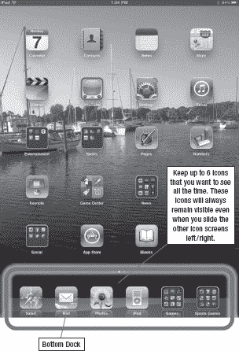
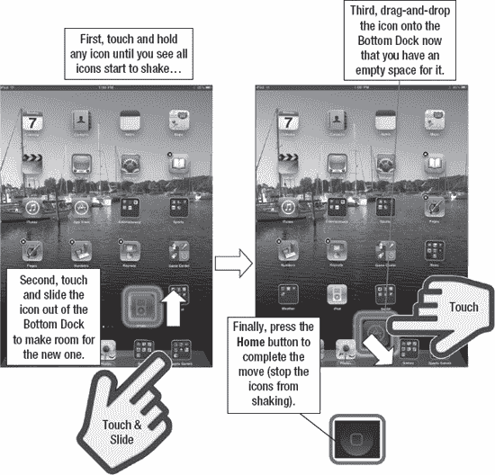
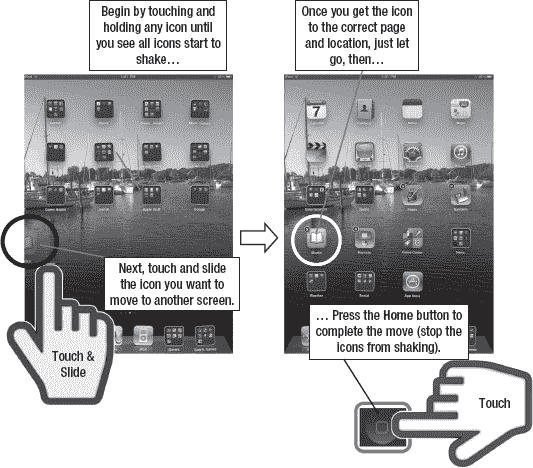
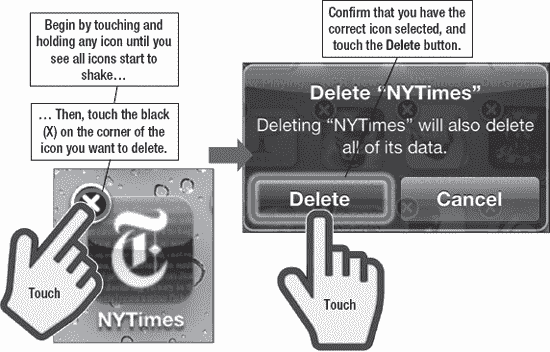
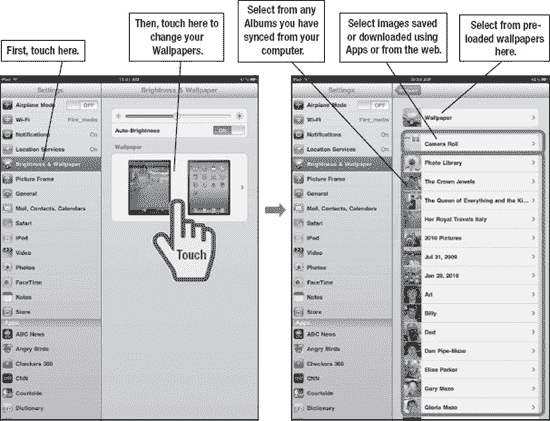
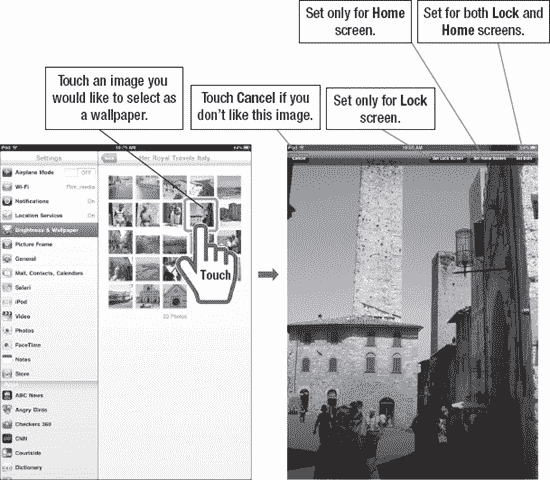

# 整理你的 iPad 图标与文件夹

你的新 iPad 具有很高的可定制性。在本章中，我们将向你展示如何移动图标，并把你最常用的应用放在你想要的位置。你最多可以使用 11 页图标，并且可以调整这些页面的外观和感觉，使其符合你的品味。

与 Mac 电脑或 iPhone 一样，iPad 有一个*底部程序坞*，你可以在其中放置最常用应用的图标。你的 iPad 底部程序坞中预设有四个标准图标，但你可以将其替换为其他图标，这样你最常用的应用就能始终显示在屏幕底部。你还可以再添加两个图标，使底部程序坞总共容纳六个项目。你甚至可以将整个应用文件夹移动到底部程序坞。

**提示**：你也可以使用电脑上的 iTunes 移动或删除图标。更多信息请参阅第 29 章：“你的 iTunes 用户指南”。

### 将图标移至底部程序坞——停靠图标

当你打开 iPad 时，会注意到底部程序坞中锁定了四个图标：`Safari`、`Mail`、`Photos`和`iPod`。

你的图标可能有所不同，但你可以轻松更改。

假设你决定将一个或多个现有图标替换为更常用的应用。幸运的是，将图标移入或移出底部程序坞非常简单。

你也可以保留这四个标准图标，再添加两个，使`底部程序坞`中共有六个图标。

#### 开始移动

按下`主屏幕`按钮返回`主屏幕`。然后，按住`主屏幕`上的任意图标几秒钟。你会注意到所有图标开始晃动。

先尝试移动几个图标。你会发现，当你将某个图标向下移动时，该行中的其他图标会为其让出空间。

当你掌握了图标的移动方式后，就可以用选中的图标替换底部程序坞中的某个图标了。在图标晃动时，将你想要替换的底部程序坞图标向上移动到一个被其他图标覆盖的区域。如果将其移动到大片空白区域，它会跳回程序坞。

**注：** 底部程序坞最多可容纳六个图标；如果已有六个图标，则必须移除一个才能用新图标替换。

假设你想用`App Store`图标替换标准的`iPod`图标。首先，按住`音乐`图标并将其向上移动一行——移出底部程序坞，如图 6-1 所示。

要停止图标晃动，请轻点`主屏幕`按钮。

**图 6-1.** *在底部程序坞中交换图标*

接下来，找到你的`App Store`图标并将其移到底部程序坞。移动时，图标会变得半透明，直到你将其安放到位。

确定图标位置无误后，再次按下`主屏幕`按钮，图标便会锁定到位。现在，你想要的`App Store`图标就出现在底部程序坞中了。

#### 将图标移动到其他页面

iPad 每个页面可容纳 20 个图标（不包括程序坞），你可以通过在**主屏幕**上*向右滑动*来找到这些页面。有了这么多酷炫的 App，拥有五页、六页甚至更多页图标的情况并不少见。如果你喜欢冒险，最多可以填满 11 页图标！

**注意**：你也可以在任何屏幕（**主屏幕**除外）上从左向右滑动。在**主屏幕**上，从左向右滑动会进入**聚焦搜索**；更多信息请参见第 2 章：“输入技巧、拷贝/粘贴与搜索”。

假设你的第一页上有一个很少使用的图标，你想把它移到最后一页。或者，你可能想将经常使用的 App 图标从图标页面的最后一页交换到第一页。这两项操作都非常简单；在页面间移动图标与将图标移动到底部程序坞非常相似。请按照以下步骤在页面间移动图标：

1.  长按任意图标以启动移动过程。
2.  长按你想要移动的图标。例如，假设你想将 **iBooks** 图标移动到第一页（请参见图 6-2）。

    

    **图 6-2.** *将图标从一个页面移动到另一个页面*

3.  现在将图标拖放到另一个页面。为此，请长按 **iBooks** 图标并将其拖向右侧，你将看到图标页面逐个移动。当到达第一页时，松开图标。这样就能将其放置在最开始的位置。
4.  按下**主屏幕**键以完成移动并停止图标抖动。

#### 删除图标

小心——删除图标和移动图标一样简单。然而，当你在 iPad 上删除一个图标时，实际上是在删除它代表的程序。这意味着，如果不重新安装或重新下载，你将无法再使用该程序。

**注意**：你可以设置家长控制（**设置**中的**访问限制**）来防止意外删除 App。如果你有把删除 App 当成有趣游戏的小孩，这个功能会非常方便。

根据你在 iTunes 中的**应用同步**设置，该程序可能仍会保留在 iTunes 的**应用**文件夹中。在这种情况下，如果你想要重新安装已删除的 App，只需在 iTunes 的同步应用列表中勾选该应用即可轻松实现。如果没有，你也可以随时从同一账户免费将其下载到你的设备上。

如图 6-3 所示，删除过程与移动过程类似。长按任意图标以启动删除过程。和之前一样，长按会使图标抖动，这样你就可以移动或删除它们。

**注意**：你只能删除已下载到 iPad 上的程序；预装的图标及其关联程序无法删除。你可以通过图标左上角是否有一个小小的黑色 **x** 来判断哪些程序可以被删除，可以删除的图标包含这个标记。

只需点击你想要删除的图标上的 **x**。系统会提示你删除或取消删除请求。如果你选择**删除**，该图标及其关联的应用将从你的 iPad 上移除。

**图 6-3.** *删除图标及其关联的程序*

## 第 7 章

## 个性化与保护你的 iPad

在本章中，你将学习一些个性化设置 iPad 的好方法，以及如何通过密码保护你的 iPad 的安全性。例如，你将学习如何下载一些精美的免费壁纸，并为你的**锁定**屏幕和**主屏幕**更换壁纸。你将学习如何通过调整设置来个性化 iPad 发出的声音，比如在接收或发送邮件、锁定 iPad、使用键盘打字，或日历事件提醒前是否听到声音。你还将学习如何自定义**相框**设置（这是一个在设备锁定状态下显示照片的应用）。你可以调整显示时长、过渡效果，甚至选择显示哪些相簿中的照片。iPad 的许多方面都可以进行微调以满足你的需求和品味，让你的 iPad 更具个性化的外观和感受。

### 更改锁定屏幕和主屏幕壁纸

实际上，你可以通过更换壁纸来个性化 iPad 上的两个屏幕。

第一个是**锁定**屏幕，在你首次开启或唤醒 iPad 时出现。此屏幕的壁纸图像显示在“滑动来解锁”滑块栏的后方。

第二个是**主屏幕**。其壁纸显示在图标的后方。

你可以使用 iPad 自带的壁纸图片，也可以使用你自己的图片。

**提示：** 你可能会希望**锁定**屏幕的壁纸比**主屏幕**的壁纸更少个人色彩。例如，您可以选择将一张通用的风景图片放在**锁定**屏幕上，而将一张亲人的照片放在**主屏幕**上。

在 iPad 上更换壁纸有几种方法。第一种方法，从设置中更换壁纸，非常简单直接。

#### 从设置中更换壁纸

触摸**设置**图标，然后触摸左侧栏中的**显示与亮度壁纸**标签。亮度和壁纸的设置选项将出现在右侧栏中。

要开始选择壁纸，请触摸屏幕右侧**壁纸**下当前选定壁纸的图片，如图 7-1 所示。

**图 7-1.** *从**设置**图标更换壁纸*

在屏幕右侧（见图 7-1 中的右图），你会看到一些相簿或图片文件夹。你有以下几种选择：

*   点击顶部的**壁纸**标签，查看 iPad 的所有预载壁纸图片。
*   点击**已存储的照片**相簿，其中包含你从网页保存的任何图片、截图（同时按住**主屏幕**按钮和**电源/睡眠**键获得），甚至包括从壁纸应用或使用 iPad 相机拍摄的照片。
*   点击**已存储的照片**下方显示的任何相簿。只有当你从 iTunes 同步了照片时，这些额外的相簿才会可见。

点击任意相簿后，你将看到该相簿中的所有图片，如图 7-2 所示。

点击相簿中的任意图片，即可在全屏模式下查看。

在全屏预览图片时，你可以执行以下操作：

*   通过双指捏合或张开进行缩放。
*   如果不喜欢该图片，点击**取消**按钮返回相簿。
*   点击**设定锁定屏幕**按钮，仅将该图片设定为**锁定**屏幕。
*   点击**设定主屏幕**按钮，仅将该图片设定为**主屏幕**。
*   点击**同时设定**按钮，将该图片同时设定为**锁定**和**主**屏幕。

**图 7-2.** *从相簿中选择一张图片来更换你的壁纸。*

