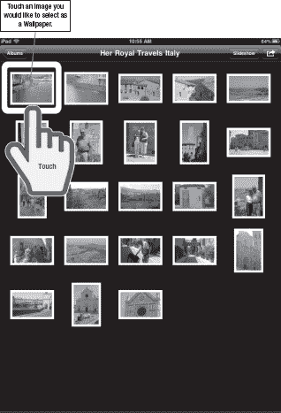
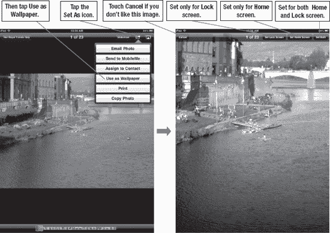

# 从任意图片更换壁纸

第二种更换壁纸的方法是在**照片**图库中查看任意图片，并将其设为壁纸。

轻点**照片**图标即可开始。如需了解更多关于处理照片的信息，请参阅第 16 章：“iPad 摄影”。

轻触你想翻阅以寻找壁纸的相簿。

当你找到想要使用的照片时，轻触它。照片将在屏幕上打开。

预览图片后（参见图 7-3），轻点屏幕右上角的**设为**图标 ，然后选择**用作壁纸**。按需缩放图片，然后将其设为**锁屏**或**主屏幕**壁纸（或两者同时设置），操作如上所述。

**图 7-3.** *从**照片**应用开始，将现有照片或图片用作壁纸。*

如果你决定改用其他图片，请选择**取消**并另选一张。

