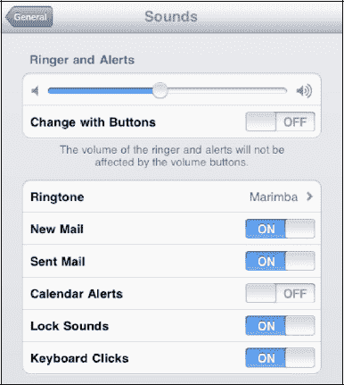

# 调整 iPad 的声音

你可以精细调节 iPad，使其在收到新邮件、发送邮件、日历闹钟响铃、键盘点击或 iPad 锁定时发出或不发出声音。要调整声音，请按以下步骤操作：

1.  轻点**设置**图标。
2.  在左侧栏中轻点**通用**。
3.  在右侧栏中轻点**声音**。
4.  轻点任意开关，以打开或关闭相应事件发生时的声音。

**提示：** 要使用 iPad 侧边的**音量**按钮调节提醒音量，只需将**用按钮调整**下的开关拨到**开**的位置。

