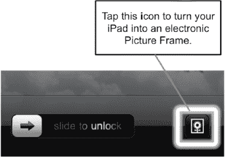
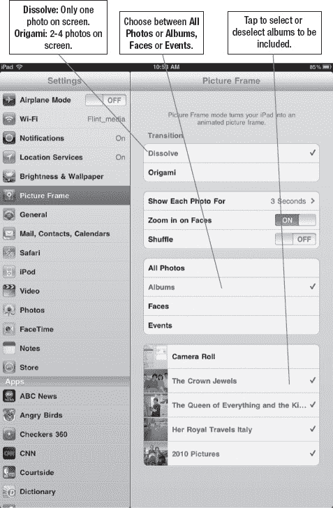

# 个性化你的相框

**相框** 是一款能在锁定 iPad 上播放照片幻灯片的应用。我们将介绍多种自定义显示方式。

## 启动或停止相框应用

你可能已经注意到，当 iPad 锁定时，**滑动来解锁**滑块旁边有一个小图标。这就是**相框**图标。

轻点此图标即可开启电子相框。

再次轻点此图标可将其关闭。

**相框**会循环播放你所有的照片，或者你也可以进行自定义，只显示选定的相簿。

**警告：** 如果你的 iPad 上存有私人照片，而**相框**在**锁定**模式下意外显示了这些照片，可能会非常尴尬。本节将向你展示如何限制用于幻灯片的相簿。

**注意：** 你可以通过在 iPad 上设置密码安全锁来禁用**相框**。我们将在本章稍后部分介绍具体方法。

## 自定义你的相框

根据 iPad 上存储的照片类型，你很可能需要设置**相框**仅显示你想要的相簿或照片。请按以下步骤操作：

1.  轻点**设置**图标。
2.  在左侧栏中轻点**相框**。现在，你可以调整相框的各种设置（参见图 7-4）。
3.  如果你希望屏幕每次只显示一张照片，请选择**溶解**。如果你希望同时显示两到四张图片，请选择**折叠**。**折叠**模式会在屏幕上显示两到四张图片，并使它们像折纸一样相互折叠。
4.  **放大面部**选项仅在选择了**溶解**过渡效果时才可选。这是一个很酷的功能，它会放大单张照片中检测到的任何人脸。
5.  如果你希望**相框**随机显示选定的照片，请将**随机播放**设为**开**。
6.  如果你希望所有照片都包含在幻灯片中（默认设置），请选择**所有照片**。
7.  人们通常希望保留一些照片的私密性。为此，请选择**相簿**，然后轻点或勾选你想要包含的相簿。（勾选标记表示该相簿将被包含在内。）

**图 7-4.** *选择如何自定义**相框***

**提示：** 要真正掌控**相框**的显示内容，请在电脑上创建一个相簿，只放入你愿意在设备解锁时让所有人看到的图片。然后，使用 iTunes 将该相簿同步到你的 iPad。如需帮助，请参阅第 3 章：“使用 iTunes 同步你的 iPad”。

