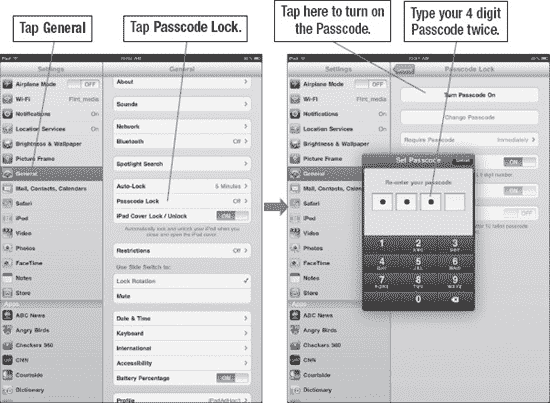
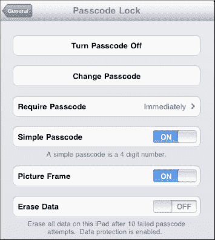
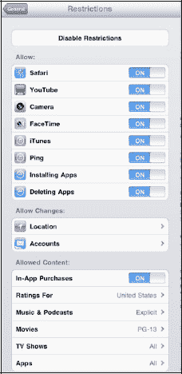
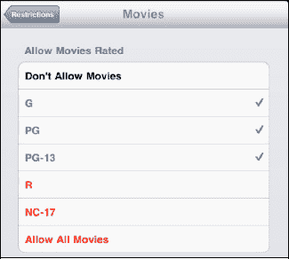
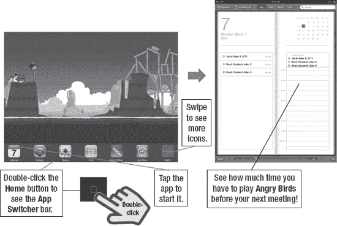
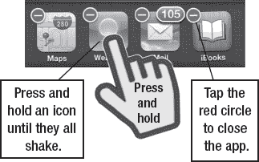
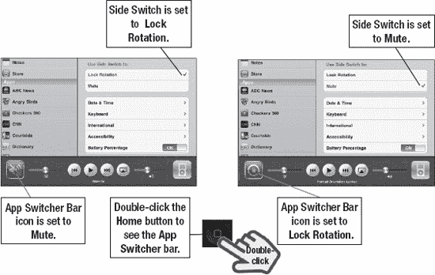
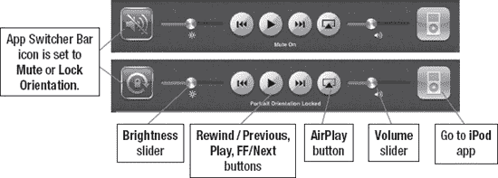
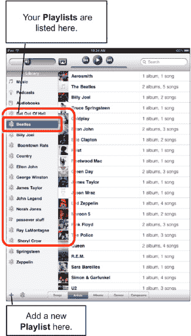

# 如何使用密码保护 iPad 安全

你的 iPad 可以存储大量有价值的信息。如果你保存了家人的社会安全号码和生日等信息，这一点尤其重要。确保任何拿起你 iPad 的人都无法访问所有这些信息是个好主意。此外，如果你的孩子像我们的一样，他们可能会拿起你酷炫的 iPad 开始上网或玩游戏。你可能希望启用一些安全限制来保护孩子的安全。

## 设置密码锁定 iPad

轻点**设置**图标，然后轻点左侧栏中的**通用**选项卡。现在向下滚动，轻点**密码锁定**选项。

在这里，你可以选择设置一个四位数字密码，以防止未经授权访问你的 iPad 和信息。但是，如果输入了错误的密码，即使是你也无法访问信息。因此，最好使用一个你容易记住的密码，或者将其写下来存放在安全的地方（参见图 7-5）。

使用键盘输入一个四位数字码。然后系统会提示你再次输入密码。

**图 7-5.** *通过设置密码启用安全保护*

## 密码选项

设置密码后，你将看到以下几个选项：

**关闭密码**

**更改密码**

**需要密码**（立即、1 分钟后、5 分钟后、15 分钟后、1 小时后、4 小时后）

**注意：** 你也可以关闭**简单密码**。这允许你设置一个更长的、更安全的密码，可以包含字母、数字、符号等。

**注意：** 为**需要密码**设置更短的时间更安全。将时间设置为**立即**（默认值）是最安全的选项。然而，使用一分钟的设置可能会让你在意外锁定 iPad 时免于重新输入密码的麻烦。

**相框**（默认设置为**开**）：将此选项设为**关**，可防止在**锁定**模式下显示照片。

**抹掉数据**（默认设置为**关**）：如果设为**开**，则在连续十次尝试输入密码失败后，所有数据将被抹除。

**警告：** 如果你有年幼的孩子，他们喜欢在 iPad 从**睡眠**模式唤醒并处于锁定状态时胡乱敲击密码解锁键盘，你可能希望将**抹掉数据**设为**关**。否则，你的 iPad 可能会频繁被抹掉数据。

#### 设置内容限制

您可能希望限制孩子在 iPad 上收听带有露骨歌词的音乐，也可能不希望他们访问 YouTube 或观看您认为不妥的内容。在 iPad 上设置内容限制非常简单。

请再次进入`设置`下的`通用`标签，然后点击`限制`。

您会看到一个写着`启用限制`的大按钮。

点击该按钮后，系统会提示您输入`限制密码`——只需选择一个您能记住的四位数密码即可。

**注意：** `限制密码`与您的 iPad 主密码是分开的。您可以将其设置得与主密码相同以便记忆；然而，如果您让家人知道了主密码，但又不想让他们调整限制设置，这样做可能会带来问题。日后关闭限制时，您需要输入此密码。

请注意，您可以使用内容限制来控制某些应用是否允许运行，例如`Safari`、`YouTube`、`iTunes`、`安装应用`或`定位`。

另外，请务必记住：**关闭 = 已限制**。

您可能会认为**开启**意味着某项功能被限制，但事实恰恰相反。要禁用或限制某项功能，您需要点击其旁边的滑块并将其滑动至**关闭**位置。如果您留意到所有标签上方写着**允许：**这个词，那么这种操作方式就说得通了。

如您所见，您可以限制对`音乐与播客`中歌词的访问，仅允许访问“干净”版本。

您还可以使用基于评级的内容限制，来控制您的 iPad 上可以播放的`影片`、`电视节目`和`应用`。

在右侧图片的示例中，只有评级不超过 PG-13 的影片才能播放。评级为 R 和 NC-17 的影片则无法播放。

## 第 8 章

## 多任务处理与静音/锁定开关

在本章中，我们将介绍如何使用`应用切换器`栏进行多任务处理，或在 iPad 上的应用之间快速切换。多任务处理是 iPad 上一个非常受欢迎的新功能，这是初代 iPad 发布时所不具备的。这项功能意味着您可以在后台保留一个应用运行的同时，去做其他事情。例如，您可以从游戏中短暂抽身，去 Facebook 上更新一下状态或在 Twitter 上发条推文，然后再跳回游戏。

`应用切换器`栏还提供了另一项便捷功能，我们将在本章中介绍。在初代 iPad 上，有一个用于锁定屏幕方向的硬件按钮。当软件更新后，该开关变成了`静音`键。有了新的 iOS 4.3，您可以通过`应用切换器`栏来设定该开关的行为，也可以在`设置`应用中对`锁定/旋转`开关进行调整。

### 多任务处理或应用切换

通过*多任务处理*或*应用切换*，您可以在切换到另一个应用时，让许多应用在后台保持运行，而无需停止当前应用。

**注意：** 开发者需要在其应用端实现多任务支持。虽然支持多任务处理的应用和更新每天都在增多，但有些应用仍然不支持，或支持不完全。

**为什么要使用多任务处理？** 以下是一些您可能在 iPad 上使用多任务处理的场景：

- 从一个应用（`邮件`）复制粘贴内容到另一个应用（`日历`）。
- 接听一个`FaceTime`通话或回复一封`电子邮件`，然后无缝跳回正在进行的游戏。
- 在玩最喜欢的游戏或浏览网页时，继续收听网络电台（如`Pandora`或`Slacker`）。
- 不再需要等待照片上传到`Facebook`或`Twitter`——它们可以在后台上传，同时您在 iPad 上做其他事情。
- 如果您使用`Skype`拨打电话，现在可以让它保持在后台运行以接听来电；这在以前是做不到的。
- 您还可以在后台保持逐向导航运行，并在通话中或使用其他应用时收听语音指令。与 VoIP 和流媒体音频一样，导航功能获得了专用的 API。

#### 如何在应用之间切换

要进行多任务处理，您需要调出屏幕底部的`应用切换器`栏。请按以下步骤操作：

1.  在任何应用界面，甚至从`主屏幕`，双击`主屏幕`按钮，即可在屏幕底部调出`应用切换器`（参见图 8–1）。
2.  所有已打开的应用将显示在`应用切换器`栏上。
3.  向右或向左滑动以找到您想要的应用，然后点击它。
4.  如果在`应用切换器`栏上看不到您想要的应用，请按下`主屏幕`按钮，然后从`主屏幕`启动该应用。
5.  再次双击`主屏幕`按钮，然后点击您刚刚离开的应用，即可跳转回去。

**图 8–1.** *双击`主屏幕`按钮调出`应用切换器`栏以进行多任务处理*

#### 如何从应用切换器关闭应用

如果您通过单击`主屏幕`按钮退出应用，该应用将在后台继续运行，除非它是一个正在进行的 VOIP 通话、定位/导航应用或某种上传任务。

**注意：** 从技术上讲，任何非 VoIP、流媒体音频和定位类应用都会保存状态并挂起——或者它会先完成诸如上传之类的网络活动，然后保存状态并挂起。但这会占用资源，iOS 会在检测到内存不足时关闭应用。如果存在某个失控进程或应用未能被及时终止，从而拖慢 iPad 的内存，手动终止该进程或应用可以解决问题。

有时您需要完全关闭一个应用。例如，您可能会发现 iPad 运行得比平时稍慢。在这种情况下，完全关闭应用以释放内存是个好主意。请按以下步骤操作：

1.  双击`主屏幕`按钮以调出`应用切换器`栏。
2.  长按`应用切换器`栏中的任意图标，直到所有图标开始晃动。您会注意到每个图标的左上角出现一个带有减号的`红色圆圈`图标。

    

3.  点击`红色圆圈`  图标即可完全关闭该应用。

**注意：** 以上步骤会终止正在运行的应用或清除保存的状态。通过这种方式关闭的任何应用，下次点击时都必须重新启动。像`邮件`这样的内置应用会自动重启，因此您不会错过任何电子邮件。

#### iPod 控制与锁定旋转/静音键

在`应用切换器`栏上，您还可以通过从左向右滑动完成另一项操作：查看 iPod 控制和屏幕`方向锁定/静音`图标。

第一代 iPad 仅允许您调整`方向锁定`；但随后的软件更新后，您可以使用`侧边`开关将 iPad 静音。

借助新的 iOS 4.3，您可以将`侧边`开关的功能更改为`锁定旋转`或`静音`。未分配给`侧边`开关的另一个选项将出现在`应用切换器`栏中。

例如，如果您将`侧边`开关设置为`锁定旋转`，则`应用切换器`栏会显示一个用于`静音`iPad 的图标。

**注意**：`锁定旋转`功能在您使用`iBooks`等应用时非常有用，可防止您在变换姿势或意外转动 iPad 时，正在阅读的书籍在`竖屏`和`横屏`模式之间不断切换。

请按照以下步骤设置`侧边`开关的功能：

1.  点击`设置`图标。
2.  点击左侧的`通用`图标。
3.  向下滚动右侧，直到看到`使用侧边开关：`选项。
4.  选择`锁定旋转`或`静音`。另一个选项现在将出现在`应用切换器`栏中，如图 8–2 所示。

**图 8–2.** *在`设置`中设置`侧边`开关，并在`应用切换器`栏中控制另一个功能。*

选择好首选设置后，更改`锁定旋转`或`静音`功能就很简单了：

1.  在任何应用或甚至`主屏幕`中，双击`主屏幕`按钮以在屏幕底部调出`应用切换器`。

    

2.  从左向右滑动以查看 iPod 控制和`锁定旋转/静音`图标。
3.  点击`锁定旋转`图标以将屏幕锁定为`竖屏`或垂直方向。即使您将 iPad 侧放，此方向也会保持不变。当您看到按钮内出现`锁定`图标且顶部状态栏中出现`锁定`图标时，即表示已锁定。

    

4.  您还可以使用中间的`上一曲`、`播放/暂停`和`下一曲`按钮。如果您按住`上一曲`或`下一曲`按钮，它们会变成`快退`或`快进`按钮。
5.  或者，您可以点击`iPod`图标跳转到`iPod`应用。如果您正在使用其他应用（如`Pandora`）控制后台音频，您将会看到该应用的图标。
6.  您还会看到用于`AirPlay`（请参见第 9 章和第 10 章）、`亮度`和`音量`的控制按钮（请参见 图 8–3）。

**图 8–3.** *`应用切换器`栏上的 iPod 控制*

## 第 9 章

## 播放音乐

在本章中，我们将向您展示如何将 iPad 变成一款出色的音乐播放器。iPad 来自普及了电子音乐播放器的 Apple，所以它肯定具备强大的功能。我们将向您展示如何播放和整理从 iTunes 购买或从电脑同步的音乐。我们还将展示如何以多种方式查看播放列表并快速查找歌曲。此外，我们还会介绍如何使用 Genius 功能，让 iPad 在您的曲库中定位并分组相似的歌曲——这有点像只播放您喜欢音乐的电台。

**提示：** 了解如何在第 20 章：“iPad 上的 iTunes”中直接在 iPad 上购买音乐。了解如何在电脑上使用 iTunes 购买音乐，或将您的音乐 CD 加载到 iTunes 中，以便在第 四部分的“iTunes 用户指南”中与 iPad 同步。

我们还将向您展示如何使用名为`Pandora`的免费应用流式播放免费音乐。使用`Pandora`，您可以从多个网络电台中进行选择，或通过输入您最喜爱的艺术家姓名来创建自己的电台。

最后，我们将讨论 iPad 2 最新版本软件中引入的`家庭共享`功能。此功能允许您在连接到家庭网络时，在 iPad 上浏览和播放家庭网络中的任何内容。

### 将 iPad 用作音乐播放器

您的 iPad 很可能是当今市场上最好的音乐播放器之一。其宽大的屏幕让您能够真正与音乐、播放列表、封面艺术以及音乐库的整理进行交互。您甚至可以通过蓝牙将 iPad 连接到家庭或车载音响，从而从 iPad 欣赏优美的立体声音效！

**提示：** 请查看第 25 章：“蓝牙”，了解如何将 iPad 连接到蓝牙立体声扬声器或车载音响。

无论您使用内置的`iPod`音乐应用还是像`Pandora`这样的网络电台应用，您都会发现在 iPad 上对音乐的控制达到了前所未有的程度。

### iPod 应用

大多数音乐处理都通过`iPod`应用完成——其图标就在`主屏幕`上。该图标通常位于底部图标坞中——即最右侧的最后一个图标。

触摸`iPod`图标，如 图 9–1 所示，您会看到底部有五个软键：

*   **歌曲：** 按字母顺序查看歌曲列表（也可搜索）。
*   **艺术家：** 按字母顺序查看艺术家列表（可像通讯录一样搜索）。
*   **专辑：** 按字母顺序查看专辑列表（也可搜索）。
*   **流派：** 查看按音乐流派整理的音乐。
*   **作曲家：** 按字母顺序查看音乐作曲家列表。

**图 9–1.** *iPod `主屏幕`布局*

**提示：** 如果这样拿着更方便，您可以将 iPad 侧放。无论屏幕方向如何，此屏幕上的所有功能都完全相同。

#### 播放列表视图

**注意：** 播放列表是您创建的音乐列表。它可以由任何流派、艺术家、录制年份或您感兴趣的歌曲集合组成。

许多人会将特定流派的音乐归类在一起，比如古典或摇滚。其他人可能会创建快节奏音乐的播放列表，并称之为“健身”或“跑步音乐”。您几乎可以随心所欲地使用播放列表来整理音乐。

播放列表可以在电脑上的 iTunes 中创建，然后同步到您的 iPad（请参见“iTunes 指南”）。您也可以直接在 iPad 上创建播放列表，我们将在下一节中介绍。

一旦您将播放列表同步到 iPad 或在 iPad 上创建了一个播放列表，它就会出现在 iPod 屏幕左侧的`资料库`下方。

在本示例中，我们触摸`Beatles`播放列表，该播放列表中的所有歌曲都会被列出来。

要转到不同的播放列表，只需触摸左侧的不同播放列表即可。

**注意：** 您可以在 iPad 上编辑某些播放列表的内容。但是，在电脑或 iPad 上创建的 Genius 播放列表无法在 iPad 本身上进行编辑。

