# 在 iPad 上创建播放列表

iPad 可让你在设备上创建独特的播放列表，这些列表可以编辑，甚至能与你的电脑同步。假设你想在 iPad 播放列表中新增一批音乐。只需创建播放列表（我们将在本章后面介绍具体方法），然后添加歌曲即可。无论何时，你都可以删除这些歌曲并添加新歌——操作再简单不过了！

要在 iPad 上创建新播放列表，请触摸左下角的 `加号`。

为你的播放列表起一个独特的名称（我们姑且称之为“iPad 播放列表”），然后触摸 `存储`。

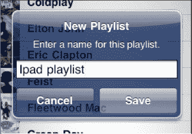

随后 iPad 会显示 `添加歌曲` 屏幕。触摸你想添加到新播放列表的任何歌曲名称的任意位置。

当歌曲变为灰色时，表示它已被选中并将添加到播放列表中。

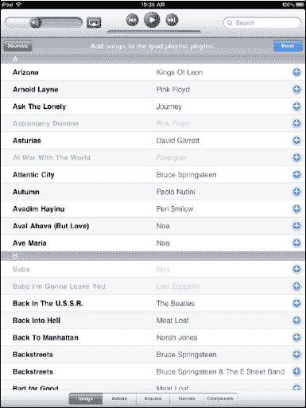

**注意：** 不要因为误触了歌曲而试图移除或取消选择而感到沮丧。你无法在此屏幕中移除或取消选择歌曲；你必须点击 `完成`，然后在下一个屏幕上进行移除。（我们稍后会演示具体方法。）

选择右上角的 `完成`，播放列表的内容将会显示出来。

如果你误触了一两首歌曲或改变了主意，在点击 `完成` 后，你可以在下一个屏幕上移除歌曲。

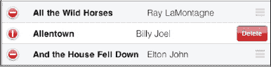

按照以下步骤删除歌曲：

1.  轻触歌曲名称左侧的 `红色圆圈`。
2.  轻触歌曲右侧的 `删除` 按钮。

按照以下步骤在播放列表中上移或下移歌曲：

1.  按住歌曲右侧的三条灰色横线。
2.  将歌曲向上或向下拖动，然后松手。

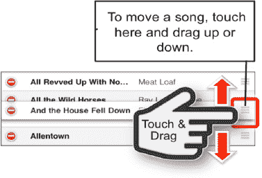

当你确定操作完成时，只需轻触右上角的 `完成`，你的播放列表就设置好了。

之后若要修改播放列表，请轻触 `编辑` 按钮，然后按照前面描述的步骤操作。

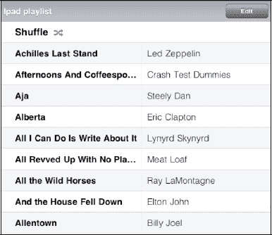

## 搜索音乐

你的 `iPod` 应用中的几乎每个视图（例如 `播放列表`、`表演者`、`视频` 和 `歌曲`）的右上角都有一个 `搜索` 窗口，如图 9–2 所示。在该 `搜索` 窗口中轻触一次，然后输入表演者、播放列表、视频或歌曲名称的几个字母，即可立即看到所有匹配项目的列表。这是在 iPad 上快速找到想听或想看的内容的最佳方法。

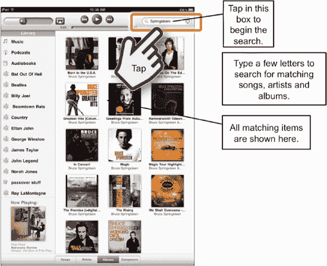

**图 9–2.** *搜索音乐*

## 更改 iPod 应用中的视图

在显示和分类音乐的方式方面，`iPod` 应用非常灵活。有时，你可能想按表演者查看歌曲列表。其他时候，你可能想查看特定的专辑或歌曲。iPad 可让你轻松更改视图，以便在特定时刻管理和播放你想要的音乐。

### 表演者视图

`表演者` 视图列出 iPad 上的所有表演者；或者，如果你在播放列表中并选择 `表演者`，它将列出该播放列表中的表演者。

滑动列表可跳转到你要找的表演者名称的首字母。

找到表演者名称后，触摸该名称，该表演者的所有歌曲将被列出，左侧会显示专辑封面图片。

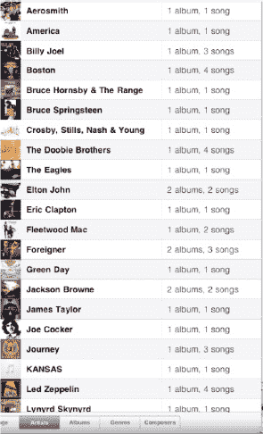

**提示：** 使用与 `通讯录` 应用（地址簿）相同的导航和搜索功能。

### 歌曲视图

 触摸 `歌曲` 标签页会显示 iPad 上所有歌曲的列表。

如果你知道歌曲的确切名称，可以滑动列表，或者触摸右侧字母索引列表中歌曲名称的首字母。

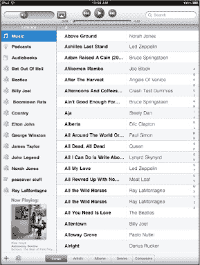

### 专辑视图

你 iPad 上的音乐也按专辑整理，当你触摸底部的 `专辑` 标签页时就会看到。

同样，你可以滚动浏览专辑封面，或在字母索引列表中触摸专辑名称的首字母，然后进行选择。

一旦你选择了一张专辑，该专辑中的所有歌曲都会被列出。

要关闭显示歌曲列表的弹出窗口，只需在该窗口外的任意位置轻触一下。

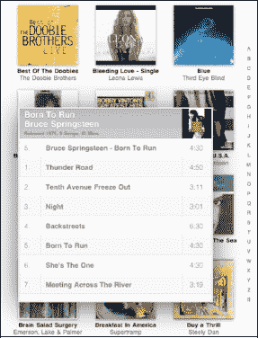

### 风格

`风格` 标签页将你的音乐按音乐类型进行分类。这可能是一种更轻松地找到你的音乐并体验更多“主题化”收听体验的方式。

有时，你可能想听摇滚或爵士混音；你可以选择那些特定的风格，然后播放部分或全部符合这些风格的歌曲。

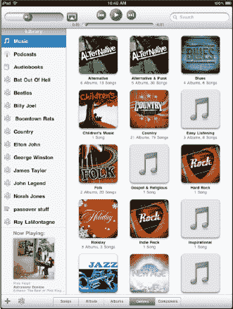

在此图中，我们触摸了 `摇滚`，iPad 弹出一个窗口，显示我们拥有该特定风格中的专辑和歌曲数量。

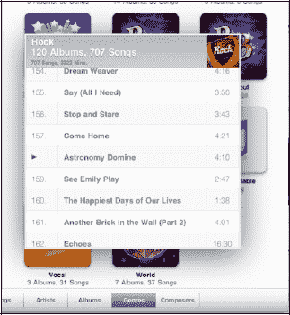

### 作曲家

与其他视图一样，触摸底部的 `作曲家` 标签页会以特定方式列出你的音乐。

有时你会忘记歌曲的标题，但你知道作曲家。浏览 iPad 上的 `作曲家` 可以帮助你找到想要的内容。

与其他视图类似，`作曲家` 视图会告诉你每位作曲家拥有多少张专辑和歌曲。

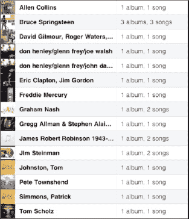

## 查看专辑中的歌曲

当你处于 `专辑` 视图时，只需触摸一张专辑封面，封面就会翻转，显示该专辑中的歌曲（参见图 9–3）。

**提示**：当你开始播放一张专辑时，专辑封面可能会放大以填满屏幕。轻触屏幕一次即可调出（或隐藏）顶部和底部的控制按钮。你可以使用这些控制按钮来管理歌曲和屏幕，我们将在下一节中描述。

要查看正在播放的专辑中的歌曲，请轻触 `列表` 按钮。专辑封面将翻转，显示该专辑中的所有歌曲。正在播放的歌曲旁边会有一个小的 `蓝色箭头`。

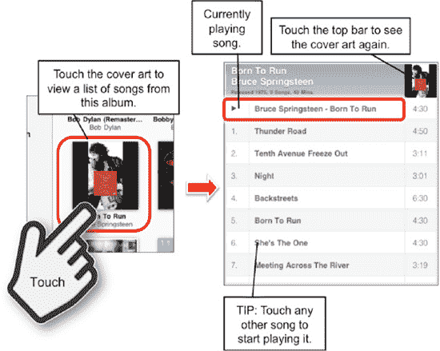

**图 9–3.** *触摸专辑封面即可查看其中的歌曲。*

轻触歌曲列表上方的 `标题栏`，专辑封面将返回到你的音乐库中的原始位置。

**注意：** 这仅在 `专辑` 视图中有效。如果你在 `表演者` 视图中触摸专辑封面，与该封面关联的歌曲将开始播放。

## 播放音乐

现在你已经知道如何找到你的音乐，是时候播放它了！使用前面列出的任何方法找到一首歌或浏览到一个播放列表。只需轻触歌曲名称，它就会开始播放。

此屏幕显示歌曲来源专辑的封面图片，顶部显示歌曲名称。

在屏幕顶部，你会找到 `音量` 滑块条以及 `上一首`、`播放/暂停` 和 `下一首` 按钮。

如果你想查看专辑中的其他歌曲，只需双击专辑封面，屏幕就会翻转以显示该专辑中的其他歌曲。

若只想查看专辑中的歌曲列表，请触摸右下角的 `列表` 按钮。

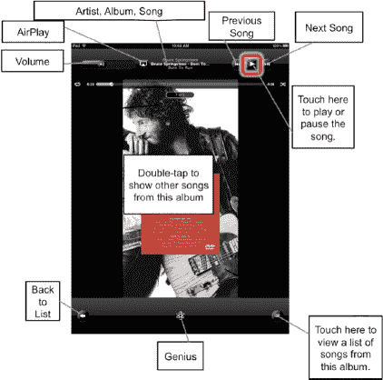

### 暂停和播放

轻触 `暂停` 符号（如果你的歌曲正在播放）或 `播放` 箭头（如果音乐已暂停）来播放或继续播放你的歌曲。

### 播放上一首或下一首歌曲

如果你在播放列表中，触摸 `下一首` 箭头（位于 `播放/暂停` 按钮右侧）将前进到列表中的下一首歌曲。如果你正在按专辑搜索音乐，触摸 `下一首` 将前进到该专辑的下一首歌曲。触摸 `上一首` 按钮则会执行相反操作。

**注意：** 如果歌曲刚开始播放，`上一首` 会带你转到上一首歌曲。如果歌曲已经在播放，`上一首` 会转到当前歌曲的开头（再次轻触则会转到上一首歌曲）。

### 调节音量

在 iPad 上调节音量有两种方式：使用外置的 `Volume` 按钮，或使用屏幕上的 `Volume` 滑块控制。

外置的 `Volume` 按钮位于设备右上侧。按下 `Volume Up` 键（上方按钮）或 `Volume Down` 键可提高或降低音量。调节音量时，你会看到屏幕上的 `Volume` 滑块随之移动。你也可以直接按住 `Volume` 滑块键上下拖动来调节音量。

**提示：** 若要快速静音，请按住 `Volume Down` 键约两秒钟。你也可以双击 `Home` 键，然后将 `App Switcher` 栏向右滑动，以显示音乐控制。如果 `Side` 开关设置为 `Lock Rotation`（请参阅第 7 章），则会出现一个用于静音 iPad 的软键。

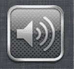

### 在歌曲中重复、随机播放和跳转

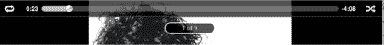

在播放模式下，你只需点击屏幕上的专辑封面任意位置即可激活其他控制。随后你将在顶部看到一个额外的滑块（进度条），以及 `Repeat` 和 `Shuffle` 符号。

#### 跳转到歌曲的其他部分

向右拖动进度条，你会看到歌曲的已播放时间（显示在最右侧）随之变化。如果你要寻找歌曲的某个特定段落，请拖动滑块，然后松开并试听，确认是否定位准确。

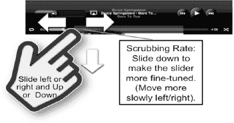

**提示：** 若要让滑块移动得更慢（即进行微调），请将手指向屏幕下方拖动。这被称为*scrubbing rate*（拖拽速率）。

#### 重复播放单首歌曲与重复播放播放列表或专辑中的所有歌曲

若要重复播放当前收听的歌曲，触摸顶部控件左侧的 `Repeat` 符号两次，直到它变为蓝色并显示数字 1。

若要重复播放播放列表、歌曲列表或专辑中的所有歌曲，触摸 `Repeat` 图标直到它变为蓝色（且不显示数字 1）。

若要关闭 `Repeat` 功能，按下图标直到它再次变为白色。

#### 随机播放

如果你在收听播放列表、专辑或任何其他类别的音乐列表，你可能会决定不想按顺序收听歌曲。触摸 `Shuffle` 符号可将音乐重新排列为随机顺序播放。当图标为蓝色时，表示 `Shuffle` 设为 `ON`；图标为白色时，表示设为 `OFF`。

#### Genius

Apple 为 iTunes 提供了一个名为 Genius 播放列表的功能。如果 Genius 功能在 iTunes 中已激活，你将看到右侧栏上显示 `Genius` 符号。

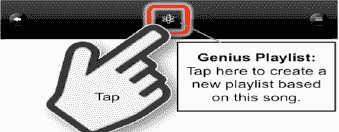

**注意：** 你必须使用电脑上的 iTunes 来启用 Genius 播放列表。请参阅“第 29 章：你的 iTunes 用户指南”了解操作方法。

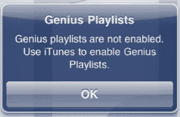

Genius 功能的作用是将与你当前收听歌曲相似的歌曲关联起来，从而创建一个播放列表。与随机的“随机播放”不同，Genius 会搜索你的音乐库，然后创建一个包含 25、50 或 100 首歌曲的新播放列表（你可以在电脑上的 iTunes 中设置 Genius 功能）。

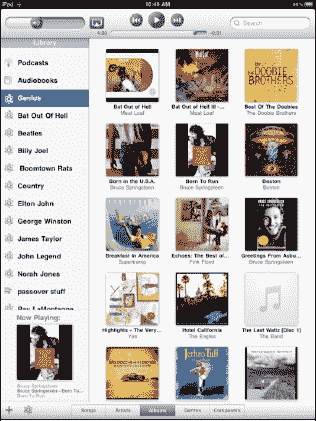

Genius 是混合播放音乐并保持新鲜感的绝佳方式。仅需播放你喜欢的音乐类型，Genius 就能找到一些可能未被收录在你现有播放列表中的冷门歌曲。

**提示：** 若要创建永久的 Genius 播放列表，只需在电脑上的 iTunes 中创建它们，然后同步到你的 iPad。从 iTunes 同步过来的 Genius 播放列表无法在 iPad 本身上进行编辑或更改，但你可以在 iPad 上保存、刷新或删除在 iPad 上创建的 Genius 播放列表。

#### 正在播放

有时，你在浏览播放列表或专辑选项时玩得太投入，以至于深入菜单层级，然后发现自己只想回到当前收听的歌曲。幸运的是，这总是很容易做到，因为在大多数音乐屏幕的左下角，都有一个 `Now Playing` 图标可供点击。

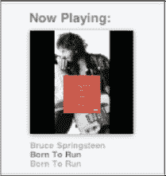

**提示：** 若要返回左下角的小专辑封面视图，请点击屏幕调出控件，然后按下左下角的 `Left Arrow` 返回上一个视图。

#### 查看专辑中的其他歌曲

你可能想收听同一专辑中的另一首歌曲，而不是去播放列表或流派列表中的下一首。

在 `Now Playing` 屏幕的右下角，你会看到一个带有三条横线的小按钮。（如果看不到任何控件，请点击屏幕一次以调出它们。）

点击该按钮，视图将切换到专辑封面小图。屏幕现在会显示该专辑中的所有歌曲。

触摸列表中的另一首歌曲，该歌曲将开始播放。

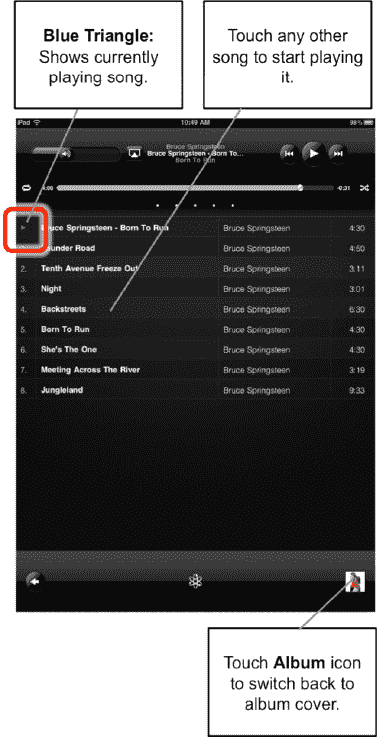

**注意：** 如果你正在播放列表或 Genius 播放列表中，并开始收听专辑中的另一首歌曲，系统不会将你带回原来的播放列表。相反，你需要返回播放列表库，或者点击 `Genius` 来创建一个新的 Genius 播放列表。

### 调整音乐设置

你可以调整多项设置来定制音乐播放体验，使其符合个人喜好。你可以在 `Settings` 菜单中找到这些设置。只需点击 `Home` 屏幕上的 `Settings` 图标即可调出菜单。

在 `Settings` 屏幕的中间位置，点击 `iPod` 标签进入 iPod 音乐设置屏幕。你可以在此屏幕上调整四项设置：`Sound Check`、`EQ`、`Volume Limit` 和 `Lyrics & Podcast Info`。

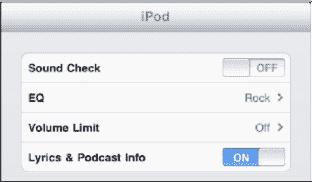

#### 使用 Sound Check（自动音量调节）

**提示：** 由于歌曲的录制音量不同，有时在播放过程中，某首歌曲可能会比另一首歌曲听起来响亮得多。`Sound Check` 可以消除这种情况。如果 `Sound Check` 设置为 `ON`，你所有的歌曲将大致以相同的音量播放。

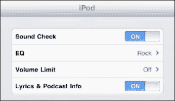

#### EQ（均衡器设置）

声音均衡是非常个人化和主观的。有些人喜欢音乐中有更多低音，有些人喜欢更多高音，还有些人喜欢更夸张的中音。无论你的音乐品味如何，总有一款 `EQ` 设置适合你。

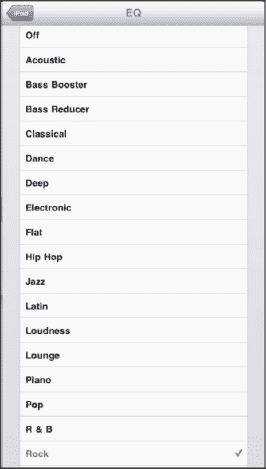

**注意：** 使用 `EQ` 设置可能会在一定程度上降低电池续航能力。

只需触摸 `EQ` 标签，然后选择你最常听的音乐类型，或者选择增强高音或低音的特定选项。尝试一下，享受乐趣，找到最适合你的设置。

#### Volume Limit（以合理音量安全听音乐）

`Volume Limit` 屏幕为家长控制孩子 iPad 的音量提供了一个很好的方法。这也是确保你使用耳机时音量不会过大、从而保护听力的好方法。只需将滑块移动到音量限制位置，然后锁定该限制。

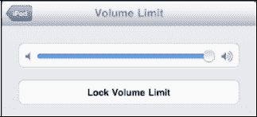

若要锁定音量限制，请触摸 `Lock Volume Limit` 按钮并输入一个四位数的密码。系统会提示你再次输入密码，随后音量限制将被锁定。

