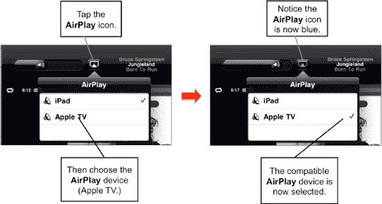
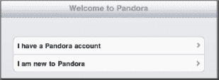
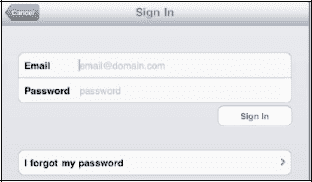
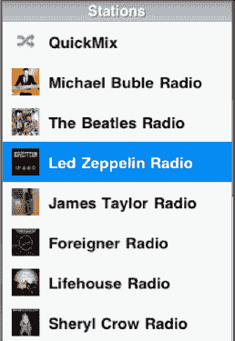
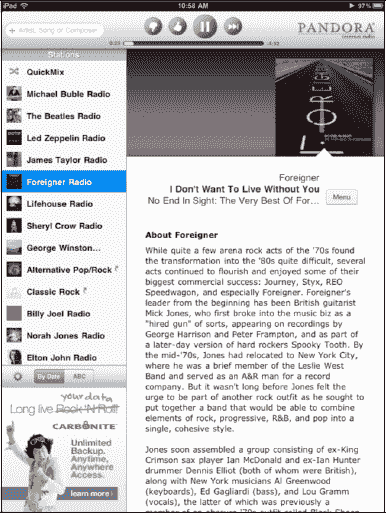
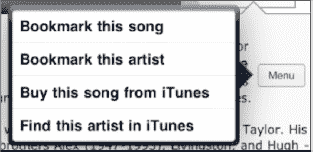
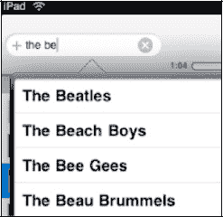
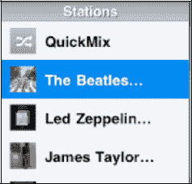

# AirPlay

`AirPlay` 程序是 iPad 内置的另一项苹果专有功能。`AirPlay` 可在多种应用中调用，但此处我们仅关注 `AirPlay` 和 `iPod` 应用。

`AirPlay` 本质上是一种内置的无线音乐流媒体功能，可将音乐流传输到兼容 `AirPlay` 的设备上，例如 Apple TV 或无线扬声器系统。

连接好 Apple TV 后，你可以选择 `AirPlay`，iPad 上播放的任何内容都会自动流传输到你的家庭影院系统中。

使用 `AirPlay` 很简单；请按照以下步骤操作：

1.  启动你的 iPod 应用。
2.  播放任意歌曲或专辑。
3.  触摸 `AirPlay` 图标。
4.  选择你想要发送音乐的 `AirPlay` 设备（参见图 9–5）。

**图 9–5.** *在 iPad 上使用 `AirPlay`*

## 收听免费网络电台 (Pandora)

虽然你的 iPad 能让你以前所未有的方式控制个人音乐资料库，但有时你可能只想“换换口味”听听其他音乐。

**提示：** 一个基础的 Pandora 账户是免费的，与从 iTunes Store 购买大量新歌相比，可以为你节省不少钱。

`Pandora` 源于音乐基因组计划。这是一项浩大的工程。一大群音乐分析师审视了几乎所有录制过的歌曲，然后为每首歌曲开发了一套复杂的属性算法。

**注意：** 当你读到本书时，Pandora 可能会有一些竞争对手。目前有一个名为 `Slacker Personal Radio` 的竞争对手，但未来可能会有更多。如果你想寻找更多选择，可以尝试在 App Store 中搜索“iPad Internet Radio”。另请注意，`Pandora` 是一款仅限于美国的应用程序。`Slacker` 仅在美国和加拿大可用，而 `Spotfly` 在欧洲很流行。希望未来国际用户能有更多选择。

### Pandora 入门

`Pandora` 允许你围绕自己喜欢的艺术家创建独特的个性化电台。最棒的是，它完全免费！

首先，从 App Store 下载 `Pandora` 应用。只需前往 App Store 搜索“Pandora”即可。

现在，触摸 `Pandora` 图标启动应用。

首次启动 `Pandora` 时，系统会要求你创建账户（若已有账户则登录）。只需填写相应信息——需要提供电子邮件地址和密码——你就可以开始设计自己的音乐聆听体验了。

`Pandora` 也适用于 Windows 或 Mac 电脑，以及大多数智能手机平台。如果你已有 Pandora 账户，只需登录即可。

### Pandora 主屏幕

你的电台会列在左侧。只需触摸其中一个电台，它就会开始播放。通常，第一首歌会来自你选择的艺术家本人，后续歌曲则来自风格相似的艺术家。

iPad 的大屏幕让你能看到大量信息。

在页面中间，你会看到艺术家的精美简介，并且会随每首新歌而变化。

左下角的窗口中还会有一个小广告——如果你升级到 `Pandora One`，你会看到一个与 `iPod` 音乐应用中“正在播放”专辑封面非常相似的窗口。

### 在 Pandora 中点赞或踩

如果你喜欢某首特定歌曲，触摸 `点赞` 图标，你将听到更多来自该艺术家的歌曲。

相反，如果你不喜欢此电台中的某位艺术家，触摸 `踩` 图标，你将不会再听到该艺术家的歌曲。

你也可以暂停歌曲稍后再回来听，或者跳过当前曲目，播放下一个选择。

**注意：** 使用免费 Pandora 账户时，你每小时可以跳过的次数是有限的。你还会偶尔听到广告。要消除这些限制，可以升级到付费的 Pandora One 账户，下文会稍作说明。

### Pandora 菜单

在简介右上方有一个 `菜单` 按钮。触摸它，你可以收藏艺术家或歌曲，或者前往 iTunes Store 购买该艺术家的音乐。

### 在 Pandora 创建新电台

只需触摸左上角显示 `艺术家、歌曲或作曲家` 的 `搜索` 窗口，并输入艺术家、歌曲或作曲家的名称。

找到你想找的内容后，触摸该选择项，`Pandora` 会立即围绕你的选择开始构建电台。

然后你会看到新电台与你的其他电台一起列出。

在 Pandora 中你可以创建多达 100 个电台。

**提示：** 你可以通过点击屏幕左下角的 `按日期` 或 `ABC` 按钮来整理你的电台。

