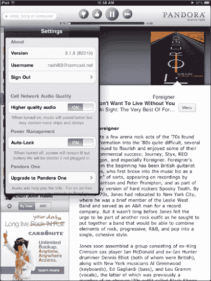
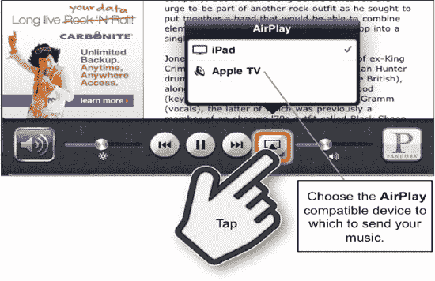

# 调整 Pandora 的设置——账户、升级等功能

你可以通过点击屏幕左下角的**设置**图标（参见图 7-5），退出你的 Pandora 账户、调整音频质量，甚至升级到 **Pandora One**（可去除广告）。

**图 9–6.** *在 **Pandora** 中设置选项*

要退出账户，请点击你的账户名称。

要调整音质，请将**蜂窝网络音频质量**下的开关移至**开**或**关**。当你在蜂窝网络下时，最好将其设置为**关**；否则，播放时可能会出现更多卡顿和中断。

**注意：**你只能在 iPad + 3G 型号上调整**蜂窝网络音频质量**。

当你连接的是强 Wi-Fi 信号时，可以将其设置为**开**以获得更佳音质。了解更多关于各种连接的信息，请参见第 5 章：“Wi-Fi 和 3G 连接”。

为了节省电池寿命，你应将**自动锁定**设置为**开**，这是默认设置。如果你希望屏幕保持常亮，则将此开关切换至**关**。

要移除所有广告，请点击**升级到 Pandora One** 按钮。一个浏览器窗口将打开，你会被引导至 Pandora 网站输入信用卡信息。在本书出版时，年度账户费用为 36.00 美元，但当你读到本书时，价格可能已有所不同。

## 在 Pandora 中使用 AirPlay

你可以神奇地将音乐从 **Pandora** “发送”到任何兼容 **AirPlay** 的设备，就像之前在 **iPod** 应用中操作一样。唯一的区别是，要访问 **AirPlay** 控制，你需要调出**应用切换器**栏。

请按照以下步骤操作：

1.  双击**主屏幕**按钮调出**应用切换器**栏。
2.  将**应用切换器**栏从左向右滑动，以显示**音乐**控制。如果你打开了多个应用，可能需要滑动多次。
3.  在**音乐**控制中触摸 **AirPlay** 图标，并选择兼容 **AirPlay** 的设备来发送你的音乐。

**图 9–7.** *在 **Pandora** 中使用 **Airplay***

