# 观看视频、电视节目等

iPad 是一款惊人的“媒体消费”设备。这一点在各种可用的视频观看应用中表现得尤为明显。

在本章中，我们将向你展示如何在 iPad 上观看电影、电视节目、播客和音乐视频。你可以从 iTunes 商店或 iTunes U（iTunes 大学）免费购买或下载此类内容。你还可以将你的 iPad 关联到 Netflix 账户（并且很可能很快就能关联到其他视频租赁服务），从而让你能够观看流媒体电视节目和电影。

使用你的 iPad，你还可以在 Safari 浏览器中观看 YouTube 视频和来自网页的视频，以及通过像 App Store 中的 **ABC** 应用等各种应用来观看。

**注意：**某些应用（例如加拿大的 **Global**）是每个地区独有的。视频应用可能因地区而异，请查看你当地的 App Store，并务必搜索本地电视网络名称，例如 ABC 或 Global。

### 将 iPad 用作视频播放器

iPad 不仅仅是一台出色的音乐播放器；它还是一套出色的便携式视频播放系统。它的宽屏、快速的处理器和优秀的操作系统，让观看音乐视频、电视节目甚至全长电影都成为一种真正的享受。iPad 的大小非常适合在坐靠椅背休息时或是在飞机上观看节目。它也非常适合长途驾车旅行时后座上的孩子们。十小时的电池续航意味着你甚至可以在跨海岸飞行途中都不会耗尽电量！你还可以为你的汽车购买一个*电源逆变器*，让 iPad 充电更持久（更多信息请参见第 1 章中的“为 iPad 充电及电池提示”部分）。

#### 将视频加载到 iPad

你可以像加载音乐一样，使用你电脑上的 iTunes 或直接通过 iPad 上的 **iTunes** 图标将视频加载到你的 iPad。

如果你在电脑上从 iTunes 购买或租借了视频和电视节目，那么你可以手动或自动将它们同步到你的 iPad。

#### 在 iPad 上观看视频

要在 iPad 上观看视频，请点击**视频**图标，该图标通常位于**主屏幕**屏幕的第一页图标上。

**注意：**你也可以从 **YouTube** 图标、**Safari** 图标以及你从 App Store 下载的其他视频相关应用观看视频。

##### 视频分类

你可以在**视频**屏幕的顶部看到几个分类按钮：**电影、电视节目**、**播客**和**音乐视频**。

**注意：**如果你开启了家庭共享（参见第 9 章），你还会看到一个**共享**按钮。

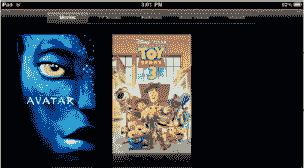

默认视图是**电影**视图；如果你的 iPad 上加载了任何电影，它们将会显示出来。

你可能看到更多或更少的分类，这取决于你加载到 iPad 上的视频类型。如果你只有**电影**和 **iTunes U** 视频，那么你将只看到这两个分类按钮。触摸其他任何一个分类都可以显示该分类对应的视频。

##### 播放电影

只需简单触摸你想要观看的电影，它就会开始播放（参见图 10-1）。大多数视频都会利用 iPad 相对较大的屏幕，以**宽屏**（也称为**横向**）模式播放。只需转动你的 iPad 即可观看它们。

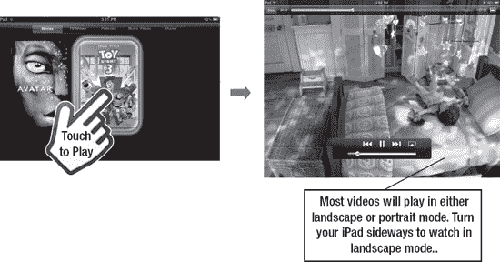

**图 10–1.** *播放视频*

当视频开始播放时，屏幕上只会看到那个视频；你不会看到任何菜单、控制或其他内容。

###### 暂停或访问控制

触摸屏幕上的任意位置，控制条和选项将会显示出来（参见图 10–2）。大多数控制与**音乐播放器**应用中的类似。点击**暂停**按钮，视频就会暂停。

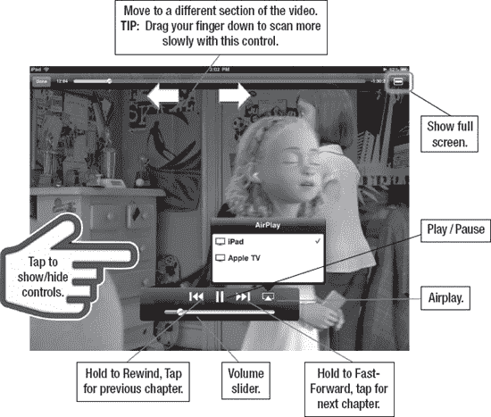

**图 10–2.** * **视频** 应用的控制*

###### 快进或快退视频

你可以在**播放/暂停**按钮的两侧看到**视频**应用常见的**快进**和**快退**按钮。要跳转到视频中下一个特定章节的部分，只需按住**快进**按钮（位于**播放/暂停**按钮右侧）。当到达视频中期望的位置时，松开**快进**按钮。视频将开始正常播放。

要倒回到视频开头，请点击**快退**按钮。要倒回到特定部分或位置，请按住**快退**按钮，就像快进视频时一样。

**注意：**如果你正在观看一部包含多个章节的全长电影，点击**后退**或**快进**将逐章后退或前进。

###### 使用时间滑块条

在视频屏幕的顶部有一个滑块，显示视频已播放的时间。如果你确切（或大致）知道你想观看视频中的哪个时间点，只需按住并拖动滑块到该位置。有些人觉得这比一直按住**快进**或**快退**按钮更精确。

**提示：**向下拖动手指可以更慢地移动滑块。换句话说，先触摸**滑块**控件，然后将手指向下拖动到屏幕下方——请注意，手指在屏幕上向下拖动得越远，滑块左右移动的速度就越慢。

###### 更改视频尺寸（宽屏 vs. 全屏）

你观看的大多数视频都会以宽屏格式播放。不过，如果某个视频未针对你的 iPad 进行转换，或未针对其屏幕分辨率进行优化，你可以轻触位于上方`状态`栏右侧的`展开`按钮。

你会注意到有两个箭头。如果处于`全屏`模式，箭头指向内侧，相对而向。如果处于`宽屏`模式，则箭头指向外侧，背向而离。

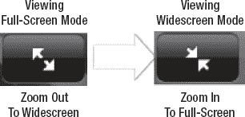

在未占满 iPad 整个屏幕的宽屏电影中，轻触`展开`按钮会略微放大画面。再次轻触则会缩小。

**注意：** 你还可以*双击*屏幕来放大并填满屏幕。请注意，就像在宽屏电视上一样，强制将非宽屏视频以宽屏格式播放，有时可能会导致画面部分缺失。

###### 使用章节功能

从 iTunes Store 购买的大多数完整电影，以及一些经过转换可供 iPad 播放的电影，都会提供章节功能。此功能让你在 iPad 上观看电影的感觉，非常像在家用电视上观看 DVD。

只需轻点屏幕调出视频控制项，然后选择`完成`。

这样会将你带回到电影的主页面。

轻触右上角的`章节`按钮，滚动到你想要观看的章节，然后轻触它。

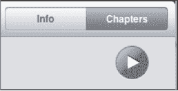

####### 查看章节

你可以快速滚动或滑动来定位你想观看的场景或章节。

你还会注意到，每个章节图像右侧会显示该章节开始的确切时间（相对于电影开始时间）。

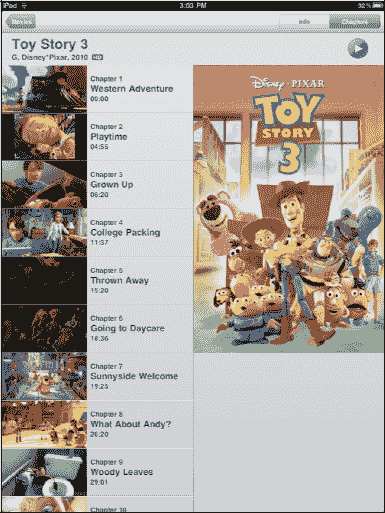

除了前面提到的章节菜单，你还可以通过轻触`快退`或`快进`按钮，快速跳转到电影中的前一个或后一个章节。轻触一次即可向前或向后移动一个章节。

**注意：** 章节功能通常仅适用于从 iTunes Store 购买的电影。经过转换并加载到 iPad 上的电影通常不支持章节功能。

##### 观看电视节目

iPad 非常适合观看你喜爱的电视节目。你可以从 iTunes Store 购买电视节目。也可以从一些 iPad 应用（如`ABC`应用）下载节目样片。

只需轻触顶部的`电视节目`标签，即可查看已下载到 iPad 上的节目。滚动浏览可用的节目，然后轻触`播放`。视频控制项的操作方式与电影控制项相同。

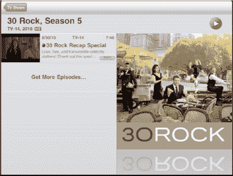

##### 观看播客

我们通常认为播客是可以通过 iTunes 下载的纯音频广播。但现在视频播客非常普遍，可以在许多网站上找到，包括许多公共广播网站和 iTunes U。后者通过 iTunes 提供大学播客及其他学校相关信息的列表。

以下是 Gary Mazo 讲述的一个关于 iTunes U 的故事：

“最近，我和刚被加州理工学院录取的儿子一起在 iPad 上的`iTunes`应用里浏览`iTunes U`版块。我们当时想知道住宿情况，你瞧，我们发现了一个展示加州理工学院宿舍参观之旅的视频播客。我们下载了它，这个播客就直接进入了播客目录，方便日后观看。我们足不出户，无需从东海岸飞到学校所在的加州，就完成了一次完整的虚拟住宿参观。”

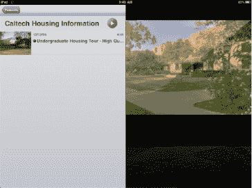

##### 观看音乐视频

你可以通过多种来源在 iPad 上观看音乐视频。通常，如果你从 iTunes 购买了一张*豪华*专辑，它可能会附带一两个音乐视频。你也可以从 iTunes Store 购买音乐视频，许多唱片公司和录音艺术家也会在其网站上免费提供这些视频。

音乐视频会自动归类到`视频`应用的`音乐视频`部分。

轻触`音乐视频`标签，然后开始播放视频。控制项的操作方式与所有其他视频应用一致。

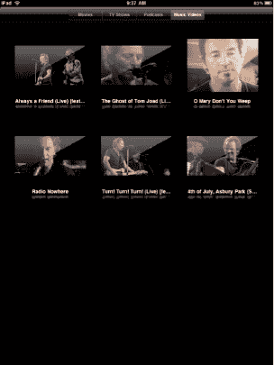

##### 视频选项

与音乐播放器一样，你也可以为视频播放器调整一些选项。这些选项可通过`主屏幕`上的`设置`图标进行访问。

轻触`设置`图标，然后向下滚动并轻触`视频`选项。

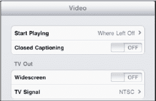

###### 开始播放选项

有时，你可能需要中断观看某个特定视频。`开始播放`选项可让你决定下次想观看该视频时如何操作。你的选项包括从头开始观看，或从上次中断处继续观看。只需选择你想要的选项，这将成为`视频`应用今后采取的操作。

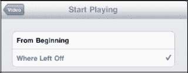

###### 隐藏式字幕

如果你的视频支持隐藏式字幕功能，当此开关转至`开`时，屏幕上将显示隐藏式字幕。

###### 电视输出：宽屏

市面上有许多第三方设备，可以让你在外部设备（如电视或电脑屏幕，甚至是模拟超大屏幕观看效果的视频眼镜阵列）上观看 iPad 中的视频。大多数此类选项要求将`电视输出`选项下的`宽屏`设置设为`开`。默认情况下，该设置为`关`。

**提示：** 你可以购买一个 VGA 适配器，将 iPad 连接到 VGA 电脑显示器上来观看电影。此外，Apple 现在也提供 HDMI 适配器。

更多信息，请参见快速入门指南中的“配件”部分。

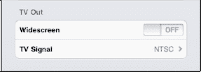

###### 电视信号

有一些高级方法，可以使用合适的线缆将 iPad 中的内容传输到电视或 DVR 上播放。你还需要设置正确的电视信号。通常，仅当你在其他国家/地区使用 iPad 时才需要更改此设置。如果你住在美国，你的电视使用 NTSC 标准。

然而，大多数欧洲国家使用 PAL。如果你不确定自己使用的是哪种标准，请联系你的电视、有线电视或卫星电视公司。

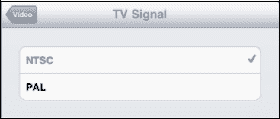

##### 删除视频

要删除视频（以节省 iPad 上的空间），只需选择你要从中删除视频的类别——就像你在本章开头所做的那样（参见图 10-3）。

**注意：** 如果你正在从 iTunes 同步视频，请确保也在那里取消勾选，否则 iTunes 可能会在下一次同步时将其重新同步回 iPad！

接下来，长按你想要删除的特定视频。就像删除应用时一样，其左上角会出现一个黑色的小`×`。轻触`×`，系统会提示你确认删除视频。

轻触`删除`按钮，该视频将从你的系统中删除。

**注意：** 这只会从你的 iPad 上删除该视频——如果你想日后将其重新加载到 iPad 上，iTunes 的影片库中仍会保留一份副本。但是，如果你删除了 iPad 上已租借的电影，它将被永久删除！

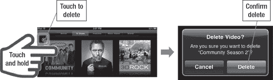

**图 10-3.** *删除视频*

