# AirPlay

`AirPlay` 是 iPad 内置的另一项苹果专有功能。`AirPlay` 在许多应用中都可用，但此处我们仅探讨 `AirPlay` 与 `Videos` 应用的配合使用。

`AirPlay` 本质上是一种内置的无线流媒体功能，可将音乐流传输至兼容 `AirPlay` 的设备，例如 Apple TV 或无线音响系统。

连接 Apple TV 后，你可以选择 `AirPlay`，iPad 上正在播放的内容将自动串流到电视或家庭影院设备上。

使用 `AirPlay` 的操作非常简单，只需遵循以下步骤：

1. 启动 `Videos` 应用。
2. 播放任意电影、电视节目或播客。
3. 点击 `AirPlay` 图标。
4. 选择要发送音乐的 `AirPlay` 设备（参见图 10–4）。

**图 10–4.** *在 iPad 上使用 `AirPlay`*

#### 家庭共享

今年 iPad 新增了一项功能，即通过苹果的专有 `Home Sharing`（家庭共享）功能共享您的家庭 iTunes 资料库。

本质上，`Home Sharing` 允许您在 iPad 上浏览并播放家庭资料库（通常位于您的台式电脑或网络驱动器上）中的任何内容。

首先，按照第 9 章中的说明设置 `Home Sharing`。此时，如前所述，将出现 `Shared`（共享）按钮。点击 `Shared` 按钮，您将看到网络驱动器上存储的所有视频，并可在 iPad 上观看。

### iPad 上的 YouTube

如今，在电脑上观看 YouTube 视频无疑是人们最常做的事情之一。而 YouTube 离您仅有一台 iPad 的距离。

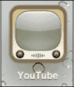

您可以在 `Home`（主屏幕）上直接找到 `YouTube` 图标。只需点击 `YouTube` 图标，即可进入 `YouTube` 应用。

#### 搜索视频

首次启动 `YouTube` 应用时，您通常会看到 YouTube 当天的 `Featured`（精选）视频。

现在，您可以像在其他应用中一样，滚动浏览视频选项。

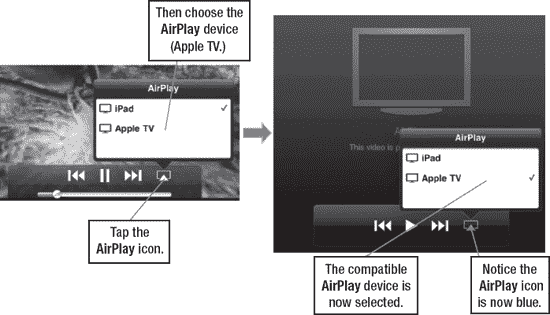

#### 使用底部图标

您可以在 `YouTube` 应用底部看到七个图标：`Featured`（精选）、`Top Rated`（最高评分）、`Most Viewed`（最多观看）、`Favorites`（收藏）、`Subscriptions`（订阅）、`My videos`（我的视频）和 `History`（历史记录）。每个图标的功能不言而喻。

要查看 YouTube 当天推荐的视频，请点击 `Featured`（精选）图标。要查看在线观看次数最多的视频，请点击 `Most Viewed`（最多观看）图标。

观看完特定视频后，您可以将其设为 `YouTube` 上的收藏，以便日后轻松查找。如果您设置了书签，点击 `Favorite`（收藏）图标时它们就会显示出来。

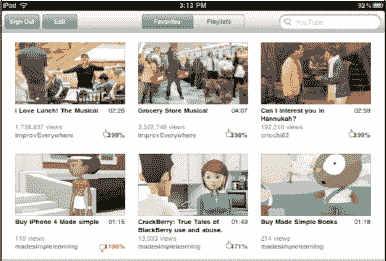

您还可以搜索 YouTube 海量的视频库。像在之前的应用中一样，点击搜索框，键盘便会弹出。接着，输入一个短语、主题甚至视频名称。

在本示例中，我正在寻找最新的 Made Simple Learning 视频教程。我输入"Made Simple Learning"来查看可观看的视频列表。

当找到想看的视频时，我可以点击它以查看更多信息。我甚至可以在播放期间点击视频，然后选择 `竖屏` 模式下可用的`赞`或`踩`按钮来为视频评分。

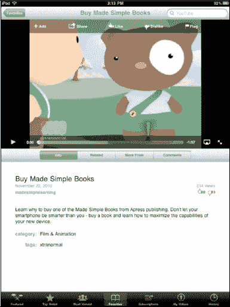

#### 播放视频

做出选择后，点击您想观看的视频。您的 iPad 将开始在`竖屏`或`横屏`模式下播放 YouTube 视频（参见图 10–5）。

**注意**：YouTube 视频上也会出现 `AirPlay` 图标。只需点击 `AirPlay` 图标，即可将视频直接发送到您的 Apple TV 或其他 `AirPlay` 设备。

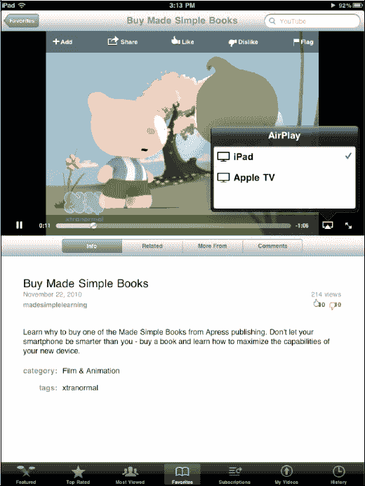

**图 10–5.** *在`竖屏`模式下播放视频*

#### 视频控制

视频开始播放后，屏幕上的控制项会消失，因此您只能看到视频。要在视频播放期间停止、暂停或激活其他选项，只需轻点屏幕即可（参见图 10–6）。

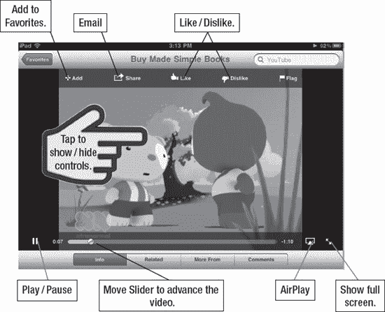

**图 10–6.** *YouTube 内的选项*

屏幕上的选项与观看其他任何视频时看到的非常相似。底部是`滑块`控制条，显示您在视频中的播放位置。要跳到视频的另一部分，只需拖动滑块。

要快进视频，只需长按`快进`箭头。要快速后退，长按`后退`箭头。要跳转到 YouTube 列表中的下一个视频，请点击`快进/下一个`箭头。要观看列表中的上一个视频，请点击`后退/上一个`箭头。

要设置收藏，请点击`收藏`图标。

要通过电子邮件发送视频，请点击`分享`图标。您的电子邮件正文将以视频链接开头。接着，输入收件人；您将在第 13 章中了解更多关于通过电子邮件发送邮件和附件的知识。

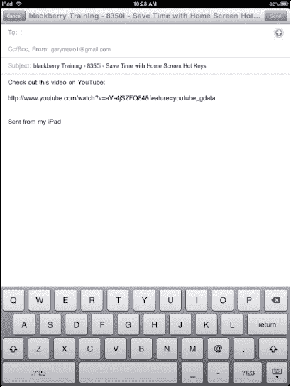

#### 查看和清除历史记录

点击页面右下角的`历史记录`图标

您最近观看过的视频将会显示出来。

如果您想清除历史记录，只需点击左上角的`清除`按钮。

要观看历史记录中的视频，点击它即可开始播放。

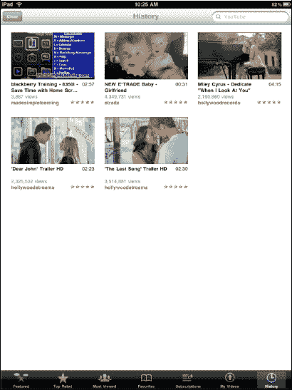

### iPad 上的 Netflix

近年来，Netflix 已发展成为消费者视频租赁的主要来源。最近，Netflix 增加了视频*流媒体*服务，可将内容无线传输到电脑以及其他电视机上盒设备。

现在，iPad 用户可以通过 App Store 中的 `Netflix` 应用使用 Netflix。

如第 21 章：“神奇的 App Store”所示，前往 App Store 并搜索 Netflix 应用。

选择`下载`按钮（该应用免费），您就可以开始使用了。

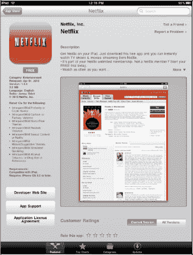

你需要一个有效的 Netflix 账户才能使用此服务，因此请在启动应用时创建一个账户，或者如果您已有账户，直接登录即可。

`Netflix` 应用的精妙之处在于，您可以将 DVD 添加到队列中，让他们寄送给您。您还可以即时观看电视节目和电影——直接流式传输到 iPad 上。

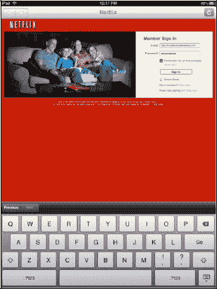

浏览 Netflix 非常简单，就像在电脑上使用 Netflix 一样。顶部有一个标签栏，包含`即时观看电影`、`即时观看电视节目`、`浏览 DVD`和`您的队列`。

当您做出选择后，您将看到最近观看过的内容（以便继续观看），以及根据您建立 Netflix 账户时选择的偏好设置而定的视频类别。

每行视频都有一个`查看更多`标签，用于显示更多选项。如果找不到想要的内容，只需点击底部的`搜索`按钮，然后输入电影、演员、导演或类型名称。

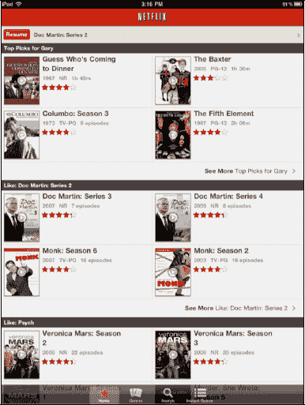

一旦找到想看的电影或电视节目，点击`立即播放`，电影将开始流式传输到您的 iPad 上。视频控件类似于 iPad 上所有其他视频播放应用的控件；但是，目前 Netflix 中没有 `AirPlay` 选项。

**注意：** Netflix 会消耗大量数据，因此如果您通过 Wi-Fi 进行流式传输，请确保有强劲的 Wi-Fi 信号。或者，如果您使用 3G 蜂窝数据，请确保您有足够的数据套餐。

### 观看其他电视节目

新应用总在推出，观看其他电视网节目和电影的新选项也层出不穷。这一领域变化非常迅速；当你读到这部分内容时，将会有更多电视节目可供观看，并且每个月都会有新内容加入。

发布初期的最佳选择之一是`ABC`应用，你可以在 App Store 免费下载。

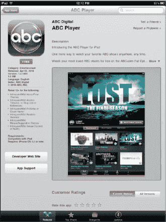

下载该应用后，你喜爱的 ABC 电视节目即可进行流媒体播放。ABC 会流式传输其最受欢迎的节目，并提供多集完整剧集。`ABC`应用也会消耗大量流量，因此，在流式播放电视节目前，请确保你拥有良好的 Wi-Fi 连接或无限流量的 3G 套餐。

#### 在 iPad 上使用 Hulu

近年来，Hulu 已成为将内容以流媒体方式无线传输到电脑和电视其他机顶盒的主要来源。

初代 iPad 发布后不久，`Hulu Plus`应用就在 App Store 上架了。Hulu Plus 是一项订阅服务，每月收费`$7.99`，但也提供免费内容。

订阅该服务的完整套餐后，你正在观看或曾经看过的几乎所有电视节目的每一集，都可以在你的 iPad 上流式播放。

启动应用后，你会在顶部看到五个图标：`免费图库`、`主页`、`电视`、`电影`和`搜索`。

滚动`免费图库`可查看当前有哪些节目可以免费观看。

轻点一个节目，它会立即开始播放。将 iPad 保持在`横屏`模式，可使视频填满屏幕。

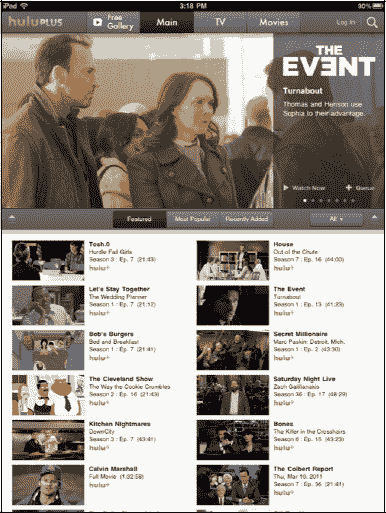

#### 搜索视频

轻点底部的`搜索`图标，然后输入特定电视节目的名称。你也可以浏览`精选`或`热门`分类。找到你想要的节目后，所有可用的视频都将可供观看。

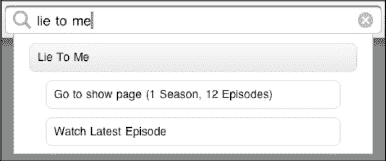

**注意：** 如果你没有 Hulu Plus 订阅，将无法观看这些视频。

##### 选择观看内容

轻点中间一排图标中的任意一个，可以查看`精选`、`最受欢迎`或`最新添加`的视频。

轻点`全部`标签，可以在`剧集`、`电影`或`剪辑`之间进行选择。

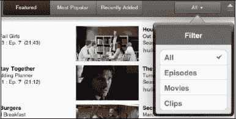

##### Hulu Plus 中的视频控制

`Hulu Plus`应用中的视频控制略有不同。在观看节目时轻点屏幕，就像观看其他任何视频一样，视频控制控件会如图 Figure 10–7 所示显示。

左侧有一个`播放/暂停`按钮，以及一个视频时间轴。只需沿着时间轴拖动手指，即可跳转到视频的另一个部分。

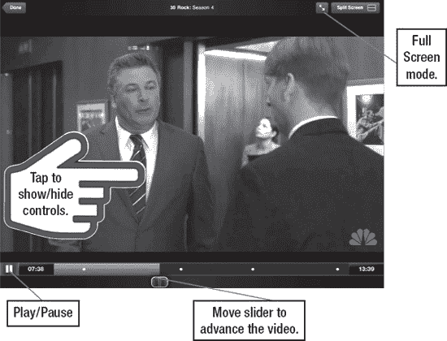

**Figure 10–7.** *`Hulu Plus`应用中的视频控制*

**注意：** 你无法在`Hulu Plus`中跳过广告。在广告播放期间，右上角会出现一个类似`分享`图标的图标。 如果你轻点此图标，将会跳转到广告商的网站。

**警告：** `Hulu Plus`会消耗大量流量，因此请确保你拥有稳定的 Wi-Fi 信号。

## 第 11 章

## 使用 Safari 上网

现在，我们将带你了解在 iPad 上能做的最有趣的事情之一：上网冲浪。你可能听说过，在 iPad 上上网比以往任何时候都更亲密——我们同意！我们将向你展示如何通过 iPad 上的 Safari，以前所未有的方式进行触摸、缩放和与网页互动。你将学习如何设置和使用书签，通过搜索引擎快速查找内容，打开并在多个浏览器窗口间切换，甚至轻松地从网页中复制文本和图形。

### 在 iPad 上浏览网页

你可以通过 Wi-Fi 或 iPad 的 3G 连接（在 Wi-Fi + 3G 机型上）随心所欲地浏览网页。许多人认为，iPad 提供了目前最强大的移动浏览体验。网页看起来非常像你在电脑上看到的网页。借助 iPad 的缩放功能，你甚至不必担心较小的屏幕尺寸会限制你的浏览体验。简而言之，在 iPad 上浏览网页是一种更加个性化的体验。

你可以选择纵向或横向模式浏览。你也可以通过双击或捏合展开来快速放大视频，这对你来说很自然，因为缩放文本和图形也是同样的操作。

**为什么有些视频和网站无法显示？（需要 Flash Player）**

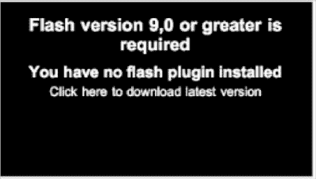

一些网站是使用 Adobe Flash Player 设计的，但截至本书出版时，iPad 尚不支持 Adobe Flash。苹果似乎已决定不支持 Flash Player。如果你轻点一个视频但无法播放，或者看到类似“需要 Flash 插件”、“下载最新的 Flash 插件以观看此视频”或“需要 Adobe Flash 才能查看此站点”的信息，你将无法观看该视频或网页。

现在，App Store 中有一些浏览器，如`Skyfire`和`iSwifter`，它们会在服务器端将 Flash 转码为 H.264 视频，因此可以在 iPad 上使用。

### 需要网络连接

你需要在 iPad 上拥有有效的互联网连接——无论是 Wi-Fi 还是 3G（蜂窝数据）——才能上网。请参阅第 5 章的“连接”部分了解更多信息。

#### 启动网页浏览器

你可以在`主屏幕`上找到`Safari`图标；这就是你的网页浏览器。通常，`Safari`图标位于`底部 Dock 栏`的左下角。

轻点`Safari`图标，你将进入浏览器的首页。通常，这会是苹果的 iPad 页面。

当你找到喜欢的网站时，可以设置书签以便日后轻松跳转到这些网站。我们将在本章后面部分向你展示如何操作。

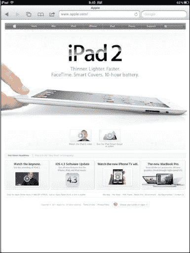

#### Safari 网页浏览器屏幕布局

图 11-1 展示了网页在 Safari 中的显示效果，以及你可以在浏览器中执行的不同操作。

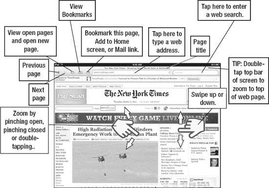

**图 11-1.** *Safari 网页浏览器页面布局*

查看屏幕时，请注意`地址栏`位于屏幕的左上角。它显示当前的网址。右侧是`搜索`窗口。默认情况下，这设置为 Google 搜索，但你可以根据需要更改。

屏幕顶部有五个图标：`后退`、`前进`、`打开页面`、`书签`和`操作`按钮。

#### 输入网址

你首先需要学习的是如何访问你最喜欢的网页。就像在电脑上一样，你需要在浏览器中输入网址（URL）。首先，轻点浏览器顶部的`地址栏`，如图 Figure 11-2 所示。键盘会弹出，浏览器窗口会展开。开始输入网址，然后按`前往`键以转到该页面。

**提示：** 记得使用底部的冒号、斜杠、下划线、点号和`.com`键以节省时间。

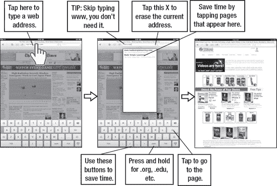

**图 11-2.** *输入网址*

**提示：** 长按`.com`键可查看所有选项：`.org`、`.edu`、`.net`、`.de` 等。

#### 在打开的网页中向前或向后导航

现在你已经掌握了输入网址的方法，可能会在不同的网站间跳转。**前进**和**后退**箭头可以让你轻松地向任一方向导航到最近访问过的页面，如图 11-3 所示。如果**后退**箭头呈灰色，你可以参考下面关于使用**打开页面**按钮的内容。

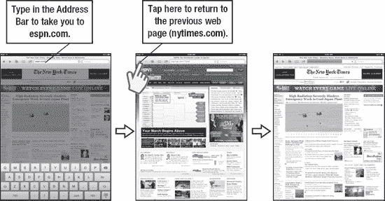

**图 11-3.** *返回之前浏览过的网页*

假设你正在查看《纽约时报》网站上的新闻，然后跳转到 ESPN 查看体育比分。要回到《纽约时报》页面，只需点击**后退**箭头。要再次返回 ESPN 网站，请点击**前进**箭头。

#### 在网页之间移动

有时，当你点击一个链接时，你正在查看的网页会移至后台，并弹出一个包含新内容（另一个网页、视频等）的新窗口。在这种情况下，新浏览器中的**后退**箭头可能不起作用！

相反，你需要点击**打开页面**图标（就在箭头右侧）来查看已打开网页的列表，然后点击你想要的那个页面。在图 11-4 中，我们点击了一个链接，该链接打开了一个新的浏览器窗口。返回旧窗口的最佳方法是点击**打开页面**图标并选择所需的页面。

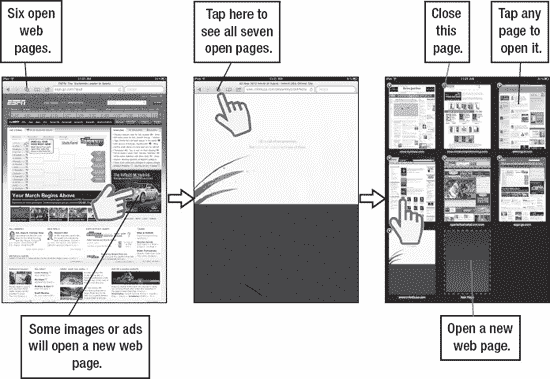

**图 11-4.** *在打开的网页之间跳转*

#### 跳转到网页顶部

有些网页可能很长，这会使往回滚动到页面顶部变得有些费力。一个简单的小技巧是点击网页的黑色标题栏，你就会自动跳转到页面顶部，如图 11-5 所示。

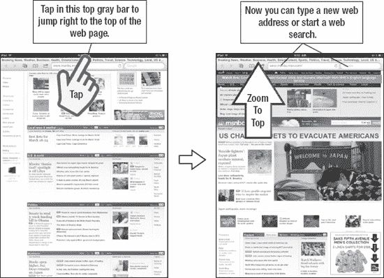

**图 11-5.** *点击顶部快速跳转到网页顶端*

#### 通过电子邮件发送网页

有时你发现某个页面非常吸引人，以至于非把它发给朋友不可。点击**地址栏**旁边的**操作**按钮，然后选择**邮件链接到此页面**（参见图 11-6）。这会创建一封包含该链接的电子邮件，你可以将其发送出去。

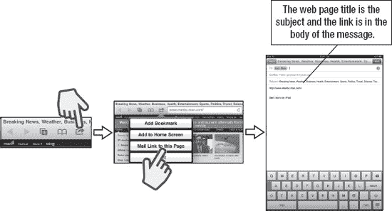

**图 11-6.** *通过电子邮件发送网页链接*

#### 如何打印网页

iPad 现在内置了**打印**命令。如果你有一台支持 **AirPrint** 的打印机（兼容打印机的完整列表可在[`www.apple.com/ipad/features/airprint.html`](http://www.apple.com/ipad/features/airprint.html) 找到），只需将打印机连接到你的家庭网络，然后在点击**操作**按钮时从显示的菜单中选择**打印**。如果你没有支持 AirPrint 的打印机，你仍有几种选择，但没有一种像 AirPrint 那样简单。

**注意：** iPad 和打印机需要在同一个 Wi-Fi 网络上。换句话说，iPad 不能使用 3G 网络。

*方法 1：* 将网页链接通过电子邮件发送给自己或同事，然后从该打印机打印。如果你正在旅行并入住带有商务中心的酒店，你可以将链接发送给商务中心或前台的人员来打印该页面。

*方法 2：* 从 App Store 购买一个网络打印应用，该应用允许你打印到网络打印机。当然，这只有在你能访问网络打印机时才有效。最好在你的家庭或办公网络中进行此操作，并寻求设置帮助，因为这可能相当有挑战性。

### 添加书签

就像在你的家用电脑上一样，你可以在 iPad 上设置书签。要添加新书签，只需点击网页屏幕顶部的加号（`+`）。

点击 后，你会看到三个选项。选择**添加书签**以添加新的书签。

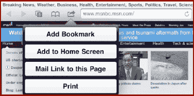

添加新书签后，你可以编辑其名称（网页地址显示在编辑窗口下方）。你还可以选择希望书签所在的文件夹。默认情况下，它会放在你的**书签**文件夹中，但你可以将其放在任何可用的文件夹中，例如“新闻”或“热门”。

按下**存储**以保存更改。

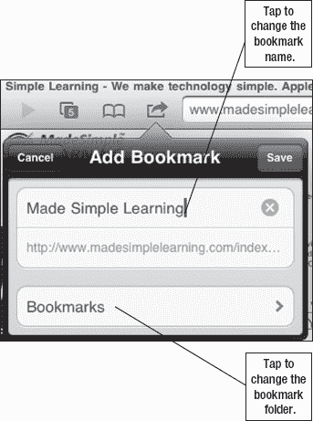

**提示：** 如果你将书签添加到书签栏，当你激活 URL 字段时，它就会出现。与桌面版 Safari 类似，它会给你一个网站的下拉菜单——对于快速找到你要去的地方非常方便。

#### 使用你的书签

设置好书签后，只需从任意网页点击**书签**图标即可查看它们。

当你点击**书签**图标时，你会找到用于**历史记录**、**书签栏**和**书签菜单**的标签。在这些标签下，你会看到 iPad 预装的书签。

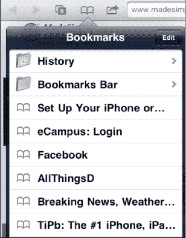

你添加的书签默认会进入**书签栏**，除非你指定了其他位置。

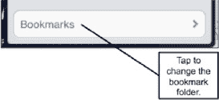

**提示：** 创建书签时，点击书签名下的**文件夹**名称，可以调整存储书签的文件夹。

### 搜索网络

有时，你需要搜索特定主题、项目或网页。在 iPad 上搜索网络再简单不过了。

以下步骤向你展示如何在 **Safari** 设置中设置默认搜索引擎。当你第一次拿到 iPad 时，默认搜索引擎是 Google。

**搜索栏**就在网址栏旁边。要执行网络搜索，请遵循以下步骤：

1.  点击**搜索栏**，键盘将会出现。
2.  输入你想要搜索的名称、网站或主题。
3.  如果出现匹配项，只需点击它即可跳转到该页面，或点击键盘上的**搜索键**。
4.  你的搜索结果将使用默认搜索引擎显示（参见图 11-7）。

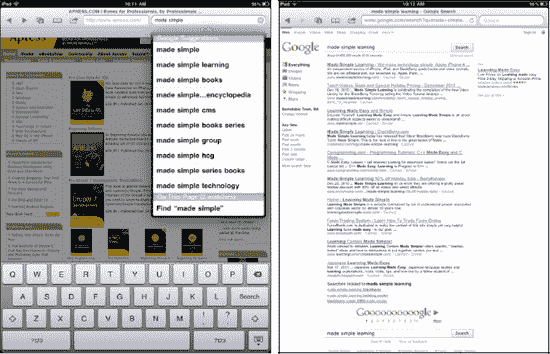

**图 11-7.** *使用 Safari 中的搜索栏执行网络搜索*

**提示：** 搜索结果底部还有“在此页面中”的列表，可让你在当前 Safari 中加载的网页上查找词语（类似于桌面上的 `cmd/ctl+F`）。

### 将网页图标添加到主屏幕

如果你喜欢某个网站或页面，可以非常轻松地将其作为图标添加到你的**主屏幕**。这样，你就可以即时访问该网页，而无需经过 Safari  的**书签** 选择书签的流程。通过将图标放在**主屏幕**上，你可以省去很多步骤（参见图 11-8）。这对于快速启动网络应用（例如来自 Google 的 Gmail 或 Buzz）或网络应用游戏尤其有用。

以下是添加图标的步骤：

1.  点击浏览器顶部地址栏旁边的**操作**按钮。
2.  点击**添加到主屏幕**。
3.  调整名称。你可能想输入网站的名称，但要保持简短，因为图标下方没有太多空间。
4.  点击右上角的**添加**按钮。

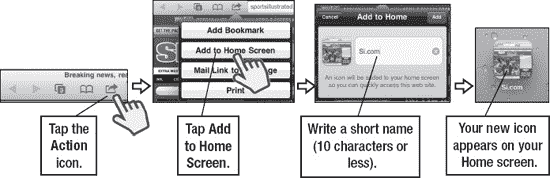

**图 11-8.** *如何将网页图标添加到主屏幕*

#### 从历史记录中浏览

你的 iPad 上一个非常有用的工具是能够像在电脑上一样从**历史记录**中浏览网页。

点击**书签**图标，你会看到一个标记为**历史记录**的标签。

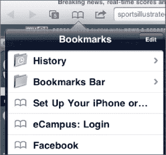

点击**历史记录**标签，你最近的网页浏览记录将会列出。如果你最近没有清除过历史记录，你可能会看到一个标签显示**今天早些时候**，以及其他带有存储历史记录的日期标签。

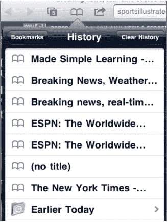

只需点击列表中的网站名称，Safari 就会在浏览器窗口中加载该页面。

要删除**历史记录**中的所有网站，请点击右上角的**清除历史记录**按钮，然后点击红色的**清除历史记录**按钮。

