# 添加文件夹、编辑和删除书签

由于添加书签非常容易，积累大量书签是很常见的事。你可能会发现不再需要某个特定的书签，或者想通过添加新文件夹来整理它们。

要管理你的书签，请点击书签菜单左下角的 `Edit` 按钮。

你会注意到左侧出现了一个红色的 `减号` (`-`)，并且每个书签都变成了一个可点击的标签（参见图 11-9）。

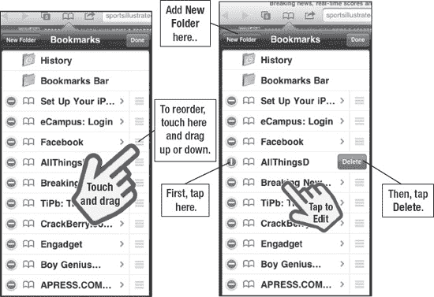

**图 11-9.** *重新排序和删除书签*

要删除书签，只需点击红色的 `减号`，就会看到 `Delete` 按钮弹出。点击 `Delete`，确认删除操作，该书签就会从你的菜单中消失。

要重新排列书签，只需点击每个书签右侧的图标，然后按喜好向上或向下拖动。

要添加新文件夹，请点击左上角的 `New Folder` 按钮。输入文件夹的名称，选择放置新文件夹的位置（文件夹），然后点击 `Done`。

## 使用新建页面按钮

在我们的家用电脑上，很多人都依赖选项卡式浏览——它允许我们同时打开多个网页，以便快速切换。iPad 也有一个类似的功能，你可以通过点击网页状态栏左上角的 `New Page` 图标来访问。（这与本章前面用于切换已打开页面的图标相同。）

当你第一次点击此按钮时，当前正在查看的网页会缩小并移动到屏幕左侧。

点击 `New Page` 按钮，浏览器将加载一个空白页面，供你输入新的网址。

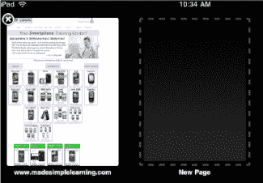

现在，只需点击 `Address Bar` 即可输入网址，这会调出键盘。输入你想要访问的网址。请注意，这个键盘上没有空格键——只需点击句号（`.`）输入点号，或者如果网站域名以 "com" 结尾，点击 `.com` 按钮来完成地址输入。

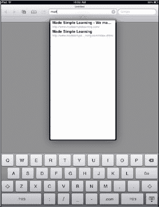

现在，当你点击 `New Page` 图标时，只需点击你想查看的页面，它就会加载到屏幕上。如之前所述，你也可以点击 `New Page` 按钮，在浏览器窗口中加载另一个新页面。

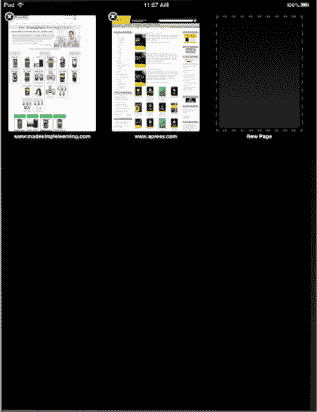

## 在网页中缩放

在 iPad 上缩放网页非常容易。主要有两种缩放方式：双击和捏合。

*双击：* 如果在网页的某一列上轻点两下，页面会放大到该特定列。这让你能精确聚焦到网页上的正确位置，对于未针对移动屏幕格式化的页面非常有用。

要缩小，只需再次双击。可以在快速入门指南中查看此操作的图形化效果。

*捏合：* 此技术可让你放大页面的特定部分。这需要一点练习，但很快就会变得很自然。请查看快速入门指南，了解其图形化效果。

用拇指和食指并拢，放在你想放大的网页区域。然后慢慢向外捏开，分开手指。你会看到网页被放大（请注意，网页可能需要几秒钟才能对焦）。

要缩小回原来的大小，只需将手指分开，然后慢慢并拢；页面就会缩小到原始尺寸。

## 激活网页中的链接

当你在网上冲浪时，经常会遇到指向其他网站的链接。由于 Safari 是一个功能完整的浏览器，你只需点击链接即可跳转到一个新页面。

如果你想返回上一页面，只需像之前展示的那样按下 `Back` 箭头按钮。

## 调整浏览器设置

与迄今为止你调整过的其他设置一样，Safari 的设置可以在 `Settings` 应用中找到。

要访问此应用，请点击 `Settings` 图标，然后点击 `Safari`。

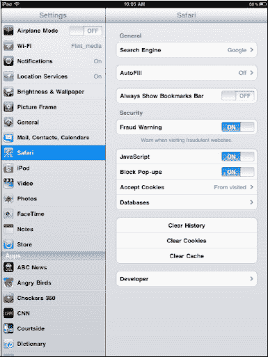

### 更改搜索引擎

默认情况下，Safari 浏览器的搜索引擎是 `Google`。要将其更改为 `Yahoo`，只需点击 `Search Engine` 标签，然后选择 `Yahoo`。你也可以选择 `Bing` 作为默认搜索引擎。

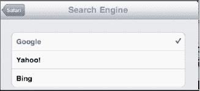

### 调整安全选项

在 `Security` 标题下，`JavaScript` 和 `Block Pop-ups` 默认应设置为 `ON`。你可以通过将开关滑动到 `OFF` 来修改其中任何一个设置。

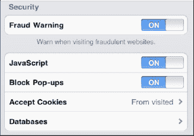

**注意：** 许多流行的网站（如 Facebook）需要 `JavaScript` 保持 `ON` 状态。

你还会在这里看到 `Accept Cookies` 标签，你可以将其调整为始终接受、`Always`、从不接受、`Never`，或仅接受来自已访问网站的 Cookie、`From visited`。

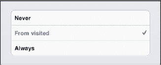

### 加速浏览器：清除历史记录和 Cookie

在 Safari `Settings` 屏幕底部，你可以看到 `Clear History` 和 `Clear Cookies` 按钮。

如果你发现网页浏览变得迟缓，那么现在可能是清除 `History` 和 `Cookies` 的好时机了。

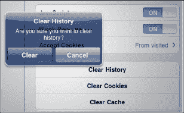

**提示：** 这也是一项良好的隐私保护措施，可以防止他人看到你浏览过哪些网站。

为了避免这种迟缓现象，建议定期清除你的历史记录和 Cookie。

### 自动填充姓名、密码、电子邮件、地址等

`AutoFill` 是一种便捷方式，可以让浏览器自动填写询问你的姓名、地址、电话号码，甚至用户名和密码的网页表单。

要启用 `AutoFill`，请在 Safari `Settings` 中点击 `AutoFill` 标签。要使用 `AutoFill` 输入你的联系人信息，请将 `Use Contact Info` 旁边的滑块移至 `On` 位置。

要让 `AutoFill` 填写姓名和密码，请将 `Names and Passwords` 旁边的滑块移至 `On`。

要设置正确的 `Contact Info`，请点击 `My Info` 标签，会显示你的联系人列表。选择你自己的联系人信息，如图 图 11-10 所示。

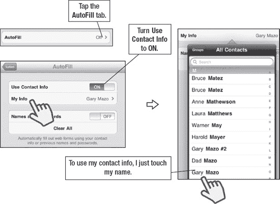

**图 11-10.** *在 AutoFill 中设置我的信息*

一旦启用 `AutoFill`，只需前往任何带有表单字段的网页。一旦你点击该字段，键盘就会在屏幕底部弹出。在键盘顶部，你会看到一个小按钮，上面写着 `AutoFill`。点击它，网页表单就会被自动填充（图 11-11）。

**警告：** 设置自动输入你的姓名和密码意味着任何拿起你 iPad 的人都可以访问你的个人网站和信息。

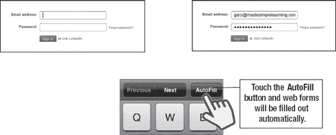

**图 11-11.** *使用 Auto Fill 自动输入电子邮件地址和密码*

### 从网站保存或复制文本与图像

有时您可能会看到想从网站复制的文本或图像。本节将简要介绍操作方法，但如需直观了解包括使用**剪切**和**粘贴**功能在内的完整过程，请参阅第 2 章中的"复制与粘贴"部分。以下是快速指南：

要复制单个词语，长按该词语直至其被高亮显示并出现**复制**按钮，然后轻点**复制**。

要复制几个词语或整个段落，长按某个词语直至其被高亮显示。然后向左或向右拖动蓝色圆点以选择更多文本。您可以向上或向下滑动以选择整个段落。最后轻点**复制**。

**提示：** 选择单个词语会进入**词语选择**模式，在此模式下您可以通过拖动来增加或减少所选词语的数量。如果选择范围超过单个段落，通常会切换至**元素选择**模式，此时您会看到边缘而非角落，您可以向外拖动这些边缘来选择多个段落、图像等内容。

要**保存**或**复制**图像，长按图片或图像直至弹出窗口询问您是否要**保存**或**复制**该图像。

### 利用浏览历史节省时间并查找网站

将常访问的网站保留在历史记录中的好处在于，您可以在进入浏览器菜单时从**历史记录**标签页中加载它们（参见图 11-12）。此外，有时您想返回某个特定网站却记不起名称，查看历史记录将显示您想访问的确切网站。

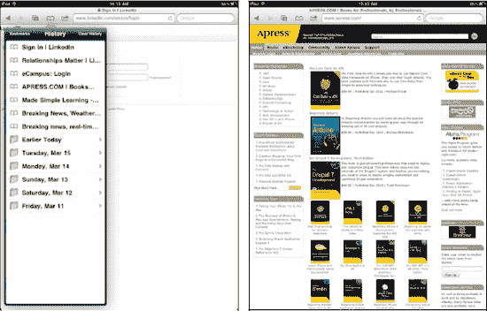

**图 11-12.** *使用浏览器历史记录*

## 第 12 章

## iBooks 与电子书

自 iPad 发布以来，其最受推崇的功能之一便是作为电子书阅读器的能力。在本章中，我们将向您展示一种无与伦比的阅读体验。我们将介绍**iBooks**应用，如何为其购买和下载书籍，以及如何找到一些优秀的免费经典书籍。我们还将向您介绍 iPad 上的其他电子书阅读选项，包括第三方应用**Kindle**和**Kobo**阅读器。

iPad 使用苹果专有的电子书阅读器**iBooks**。在本章中，我们将向您展示如何下载**iBooks**应用，如何在 iBooks 商店中选购书籍，以及如何充分利用**iBooks**应用的所有功能。

有了**iBooks**，您能以前所未有的方式与书籍互动。您可以翻页、调整字体大小、在内置词典中查词以及在文本中搜索。

在 App Store 中，您还可以找到亚马逊**Kindle**阅读器及其他流行电子书阅读器的应用。

### 下载 iBooks

当您首次在 iPad 上打开 App Store 时，系统会提示您下载免费的**iBooks**应用。选择**下载**，**iBooks**便会下载并安装到您的 iPad 上。

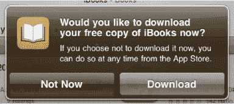

### iBooks 商店

在您开始享受阅读体验之前，需要先为 iBooks 书库添加书籍。幸运的是，iBooks 商店中有许多免费书籍可供查找，包括完整的古腾堡经典作品集和公有领域图书。

只需轻点书架左上角的**商店**按钮，您便会进入 iBooks 商店。

iBooks 商店的布局与 App Store 非常相似。左上角有一个**分类**按钮，位于**书库**按钮旁边。轻点此按钮可查看所有可用的分类，您可以根据这些分类选择书籍。

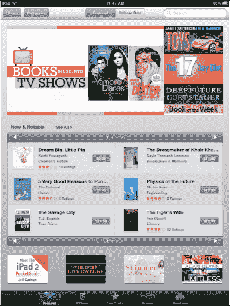

精选图书会突出显示在商店首页，并展示**新书**和**热门**图书供您浏览。

商店底部有五个虚拟按键：**精选**、**纽约时报**、**排行榜**、**浏览**和**已购项目**。轻点**纽约时报**按钮

可查看纽约时报虚构类和非虚构类畅销书排行榜。

轻点**排行榜**按钮`images`可查看商店中所有畅销书和热门免费书籍。

轻点**已购项目**`images`按钮可查看您为书库购买或下载的所有书籍。

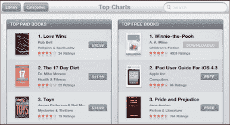

购买书籍与购买应用类似。轻点您感兴趣的书籍标题，浏览其描述和用户评论。当您准备购买此书时，轻点**价格**按钮。

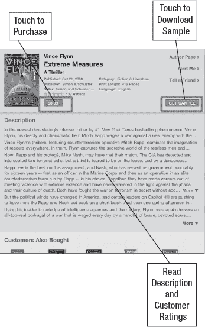

**注：** 许多图书提供试读样本下载。如果您不确定是否要购买某本书，这是个不错的办法。下载样本是预览图书的好方法；您可以随时从样本内购买完整图书。

一旦您决定下载样本或购买图书，视图会切换至您的书架。此时，您可以看到书籍正在存入书架。您的图书现在可供阅读。

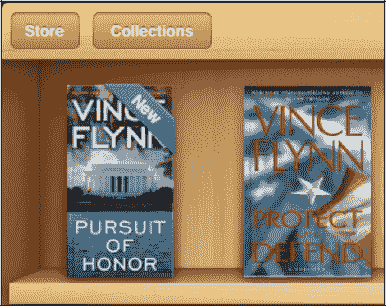

**注**：新下载的图书会在右上角显示“New”字样。

#### 使用搜索窗口

与 iTunes 和 App Store 一样，iBooks 为您提供了一个**搜索**窗口，您几乎可以在其中输入任何短语。您可以搜索作者、书名或系列。只需轻点**搜索**窗口，屏幕键盘便会弹出。输入作者、书名、系列或书籍类型。

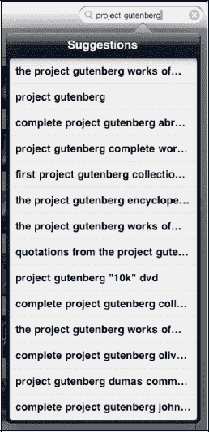

**注**：您也可以使用底部的**浏览**按钮进行搜索。例如，您可以按作者或分类浏览，或使用**搜索**框。

**提示：** 要搜索大量免费书籍，可以搜索"古腾堡项目"以查看数千种免费公有领域图书。

您会看到与搜索内容匹配的建议弹出；轻点相应的建议即可跳转到该书籍。

### 阅读 iBooks

轻点书架上的任意书籍即可打开阅读。书籍将打开至第一页，通常为书名页或其他前置内容。

左上角有一个**目录**按钮，位于**书库**按钮旁边（参见图 12-1）。要跳转到目录，请轻点**目录**按钮，或者直接翻页直至看到这些页面。

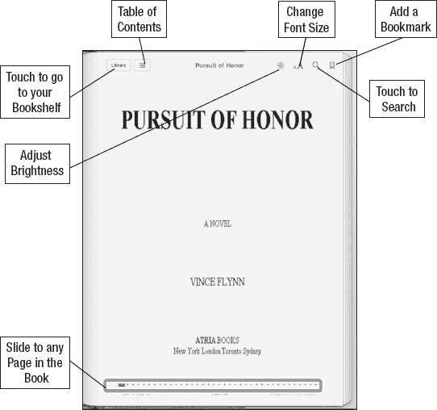

**图 12-1.** *`**iBooks**`页面布局*

您可以通过以下三种方式之一翻页：

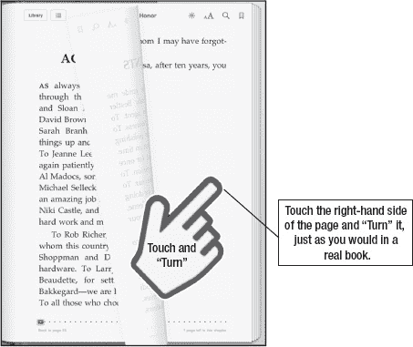

*   轻点页面的右侧边缘翻到下一页。
*   缓慢地长按页面右侧边缘的屏幕。在仍触摸屏幕的同时，温和缓慢地将手指向左滑动。

    **提示：** 如果您非常缓慢地移动手指，在"翻"页时甚至可以实际看到页面背面的文字——非常酷的视觉效果。

*   最后一种翻页方式是使用页面底部的**滑块**控件。当您从左向右缓慢滑动时，您会看到**滑块**控件上方显示页码。松开**滑块**控件即可跳转到该特定页码。

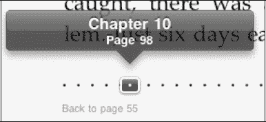

