# 自定义阅读体验：亮度、字体与字号

在图书界面的右上角有三个图标，可帮助您获得更沉浸式的阅读体验（见图 12-2）。

轻触**亮度**图标，即可调节图书的亮度。

如果您在非常暗的房间里躺在床上阅读，可能需要将滑块一直向左滑动；而在室外阳光下阅读时，则可能需要一直向右滑动。请注意，调高屏幕亮度是 iPad 上较为耗电的操作之一，因此在不需要如此高亮度时，记得将其调回。

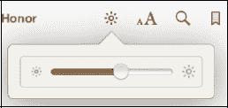

**注意：** 上述操作仅调节**iBooks**应用内的亮度。若要调节 iPad 的整体亮度，请使用**设置**应用中的控制项——点击**设置**图标，然后选择**亮度与墙纸**即可进入。

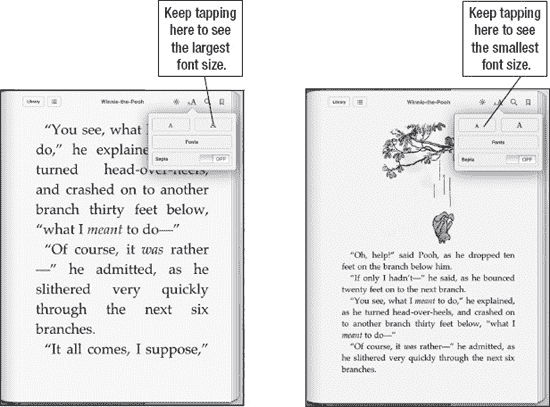

**图 12-2.** *在**iBooks**应用中调整字体大小*

下一个**文本大小**图标可让您调整字号和字体。选中此图标后，可多次点击大**A**按钮来增大字号。

要减小字号，请多次点击小**A**按钮。

共有五种字体样式可供选择（您读到本书时，可能已有更多字体）。

不妨尝试各种字体，享受其中的乐趣。默认字体是 Palatino；不过所有字体看起来都很棒，对部分读者而言，较大的字号能带来不同的阅读感受。目标是灵活调整字体，让这次阅读体验尽可能舒适愉悦。

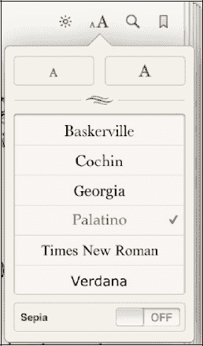

## 使用内置词典扩充词汇量

iBooks 内置了功能强大的词典，当您遇到陌生或生僻的单词时，它会非常有用。

**提示：** 使用内置词典是在阅读时扩充词汇量的简便绝佳方法。无需翻阅卷边的纸质词典查找单词，释义会立即弹出在弹出窗口中！

调用词典再简单不过了。只需长按书中的任意单词，就会弹出一个包含以下选项的窗口：使用**词典**、设置**书签**、或使用**搜索**查找该单词的其他出现位置。

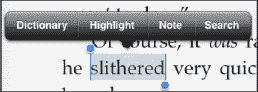

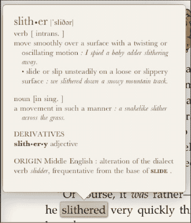

轻触**词典**，将显示该单词的发音和释义。

## 设置页面内书签

有时您可能希望在文本中设置书签以供日后参考。

右上角包含一个**书签**图标。点击**书签**图标，该页面上的图标将变为红色书签。

要查看您的书签，请点击屏幕左上角的**目录**图标（位于**书库**图标旁），然后点击**书签**。点击高亮显示的书签，即可跳转到书中的相应章节。

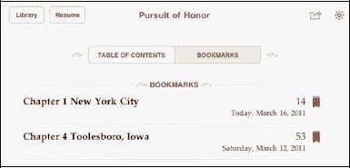

**提示**：无需在每次离开**iBooks**时都设置书签。**iBooks**会自动记住您上次在书中读到哪一页。即使您跳转到另一本书，当返回到刚读的这本书时，也会精确回到上次中断的位置。iBooks 现在还会与您的 iPhone 或 iPod touch 上的**iBooks**应用同步，因此您可以在不同设备之间切换阅读，并保持进度一致。

## 使用高亮和笔记功能

**iBooks**应用内置了一些非常贴心的“附加功能”。有时您可能想高亮某个单词以便日后回顾；有时则可能想在页边空白处给自己留个笔记。

在**iBooks**应用中完成这些操作都非常简单。不过，在**iBooks**中查看 PDF 文件时，此功能尚不可用。

### 高亮文本

请按照以下步骤在您正在阅读的书中高亮文本：

1.  长按任意单词，调出菜单选项。
2.  从菜单中选择**高亮**。
3.  若要移除高亮，长按高亮部分，然后选择**移除高亮**。

若要更改高亮颜色，请执行以下操作：

1.  长按高亮的单词。
2.  从菜单中选择**颜色**。
3.  选择一种新颜色（见图 12-3）。

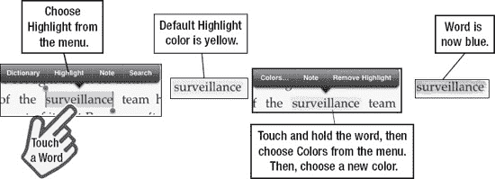

**图 12-3.** *在**iBooks**中使用高亮功能*

### 添加笔记

请执行以下操作在页边添加笔记：

1.  长按任意单词，方法与之前相同。
2.  从菜单中选择**笔记**。
3.  输入您的笔记，然后点击**完成**。
4.  笔记现在将显示在页面的侧边空白处（见图 12-4）。

**提示**：您的笔记也会显示在标题页的书签下方。点击**标题页**按钮，然后点击**书签**。您写的笔记将位于页面底部。

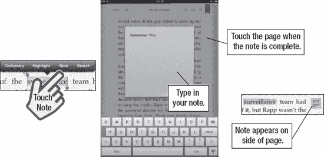

**图 12-4.** *在 iBooks 中使用笔记功能*

## 使用搜索功能

**iBooks**应用内置了强大的搜索功能。只需点击**搜索**栏（如同 iPad 上的其他应用程序），内置键盘便会弹出。输入要搜索的单词或短语，就会显示包含该单词的章节列表。

只需轻触所需选择，即可跳转到书中的相应章节。您还可以通过点击**搜索**窗口底部的相应按钮，直接跳转至 Google 或 Wikipedia 进行搜索。

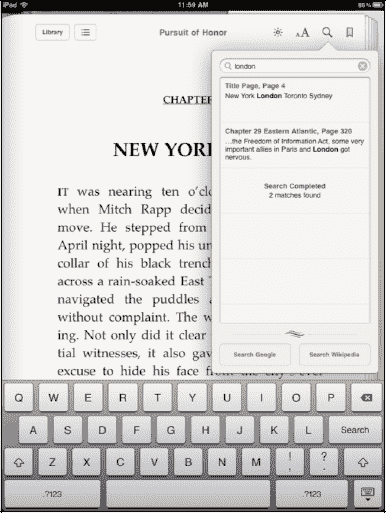

**注意：** 使用 Wikipedia 或 Google 搜索将带您离开**iBooks**并启动**Safari**。

## 删除图书

从您的**iBooks**书库中删除图书，与从 iPad 上删除应用程序非常相似。

在**书库**视图中，只需点击右上角的**编辑**按钮。

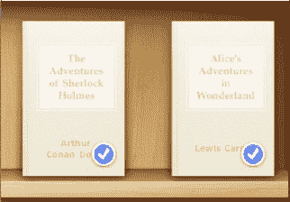

点击**编辑**按钮后，再点击任意图书，就会出现一个蓝色小勾。

现在点击顶部的**删除**  按钮，系统会提示您**删除**该图书。点击**删除**后，该书将从书架上消失。

## 整理书架

书架右上角有两个图标：**封面**视图和**列表**视图。书架默认排列方式是**封面**视图。

请按照以下步骤切换到**列表**视图：

1.  点击**封面**视图图标右侧的**列表**视图图标。
2.  选择您希望图书按**书架**、**标题**、**作者**或**类别**排列。
3.  点击底部的相应按钮，书架视图将根据您的选择进行变更。

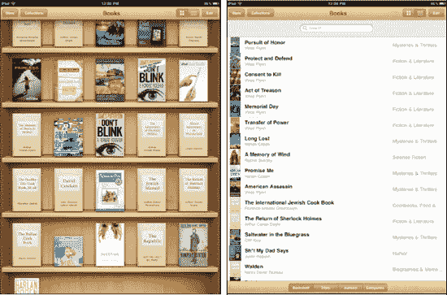

**图 12-5.** *以**封面**或**列表**视图整理图书*

## 合集

iBooks 新增了存储不同合集的功能。最常见的两个合集是**PDF**和**图书**。

当您通过电子邮件收到 PDF（参见下一节示例）或通过 iTunes 传输 PDF 文件（参见第 29 章）时，可以选择在**iBooks**中**打开**该 PDF。它随后将被存储到您的 PDF 合集中。

