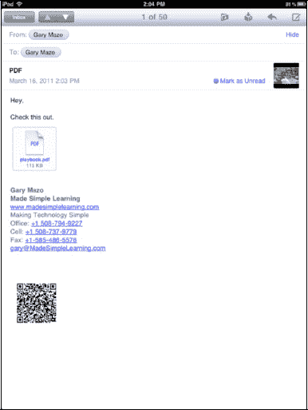
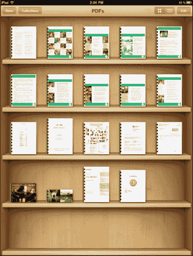
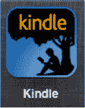
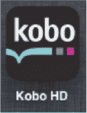
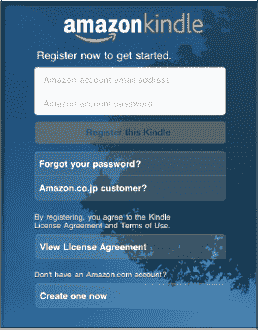
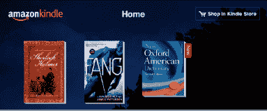
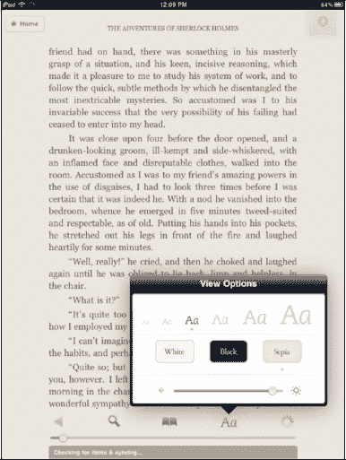
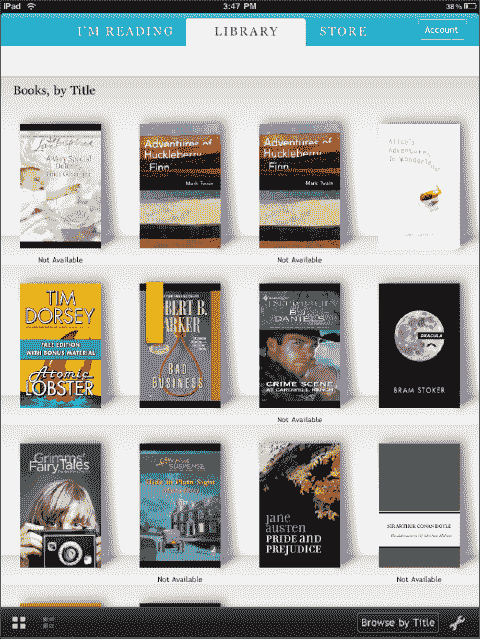

# 在 iBooks 中阅读 PDF 文件

`iBooks` 的一个非常酷的功能是能够阅读通过电子邮件发送或通过 iTunes 同步的 PDF 文件（参见第 3 章：“将 iPad 与 iTunes 同步”）。

在本例中，一封包含 PDF 文件的电子邮件已到达，我们希望将其保存并在 `iBooks` 中查看。

请按照以下步骤打开通过电子邮件收到的 PDF 文件：

1. 从电子邮件中打开该 PDF 文件。
2. 在右上角，选择“用...打开”，然后选择“iBooks”。此时 PDF 文件将被归入 `iBooks` 的 PDF 类别中。
3. PDF 文件保存在 PDF 区域。只需轻点文件即可打开它，并像阅读其他 iBook 一样进行阅读。
4. 要删除 PDF 文件，请按照先前删除 iBook 的说明操作。

**注意**：当您在电子邮件的 PDF 右上角选择“用...打开”时，所有可用的 PDF 阅读应用都会列出。从列表中选择“iBooks”即可在 `iBooks` 中打开文件，或选择其他阅读器在该应用中打开文件。

在您保存第一个 PDF 文件之前，您会看到“合集”列出，但没有任何文件存储。保存第一个 PDF 文件后，您的 PDF 文件将出现在“商店”按钮旁边的“合集”中。

您可以轻点“合集”按钮，在“图书”和“PDF”类别之间切换。

## 其他电子书阅读器：Kindle 与更多

正如我们所提到的，`iBooks` 应用提供了无与伦比的电子书阅读体验。不过，iPad 上还有其他值得一试的电子书阅读器应用。

许多用户已经拥有 Kindle 并投入了不少资金购买 Kindle 书籍。其他用户则使用 `Kobo` 电子阅读器软件（以前称为 `Short covers`），并为该平台购买了书籍库。

幸运的是，这两个电子书平台在 iPad 应用商店中都有对应的应用。当其中任何一个程序被下载并安装后，您可以登录并在 iPad 上阅读您的完整书籍库。

**注意：** 无论您选择哪种其他电子阅读器，您都只需登录相应的服务，即可查看完整的书籍库，并从上一次阅读的地方继续阅读——即使您是在不同设备上开始阅读的。

### 下载电子书阅读器应用

前往应用商店。轻点“类别”，然后轻点“图书”。您会在显示的应用列表中找到 `Kindle` 和 `Kobo` 阅读器。这两款应用都是免费的，因此只需轻点“免费”按钮即可开始下载。

**提示：** 如果您知道自己要找的是哪款应用，通常直接按名称*搜索*会更快捷。

安装好所需的电子书阅读器软件后，轻点其图标启动应用。

### Kindle 阅读器

亚马逊的 `Kindle` 阅读器是世界上最流行的电子阅读器。数百万用户拥有 Kindle 书籍；`Kindle` 阅读器允许他们在 iPad 上阅读这些 Kindle 书籍。

**提示：** 如果您使用 Kindle 设备，不必担心在 iPad 上登录的问题。您可以将多台设备绑定到同一个账户上。您将能够在 iPad 上安装的 `Kindle` 阅读器中尽情享受为您 Kindle 购买的所有书籍。

只需轻点 `Kindle` 阅读器，然后登录您的 Kindle 账户，或使用用户名和密码创建一个新账户。

登录后，您将在“主页”页面上看到您的 Kindle 书籍。您可以轻点某本书开始阅读，或者轻点“购物车”在 Kindle 商店中开始选购。

**注意：** 轻点“购物车”将启动您的 `Safari` 浏览器。之后，您可以购买 Kindle 书籍。购买完成后，您需要退出 `Safari` 并重新启动 Kindle 阅读器。

要阅读 Kindle 书籍，请轻点其封面。阅读选项位于底部的图标栏中。

您可以通过轻点右上角的“书签”图标来添加书签。设置书签后，会显示一个小书签——就和 `iBooks` 应用中一样。

您可以通过轻点“转到”按钮，跳转到书籍的封面、目录或任意指定位置（例如开头）。

字体和页面颜色都可以调整。一个非常有趣的功能是能够将页面改为“黑色”，这在夜间阅读时非常棒。

要翻到下一页，可以从右向左滑动，或轻点页面的右侧。要返回上一页，只需从左向右滑动，或轻点页面的左侧。

轻点屏幕，底部会出现一个“滑块”控件。您可以调整此控件来跳转到书中的任意页面。

### Kobo 阅读器

与 `Kindle` 阅读器一样，`Kobo` 阅读器启动时会要求您登录现有的 Kobo 书籍账户。您所有的现有 Kobo 书籍随后即可供阅读。

Kobo 采用类似 `iBooks` 的“书架”方式。轻点您想打开的任何一本书的封面。

或者，您可以轻点“我正在阅读”选项卡，继续阅读上次阅读的内容。您也可以直接轻点“商店”选项卡前往 Kobo 商店购买书籍。

您可以在 `Kobo` 阅读器的顶部找到三个按钮：“目录”、“概览”和“书签”。

轻点任意按钮即可进入相应的功能。

您还可以在底部找到四个图标：“字体”、“亮度”、“添加书签”和“显示设置”。轻点任意按钮即可调整您的查看设置。

要在 `Kobo` 阅读器中翻到下一页，请轻点页面右侧。要返回上一页，只需轻点页面左侧。您也可以使用底部的“滑块”控件来翻阅页面。

