# iPad 上的电子邮件

在本章中，我们将帮助您探索 iPad 上 `邮件` 应用中的电子邮件世界。您将学习如何设置多个电子邮件账户、查看各种阅读选项、打开附件以及整理收件箱。

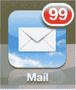

您会对其统一的收件箱功能感到满意，该功能让您可以在一个收件箱中查看所有电子邮件。您还可以选择查看主题邮件，其中与同一主题相关的所有邮件（回复、转发等）都归到一个组中。或者，如果您愿意，可以在“设置”应用中关闭此功能。

当您的电子邮件无法正常工作时，您还将学习一些有用的故障排除技巧，帮助您恢复正常使用。

### 邮件入门

在 iPad 上设置电子邮件相当简单。您可以从 `iTunes` 同步电子邮件账户设置（参见第 3 章：“将 iPad 与 iTunes 同步”中的“同步电子邮件账户设置”部分），也可以直接在 iPad 上设置电子邮件账户。您需要网络连接才能正常使用电子邮件。

### 需要网络连接

如今移动电子邮件无疑非常流行。你可以在没有网络连接的情况下，查看、阅读和回复已同步到 iPad 上的邮件；但是，要使用 iPad 发送和/或接收电子邮件，你需要连接 Wi-Fi 网络。请参阅第 5 章：“Wi-Fi 和 3G 连接”了解更多信息。另请参阅第 1 部分快速入门指南中的“读取顶部连接状态图标”部分。

**提示：** 如果你正在乘坐飞机，只需在登机前下载所有电子邮件；这样你就可以在离线状态下阅读、回复和撰写邮件。这里有一点很重要——除非你点开邮件进行查看，否则在离线前你可能只下载了邮件标题。换句话说，在起飞前，请确保点开所有重要邮件，确保完整内容已下载到你的 iPad。你在 iPad 上离线撰写的任何邮件，都将在落地并重新建立网络连接后发送。

## 在 iPad 上设置电子邮件

你有两种选项可在 iPad 上设置电子邮件账户：

- 使用 `iTunes` 应用同步电子邮件账户设置。
- 直接在 iPad 上设置电子邮件账户。

如果你有多个电子邮件账户，并且通过电脑上的电子邮件程序（例如 `Microsoft Outlook`、`Entourage` 等）访问它们，那么最简便的方法就是使用 `iTunes` 同步你的账户。有关此主题的更多信息，请参阅第 3 章：“使用 iTunes 同步你的 iPad”中的“同步电子邮件账户设置”部分。

如果你只有几个账户，或者你未使用 `iTunes` 可同步的电脑电子邮件程序，那么你需要直接在 iPad 上设置电子邮件账户。

### 输入从 iTunes 同步的电子邮件账户密码

在第 3 章的“同步电子邮件账户设置”部分，我们向你展示了如何将电子邮件账户设置同步到 iPad。同步完成后，你应该能够通过打开 `设置` 应用来查看 iPad 上的所有电子邮件账户。你只需要输入每个账户的密码即可。

输入账户密码的简单方法是在弹出窗口出现时，直接在其中输入密码。

输入你的 `密码`，然后轻点 `OK` 进行保存。

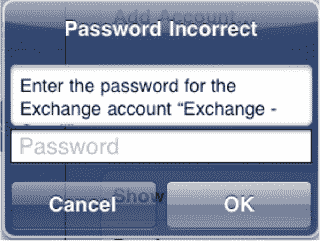

你也可以在 `设置` 应用中输入电子邮件账户密码并调整其他账户详细信息。要为每个同步的电子邮件账户输入密码，请按照以下步骤操作（参见图 13-1）：

1. 轻点 `设置` 图标。
2. 轻点左侧栏中的 `邮件、通讯录、日历`。
3. 在右侧栏的 `账户` 下，你应该能看到所有已同步的电子邮件账户列表。
4. 轻点任一列出的电子邮件账户，然后轻点 `账户` 进入 `账户` 详情界面。
5. 输入账户 `密码`，然后轻点 `完成`。
6. 为所有列出的电子邮件账户重复以上步骤。

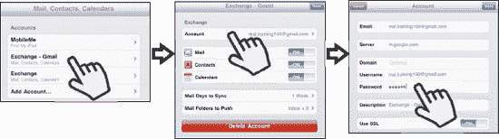

**图 13–1.** *为从 `iTunes` 应用同步的每个电子邮件账户输入密码*

### 在 iPad 上添加新电子邮件账户

要在 iPad 上添加新电子邮件账户，请按照以下步骤操作：

1. 轻点 `设置` 图标。
2. 轻点 `邮件、通讯录、日历`。
3. 在你的电子邮件账户下方，轻点 `添加账户`。

    **提示：** 要编辑任何电子邮件账户，只需轻点该账户。

    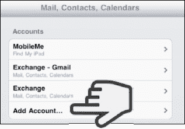

4. 在此界面上选择要添加的电子邮件账户类型：

    - 如果你使用 Microsoft Exchange 电子邮件服务器、Hotmail 或 Gmail，并且希望无线同步联系人和日历，请轻点 `Microsoft Exchange`。
    - 如果你使用 Gmail 但不希望无线同步联系人，请轻点 `Gmail`。
    - 如果你使用这些服务，请轻点 `MobileMe、Yahoo` 或 `Aol`。
    - 要设置其他类型的账户，请轻点 `其他`。

    **提示：** 在第 4 章：“其他同步方法”中了解更多关于 `Google`/`Hotmail/Microsoft Exchange` 和 `MobileMe` 的信息。

    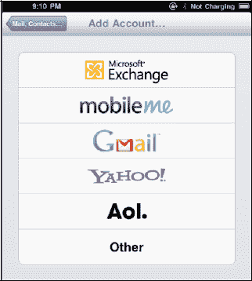

5. 如果在账户类型中选择 `其他`，你将看到此界面，可以添加以下类型的账户：邮件、通讯录和日历。

    - 要添加邮件账户，请轻点 `添加邮件账户`。
    - 要添加通讯录账户，请轻点 `添加 LDAP 账户` 或 `添加 CardDAV 账户`。
    - 要添加日历账户，请轻点 `添加 CalDAV 账户` 或 `添加已订阅的日历`。

    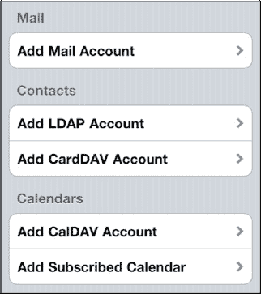

6. 现在你将能够输入登录凭据。在 `名称` 字段中输入你的姓名，以便其他人收到你邮件时看到。如果你选择了通讯录或日历类型的账户，则需要输入 `服务器` 名称、`用户名`、`密码` 和 `描述`。

    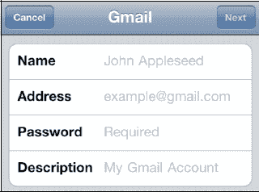

7. 接下来，在 `地址`、`密码` 和 `描述` 字段中添加适当信息。
8. 轻点右上角的 `下一步` 按钮。

#### 指定接收和发送服务器

有时，iPad 无法自动设置你的电子邮件账户。在这种情况下，你需要手动输入更多设置以启用你的电子邮件账户。

**提示：** 你可以通过在网上搜索你的电子邮件提供商名称和“电子邮件设置”来找到相关设置。例如，如果你使用 Windows Live Hotmail（原名 Hotmail），则可以搜索“Windows Live Hotmail 的 Microsoft Exchange、POP 或 IMAP 电子邮件设置”。如果找不到这些设置，请联系你的电子邮件提供商寻求帮助。

如果 iPad 仅凭你的电子邮件地址和密码无法登录服务器，你会看到类似这样的界面。

在 `接收邮件服务器` 下，在 `主机名`、`用户名` 和 `密码` 字段中输入相应信息。通常，你的接收邮件服务器类似于 `mail.*你的网络服务提供商名称*.com`。

要调整发送服务器名称，请轻点 `发送邮件服务器`。你可以在以下界面上调整发送邮件服务器。这些服务器名称通常看起来像 `smtp.*你的网络服务提供商名称*.com` 或 `mail.*你的网络服务提供商名称*.com`。

你可以尝试将 `服务器名称` 和 `密码` 字段留空。如果不起作用，你随时可以返回并修改它们。

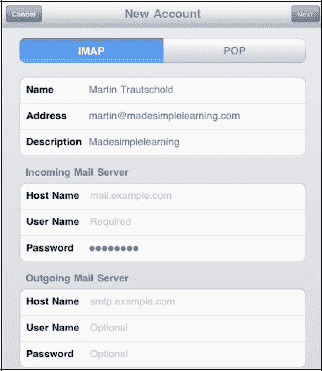

系统可能会询问你是否要使用 SSL（安全套接层），这是一种发送邮件安全类型，你的电子邮件提供商可能要求使用它。如果你不确定是否需要，请向你的电子邮件提供商确认所需的邮件设置。

**提示：** 作者建议尽可能使用 SSL 安全协议。如果不使用 SSL，那么你的登录凭据、邮件以及任何私人信息将以纯文本（未加密）形式发送，容易受到窥探。

#### 验证你的账户是否已设置成功

输入所有信息后，iPad 将尝试配置你的电子邮件账户。你可能会收到一条错误消息；如果发生这种情况，你需要检查输入的信息。

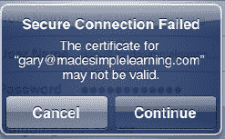

如果系统跳转到显示所有电子邮件账户的界面，请查找新的账户名称。

如果你看到了，说明你的账户已设置成功。

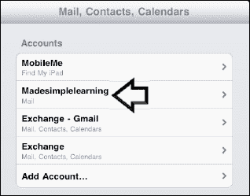

#### 修复“无法获取邮件”错误

如果你轻点 `邮件` 图标并收到“密码错误”的提示，你需要输入密码并轻点 `OK` 以查看你的电子邮件。

有关更多帮助，请参阅本章的“输入从 iTunes 同步的电子邮件账户密码”部分。

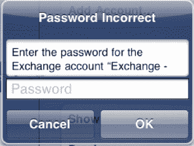

### 电子邮件基础

在本节中，我们将引导您了解`邮件`应用。我们将解释如何在`竖屏`和`横屏`模式下使用它，以及如何执行阅读、回复、归档、打印和删除邮件等基本操作。

#### 竖屏与横屏邮件界面

既然您已经在 iPad 上设置了电子邮件账户，那么是时候简单了解一下`邮件`应用了。为了更好地掌握如何操作`邮件`程序，了解您的`邮件`应用在`竖屏`和`横屏`视图下的外观会有所帮助（参见图 13-2）。

在`横屏`视图中，您始终可以在左侧栏看到收件箱或邮箱，右侧则是电子邮件内容。

在`竖屏`视图中，整封电子邮件内容会填满屏幕。要查看页面左侧垂直弹出窗口中的`收件箱`或`邮箱`，请点击页面左上角的`收件箱`按钮。

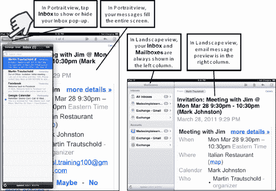

**图 13-2.** *竖屏与横屏视图下的邮件界面*

**提示：** 如果您将 iPad 放在桌子上或放在膝盖上使用，可能需要使用`竖屏锁定`图标将视图锁定在`竖屏`（垂直）模式。这样可以防止屏幕随意旋转。要锁定视图，请按照以下步骤操作：

1.  双击`主屏幕`按钮，然后从左向右滑动。
2.  点击`竖屏锁定`按钮将屏幕锁定在`竖屏`模式。

#### 查看邮件与未读邮件蓝点

点击任意电子邮件即可在主窗口中查看。

任何未读邮件都会在邮件左侧标有`蓝点`图标 。

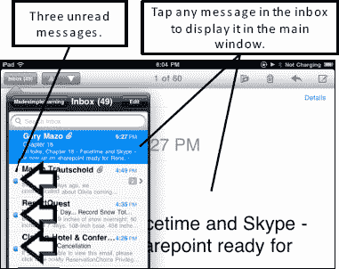

#### 调整邮件字体大小

既然谈到了电子邮件，我们来看一个实用的技巧：如何增大邮件中的字体大小。您可以将默认的 10 点或 12 点字体一直调整到 56 点（参见图 13-3）。

1.  点击`设置`。
2.  点击`通用`。
3.  点击`辅助功能`（右侧栏）。
4.  点击`大文本`，然后选择您需要的字体大小。

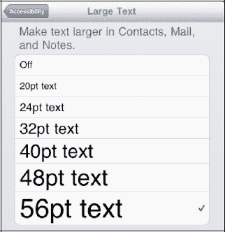

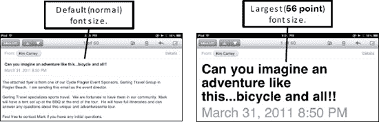

**图 13-3.** *电子邮件中不同大小的字体*

#### 查看您的邮箱（收件箱与账户文件夹）

顶层界面是您的`邮箱`界面。您可以通过点击左上角的按钮随时进入此界面。持续点击该按钮，直到看不到更多按钮为止。当出现这种情况时，您就处于`邮箱`界面。

从`邮箱`界面，您可以访问以下项目：

*   **统一收件箱：** 点击`所有收件箱`进行操作。
*   **每个单独账户的收件箱：** 在“收件箱”部分点击该电子邮件账户名称进行操作。
*   **“账户”部分中每个电子邮件账户的文件夹：** 点击账户名称以查看所有文件夹。

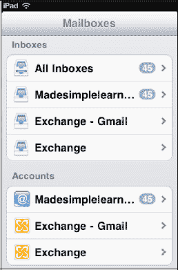

您可以在一个统一收件箱中查看邮件，该收件箱将您的所有电子邮件账户显示在一个收件箱中，或者单独列出每个账户。您也可以选择查看已同步到 iPad 的任何邮件账户文件夹。

最好对您的各个电子邮件账户有一个整体概念。您的`邮箱`界面位于一棵倒置树的顶端。您可以通过点击顶部的`收件箱`访问每个收件箱，或者通过点击底部的`账户`列表深入到各种同步的邮件文件夹（包括您的收件箱）（参见图 13-4）。

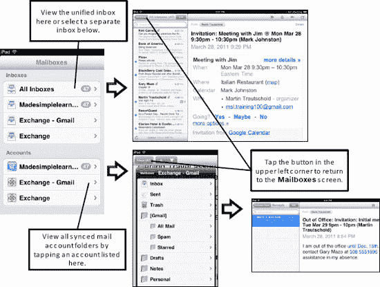

**图 13-4.** *导航到各个收件箱和邮件账户文件夹*

##### 统一收件箱

从`邮箱`界面，点击`所有收件箱`即可查看一个包含您所有账户电子邮件的单一收件箱。

**提示：** 以下是进入`邮箱`界面的方法。

如果您碰巧正在查看某个收件箱或其他邮件文件夹，则需要点击屏幕左上角的按钮一次或两次。

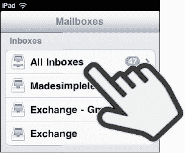

**注意：** 您只会看到在邮件设置过程中选择同步的那些邮件文件夹。例如，您的主邮件账户上可能有 20 个邮件文件夹，但在 iPad 上您可能只能看到其中几个。默认同步的邮件文件夹是`收件箱`、`已发送`、`草稿`和`已删除`。

#### 相关邮件在线程中保持在一起

您还会注意到，有些邮件在右侧显示一个数字和一个朝右的`箭头`图标（`>`），如下所示：

这表明所显示的邮件有两封相关邮件（回复和转发）。

点击任何邮件即可将其打开。只有当存在相关邮件时，它才无法直接打开。在这种情况下，您首先会看到一个包含所有相关邮件的界面。点击其中任何一封邮件即可打开并查看（参见图 13-5）。

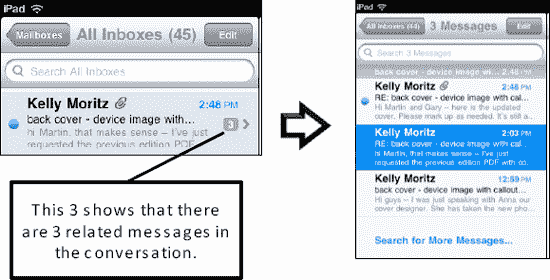

**图 13-5.** *相关邮件被分组成称为线程的群组中。*

**提示：** 您可以在`设置`应用中禁用此`线程`视图。点击`设置`  `邮件、通讯录、日历`，然后将`按主题整理`设置为`关闭`。

#### 放大或缩小

与在 iPad 上阅读其他文本一样，您可以放大以查看字更大的电子邮件。您可以通过双击屏幕来实现此操作。您也可以使用`捏合`张开或收拢手势来放大或缩小（有关这些功能的更多信息，请参阅本书第 1 部分的“快速入门指南”中的“缩放”部分）。

#### 转到下一封或上一封邮件

在`竖屏`视图中，点击右上角`收件箱`按钮旁边的`上三角`图标  或`下三角`图标 。

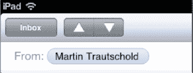

在`横屏`视图中，您只需点击左侧栏中的邮件，即可在主（右侧栏）预览窗口中查看。

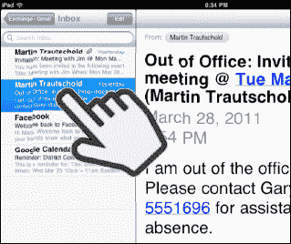

#### 拷贝与粘贴

以下是选择文本或图片然后从电子邮件中将其拷贝的一些技巧：

*   *双击所需文本以选中一个单词，然后上下拖动蓝色控点以调整选择范围。*
    接着，选择`拷贝`。

    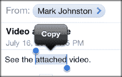

*   长按文本，然后选择`选择`或`全选`。

    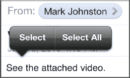

*   长按图片，然后选择`存储图像`或`拷贝`。

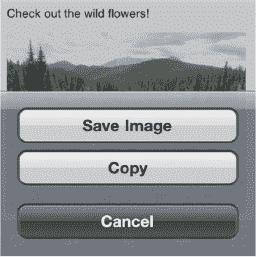

如需更完整的说明，请查看第 2 章中的“拷贝与粘贴”部分：“打字技巧、拷贝/粘贴与搜索”。

#### 移动（归档）邮件

有时，您可能想要整理电子邮件以便日后轻松检索。例如，您可能会收到一封关于即将到来的旅行的电子邮件，并希望将其移动到`旅行`文件夹。有时您会收到需要稍后处理的电子邮件，此时可以将它们移动到`需要关注`文件夹。这可以帮助您记住稍后处理这些邮件。

要开始移动邮件，请点击屏幕右上角的`移动`图标。

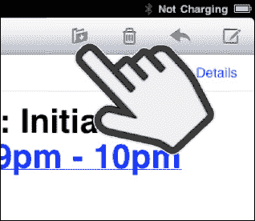

当前邮件账户的文件夹列表将显示在屏幕左侧。

点击您想要将邮件移入的文件夹。

**提示：** 虽然您可以将邮件移动到垃圾邮件文件夹，但我们建议您直接删除这些邮件。

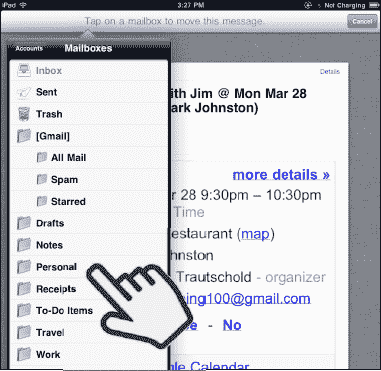

