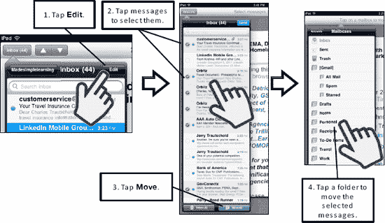

# 批量移动（归档）邮件

若要一次移动大量邮件，请打开收件箱并按照以下步骤操作：

1.  点击收件箱右上角的`编辑`按钮（见图 13-6）。
2.  点击任意邮件以选中它——选中后，邮件旁边会显示一个`红色对勾`图标。
3.  点击屏幕底部的`移动`按钮。
4.  此时将显示你已从邮件账户同步的文件夹列表。在图 13-6 中，我们有多个文件夹；但根据 iPad 的设置方式，你可能只看到两个文件夹：`邮件`和`废纸篓`。

**提示:** 你可以通过`设置`应用添加更多需要同步的邮件文件夹。依次点击`邮件、通讯录、日历`，然后点击你要调整的账户。如果你看到`要推送的邮件文件夹`选项，则点击它并进行调整。如果未看到该选项，则无法针对你的特定账户同步其他邮件文件夹。

**图 13–6.** *一次移动多个邮件*

