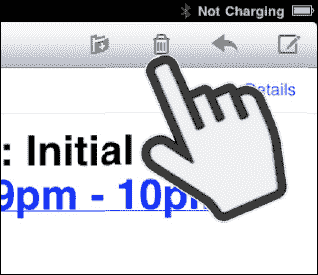
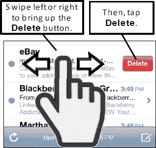

# 删除单个邮件

删除邮件有几种方法。

在查看邮件时，点击屏幕右上角的`垃圾桶`图标 。

邮件会缩小，垃圾桶盖会打开，邮件会飞入桶内，然后盖子关闭。这还挺有趣的——试试看吧！

删除单个邮件的另一种方法是从收件箱操作。

只需在邮件上向左或向右滑动，直到出现`删除`按钮。

然后，点击`删除`按钮。

**提示:** 你可以通过`设置`应用让 iPad 在删除邮件前进行确认。操作方法是：依次点击`邮件、通讯录、日历`，然后将`删除前询问`旁边的开关设置为`打开`。

