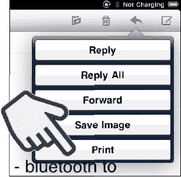
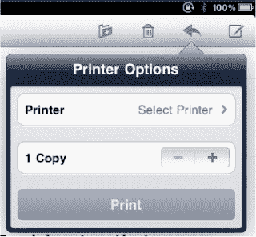
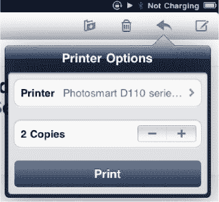
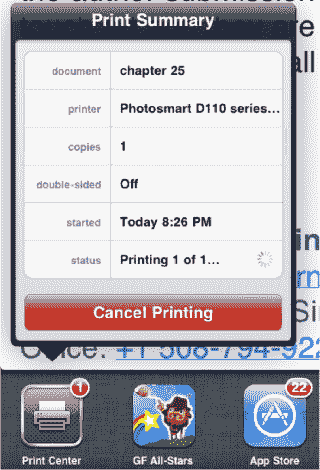

# 打印邮件

现在，只要你拥有兼容 Apple `AirPrint`的打印机，或者可以接收电子邮件并打印附件的打印机，就可以从 iPad 上打印邮件。在本节中，我们将向你展示如何使用 Apple 的`AirPrint`打印邮件。以下是出版时`AirPrint`兼容打印机的列表（见表 14-1）。我们的测试使用的是 HP Photosmart e-AiO (D110a) 打印机。

**表 13–1.** *`AirPrint` 兼容打印机列表*

| HP Envy eAll-in-One 系列 (D410) | HP LaserJet Pro CM1415fnw 彩色多功能打印机 |
| HP Photosmart Plus e-AiO (B210) | HP LaserJet Pro CP1525n 彩色打印机 |
| HP Photosmart Premium e-AiO (C310) | HP LaserJet Pro CP1525nw 彩色打印机 |
| HP Photosmart Premium Fax e-AiO (C410) | HP Officejet 6500A e-AiO |
| HP Photosmart e-AiO (D110) | HP Officejet 6500A Plus e-AiO |
| HP Photosmart Wireless e-AiO (B110)—欧洲和亚太地区 | HP Officejet 7500A 宽幅面 e-AiO |
| HP Photosmart eStation (C510) | HP Officejet Pro 8500A e-AiO |
| HP LaserJet Pro M1536dnf 多功能打印机 | HP Officejet Pro 8500A Plus e-AiO |
| HP LaserJet Pro CM1415fn 彩色多功能打印机 | HP Officejet Pro 8500A Premium e-AiO |

## 第 1 步：将 AirPrint 兼容打印机连接到网络

在向打印机发送打印任务之前，你需要将其连接到与 iPad 相同的无线 Wi-Fi 网络。Wi-Fi 网络安全设置各不相同，因此本书未提供详细步骤。请使用打印机随附的说明将其连接到网络。

## 第 2 步：从 iPad 打印

打印操作简单直观。请按以下步骤操作：

1.  打开你要打印的邮件。
2.  点击右上角的`圆箭头`图标，然后选择`打印`。

    

3.  点击`打印机`，从网络中选择你的打印机。（此操作只需执行一次，因为 iPad 会记住你的选择。）

    

4.  选择后，打印机名称将显示出来。使用`加号` (+) 和`减号` (-) 按钮调整打印份数。
5.  准备就绪后，点击`打印`，文档将通过无线网络在打印机上打印出来。

## 查看正在打印的文档

你可以使用`打印中心`应用查看正在打印的文档状态。请按以下步骤操作：

1.  双击`主屏幕`按钮，直到屏幕底部出现灰色的应用程序图标栏（多任务窗口）。
2.  你可以看到正在进行的打印作业，如果需要，还可以点击`取消打印`按钮停止打印。

