# 编写新邮件

在任何邮件界面中，点击右上角的`编写`图标，即可开始撰写新邮件。

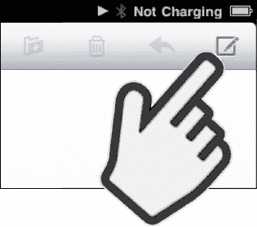

### 指定收件人

根据收件人是否在你的 iPad `通讯录`中，你有几种选择收件人的方式：

**选项 1**：输入某人名字的几个字母，然后按`空格`键，再输入此人姓氏的几个字母。此人的名字应会出现在列表中；轻点该名字即可选择此联系人。

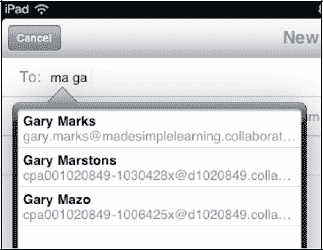

**选项 2**：输入一个电子邮件地址。注意键盘上的`@`和`句号`（`.`）键，它们有助于你的输入。

**提示：** 按住`句号`键可以查看 `.com`、`.edu`、`.org` 以及其他电子邮件域名后缀。

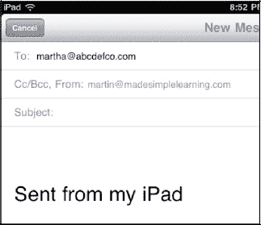

**选项 3**：轻点`加号`（`+`） 以查看完整的`通讯录`列表，然后搜索或从中选择一个名字。

如果你想使用不同的联系人群组，请轻点左上角的`群组`按钮。

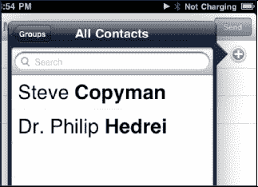

### 删除收件人

如果需要从收件人列表（`收件人:`、`抄送:` 或 `密送:`）中删除某个名字，请轻点该名字以选中它，然后按`退格`键。

**提示：** 如果你想删除最后一个输入的收件人（且光标位于该名字旁边），请按一次`删除`键以高亮该名字，再按一次即可将其删除。

### 添加抄送或密送收件人

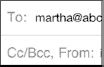 若要添加`抄送:`(`Cc:`) 或`密送:`(`Bcc:`) 收件人，你需要轻点电子邮件顶部`收件人:`字段正下方的`抄送:/密送:`字段。这样做会打开所轻点的字段。

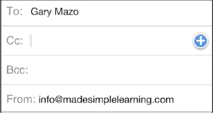

### 更改发送邮件的账户

如果你设置了多个电子邮件账户，iPad 将使用被设为默认账户的账户。（此项在`设置` -> `邮件、通讯录、日历` -> `默认账户`中设置，位于`邮件`部分的底部。）

请按照以下步骤更改发送邮件的账户：

1.  轻点电子邮件的`发件人:`字段以将其高亮。
2.  轻点一个新的电子邮件账户以将其选中。

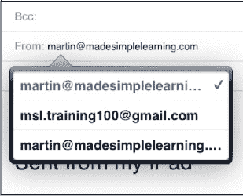

### 输入主题

现在你需要为电子邮件输入一个主题。请按照以下步骤操作：

1.  触摸`主题:`行，并为电子邮件的`主题:`字段输入文本。
2.  按`回车`键或轻点电子邮件的`正文`区域，将光标移至`正文`部分。

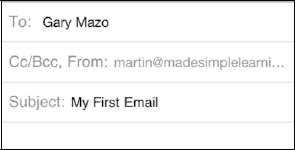

### 输入邮件内容

现在光标位于电子邮件的正文中（主题行下方），你可以开始输入你的电子邮件内容。

### 电子邮件签名

默认的电子邮件签名显示在右侧的图片中：`发自我的 iPad`。

**提示：** 你可以将此签名更改为任何你想要的内容；请参阅本章后面的“更改电子邮件签名”部分。

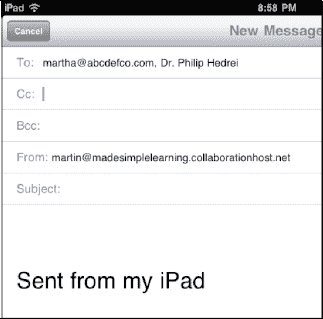

**提示：** 如果你的手比较大，键盘更大时可能更容易输入。一旦你习惯了用双手在大键盘上输入，你会发现这比用一根手指输入快得多。同时，你还会看到自动大写和自动更正功能。了解更多输入技巧，请参阅第 2 章：“输入技巧、复制/粘贴与搜索”以获取更多输入技巧。

### 发送邮件

输入完邮件内容后，轻点右上角的蓝色`发送`按钮。你的邮件将被发送，并且你应该会听到 iPad 的发送邮件声音，这确认了你的邮件已发送。你可以在第 7 章：“个性化设置和保护你的 iPad”中的“调整 iPad 声音”部分了解如何启用或禁用此声音。

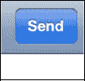

### 保存为草稿以便稍后发送

如果你尚未准备好发送邮件，但想将其保存为草稿以便稍后发送，请按照以下步骤操作：

1.  按照之前所述，撰写你的邮件。
2.  按下左上角的`取消`按钮。
3.  选择屏幕底部的`保存草稿`按钮。

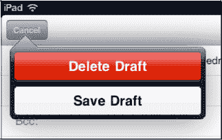

稍后，当你想要找到并发送草稿邮件时，请按照以下步骤操作：

1.  打开撰写该邮件所用的电子邮件账户中的`草稿`文件夹。有关进入`草稿`文件夹的帮助，请参阅本章前面的“在邮件文件夹中导航”部分。
2.  轻点`草稿`文件夹中的电子邮件以将其打开。
3.  轻点邮件中的任意位置以进行编辑。
4.  轻点`发送`按钮。

### 检查已发送邮件

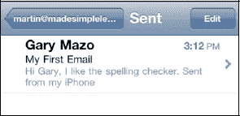

请按照以下步骤确认邮件是否正确发送：

1.  轻点左上角的`电子邮件账户名称`按钮，以查看你刚刚用于发送邮件的账户的邮件文件夹。
2.  轻点`已发送`文件夹。
3.  确认列表中你看到的第一封邮件就是你刚刚撰写并发送的那一封。

**注意：** 只有当你在 iPad 上实际发送或删除了该账户的邮件时，你才会看到`已发送`和`废纸篓`文件夹。如果你的电子邮件账户是 IMAP 账户，你可能会看到比本章描述的更多文件夹。

## 处理电子邮件附件

有些电子邮件附件会被 iPad 自动打开，以至于你甚至没有注意到它们是附件。这些附件的示例包括 Adobe 的可移植文档格式（`PDF`）文件（由`Adobe Acrobat`和`Adobe Reader`等应用程序使用）以及某些类型的图像、视频和音频文件。你可能还会收到其他类型的文档作为附件，例如 Apple 的`Pages`、`Numbers`和`Keynote`文件，或者 Microsoft 的`Word`、`Excel`和`PowerPoint`文件。这些文件需要你手动打开。

**注意：** 你可以使用`快速查看`功能预览许多类型的文件——例如文字处理和电子表格文档。但是，如果你想要编辑文件，则需要使用`在...中打开`功能，在允许编辑的应用程序中打开它。

### 识别何时有附件

任何带有附件的电子邮件都会在发件人姓名旁边有一个小的`回形针`图标，如右侧所示。当你看到该图标时，就知道其中包含附件。

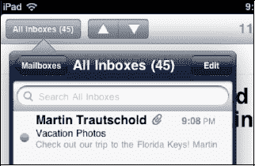

### 接收自动打开的附件

现在假设你收到了一些图片或一个单页的 PDF 文件。（多页 PDF 文件需要你轻点才能打开。）

当你打开带有此类附件的邮件时，你会直接在邮件正文下方看到它。

在这个示例中，邮件附带了若干张自动打开的图片。我们只需向下滑动即可查看所有图片。

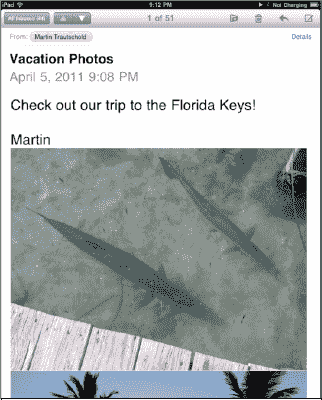

### 保存收到的图片

假设你喜欢收到的一张或多张图片。为了将图片保存到你的 iPad，请长按任意图片，直到出现一个弹出窗口。

在这个示例中，我们有四张图片，因此我们看到`存储图像`、`存储 4 张图像`和`拷贝`。

这些图像将存放在你的`照片`应用程序中的`已存储的照片`相册中。有关`照片`应用程序的更多信息，请参阅第 16 章：“iPad 摄影”。

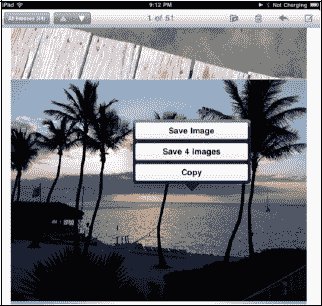

