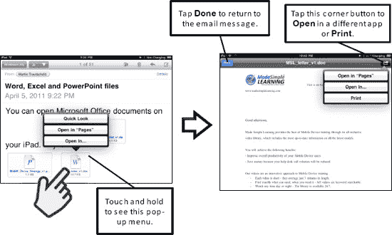
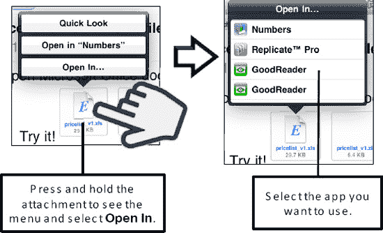

# 打开邮件附件

其他类型的附件（如电子表格、文字处理文档和演示文稿文件）不会像我们刚刚描述的那样直接在邮件正文中打开，而需要手动打开。

## 轻点进入“`Quick Look`（快速查看）”模式

请按照以下步骤在“`Quick Look`（快速查看）”模式下打开附件：

1. 打开带有附件的邮件（参见图 13–8）。
2. 快速轻点附件，即可立即在“`Quick Look`（快速查看）”模式下打开它。你可以在文档中自由导航。请记住，你可以进行缩放以及向上或向下滑动屏幕。
3. 如果你打开一个包含多个标签页或工作表的电子表格，你会看到顶部有标签页。触摸另一个标签页即可打开该工作表。
4. 查看完附件后，轻点文档一次以调出控件，然后轻点左上角的`Done`（完成）。
5. 如果你安装了能够打开当前所查看附件类型（本例中为电子表格）的应用，那么你会看到右上角出现一个`Open In`（在...中打开）按钮。轻点`Open In`（在...中打开）按钮，即可在另一个应用中打开此文件。

**图 13–8.** *通过轻点附件快速查看*

## 在其他应用中打开文档

你可能希望在其他应用程序中打开附件。例如，你可能想在`iBooks`、`Stanza`或`GoodReader`中打开一个`PDF`文件。请按照以下步骤操作：

1. 打开邮件。
2. 长按附件，直到出现弹出窗口。
3. 选择`Open In`（在...中打开）选项。
4. 从列表中选择你想使用的应用程序（参见图 13–9）。
5. 最后，你可以编辑文档、保存它，并通过电子邮件将其回复给发件人。

**图 13–9.** *在其他应用中打开和查看附件*

## 查看视频附件

你可能会收到以附件形式发送的视频邮件。某些类型的视频可以在你的 iPad 上观看（有关支持的视频格式列表，请参阅本章后面的“支持的电子邮件附件类型”部分）。请按照以下步骤打开视频附件：

1. 轻点视频附件以打开它，并在视频播放器中观看。
2. 观看完视频后，轻点屏幕以调出播放器控件。
3. 轻点左上角的`Done`（完成）按钮，返回邮件。

