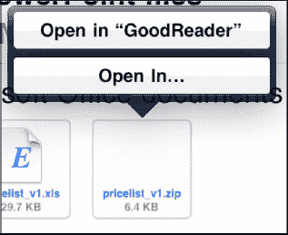
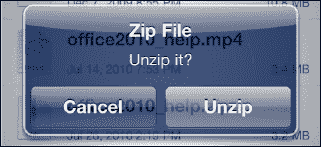
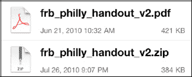

# 打开和查看压缩的`.zip`文件

除非你安装了诸如`GoodReader`之类的应用程序，否则你的 iPad 将无法打开和查看`.zip`格式的压缩文件。在本书出版时，`GoodReader`仍然是一个免费应用程序，非常值得安装。请按照以下步骤使用`GoodReader`：

**提示：** 你将学习如何安装和使用`GoodReader`，详见第 26 章：“新媒体：阅读报纸、杂志等。”

1. 从 App Store 安装免费的`GoodReader`。
2. 打开带有`.zip`文件附件的邮件。
3. 长按`.zip`附件，直到屏幕底部出现一个带有“`Open in GoodReader`（在 GoodReader 中打开）”字样的按钮的弹出窗口。轻点该按钮，即可在`GoodReader`中打开`.zip`文件。

    

    **注意：** 不要只是快速轻点附件来打开它。在本书出版时，这样做会导致出现空白白色或黑色屏幕，并且没有任何反应。请确保长按附件，直到看到按钮弹出。

4. 此时`GoodReader`应该会打开，你的`.zip`文件应位于文件列表的顶部。要打开或解压`.zip`文件，请轻点该文件并选择`Unzip`（解压）按钮。

    

5. 现在你应该能看到解压后的文件——在本例中，是一个 Adobe `.pdf`文件，位于`.zip`文件上方的文件列表中。
6. 轻点该解压后的文件即可查看它。

    

7. 阅读完附件后，双击你的`Home`（主屏幕）按钮，然后轻点`Mail`（邮件）图标，返回阅读你的电子邮件。

