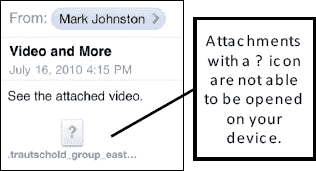

# 打开邮件附件时遇到的问题

某些类型的附件无法在你的 iPad 上打开。此类附件会显示一个`Question Mark`（问号）（`?`）图标。在此图中，我们尝试点击一个类型为`winmail.dat`的附件，但失败了。

## 支持的电子邮件附件类型以及音频/视频格式

你的 iPad 支持以下文件类型作为附件：

- `.doc`和`.docx`（`Microsoft Word`文档）
- `.htm`和`.html`（网页）
- `.key`（`Keynote`演示文稿文档）
- `.numbers`（`Apple Numbers`电子表格文档）
- `.pages`（`Apple Pages`文档）
- `.pdf`（Adobe 可移植文档格式，用于`Adobe Acrobat`和`Adobe Reader`等程序）
- `.ppt`和`.pptx`（`Microsoft PowerPoint`演示文稿文档）
- `.txt`（文本文件）
- `.vcf`（联系人文件）
- `.xls`和`.xlsx`（`Microsoft Excel`电子表格文档）
- `.mp3`和`.mov`（音频和视频格式）
- `.zip`（压缩文件）。请注意，只有在你安装了能够读取这些文件的应用（例如`GoodReader`）时才能读取（参见本章中的“打开和查看压缩的 .zip 文件”部分）。

你的 iPad 还支持以下音频格式：

- HE-AAC (V1)
- AAC（16 至 320 Kbps）
- 受保护的 AAC（来自 iTunes Store）
- MP3（16 至 320 Kbps）
- MP3 VBR
- Audible（格式 2、3 和 4）
- Apple Lossless
- AIFF
- WAV

你的 iPad 还支持以下视频格式：

- H.264 视频，最高可达 720p，每秒 30 帧
- Main Profile level 3.1，搭配最高 160 Kbps、48kHz 的 AAC-LC 音频
- `.m4v`、`.mp4`和`.mov`文件格式中的立体声音频
- MPEG-4 视频，最高可达 2.5 Mbps，分辨率 640 x 480 像素，每秒 30 帧
- Simple Profile，搭配最高 160 Kbps、48kHz 的 AAC-LC 音频，`.m4v`、`.mp4`和`.mov`文件格式中的立体声音频
- Motion JPEG (M-JPEG)，最高可达 35 Mbps，分辨率 1280 x 720 像素，每秒 30 帧，音频格式为 ulaw
- `.avi`文件格式中的 PCM 立体声音频

