# 搜索电子邮件

iPad 内置了一些实用的搜索功能，可以帮助你查找电子邮件。你可以通过`From`（发件人）、`To`（收件人）、`Subject`（主题）或`All`（全部）字段在你的`Inbox`（收件箱）中进行搜索。这有助于你快速精准地定位到想要查找的邮件。

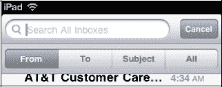

### 激活电子邮件搜索

您可以搜索单个收件箱，或通过进入通用收件箱（`所有收件箱`）来同时搜索所有收件箱。

如果向上滚动到顶部，您现在将在`收件箱`顶部看到熟悉的`搜索`栏（请参见图 13–10）。

如果您的电子邮件帐户支持此功能，您还可以在服务器上搜索电子邮件消息。在撰写本书时，部分受支持的可搜索电子邮件帐户类型包括`Exchange`、`MobileMe`和`Gmail IMAP`。请按照以下步骤在服务器上搜索您的电子邮件：

1.  点击`搜索`栏，查看`搜索`栏下方出现的新软键菜单。
2.  输入您要搜索的文本。
3.  点击`搜索`窗口下方的某个软键：
    1.  `发件人`：仅搜索发件人的电子邮件地址。
    2.  `收件人`：仅搜索收件人的电子邮件地址。
    3.  `主题`：仅搜索消息的`主题`字段。
    4.  `全部`：搜索消息的所有部分。

例如，假设我想在收件箱中搜索一封来自 Martin 的电子邮件。我会在`搜索`框中输入 Martin 的名字，然后点击`发件人`。我的收件箱随后会被过滤，仅显示来自 Martin 的电子邮件。

**注意：**如果您有多个电子邮件帐户，则无法同时搜索所有收件箱，因为您的 iPad 一次只允许您搜索一个收件箱。要在 iPad 上进行更全局的搜索，请使用第 2 章：“输入技巧、复制/粘贴和搜索”中“使用 Spotlight 搜索查找内容”一节介绍的`Spotlight 搜索`功能。

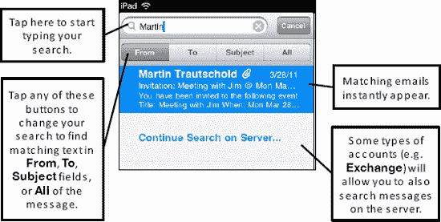

**图 13–10.** *使用`发件人`、`收件人`、`主题`或`全部`文本字段搜索电子邮件*

### 微调您的电子邮件设置

您可以使用`设置`应用中提供的众多选项，在 iPad 上对您的电子邮件帐户进行微调。

请按照以下步骤更改这些设置：

1.  点击`设置`图标。
2.  点击`邮件、通讯录、日历`。

以下部分将说明您可以进行的调整。

#### 自动检索电子邮件（获取新数据）

除了`高级`选项之外，您还可以使用`邮件`设置来配置电子邮件被获取（或称*拉取*）到 iPad 的频率。默认情况下，当服务器*推送*新邮件或其他通讯录或日历更新时，您的 iPad 会自动接收。

您可以按照以下步骤调整此设置：

1.  点击`设置`图标。
2.  点击`邮件、通讯录、日历`。
3.  在列出的电子邮件帐户下，点击`获取新数据`。

    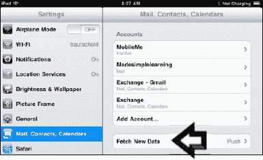

4.  将`推送`设置为`开`（默认），以自动让服务器推送数据。将其设为`关`以节省电池电量。
5.  调整从服务器拉取数据的时间计划。这决定了应用从服务器拉取新数据的频率。

**注意：**如果您将此选项设置为`每 15 分钟`，您将更频繁地收到更新，但与设置为`每小时`相比，会牺牲电池续航时间。

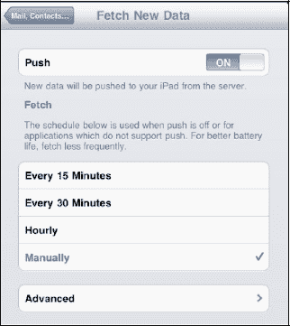

如果您只想打开 iPad 就看到有新消息，那么自动检索功能非常方便；否则，您需要记得手动检查。

##### 高级推送选项

在`获取新数据`屏幕底部，`每小时`和`手动`设置的下方，您可以点击`高级`按钮，查看一个新屏幕，其中列出了您所有的电子邮件帐户。

点击任意电子邮件帐户以调整其设置。

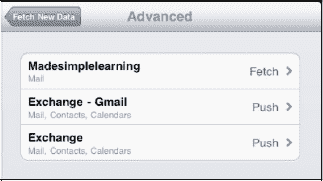

大多数帐户可以按照您设定的计划`获取`，或设置为`手动`。`手动`选项要求您使用`更新`按钮来检索数据。此屏幕使您能够为您设置的每个帐户调整`获取`、`手动`，某些情况下还有`推送`的设置。

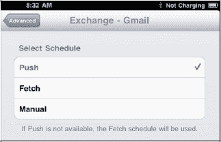

#### 调整您的邮件设置

在`帐户`部分下，您可以在`邮件`中看到所有列出的电子邮件设置。`默认`设置可能对您来说已经适用；但如果需要调整其中任何一项，您可以按照以下步骤操作。

`显示`：这设置了从服务器拉取的邮件数量。您可以指定 25 到 200 条消息（默认为最近的 50 条消息）。

`预览`：此选项允许您设置在`收件箱`预览中，除了`主题`之外还显示多少行文本。您可以将此值从`无`调整为`5 行`（默认为`2 行`）。

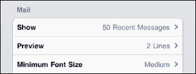

`最小字体大小`：这是首次打开邮件时显示的默认字体大小。也是您在查看邮件时允许缩放到的最小字号。您的选项有`小`、`中`、`大`、`特大`和`巨大`（默认为`中`）。

`显示收件人/抄送标签`：当此选项为`开`时，您会在收件箱中看到主题前有一个小的`收件人`或`抄送`标签。此标签显示您的地址被放置在了哪个字段中（此选项的默认状态为`关`）。

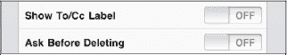

`删除前询问`：将此选项设为`开`，则每次尝试删除消息时都会询问您（默认为`关`）。

`载入远程图像`：此选项允许您的 iPad 加载某些电子邮件消息中包含的所有图形（远程图像）（此选项的默认值为`开`）。

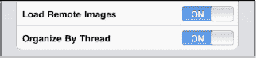

`按主题整理`：此选项将相关的电子邮件分组在一起。它只显示一条消息，旁边带有一个数字。该数字表示存在多少封相关的邮件。此功能为您提供了一个将所有讨论集中在一个位置的好方法（此选项的默认值为`开`）。

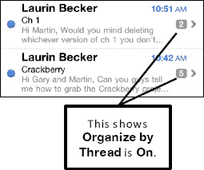

`始终密送给自己`：此选项会向您从 iPad 发送的每封电子邮件发送一封密件抄送（`Bcc:`）到您的电子邮件帐户（此选项的默认值为`关`）。

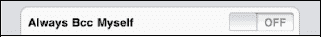

#### 更改您的电子邮件签名

默认情况下，您发送的电子邮件会显示“发自我的 iPad”。请按照以下步骤更改电子邮件的`签名`行：

1.  点击`签名`选项卡。

    

2.  点击`清除`按钮，然后输入您希望出现在所有从 iPad 发送的电子邮件底部的新电子邮件签名。

    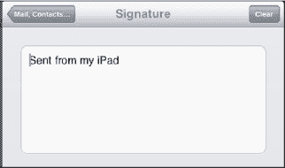

3.  完成编辑`签名`字段后，点击左上角的`邮件、通讯录…`按钮。这将使您返回到`邮件`设置屏幕。

#### 更改您的默认邮件帐户（发送自）

如果您在 iPad 上设置了多个电子邮件帐户，您应该将其中一个（通常是您最常用的那个）设置为您的`默认帐户`。当您从`邮件`屏幕选择`写邮件`时，默认帐户总是被选中。此外，如果您在其他应用中点击电子邮件地址来撰写新邮件，也将选择此`默认帐户`。请按照以下步骤更改您默认发送邮件的电子邮件帐户：

1.  点击`默认帐户`选项，您将看到所有电子邮件帐户的列表。

    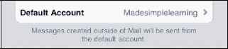

2.  点击您希望用作`默认帐户`的那个。

    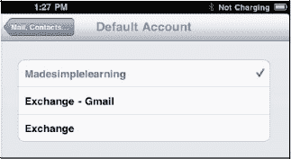

3.  完成后，点击`邮件、通讯录…`按钮以返回`邮件`设置菜单。

#### 切换接收和发送电子邮件的提示音

您可能会注意到每次发送或接收电子邮件时都会有点音效。您听到的是 iPad 上的默认设置。

如果您想禁用此选项或更改它，可以在`设置`程序中进行：

1.  点击您的`设置`图标。
2.  点击左侧栏中的`通用`。
3.  点击右侧栏中的`声音`。
4.  您将看到用于打开或关闭音效的各种开关。点击`新邮件`和`已发送邮件`以调整`开`或`关`选项。

    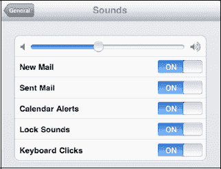

### 高级电子邮件选项

**注意：**  设置为 Exchange、IMAP 或 MobileMe 的电子邮件帐户将不会显示此**高级**电子邮件设置界面。此设置仅适用于 POP3 电子邮件帐户。

要进入每个电子邮件帐户的**高级**选项，请按照以下步骤操作：

1.  点击**设置**图标。
2.  点击**邮件、通讯录、日历**。
3.  点击**帐户**下列出的一个电子邮件地址。
4.  在邮件设置弹出窗口的底部，点击**高级**按钮以调出**高级**对话框。

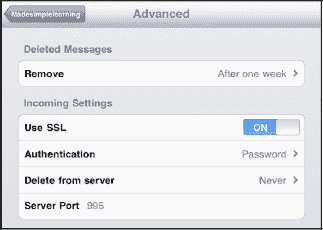

#### 删除后从 iPad 上移除电子邮件

您可以选择在删除电子邮件后，每隔多久将其从 iPad 上彻底移除。

点击**移除**选项卡，然后选择最适合您的选项；默认设置为**永不**。

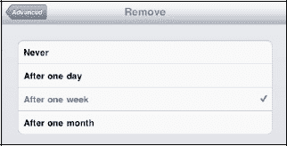

#### 使用 SSL/身份验证

`SSL`/`身份验证`功能之前已经讨论过，但**高级**电子邮件选项界面提供了另一个位置来访问特定电子邮件帐户的这些功能。

#### 从服务器删除邮件

您可以配置 iPad 来处理从电子邮件服务器上删除邮件的方式。通常，此设置会保留为**永不**，此功能将由您的主电脑处理。但是，如果您将 iPad 作为主要的电子邮件设备，则可能需要从此设备上处理该功能。请按照以下步骤使用 iPad 在服务器上删除已删除的邮件：

1.  点击**从服务器删除**选项卡，选择最适合您需求的功能：**永不**、**七天**或**从收件箱移除时**。
2.  默认设置为**永不**。如果您想选择**七天**，此选项应能为您提供足够的时间，在电脑和 iPad 上查看邮件，然后决定保留哪些内容以及删除哪些内容。

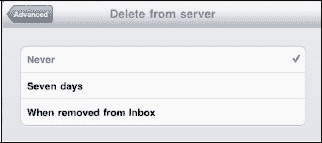

#### 更改传入服务器端口

正如您之前对**传出服务器端口**所做的设置一样，如果您在接收电子邮件时遇到问题，您可以更改**传入服务器端口**。您遇到的问题与接收邮件的端口相关的可能性非常小，这意味着您很少需要更改此号码。如果您的电子邮件服务提供商给您提供了一个不同的号码，只需点击数字并输入一个新的端口。**传入服务器端口**的值通常为 `995`、`993` 或 `110`；但是，端口值也可能是其他数字。

### 电子邮件问题故障排除

通常，您 iPad 上的电子邮件功能运行完美无瑕。但有时——无论是服务器问题、网络连接问题还是电子邮件服务提供商的要求——电子邮件可能无法像您希望的那样顺畅运行。

通常情况下，只需调整一个简单的设置或重新输入一次密码即可解决。

如果您尝试了下面的一些故障排除技巧后，电子邮件仍然无法正常工作，那么您的电子邮件服务器可能只是暂时停机。请与您的电子邮件服务提供商联系，确认您的邮件服务器已启动并正常运行；您也可以检查一下您的提供商最近是否做了任何会影响您设置的更改。

**提示：** 如果以下的技巧无法解决问题，请查看第 28 章：“故障排除”以获取更多有用的提示和资源。

#### 无法接收或发送电子邮件

如果您无法发送或接收电子邮件，第一步应该是确认您已连接到互联网。查看**主屏幕**左上角的 Wi-Fi 或 3G 连接状态（有关详细信息，请参阅“快速入门指南”中的“如何知道我已连接？”部分）。

有时，您需要调整传出端口才能正常发送电子邮件。请按照以下步骤操作。

1.  点击**设置**。
2.  点击**邮件、通讯录和日历**。
3.  点击**帐户**下出现发送消息问题的电子邮件帐户。
4.  点击 **SMTP** 并确认您的传出邮件服务器设置正确；同时检查它是否已设置为**开**。
5.  点击顶部的**传出邮件服务器**并验证所有设置，例如**主机名**、**用户名**、**密码**、**SSL**、**身份验证**和**服务器端口**。您也可以尝试将**服务器端口**的值设为 `587`、`995` 或 `110`；有时这会有帮助。
6.  点击**完成**，然后点击左上角的电子邮件帐户名称，返回此帐户的**电子邮件**设置界面。
7.  向下滚动到底部，然后点击**高级**。
8.  在此界面中，您也可以尝试为服务器端口设置不同的值，例如 `587`、`995` 或 `110`。如果这些值不起作用，请联系您的电子邮件服务提供商以获取不同的端口号并验证您的设置。

好的，作为高级文档工程师和翻译员，我将遵循您的注意事项和示例，将给定的英文文本翻译成中文。

