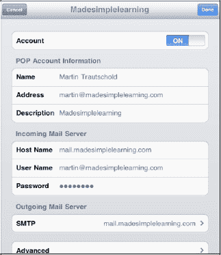
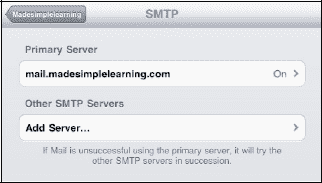
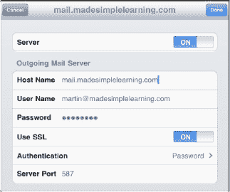
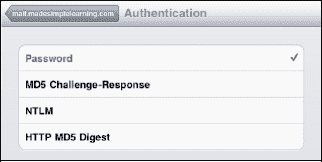

# 验证您的邮件帐户设置

请按照以下步骤验证您的帐户设置：

1.  点击**设置**图标。
2.  点击**邮件、通讯录、日历**。
3.  如果您收到来自某个特定电子邮件帐户的错误信息，请触摸该帐户。
4.  确认**帐户**设置为**开启**。
5.  确认您的电子邮件**地址**在 **POP 帐户信息**部分是正确的。
6.  确认**主机名**、**用户名**和**密码**字段中的所有信息都是正确的。
7.  如果您在尝试发送电子邮件时收到错误信息，问题很可能出在**发件服务器**区域的 **SMTP** 设置中。
8.  点击 **SMTP** 以调整更多设置。

9.  触摸**主服务器**选项卡，并确保其设置为**开启**。
10. 在**主服务器**选项卡下方，您会看到用于您的其他电子邮件帐户的其他 SMTP 服务器。一种选择是使用您已知正常工作的其他 SMTP 服务器之一。在这种情况下，只需触摸该服务器的选项卡，并将其开关转到**开启**。

11. 点击**主服务器**地址以查看和调整更多设置。
12. 确认**主服务器**是**开启**状态。
13. 联系您的电子邮件服务提供商以验证其他设置，例如**主机名**、**用户名**、**密码**、**SSL**、**身份验证**和**服务器端口**。我们将在后续章节中分享有关这些设置的更多详细信息和一些技巧。
14. 完成后点击**完成**按钮，然后点击左上角列有您电子邮件帐户的按钮返回上一屏幕。或者，您可以点击**主屏幕**按钮退出到您的**主屏幕**。

### 使用 SSL

某些 SMTP 服务器需要使用安全套接字层（“SSL”）安全性。如果您在发送电子邮件时遇到问题，并且**使用 SSL** 开关设置为**关闭**，请尝试将其设置为**开启**，看看是否有帮助。

### 更改身份验证方法

在 SSL 开关下方是一个**身份验证**选项卡。通常，**密码**是该开关的正确设置。我们不建议您更改此设置，除非您的电子邮件服务提供商有具体指示要求更改。

### 更改服务器端口

通常情况下，当您配置电子邮件帐户时，服务器端口会自动为您设置。但有时，可能需要根据您的互联网服务提供商 (ISP) 进行一些微调。

如果您从 ISP 那里获得了特定设置，您可以更改服务器端口，以尝试解决您可能遇到的任何错误。请按照以下步骤更改**服务器端口**设置：

1.  返回到您帐户的特定 **SMTP** 设置。
2.  触摸**主服务器**的选项卡，就像您在“验证邮件帐户设置”部分中所做的那样。
3.  向下滚动到**服务器端口**，并触摸屏幕上显示的数字。
4.  这将会弹出一个键盘，您可以使用它输入一个新的端口号（由您的 ISP 提供）。大多数情况下，ISP 提供的端口号是 995、993、587 或 110；但是，如果给您的是不同的数字，直接输入即可。
5.  完成后，触摸左上角的 **SMTP** 选项卡返回上一屏幕。

