# 第 14 章

##### 使用通讯录

您的 iPad 让您可以立即访问所有重要信息。就像您的电脑或智能手机一样，您的 iPad 可以存储数千个联系人以便快速检索。在本章中，我们将向您展示如何添加新联系人（包括如何从电子邮件地址添加），如何通过添加新字段来自定义您的联系人，如何通过群组来组织您的联系人，如何快速搜索或浏览联系人，甚至如何使用 iPad 上的**地图** App 来显示联系人的位置。我们还将向您展示如何自定义您的**通讯录**视图，使其按照您喜欢的方式进行排序和显示。最后，您将学习一些故障排除技巧，当您遇到困难时，这些技巧可以为您节省时间。

iPad 的美妙之处在于它如何集成您的所有应用程序，因此您可以直接从**联系人**录入屏幕发送电子邮件和定位您的联系人。

### 将联系人加载到 iPad 上

在第 3 章：“使用 iTunes 同步您的 iPad”中，我们向您展示了如何使用 Mac 或 Windows 电脑上的 **iTunes** App 将联系人加载到 iPad 上。您也可以使用第 4 章：“其他同步方法”中描述的 Exchange (Active Sync) 或 MobileMe 服务。

### 您的通讯录何时最有用？

当满足以下两个条件时，**通讯录** App 最有用：

1.  其中包含大量姓名和地址。
2.  您能够轻松找到所需内容。

#### 改进通讯录的两个简单规则

我们有几条基本规则，可以帮助您使 iPad 上的**通讯录**列表更有用。

**规则 1：将所有内容都添加到通讯录 App 中。**

> 您永远不知道什么时候会需要那个不起眼的餐馆名称、那个水管工的电话号码或其他商业或专业联系人的信息。

**规则 2：在添加条目时，务必考虑将来如何找到它们（名字、姓氏、公司）。**

> 我们在本章中提供了许多提示和技巧，帮助您输入姓名，以便在需要时可以立即找到它们。

**提示：** 以下是查找餐馆的一个好方法：每当您将一家餐馆输入到**通讯录**列表时，请务必将“restaurant”这个词放入公司名称字段，即使它本身不是餐馆名称的一部分。然后，当您输入字母“rest”时，您应该立即能找到所有的餐馆！

## 直接在 iPad 上添加新联系人

您始终可以在 iPad 上直接添加联系人。当您远离电脑——但随身带着 iPad——并且需要将某人添加到您的**通讯录**列表时，这非常方便。操作非常简单；我们将在下一节中向您展示如何操作。

### 点击加号添加联系人

从您的**主屏幕**开始，触摸**通讯录**图标，您将看到**所有联系人**列表（参见图 14-1）。点击**通讯录**列表右下角的**加号 (+)** 以添加新联系人。

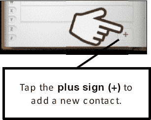

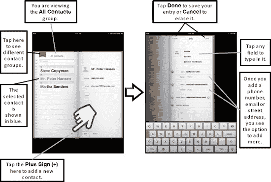

**图 14-1.** *在 iPad 上输入联系人*

点击任一字段（名、姓、公司等）以输入信息。

**提示：** 请记住，**通讯录**列表的搜索功能会使用名字、姓氏和公司字段。当您添加或编辑联系人时，在公司字段中添加一个特殊关键词可以帮助您以后找到特定联系人。例如，在公司字段中添加“Cece 的朋友”这个词，可以使用搜索功能快速找到 Cece 的所有朋友。

### 添加新字段和更改标签

您会注意到，添加联系人的初始屏幕只显示几个用于输入信息的字段：移动（电话号码）、电子邮件（电子邮件地址）、主页（网页地址）、添加新地址（街道地址）、备注和添加字段。

Apple 特意这样做是为了让屏幕不那么杂乱。您会注意到，当您开始输入电话号码、电子邮件地址或街道地址时，在您正在输入的字段下方会立即出现一个新字段。这使您可以轻松添加多个项目。如果您愿意，可以点击字段名称（例如，移动）并将其更改为其他名称（例如，住宅或工作）。

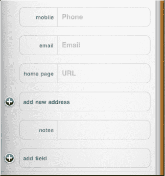

### 添加联系人照片

通过照片来识别联系人会更容易。因此，你可能希望为联系人添加照片（如果有的话）。要为联系人添加照片，请点击“姓”和“名”字段旁边的**添加照片**按钮。

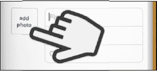

如果你在更改照片，进入“编辑联系人”模式后，会在现有照片底部看到**编辑**选项。

点击**添加照片**按钮后，你将看到可以进行以下操作：

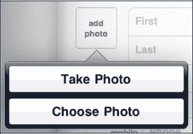

- **拍照**（适用于带摄像头的 iPad 2）
- **选取照片**

如果已存在照片，你还会看到以下选项：

- **编辑照片**
- **删除照片**

如果你选择**选取照片**，则可以导航到你的某个相册，并通过点击来选择一张照片。

你会注意到照片的顶部和底部变为灰色，并且你可以用手指拖动照片来调整位置。你还可以使用双指捏合操作来放大或缩小。

当照片调整到满意位置后，只需点击右上角的**使用**按钮，该照片就会设置为联系人的头像。

### 添加新电话号码

在“电话”字段中点击，然后使用数字键盘输入电话号码。

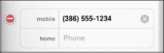

**提示：** 无需担心括号、破折号或点号；iPad 会自动将号码调整为正确格式。只需输入区号和号码的数字即可。如果你知道国家代码，也最好一并输入。

假设你刚刚输入的电话号码不是手机，而是其他类型的电话。好消息是，你可以更改它。点击该字段的标签——在本例中是**手机**——然后将标签改为**住宅**、**工作**或其他类型（请参阅图 14–2）。

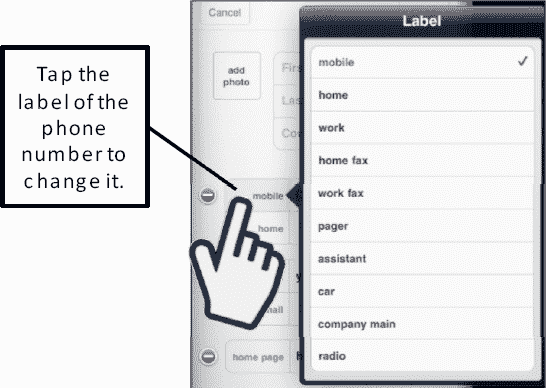

**图 14–2.** *更改电话号码的字段标签*

**提示：** 有时你需要在电话号码中添加一个暂停。例如，当你拨打的组织电话需要先拨主号再拨分机号时，就需要这样做。这在 iPad 上很容易实现。只需在主号和分机号之间添加一个逗号，如下所示：

`386-555-1234, 19323`

如果你拨打这个号码（例如从你的 iPhone 上拨打），手机将先拨主号，暂停两秒，然后拨打分机号。如果需要更长的暂停时间，只需添加更多逗号即可。

### 添加电子邮件地址和网站地址

点击**电子邮件**标签，输入联系人的电子邮件地址。你还可以点击电子邮件地址左侧的标签，选择这是住宅、工作还是其他类型的电子邮件地址（有时你无法更改此标签，具体取决于你同步的联系人系统类型）。

在电子邮件字段下方，你还会找到一个“主页”字段，可以在其中输入联系人的网站地址。

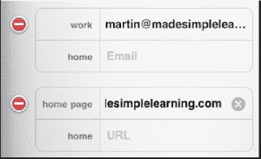

### 添加新联系人字段

如果你需要为联系人条目添加更多字段，只需点击“联系人”条目屏幕底部的**添加字段**按钮。

接下来，选择任意可用字段，以添加到该特定联系人中。

例如，要为此联系人添加“生日”字段，只需点击**生日**。

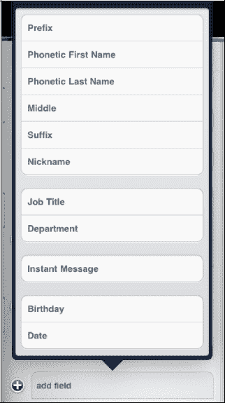

当你点击**生日**时，会看到一个滚轮。你可以旋转滚轮到对应日期，将生日添加到联系人信息中。

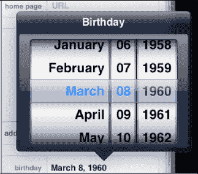

**提示：** 假设你在公交车站遇到了某位你想记住的人。你当然应该输入这位新朋友的名和姓（如果你知道的话）。但你还应该在“公司”字段中输入“公交车站”这个词。这样，当你输入“公交”或“车站”这些字母时，就能立刻找到所有你在公交车站遇到的人，即使你想不起他们的名字！

### 添加街道地址

要添加街道或实体地址，请点击“添加新地址”字段。屏幕上会出现所有必填字段（街道、城市、州、邮政编码和国家）。与处理电话号码时一样，你可以更改标签，以显示这是住宅、工作还是其他地址。

完成后，只需点击“新建联系人”表单右上角的**完成**按钮。

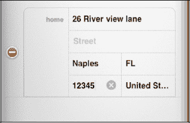

**提示：** 如果你刚搬到一个新社区，记住每个人的名字可能会让人望而生畏。一个好的做法是，为你遇到的每位邻居，在“公司”字段中添加“邻居”一词。然后，要快速调出所有邻居的信息，只需输入“邻居”这两个字，就能找到所有你遇到的人！

### 关联名片（统一联系人）

**注意：** 仅当你在 iPad 上设置了至少两个独立的联系人账户，并且不同账户中有重名的联系人的“姓”和“名”（但前缀、后缀或中间名不能不同）时，**“关联”**（**“统一联系人”** 视图）功能才会出现。例如，如果你有一个 Gmail 账户和一个 Exchange 或 iTunes 同步的联系人账户，且两者都有名为“John Smith”的联系人，那么 iPad 上的**“通讯录”**应用将在**“编辑”**屏幕底部显示**“关联”**选项，如本节所示。

随着你的**“通讯录”**列表随时间增长，最终出现多个包含部分信息的重复联系人条目是很常见的。例如，你可能根据某人的电子邮件地址或手机号添加了一个新联系人，但之前已经用略有不同的名字（例如，**Peter** 与 **Pete**）保存了他的信息。

在 iPad 上，你可以合并或*关联*两个或多个名片，以查看 iPad 所谓的*统一联系人*中的所有信息。请按照以下步骤来关联名片：

1.  选择其中一个重复的联系人条目，然后轻点**“联系人”**详情屏幕下的**“编辑”**按钮。

    

2.  进入编辑联系人界面后，轻点屏幕底部的**“关联名片”**按钮（一个带加号的**“人物”**图标）。
3.  接下来，找到并轻点正确的联系人。你可以通过轻点顶部的**“群组”**按钮选择其他群组，使用顶部的**“搜索”**窗口，或向上或向下滑动来查找联系人。

    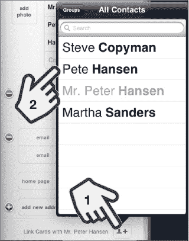

4.  现在你可以看到所选联系人的详细信息，并通过轻点右上角的**“关联”**来确认关联联系人。如果这不是你要关联的联系人，请按右上角的**“所有联系人”**按钮并选择另一个联系人。

    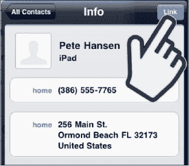

5.  要关联更多联系人或取消关联联系人，请轻点**“联系人”**屏幕底部的**“关联和取消关联联系人”**按钮（一个旁边带有数字的**“人物”**图标）。

    

6.  你可以识别出已关联的联系人，因为屏幕顶部显示的不再是**“信息”**，而是**“统一信息”**。轻点右上角的**“完成”**按钮以保存关联操作。

完成后，对于所有关联在一起的联系人，你只会看到一个单独的联系人条目。你可以通过底部的**“统一信息”**链接和显示已关联联系人数量的**“人物”**图标（参见图 14–3）来识别这些已关联或*统一*的联系人。

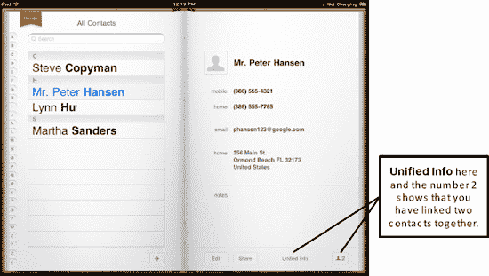

**图 14–3.** *在 iPad 上查看关联的联系人*

**提示：** 记住学龄孩子朋友父母的名字相当有挑战性。但是，在“名字”字段中，你不仅可以添加孩子朋友的名字，还可以添加其父母的名字（例如，**名字：Samantha (妈妈：Susan, 爸爸：Ron)**）。然后，在“公司”字段中，添加你孩子的名字和“学校朋友”（例如，**Cece 学校朋友**）。现在，只需在**“所有联系人”**搜索框中输入你孩子的名字，就能立刻找到你在孩子学校见过的每一个人。这样你就可以自然而然地打招呼：“你好，Susan，很高兴再次见到你！” *尽力不动声色地查看名字！*

### 共享联系人

如果有人向你要 iPad 上的联系人信息，无需复制粘贴或大声朗读。相反，你可以轻点**“共享”**按钮，以电子邮件附件的形式发送给他。附件将以 vCard (`.vcf`) 格式发送，这是一种电子名片的标准格式。请按照以下步骤共享联系人信息：

1.  打开你的**“通讯录”**列表，找到你想要发送的联系人。
2.  轻点联系人详情下的**“共享”**按钮。

    

3.  接下来，填写邮件地址并发送。现在，你已经将联系人详情以 vCard (`.vcf`) 格式全部发送出去。收件人应该能够打开电子邮件，并轻点（或保存）该联系人信息以将其添加到自己的联系人列表中——完全无需重新输入任何内容！

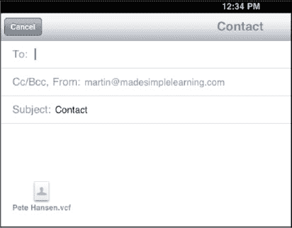

### 与联系人开始 FaceTime 视频通话

如果你喜欢使用**“FaceTime”**进行视频通话，可以直接从**“通讯录”**列表中发起。打开你的**“通讯录”**列表并找到该联系人。接着，轻点**“联系人”**详情屏幕底部的**“FaceTime”**按钮。

要了解关于**“FaceTime”**通话的所有信息，请参阅第 18 章：“FaceTime 视频消息和 Skype”。

### 将联系人设为 FaceTime 个人收藏

如果你经常与某人使用**“FaceTime”**视频聊天，你可能想将其设为*个人收藏*。为此，打开你的**“通讯录”**列表并找到该联系人。接着，轻点**“联系人”**详情屏幕底部的**“添加到个人收藏”**按钮。

### 删除联系人

有时，你想删除 iPad 上的联系人。请按照以下步骤操作：

**注意：** 请记住，如果你将联系人同步到电脑或在线**“通讯录”**列表，那么从 iPad 上删除一个联系人也会从你的电脑或在线联系人列表（例如，Google 或 Hotmail）中删除该联系人。

1.  找到你想要删除的联系人，并轻点**“联系人”**详情屏幕下的**“编辑”**按钮。

    

2.  向下滚动到**“编辑联系人”**屏幕的底部，找到**“删除联系人”**按钮。轻点**“删除联系人”**。

    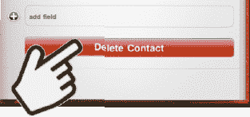

3.  此时可能会弹出一个确认对话框。轻点**“删除”**以移除该联系人。

### 搜索联系人

假设你需要查找特定的电话号码或电子邮件地址。只需按之前所述轻点你的**“通讯录”**图标，你就会在**“所有联系人”**列表顶部看到一个**“搜索”**框（参见图 14–4）。

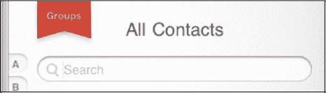

**图 14–4.** *用于搜索**“所有联系人”**的**“搜索”**框*

输入以下三个可搜索字段中任意一个的前几个字母：

*   名字
*   姓氏
*   公司

iPad 会立即开始筛选，并仅显示与键入字母匹配的联系人。

**提示：** 要进一步缩小搜索范围，请按空格键并再键入几个字母。

当看到正确的名字时，只需轻点它，该联系人的信息就会显示出来。

#### 通过轻点并滑动字母快速跳转到某个字母

如果你将手指放在屏幕左边缘的字母表上并向上或向下拖动，就可以跳转到那个字母。

#### 通过滑动搜索

如果你不想手动输入字母，只需移动手指从底部向上滑动，即可让屏幕上的联系人快速滚动。继续滑动或滚动，直到看到你想要的名字。轻点一个名字，联系人信息就会显示出来。

