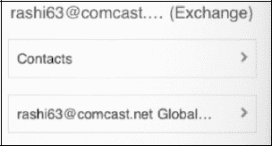
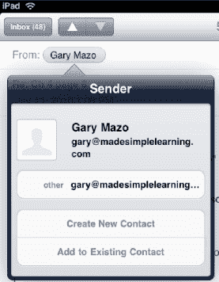
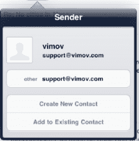
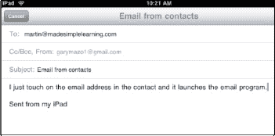
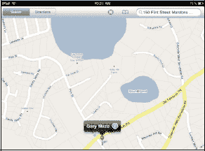
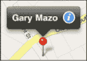
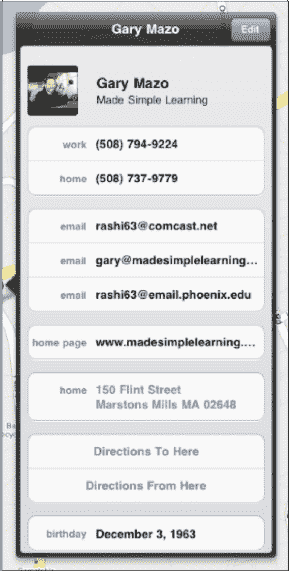
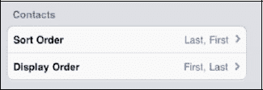
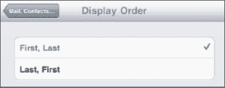

# 使用分组进行搜索

如果你在 PC 或 Mac 上按组整理了联系人，并且将 iPad 与电脑同步，那么这些组将同步到 iPad。只需触摸“所有联系人”窗口左上角的“`群组`”选项卡，然后选择要搜索的组。

此示例显示两个组——一个来自 Microsoft Exchange 帐户（即公司电子邮件帐户），另一个来自常规联系人。

如果你拥有 Exchange ActiveSync 帐户，并且你的公司已启用该功能，你的 Exchange 全局地址列表也会显示在“`群组`”选项卡下。你可以在此搜索找到公司中的任何人。

**注意：** 你无法在 iPad 上创建群组。相反，必须先在你的电脑或其他联系人列表（例如 MobileMe 网站或 `Outlook`）中创建它们，然后同步到 iPad。

## 从电子邮件添加联系人

通常，你会收到一封电子邮件，然后发现发件人不在你的通讯录中。从电子邮件中添加新联系人很简单。

打开来自你要添加到“`联系人`”列表的联系人的电子邮件。然后，在电子邮件的“发件人”字段中，触摸“`发件人:`”标签旁边的发件人姓名。

如果发件人不在你的通讯录中，你将进入一个屏幕，让你选择是将该电子邮件地址添加到现有联系人，还是创建一个新联系人。

如果你选择“`创建新联系人`”，你将进入我们之前看到的“`新建联系人`”屏幕（参见图 14–1）。

但假设这是一个人的个人电子邮件地址，并且你已经有了该人的工作电子邮件条目。在这种情况下，你可以选择“`添加到现有联系人`”并选择正确的人。然后，给这个电子邮件地址添加一个标签——此处标为*个人*。

## 向联系人发送图片

如果你想向联系人发送图片，你需要从“`照片`”应用中执行此操作（参见第 16 章：“iPad 摄影”）。

## 从联系人发送电子邮件

由于许多核心应用（`联系人`、`邮件`和`信息`）完全集成，一个应用可以轻松启动另一个应用。因此，如果你想给某个联系人发送电子邮件，请打开该联系人并点击电子邮件地址。`邮件`应用将启动，你可以撰写并发送消息给此人。

触摸“`联系人`”图标启动“`联系人`”。搜索或滑动浏览联系人，直到找到你需要的联系人。

在联系人信息中，触摸你想使用的联系人的电子邮件地址。

你会看到“`邮件`”程序自动启动，收件人字段中已填好该联系人的姓名。输入消息并发送。

## 在地图上显示联系人地址

iPad 的一大优势是与“`Google 地图`”应用的集成。这在“`联系人`”应用中体现得非常明显。假设你想在地图上显示通讯录中某位联系人的家庭或工作地址。在过去（前 iPad 时代），你必须使用 Google 或 MapQuest 等其他服务，费力地重新输入或复制粘贴地址信息。这非常耗时；幸运的是，在 iPad 上你无需这样做。

只需像之前一样打开联系人。这次，触摸联系人信息底部的地址。

你的“`地图`”应用（由 `Google 地图` 提供支持）会立即加载，并在联系人的确切位置放置一个`图钉`图标。联系人姓名将出现在`图钉`上方。

触摸`图钉`顶部的选项卡以进入“`信息`”屏幕。

现在你可以选择“`路线到达这里`”或“`路线离开这里`”。

接下来，输入正确的起点或终点地址，然后触摸右下角的“`路线`”按钮。如果你决定不需要路线，只需点击左上角的“`清除`”按钮。

如果你刚刚在“`地图`”应用中输入了地址，但尚未离开“`联系人`”列表，会怎样？在这种情况下，你可以点击“`添加到联系人`”来添加此地址。

**提示：** 要返回联系人信息，请点击“`主屏幕`”按钮，然后点击“`联系人`”。

## 更改联系人排序顺序和显示顺序

与其他设置一样，“`联系人`”的选项可通过“`设置`”图标访问。

触摸“`设置`”图标，向下滚动到“`邮件、通讯录、日历`”，然后触摸该选项卡。

向下滚动，你会看到“`通讯录`”及其下方的两个选项。要更改排序顺序，请触摸“`排序顺序`”选项卡，并选择你希望联系人按名字还是姓氏排序。

你可能还想更改联系人的显示方式。以下是如何操作：你可以选择“`名字, 姓氏`”或“`姓氏, 名字`”。点击“`显示顺序`”选项卡，选择你希望联系人按名字还是姓氏顺序显示。点击左上角的“`邮件、通讯录…`”按钮以保存你的设置更改。

## 搜索全局地址列表联系人

有时你可能想要搜索全局地址列表 (GAL) 联系人。像往常一样打开“`联系人`”应用，然后触摸左上角的“`群组`”按钮。在“`群组`”列表中找到旁边带有“`全局`”的组并触摸它。如果你已连接到组织的服务器，这将允许你访问全局地址列表。

## 联系人故障排除

有时，你的“`联系人`”应用可能无法按预期工作。如果你看不到所有联系人，请回顾第 3 章：“将 iPad 与 iTunes 同步”或第 4 章：“其他同步方法”中的步骤，了解如何与“`通讯录`”应用同步。请确保你在 `iTunes` 的设置中选择了“`所有群组`”。

**提示：** 如果你正在与其他联系人应用（例如 Gmail 中的“`联系人`”）同步，请确保选择了最接近“`所有联系人`”的选项，而不是像特定组这样的子集。

### 当全局地址列表联系人未显示时

下一节针对 Microsoft Exchange 用户。有时你可能会遇到全局地址列表联系人未显示的问题。如果发生这种情况，请首先确保你已连接到 Wi-Fi 或 3G 蜂窝数据网络。

接下来，检查你的 Exchange 设置，并验证你拥有正确的服务器和登录信息。为此，请点击“`设置`”按钮，然后滚动并触摸“`邮件、通讯录、日历`”。在列表中找到你的 Exchange 帐户并触摸它以查看设置。你可能需要联系你所在组织的技术支持，以确保你的 Exchange 设置正确。

## 第 15 章

