# 您的日历

iPad 让过去挂在冰箱上的旧日历变得过时了。在本章中，我们将向您展示如何充分利用 iPad 上的`日历`应用。我们将向您展示如何安排约会、如何管理多个日历、如何更改日历视图，甚至如何处理会议邀请。

**注：** 在本章的大部分内容中，我们都会讨论将 iPad 日历与另一个日历同步，因为这样您就可以在 iPad 和其他地方访问您的日历。如果您愿意，也可以让 iPad 以*独立*模式运行，即不与任何其他日历同步。在这种情况下，我们描述的所有添加、查看和管理事件的步骤同样适用于您。但至关重要的是，您要使用 iTunes 自动备份功能（或通过无线方式同步到 Google、MobileMe 或 Exchange 日历）来保存日历副本，以防 iPad 出现问题。

### 在 iPad 上管理繁忙生活

`日历`应用是一款功能强大且易于使用的应用程序，它能帮助您管理约会、记录待办事项、设置提醒闹钟，甚至创建和回复会议邀请（适用于 Exchange 用户）。

#### 日历图标上显示的今日日期和星期

`日历`图标通常直接位于 iPad 的`主屏幕`上。您会很快注意到，`日历`图标会发生变化，显示当天的日期和星期。右侧的图标显示当天是星期五，并且是当月的 16 号。

**提示：** 如果您经常使用 iPad 的`日历`应用，不妨考虑将其固定或移动到 Dock 栏底部——您已在第 6 章关于固定图标的章节中学习了如何操作。

#### 与 iPad 同步或共享日历

如果您在计算机或 Google 日历等网站上维护一个日历，您可以通过 iTunes 和同步线缆，或通过设置无线同步（有关同步的更多信息，请参阅第 3 章和第 4 章），来将该日历与 iPad 同步或共享。

设置日历同步后，根据您的同步设置，计算机上的所有日历约会将自动与 iPad 日历同步（参见图 15–1）。

如果您使用 iTunes 与您的日历（例如`Microsoft Outlook`、`Entourage`或 Apple 的`iCal`）同步，则每次将 iPad 连接到计算机时，约会都会被传输或同步。

如果您使用其他方法同步（例如 Mobile Me、Exchange 或类似服务），则此同步是无线且自动的，并且在初始设置过程之后，您很可能无需进行任何操作即可完成同步。

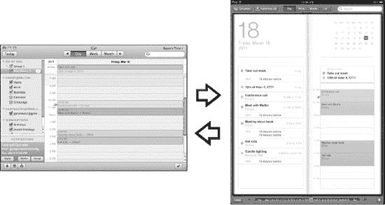

**图 15–1.** *将 PC 或 Mac 日历同步到 iPad*

#### 查看您的日程并浏览

日历的默认视图是`日`视图。它将让您一目了然地看到当天所有即将到来的约会。约会会显示在您的日历中（参见图 15–2）。如果您在计算机上设置了多个不同的日历，例如`工作`和`家庭`，那么它们在 iPad 日历上将显示为不同的颜色。

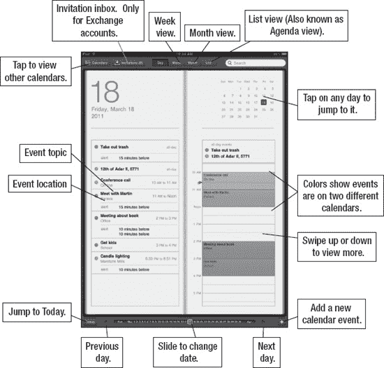

**图 15–2.** *日历的日视图布局*

您可以通过多种方式操作日历：

*   **逐日移动：** 点击底部`滑块`控制旁边的`三角形`图标，可以向前或向后移动一天。
*   **更改视图：** 使用顶部的`日`、`周`、`月`和`列表`按钮来更改视图。

    **提示：** 通过向左或向右移动底部的`滑块`控制，可以快速逐日推进。

*   **跳转到今天：** 使用左下角的`今天`按钮。

#### 日历的四种视图

iPad 的`日历`应用提供四种视图：`日`、`周`、`月`和`列表`。您可以通过点击屏幕底部的视图名称来切换视图。以下是这四种视图的简要概述：

**日视图：** 启动`日历`应用时，默认视图通常是`日`视图。这使您可以快速查看当天安排的所有事项。`日历`应用顶部有用于更改视图的按钮。

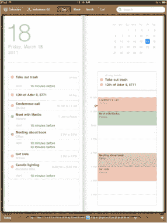

**列表（或议程）视图：** 点击顶部的`列表`视图按钮，您可以在左侧看到一份约会列表。

根据您安排事项的多少，您可能会看到第二天甚至下一整周的预定活动。

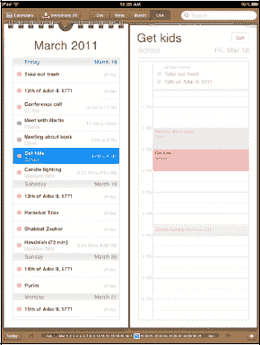

**周视图：** 点击顶部的`周`视图按钮，您可以查看整周的所有约会。

同样，点击任意约会可查看该约会的详细信息。

查看详细信息后，您可以点击`编辑`按钮进行更改。

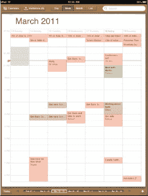

**月视图：** 点击`月`视图，您可以查看整个月的布局。有约会的日期会显示一个小点。当前日期将以蓝色高亮显示。

**提示：** 双击任意日期可直接跳转到该日期的`日`视图。要返回`今天`视图，只需点击左下角的`今天`选项卡即可。

在月份之间导航非常容易：

*   **转到下个月：** 点击底部`月份`滑块右侧的`三角形`图标。
*   **转到上个月：** 点击底部`月份`滑块左侧的`三角形`图标。

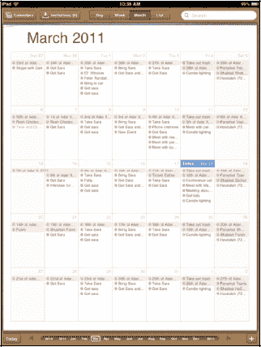

要在`日`视图中推进日期，只需点击底部`日期`滑块两侧的`箭头`图标。

**注：** 虽然在`日历`应用中可以滚动，但不能通过滑动来切换日期，这可能与您的预期不符。

#### 使用多个日历

iPad 的`日历`应用可以跟踪多个日历。您看到的日历数量取决于您使用 iTunes 或其他同步方法设置同步的方式。在下面的示例中，我们将个人约会分类到`家庭`日历中，将工作约会分类到独立的`工作`日历中。

在`日历`应用的约会中，我们的`家庭`日历约会显示为红色，`工作`日历约会显示为橙色或绿色。

在设置`同步`设置时，您可以指定要与 iPad 同步的日历。您可以通过以下说明进一步自定义日历：

**更改颜色：** 您需要在计算机上已与 iPad 同步的程序中更改日历的颜色；这将改变 iPad 上的颜色。

**添加新日历：** 添加要与 iPad 同步的新日历分为两步：

1.  在计算机的`日历`程序中设置该新日历。
2.  调整您的`同步`设置，确保该新日历同步到您的 iPad。

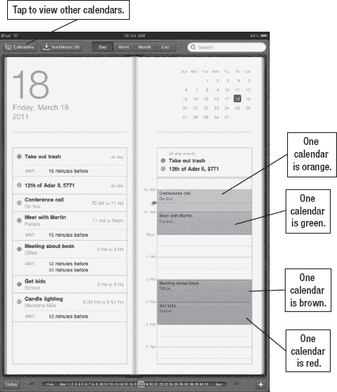

**只查看一个日历：** 要一次只查看一个日历，请点击顶部的`日历`按钮，然后仅选择您希望查看的日历。

#### 添加新的日历约会/事件

您可以直接在 iPad 上轻松添加新约会，这些约会将在下次同步时与您的计算机同步（或共享）。

##### 添加新日程

你的第一反应很可能是尝试在屏幕上点击某个特定时间来设置日程；但遗憾的是，添加日程的操作并非如此。

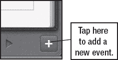

要从任意日历视图添加新的日历事件，请按以下步骤操作：

1.  点击屏幕右下角的 `+` 图标。此时将显示 `添加事件` 屏幕。

    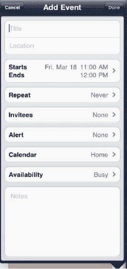

2.  接着，点击标有 `标题` 和 `地点` 的输入框。

    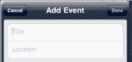

3.  输入事件的标题和地点（可选）。例如，你可以输入“与马丁会面”作为标题，并将地点填写为“办公室”。或者，你也可以输入“与马丁共进午餐”，然后选择纽约市一家非常昂贵的餐厅。

4.  点击右上角的 `蓝色完成` 按钮，返回 `添加事件` 屏幕。

    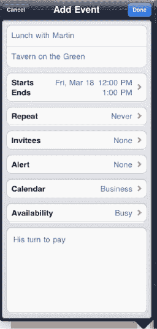
    

5.  点击 `开始` 或 `结束` 标签页来调整事件时间。要更改开始时间，请点击 `开始` 字段使其高亮显示为蓝色。接着，移动底部的旋转拨盘，以反映正确的日期和日程的开始时间。

    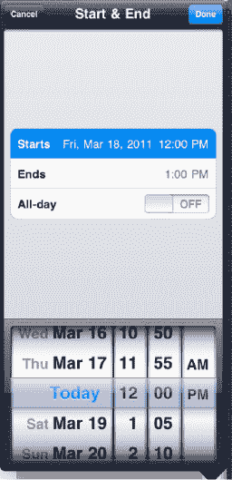

6.  要更改结束时间，请点击 `结束` 字段并使用旋转拨盘。

    或者，你也可以通过点击 `全天` 旁边的开关，将其设置为 `开`，从而创建一个全天事件。

    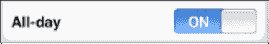

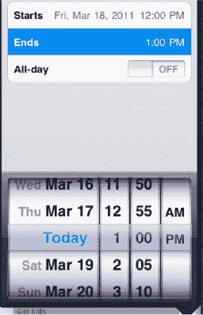

**注意：** 仅当你的 iPad 与 Exchange 日历同步时，你才会在 `重复` 标签页之前看到一个名为 `受邀者` 的标签页。我们将在第 24 章：“其他同步方法”中向你展示如何使用 `受邀者` 标签页来邀请他人参加日历事件。

##### 重复事件与提醒（闹铃）

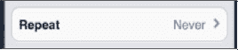

你的一些日程每天、每周或每月都在同一时间发生。如果你正在安排的日程是重复性或周期性日程，只需点击 `重复` 标签页，然后从列表中选择正确的选项即可。

点击 `完成` 返回主 `事件` 屏幕。

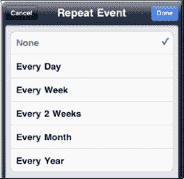

为即将到来的日程设置一个声音提醒——即*提醒*——可以帮助你避免忘记重要事件。按以下步骤创建提醒：

1.  点击 `提醒` 标签页，然后选择一个提醒闹铃选项。你可以完全不加闹铃，也可以设置在事件开始前五分钟到两天之间的任何时间——选择最适合你的方式即可。

2.  点击 `完成` 返回主 `事件` 屏幕。

    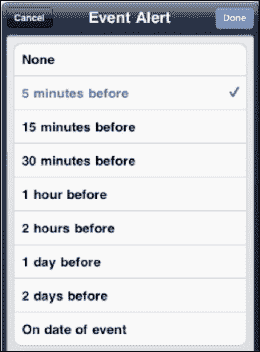

3.  添加提醒后，你将可以选择添加第二个（可选）提醒。

    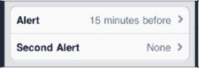

如果你需要第二个提醒来确保不错过事件，这会非常有用。

例如，如果你需要在公交车站接孩子，你可能希望提前 15 分钟收到一个提醒，然后在提前 5 分钟时收到最后一个提醒，这样你就能绝对确保不会错过接孩子的时间。

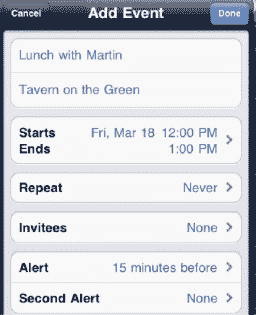
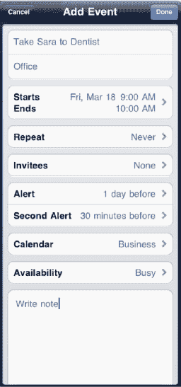

**提示：** 创建两个提醒的另一个好例子是当你需要带孩子离开学校去看医生或牙医时。

将第一个提醒设置在出发前一晚，以便给学校写个便条让孩子带上。

将第二个提醒设置在预约时间前 30 分钟，这样你就有足够的时间去接孩子并带她赴约。

##### 选择要使用的日历

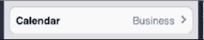

如果你在 `Outlook`、`Entourage`、`iCal` 或其他程序中使用多个日历，并且将 iPad 与该程序同步，那么你将拥有多个可用的日历。

**注意：** 如果你创建事件并选择 Exchange 日历，你将可以选择邀请其他用户参与该事件。

点击左上角的 `日历` 按钮可查看你所有的日历。

点击你想要用于此特定事件的日历。通常情况下，所选日历就是你上次在 iPad 上安排上一个事件时所选的日历。

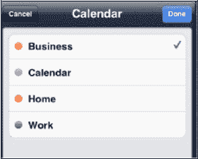

##### 将事件切换到不同的日历

你会注意到，当你在 iPad 上编辑日历事件时，你无法选择切换日历。

如果你希望在 iPad 上更改已安排的日历，你需要删除原始事件，然后在首选日历上安排一个新事件。

**提示：** 要删除日历事件，请点击该事件，然后选择 `编辑` 按钮。滑动到 `编辑` 屏幕底部，选择 `删除事件`。接着，你需要确认要删除该事件。

##### 忙闲状态

你可以从以下选项中选择你的忙闲状态：`忙碌`（默认）或 `空闲`。根据你的 Exchange 设置，你可能还会看到 `暂定` 或 `外出`。

**注意：** 仅当您用于此事件的日历与 MobileMe、Exchange 或 Exchange/Google 设置同步时，你才会看到 `忙闲状态` 字段。

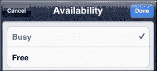

#### 在日历中使用复制粘贴文本

iPad 的 `应用程序切换器` 程序意味着你现在可以轻松地在任意两个应用之间跳转。有时你可能需要在 `邮件` 和 `日历` 应用之间跳转，以复制和粘贴信息。需要复制粘贴的信息可以是任何内容，例如开车路线或会议中急需的关键笔记。请按以下步骤在 `邮件` 和 `日历` 程序之间复制和粘贴信息：

1.  按照本章前面所述，创建一个新的日历事件或编辑一个现有事件。

2.  向下滚动到 `备注` 字段，点击它以将其打开。

3.  双击 `主屏幕` 按钮以调出 `应用程序切换器`。

4.  如果你看到 `邮件` 图标，请点击它。如果你没有看到 `邮件` 图标，请向左或向右滑动来查找它。找到后，点击它打开 `邮件` 应用。

    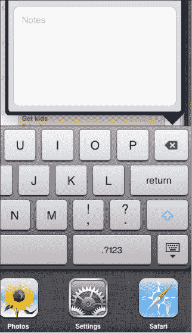

5.  双击一个单词，然后用手指拖动蓝色手柄以选择你要复制的文本。

6.  点击 `复制` 按钮。

    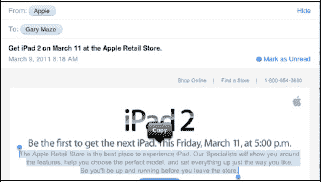

7.  双击 `主屏幕` 按钮以调出 `应用程序切换器`。

8.  点击 `日历` 图标。它应该是左侧的第一个图标，因为你刚刚从这个程序跳出来。

    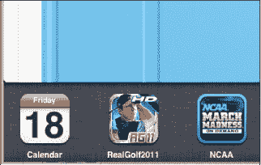

9.  现在在 `备注` 字段中长按。当你松开手指时，你应该会看到 `粘贴` 弹出字段。如果你没有看到它，请将手指按住稍久一点，直到你看到它。

10. 点击 `粘贴`。

    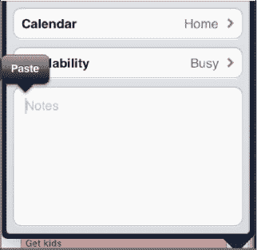

11. 现在你应该会看到你复制的文本被粘贴到了 `备注` 字段中。点击 `完成` 以保存你的更改。

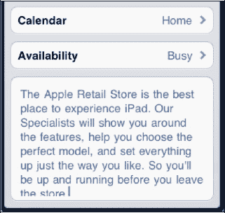

##### 向日历事件添加备注

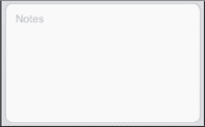

如果你想为此日历事件添加一些备注，请点击 `备注` 并输入一些笔记。

**提示：** 如果这是一个要去新地方的会议，你可以输入或复制/粘贴一些开车路线。关闭并重新打开该日程，然后点击你刚刚添加的地点。你的 `地图` 应用将会加载并为你导航。

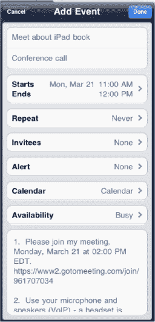

