# 编辑日程

有时，日程的详细信息可能会发生变化，需要进行调整（参见图 15-3）。幸运的是，在 iPad 上这是一项轻松的任务。

首先，找到需要更改的日程并轻点它。在右上角，你会看到`Edit`按钮。轻点`Edit`，你将回到显示日程详细信息的`Edit Event`屏幕。

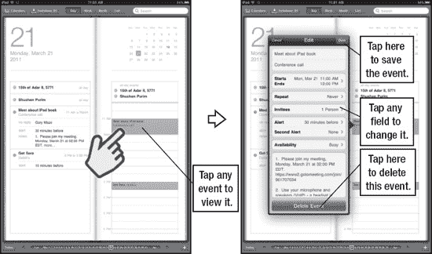

**图 15-3.** *编辑日程*

只需轻点你需要调整的字段选项卡即可。例如，你可以通过轻点`Starts`或`Ends`选项卡来更改此日程的时间，然后调整事件的开始或结束时间。

## 删除事件

请注意，在`Edit`屏幕的底部，你还可以选择删除此事件。只需轻点屏幕底部的`Delete Event`即可。

## 会议邀请

对于经常使用 Microsoft Exchange 或 Microsoft Outlook 的用户来说，会议邀请已成为日常工作的一部分。你会在电子邮件中收到会议邀请，接受邀请后，该日程便会自动添加到你的日历中。

在你的 iPad 上，你会看到你接受的邀请会直接放入日历中。在右侧的示例中，如果我们轻点电子邮件底部的`Meeting Invitation`图标，该事件将直接放入我们的日历中。

**注意：** 如果你使用 Exchange 或 Google 日历，你可以在 iPad 上邀请他人并回复会议邀请。请参阅第 4 章“其他同步方法”中的“使用 Google 或 Exchange 日历”部分以了解更多信息。

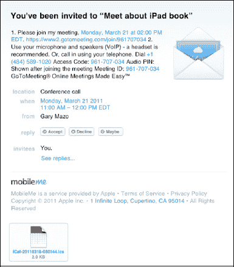

如果你在日历中轻点该会议邀请，你可以看到所有需要的详细信息：拨入号码、会议 ID 以及邀请中可能包含的任何其他详细信息。

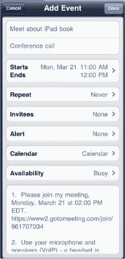

**注意：** 在撰写本文时，你可以在 iPad 上接受来自 Exchange 账户的会议邀请，并且只要你选择 Exchange 日历或 MobileMe 日历，就可以创建它们。如果你将 iTunes 设置为与这些程序同步，邀请也会自动从`Entourage`、`iCal`或`Outlook`转移。

## 日历选项

在`Calendar`应用中，只有少数几个选项可供调整；你可以在`Settings`应用中找到它们。只需从`Home`屏幕轻点`Settings`。

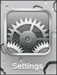

向下滚动到`Mail, Contacts, Calendars`选项卡并轻点它。向下滚动到`Calendars`，你会看到三个选项。第一个选项是一个简单的开关，用于接收`New Invitation`提醒——如果你收到任何会议邀请，最好将其保持默认的`ON`状态。

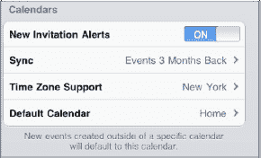

接下来，你可以选择您的时区。此设置应反映你设置 iPad 时的`Home`设置。但是，如果你正在旅行，并希望针对不同时区调整日程，你可以将其更改为你想要的任何其他城市。

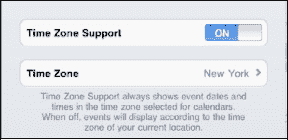

### 更改默认日历

我们之前提到过，你可以在 iPad 上显示多个日历。此选项允许你选择哪个日历将成为你的默认日历。

这意味着当你去安排任何新日程时，默认情况下将选中此日历。

如果你希望使用其他日历——比如你的`Work`日历——你可以在实际设置日程时进行更改，如本章前面所示。

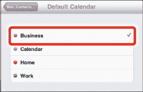

## 第 16 章

## iPad 摄影

早期版本的 iPad 没有配备摄像头；iPad 2 通过配备两个摄像头弥补了这一缺陷：一个后置的 0.7 兆像素摄像头和一个用于视频聊天和自拍的 0.3 兆像素 VGA 前置摄像头（你将第 18 章“FaceTime 视频消息与 Skype”中了解更多关于使用前置摄像头的信息）。

此外，`Photo Booth`应用也是新功能，它允许你拍摄自拍照并发挥创意——我们在本章末尾向你展示了如何使用。

**注意：** iPad 的分辨率使照片看起来非常漂亮。然而，它远不及新款 iPhone 4 摄像头的质量，因此当你同步照片并在电脑上查看时，照片会损失一些质量。可以将 iPad 摄像头视为一台能拍静态照片的摄像机，而不是一台能拍摄视频的静态相机。

在 iPad 上查看和分享照片确实是一种乐趣，这在很大程度上要归功于其华丽、大尺寸的高分辨率屏幕。在本章中，我们将讨论将照片导入 iPad 的多种方法。我们还将向你展示如何使用触摸屏浏览照片、放大和缩小、捏合打开相簿以及操作照片。

**提示：** 你知道吗，你可以通过同时按两个按键来截取整个 iPad 屏幕的画面？现在你可以证明你在《俄罗斯方块》中得了最高分！

操作方法如下：同时按下`Home`按钮和右上角的`On/Off/Sleep`键（你也可以按住其中一个键不放，然后按下另一个键）。如果操作正确，屏幕应该会闪烁，并且你会听到相机声音。你截取的屏幕截图将保存在`Photos`应用的`Camera Roll`相簿中。

### 使用相机应用

`Camera`应用（参见图 16-1）应该在你的`Home`页面上——通常位于第一页的顶部。如果看不到，请向左或向右滑动直到找到它。

轻点`Camera`图标，相机的快门会以动画效果在你的屏幕上打开。

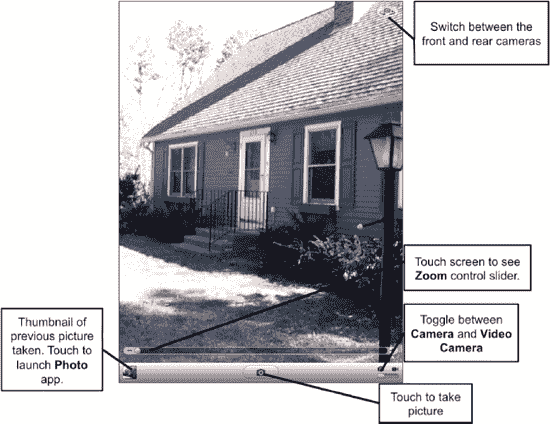

**图 16-1.** *`Camera`应用的布局*

#### 地理标记

地理标记是一项功能，可将你的 GPS（全球定位系统）坐标嵌入到图片文件中。如果你将照片上传到 Flickr 等服务，照片的坐标可以帮助朋友们定位照片的拍摄地点。iPad 支持地理标记，不仅在 3G 版本上，在 Wi-Fi 环境下同样支持。后一种方法要求你连接到 Wi-Fi 网络，并使用 Wi-Fi 三角测量法将 GPS 坐标嵌入到图像中。

地理标记还会显示在 iPad 的`Places`相簿中。轻点`Places`选项卡，你将看到所有带有地理标记的照片的图钉标记。

轻点其中一个图钉标记，该位置旁边会显示一个带有地理标记照片的小缩略图。

在此示例中，我轻点了波士顿附近的图钉标记，找到了一张我去学校看望儿子时为他拍的照片。

**注意：** 地理标记的缺点是，如果你在线分享它们，别人就会知道你的生活、工作地点等信息。你可能需要谨慎使用此功能，并注意分享内容。

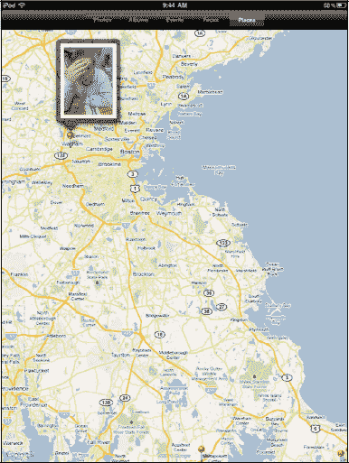

**注意：** 如果你使用 Mac，请注意`iPhoto`应用使用地理标记将照片归类到`iPhoto`的`Places`类别中。

如果你在启动相机时开启了定位服务（参见第 1 章：“入门”），系统会询问您是否允许使用当前的位置。

要再次确认它是否开启，请执行以下操作：

1.  启动你的`Settings`。
2.  进入`General`。
3.  然后轻点`Location Services`。你将看到类似这里的屏幕。
4.  确保`Camera`旁边的开关已切换到`ON`。

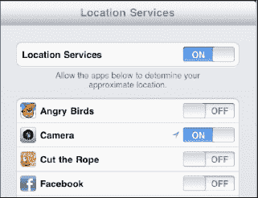

##### 拍照

拍照就像对准目标按下快门一样简单，不过如果你愿意，也可以进行一些调整。

摄像头开启后，将拍摄主体置于 iPad 屏幕的中央。

准备好拍照时，只需轻点底部的`Camera`按钮。你将听到快门声，屏幕会显示动画，表示正在拍照。

拍照完成后，照片会落入左下角的窗口中。轻点那个小缩略图，即可加载`照片`应用中的`相机胶卷`相册。

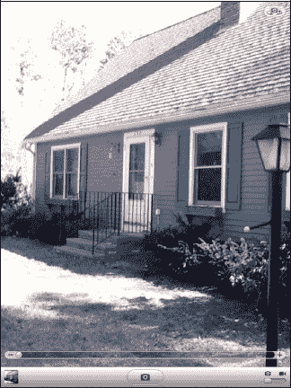

###### 使用 iPad 的变焦功能

iPad 摄像头支持 5 倍数码变焦。

**注意**：数码变焦的清晰度远不及模拟变焦，因此请注意，使用 iPad 的变焦功能时，图像质量通常会有轻微下降。

要使用变焦功能，只需触摸屏幕并移动`Zoom`控制滑块，如图 16–1 所示。

#### 切换摄像头

如前所述，iPad 配备了两个摄像头：一个用于日常拍照的 0.7 兆像素摄像头，以及一个用于自拍或`FaceTime`视频通话的 VGA 摄像头（参见第 18 章：“FaceTime 视频通话与 Skype”）。

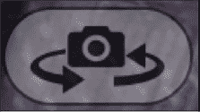

要在两个摄像头之间切换，请按以下步骤操作：

1.  轻点`相机`应用中的`切换摄像头`图标。
2.  等待摄像头切换至前置摄像头并完成构图。
3.  再次轻点`切换摄像头`图标，即可切回标准摄像头。

**提示**：由于前置摄像头的安装位置，人脸可能会显得有些变形。尝试将脸稍向后移并调整摄像头角度，以获得更佳的图像。

#### 查看已拍摄的照片

您的 iPad 会将拍摄的照片存储在所谓的`相机胶卷`中。您可以在`相机`和`照片`两个应用中访问`相机胶卷`。在`相机`应用中，轻点`相机`屏幕左下角的`照片`图标。

轻点一张照片进行查看后，您可以滑动屏幕浏览`相机胶卷`中的所有照片。

 要返回`相机胶卷`，请按下左上角的`相机胶卷`按钮。

 要拍摄另一张照片，请轻点右上角的`完成`按钮。

请注意，右侧的照片是使用`Photo Booth`应用拍摄的。请在本章末尾阅读相关内容。

### 将照片导入 iPad

您有多种方式将照片加载到设备上：

*   **使用 iTunes 同步**：最简单的方法可能是使用 iTunes 从电脑同步照片。这在第 3 章：“将 iPad 与 iTunes 同步”中有详细介绍。
*   **作为电子邮件附件接收**：虽然这不适用于大量照片，但对于一两张照片来说效果很好。请查看第 13 章：“iPad 上的电子邮件”了解如何保存附件的更多细节。（保存后，这些图像会显示在`相机胶卷`相册中。）
*   **从网页保存图像**：有时您会在网站上看到一张好图片。长按它，出现弹出菜单，然后选择`保存图像`。（与其他保存的图像一样，这些最终会保存在`相机胶卷`相册中。）
*   **从应用内下载图像**：第 7 章：“个性化与保护您的 iPad”中展示的壁纸图像就是一个很好的例子。
*   **与 iPhoto 同步（适用于 Mac 用户）**：如果您使用 Mac 电脑，您的 iPad 很可能会自动与`iPhoto`或`Aperture`同步。

以下是启动 iPhoto 同步的步骤：

1.  连接您的 iPad 并启动`iTunes`。
2.  转到`同步选项`顶部一行的`照片`标签。
3.  选择您希望与 iPad 保持同步的`相簿`、`事件`、`面孔`或`地点`（参见图 16–2）。

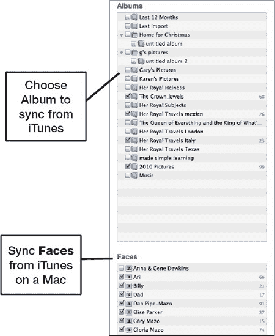

**图 16–2.** *从 iTunes 中选择要与 iPad 同步的相簿、面孔或事件*

*   **拖放（适用于 Windows 用户）**：将 iPad 连接到 Windows 电脑后，它会在 Windows 资源管理器中显示为便携设备，如图 16–3 所示。以下是在 iPad 和电脑之间拖放照片所需的步骤：

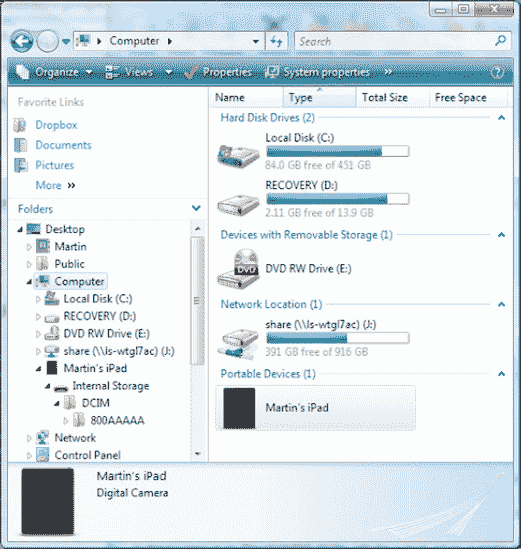

**图 16–3.** *Windows 资源管理器显示 iPad 为便携设备（通过 USB 线缆连接）*

1.  双击`便携设备`下的 iPad 图标将其打开。
2.  双击`内部存储`将其打开。
3.  双击`DCIM`将其打开。
4.  双击`800AAAAA`将其打开。（这在您的电脑上会是唯一的名称。）
5.  您将看到 iPad 上`已保存的照片`相册中的所有图像。
6.  要从 iPad 复制图像，请选中图像，然后将其从此文件夹拖放到您的电脑上。

**提示：** 以下是在 Windows 中选择多个图像的方法。

在图像周围画一个框，或者单击一个图像，然后按`Ctrl+A`全选。按住`Ctrl`键并单击各个图像进行选择。右键单击选中的图像之一，然后选择`剪切`（移动）或`复制`（复制）所有选中的图像。要粘贴图像，请单击并按下任何其他磁盘或文件夹（如`我的文档`），然后导航到您想要移动或复制文件的目标位置。最后，再次右键单击并选择`粘贴`。

### 查看您的照片

现在照片已经在您的 iPad 上了，您可以通过几种很酷的方式来浏览照片，并向他人展示。

#### 从照片图标启动

如果您喜欢使用`照片`应用，并且它尚未在程序坞中，您可能希望将其放置在底部程序坞中以便快速访问（参见第 6 章：“整理您的图标与文件夹”）。

开始使用照片时，请轻点`照片`图标。

第一个屏幕显示您的相簿，这些相簿是在您设置 iPad 并同步 iTunes 时创建的。第 3 章：“将 iPad 与 iTunes 同步”向您展示了如何选择要与 iPad 同步的照片。电脑上照片库的任何更改都会自动更新到您的 iPad 上。

顶部有一些按钮，对应五类照片（具体取决于与 iPad 同步的 PC 或 Mac 上的照片软件）。在右侧的图像中，您会看到`照片`、`相簿`、`事件`、`面孔`和`地点`。

**注意**：此 iPad 已与 Mac 上的`iPhoto`同步；PC 用户将看到不同的选项。

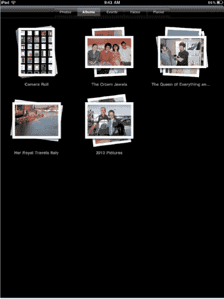

#### 选择照片库

在`相簿`页面，轻点其中一个库按钮，即可显示该相簿中的照片。屏幕会立即切换，显示此照片库中图片的缩略图。

用手指上下拖动以查看所有图片。您可以向上或向下快速滑动以快速浏览整个相簿。

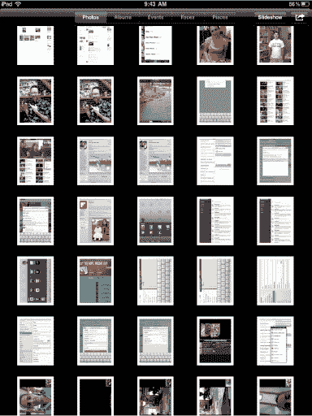

#### 通过双指张开来预览相簿

当您尝试找到特定图片时，在 iPad 上可以做的很酷的事情之一就是通过双指张开来预览相簿。

将两根手指放在相簿上，然后缓慢地*张开双指*。请注意，所有图像会在屏幕上展开。

如果您看到了想要的照片，继续张开双指以完全打开相簿。张开结束时甩动一下手指即可打开相簿。

如果您没有看到想要的图像，只需再次合拢手指关闭相簿，然后尝试另一个。

**提示**：您可以通过在缩略图屏幕的整个画面上*合拢双指*来关闭一个已完全打开的相簿。

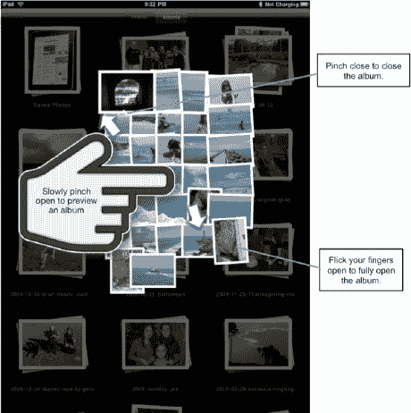

