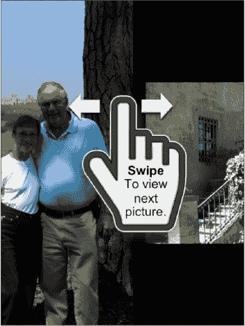
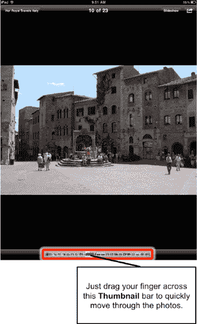

# 切换照片

使用滑动手势可以在照片之间切换。只需在屏幕上向左或向右滑动手指，即可浏览照片。

**提示**：缓慢拖动手指可以更渐进地浏览照片库。

当浏览到相册末尾时，轻点一次屏幕，左上角会出现一个显示相册名称的标签。点击该标签，即可返回该相册的缩略图页面。

要返回主相册页面，请点击屏幕顶部的**相簿**按钮。

## 使用缩略图栏切换照片

除了左右滑动切换照片，你也可以调出屏幕上的软键控件。操作方法是：只需轻点一次屏幕。再次点击则隐藏软键。

在屏幕最底部，你会看到一个小的**缩略图**栏，你可以用手指在其上轻轻滑动（见图 16–4）。使用此栏可快速浏览整个相册。你也可以直接点击某个缩略图来查看对应的照片。

**图 16–4.** *使用**缩略图**栏浏览照片。*

