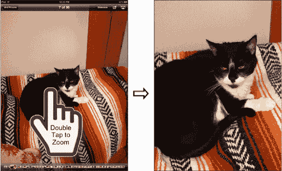

# 放大和缩小照片

在 iPad 上有两种方法可以放大和缩小照片：双击和捏合。

## 双击

顾名思义，*双击*就是在屏幕上快速点击两下以放大照片，如图 16–5 所示。你会放大到双击的位置。要缩小，只需再次双击。

有关双击的更多帮助，请参阅第 1 章“入门指南”。

**图 16–5.** *双击照片进行缩放*

## 捏合

同样在第 1 章“入门指南”中有所描述，*捏合*是一种更为精确的放大方式。双击只能放大或缩小到固定级别，而捏合允许你只放大或缩小一点，或放大、缩小很多。

要进行捏合操作，将拇指和食指并拢，然后在接触屏幕的同时慢慢分开它们，使图片变大。要缩小，则将拇指和食指分开，然后合拢。

**注**：一旦你通过任意方法启用了缩放功能，在将照片恢复为标准尺寸之前，你将无法轻松地在照片之间滑动浏览。

