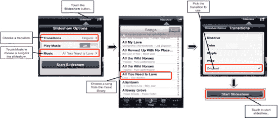
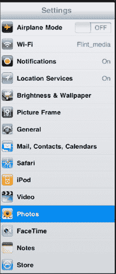
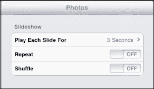
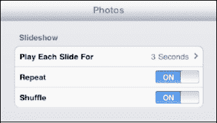

# 观看幻灯片

如果你愿意，可以将相册中的照片以幻灯片形式播放。只需轻点一次屏幕以调出屏幕软键。右上角有一个**幻灯片显示**按钮——点一下即可开始播放幻灯片。你可以从**照片图库**界面或正在查看的任何照片开始播放幻灯片。

**幻灯片显示选项**允许你调整每张照片在屏幕上停留的时间。它还可以让你选择音乐、过渡效果及其他设置，如图 16–6 所示。要结束幻灯片，只需轻点屏幕。

**图 16–6.** *配置幻灯片*

## 调整幻灯片显示选项

要配置幻灯片，你需要更改设置。操作方法是：在**主屏幕**上点击**设置**图标。

向下滚动到**照片**选项卡并点击屏幕。随后你将看到可用的各种选项，包括四个可针对幻灯片进行调整的选项。

要指定每张幻灯片的播放时长，请点击**每张幻灯片播放时间**选项卡。你可以选择 2 到 20 秒之间的范围。

如果你希望幻灯片中的照片重复播放，只需将**重复**开关拨到**开启**。

如果你希望照片以不同于列表顺序的方式播放，请选择**随机播放**。与音乐播放器中的**随机播放**命令类似，此选项将使照片以随机顺序播放。

