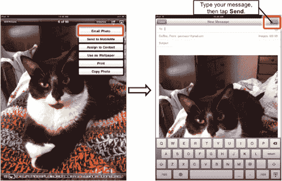

# 将照片用作 iPad 墙纸

有关如何选择并使用照片作为 iPad 墙纸（以及更多墙纸选项）的信息，请参阅第 7 章“个性化和保护你的 iPad”。

**注**：你可以为主屏幕和锁定屏幕设置不同的照片，或对两者使用相同的照片。

## 通过电子邮件发送照片

只要你有活跃的互联网连接（见第 5 章“Wi-Fi 和 3G 连接”），就可以通过电子邮件发送照片集中的任何照片。点击顶部图标栏上的**选项**按钮——通常是最右边那个（如果已启用**AirPlay**，则是右边第二个）。如果看不到图标，请轻点一次屏幕。

选择**电子邮件照片**选项，**邮件**应用将自动启动（见图 16–7）。

**图 16–7.** *通过电子邮件发送照片*

像在第 13 章“iPad 上的电子邮件”中那样，点击**收件人**字段，然后选择接收照片的联系人。点击**蓝色 +** 按钮可添加联系人。

输入主题和消息，然后点击右上角的**发送**。操作就这么简单。

