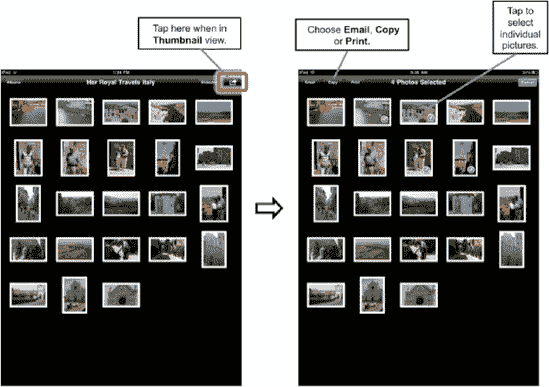

# 同时通过电子邮件发送、拷贝或删除多张照片

如果你有多张照片需要同时通过电子邮件发送、拷贝或删除，可以从**缩略图**视图中进行操作，如图 16–8 所示。

**注**：**拷贝**功能允许你将多张照片拷贝并粘贴到电子邮件或其他应用中。**共享**会将图像重命名为`photo.png`；**拷贝**和**粘贴**则保留其 DCIM 文件夹文件名`.png`。当你选择**共享**时，会弹出一个窗口，询问你是要以小、中、大还是原始尺寸发送，并显示附件的大小（以 MB 为单位）。

在本书出版时，你最多可以共享或通过电子邮件发送五张照片。此限制在未来的软件版本中可能会发生变化。

**图 16–8.** *选择多张图片进行电子邮件发送*

