# 打印照片

iOS 4.3 新增了**AirPrint**功能。**AirPrint**是 Apple 专有的内置打印功能。**AirPrint**适用于照片、文档和其他应用。很酷的一点是：你无需像在 PC 或 Mac 上那样安装打印机驱动程序。

请按照以下步骤打印照片：

1.  像之前一样，从相册中选择任意一张照片。
2.  点击**信封**图标。
3.  从选项中选择**打印**。
4.  当你点击**打印机选项**按钮时，**AirPrint**将搜索兼容的**AirPrint**打印机。
5.  选择你想要打印的份数。
6.  点击**打印**按钮，照片便会打印出来。

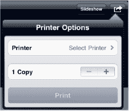

### 为联系人指定照片

第 14 章：“使用联系人”介绍了如何在编辑联系人时添加照片。你也可以找到喜欢的图片并将其指定给联系人。首先，找到你想要使用的照片。

与选择壁纸和通过电子邮件发送照片时一样，点击`选项`按钮——即上方软键行最右侧的那个。如果看不到图标，请点击屏幕一次。

点击`选项`按钮后，你会看到一个下拉选项列表：`通过电子邮件发送照片`、`指定给联系人`、`用作壁纸`和`复制照片`。

点击`指定给联系人`按钮。

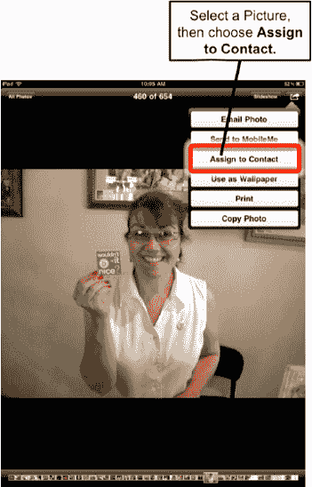

屏幕上将显示你的联系人列表。你可以通过顶部的`搜索`栏进行搜索，也可以直接滚动浏览联系人。

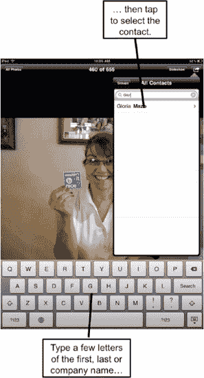

找到你想要添加照片的联系人后，点击其姓名。

接着你会看到`移动和缩放`屏幕。拖动照片可以移动它；使用双指捏合可以放大或缩小。

将照片调整到满意位置后，点击`使用`按钮，即可将照片指定给该联系人。

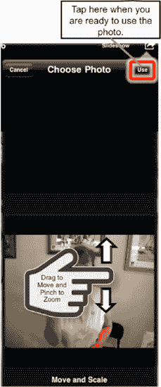

**注意**：操作完成后，你将返回`照片`图库，而非联系人列表。如需确认照片已成功设置给联系人，请退出`照片`应用，打开`通讯录`应用，然后搜索该联系人。

#### 删除照片

你可能会纳闷，为什么无法从 iPad 上删除某些照片（即找不到`废纸篓`图标）。

你会注意到，所有从 iTunes 同步过来的照片都不显示`废纸篓`图标。这类照片只能从你的电脑资料库中删除。下次同步 iPad 时，它们就会被移除。

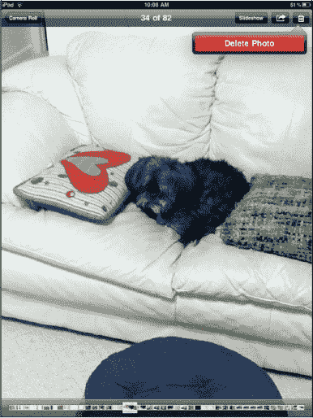

当你查看`相机胶卷`（该相册不与 iTunes 同步，由你从电子邮件中保存或从网络下载的照片组成）中的照片时，在顶部的图标栏右侧会看到`废纸篓`图标。而查看`照片`图库或其他同步相册中的照片时，此`废纸篓`图标不会出现。

如果看不到底部的图标行，点击照片一次即可激活它们。然后点击`废纸篓`图标；系统会提示你确认是否删除照片。

点击`删除照片`，该照片就会从你的 iPad 上被删除。

### 从网站下载图片

现在你已经知道如何将照片从电脑传输到 iPad，以及如何从电子邮件中保存照片。此外，你还可以直接从网络将图片下载并保存到 iPad 上。

**警告**：我们强烈建议你在从网络下载和保存图片时尊重图片版权法。除非网站标明图片是免费的，否则在下载和保存任何图片前，应先征得网站所有者的同意。

#### 找到要下载的图片

iPad 让从网站复制和保存图片变得非常简便。当你为 iPad 寻找新的壁纸图片时，这个功能会派上用场。

首先，点击`Safari`网络浏览器图标，搜索 iPad 壁纸，找到一些可能提供有趣选择的网站（如需帮助，请参见第 11 章：“使用 Safari 浏览网页”）。

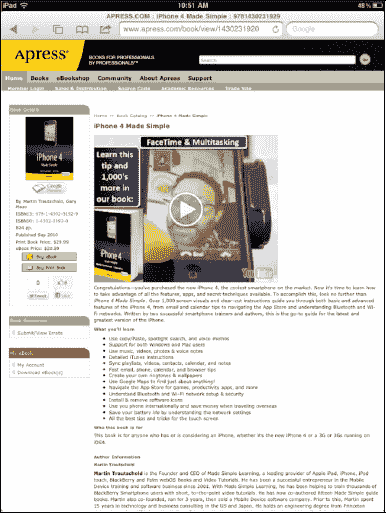

找到你想要下载并保存的图片后，长按该图片，会弹出一个新的选项菜单，其中包含`存储图像`（以及其他选项），如图 16–9 所示。选择此选项，即可将图片保存到你的`相机胶卷`相册中。

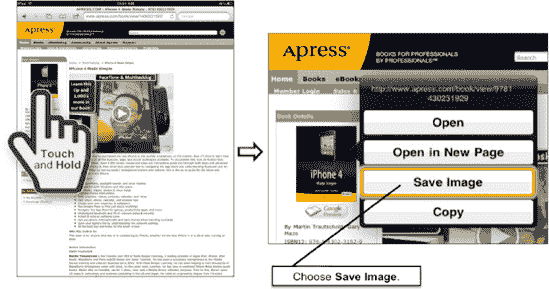

**图 16–9.** *从网站保存图像*

现在点击你的`照片`图标，你应该就能在`相机胶卷`相册中看到这张图片了。

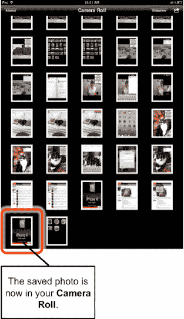

### Photo Booth

iPad 新增了一款非常有趣的软件，Mac 用户对此应该不会陌生：`Photo Booth`。`Photo Booth`使用 iPad 的前置摄像头，让用户能够创建一些非常酷炫且与众不同的视觉效果。

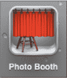

首先，点击`Photo Booth`图标，你会看到九个方格，每个代表一种不同的视觉效果：`热感应摄像头`、`镜像`、`X 光`、`万花筒`、`正常`、`光隧道`、`挤压`、`旋转`和`拉伸`。

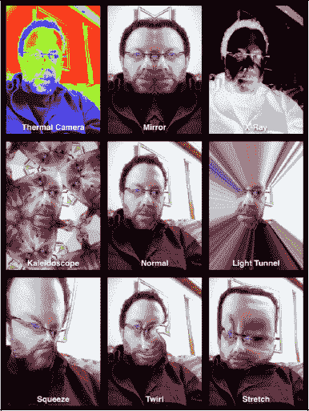

只需点击其中一种效果，它就会全屏显示。

要捕捉其中一张图像，点击`相机`图标，就像拍照一样。捕捉到的图像会出现在屏幕底部的一行中。

要返回并选择不同的效果类型，请点击左下角的图标。

若要结合当前效果使用后置摄像头，只需点击`切换摄像头`按钮即可。

`Photo Booth`能带给你很多乐趣。你拍摄的照片会存储在`相机胶卷`中，因此你可以通过电子邮件发送它们、发布到 Facebook 上，与全世界分享！

## 第 17 章

## 录制与编辑视频

你的 iPad 是一部功能强大的摄像机。你可以录制并导出高达 720p 的高清视频。随后，你可以将该视频直接发布到 YouTube 或 MobileMe，甚至可以通过电子邮件发送给收件人。在本章中，我们还将向你展示如何拍摄视频、快速进行*修剪*，以及如何上传视频。

### 视频录制与编辑

今年 iPad 新增了使用`相机`应用录制视频以及使用`iMovie`应用编辑视频的功能，Mac 用户已经使用`iMovie`一段时间了。通过`iMovie`，你可以连接视频片段、添加图片和转场效果，再配上自己的音轨，从而创作出完整的影片。完成后，你可以将影片上传到网络。

在下一节中，你将学习如何添加视频片段、音频、图片和转场效果。你还将学习如何直接在 iPad 上制作出高质量的高清视频。

#### 启动录像机

视频录制软件实际上是**相机**应用的一部分（请参见图 17–1）。请按照以下步骤使用内置录像机：

1.  启动**相机**应用（有关具体操作方法，请参见第 16 章：“iPad 摄影”）。
2.  将右下角的滑块从**相机**图标移动到**录像机**图标。
3.  录制场景时，尽量保持 iPad 稳定。
4.  录制完成后，轻触**停止**按钮。

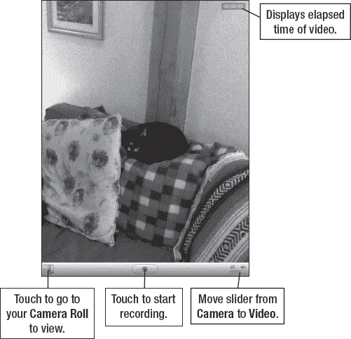

**图 17–1.** *录像机的布局与控件*

##### 调整白平衡点

iPad 摄像头的对焦是固定的。您可以根据拍摄主体调整视频的白平衡点。请按照以下步骤利用此功能：

1.  要对视频前景中的某物对焦，请轻触前景中的屏幕。此时会显示一个小方框，标示白平衡区域。
2.  要将白平衡切换到背景中的主体，请轻触屏幕的另一部分。该方框会临时显示新的白平衡区域。

##### 修剪视频

iPad 允许您直接在设备上对视频进行剪辑。按下**停止**按钮录制完视频后，该视频会立即存入您的**相机胶卷**。

轻触左下角的视频缩略图以打开该视频。在屏幕顶部，您会看到一个时间轴，显示了视频的所有帧（请参见图 17–2）。请按照以下步骤编辑您刚刚录制的视频：

1.  拖动时间轴的任意一端，您会看到视频进入**修剪**模式。
2.  拖动视频两端，直到它达到您想要的长度。
3.  当视频长度合适时，轻触右上角的**修剪**按钮。
4.  接着，选择**修剪原片**或**存储为新剪辑**。后者会保存一个新修剪版本的视频。

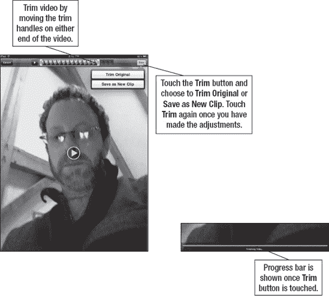

**图 17–2.** *修剪视频*

**注意**：视频文件远大于图片；如果向**相机胶卷**中保存大量视频，请务必留意存储空间。

##### 发送视频

与照片类似，您有几种选择可以通过 iPad 将录制的视频发送给他人。请按照以下步骤从 iPad 发送视频：

1.  轻触右上角的**发送**图标 。
2.  选择您偏好的视频发送选项：**电子邮件**、**彩信**、**MobileMe**、**YouTube** 或**拷贝**。
3.  您看到的下一屏幕将取决于您在步骤 2 中所做的选择。如果您选择了**电子邮件**，您的**邮件**应用将会启动。

##### 上传到 YouTube

iPad 允许您将高清（720p）视频直接上传到您的 **YouTube** 账户。您只需连接到 Wi-Fi 网络即可。请按照以下步骤将视频上传到 YouTube：

1.  在您的**相机胶卷**中找到要上传的视频。
2.  轻触**发送**图标。
3.  选择**发送到 YouTube**。
4.  为视频输入标题、描述和*标签*。
5.  选择标准清晰度或高清。
6.  为视频选择一个类别。

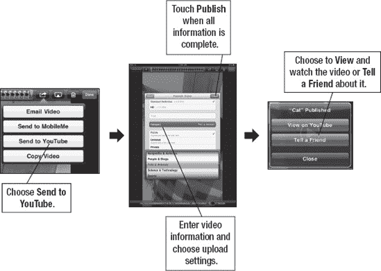

**图 17–3.** *将视频上传到 YouTube*

**注意**：要将视频上传到 MobileMe 或 YouTube，您需要拥有目标网站的账户（有关 MobileMe 的更多信息，请参见第 4 章：“其他同步方法”）。

#### 使用 iMovie

Mac 用户多年来一直享受着 **iMovie** 应用的乐趣。此应用允许您将影片剪辑与图片和音乐结合，为场景之间添加炫酷的转场效果，从而制作出具有专业水准的影片。

新款 iPad 的一大出色功能是用户可以直接在 iPad 上体验 **iMovie** 的强大功能。**iMovie** 应用可从 App Store 以 4.99 美元的价格下载。它通常列在**精选**应用或**为 iPad 2 优化**应用专区下。您也可以直接在 App Store 中搜索“iMovie”来直接进入下载页面（有关在 App Store 中搜索内容的更多信息，请参见第 21 章：“神奇的 App Store”）。

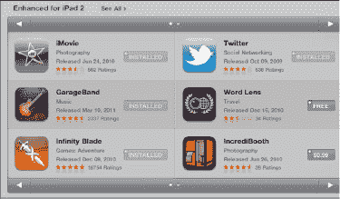

#### 开始使用 iMovie

**iMovie** 应用以项目方式工作。如果您保存过项目，它们会显示在**项目**页面上。这很可能您是第一次使用该应用，因此不会有任何项目。请按照以下步骤开始一个 **iMovie** 项目：

1.  轻触**加号**图标  以开始一个新项目。
2.  轻触**设置**图标并为项目选择一个主题。浏览可用的主题。当前主题包括**现代**、**明亮**、**旅行**、**俏皮**、**霓虹**、**旅行**、**简洁**、**新闻**和 **CNN 报道**。
3.  如果您想使用为该主题设计的特定音乐，请选择**主题音乐 开**。
4.  轻触任一**插入媒体**图标以选择您影片的媒体。要选择视频，请轻触左侧的**视频**软键。要选择照片，请轻触旁边的**照片**软键。最后，要从您自己的音乐文件中选择音轨，请轻触**音频**软键并导航到所需的歌曲（请参见图 17–4）。

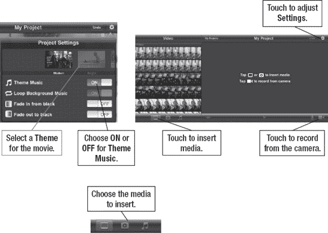

**图 17–4.** *选择要添加到您的 **iMovie** 项目中的媒体*

##### 构建您的影片

在 **iMovie** 中创建影片就像添加新内容、转场和音频一样简单。请按照以下步骤构建您的影片：

1.  再次轻触**插入媒体**按钮，并从您的**照片**应用中选择一个影片剪辑或照片。
2.  通过将两端的**黄点**向中心移动来调整剪辑的长度。注意，随着调整，剪辑的时长会发生变化。
3.  准备将剪辑添加到项目时间轴时，轻触**蓝色箭头**。
4.  重复上述步骤，向时间轴添加另一个视频剪辑或照片。
5.  现在，项目中不同媒体之间会出现一个小**双箭头**图标。这是**转场**图标。双击**转场**图标以调出**转场设置**菜单（请参见图 17–5）。
6.  选择一个转场效果（目前只有三个选项：**无**、**交叉溶解**和**主题**）。
7.  选择转场时长。范围可从 0.5 秒到 2.0 秒。
8.  接下来，轻触**转场**图标下方的**上箭头**或**下箭头**，以调整从一个剪辑或照片到另一个的重叠和过渡。
9.  轻触**转场**图标退出菜单。
10. 通过轻触**音频**按钮并从您的**音乐**资料库中选择配乐来添加音乐。
11. 轻触**波形**按钮以查看实际的音频波形及其在视频中的位置。
12. 轻触**录音**按钮为视频添加画外音录制。

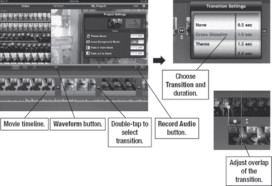

**图 17–5.** *为 **iMovie** 项目添加转场*

请按照以下步骤预览影片：

1.  将底部的**时间轴**控件滑到开头，然后轻触**播放**  按钮。
2.  完成后，轻触屏幕顶部中央的**我的项目**  按钮。这会让您返回到**项目**屏幕。

#### 分享你的影片

轻触`分享`按钮，`iMovie`会提供选项，让你将影片分享到`YouTube`、`Facebook`、`Vimeo`或`CNNiReport`。此外，你还可以选择将项目发送到`iTunes`。

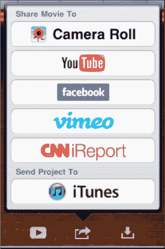

选择你想要分享项目的网站。随后会出现一个选项屏幕，让你选择影片的导出尺寸。你可以选择以高清（720p）、大（540p）或中等（360p）格式导出影片文件。

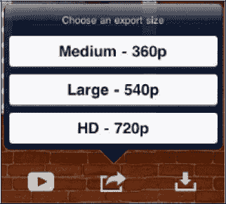

**注意**：高清 720p 影片画质最佳；但根据影片长度，文件可能非常大。显然，通过电子邮件发送或上传高清影片所需的时间会比同等长度的大或中等尺寸影片更长。

`导出`屏幕会显示影片导出的进度。按照以下步骤从你的`相机胶卷`分享项目：

1.  从`共享`菜单中选择`相机胶卷`选项。
2.  前往你的`相机胶卷`（更多操作详情请参见第 16 章：“iPad 摄影”）。
3.  在`相机胶卷`中找到新影片。图片底部会显示`视频`图标；图像中还会显示视频时长。
4.  从`相机胶卷`中轻触该视频。
5.  从底部的虚拟按键中选择`分享`。
6.  选择以下方式之一发送项目：`电子邮件`、`MobileMe`、`YouTube`或`拷贝`。

**注意**：为保持高清 720p 视频的质量，你应该将其同步回电脑。通过 Wi-Fi 手动上传可能让你以最高质量分享影片。将影片同步到 iTunes 可确保原始画质得以保留。

##### 上传至 YouTube

iPad 允许你将高清（720p）的`iMovie`项目直接上传到你的 YouTube 账户。你只需连接到 Wi-Fi 网络。按照以下步骤将视频上传至 YouTube：

1.  在`iMovie`项目中找到要上传的项目。
2.  轻触`分享`图标。
3.  选择`YouTube`。
4.  为视频输入`标题`、`描述`和`标签`。
5.  为`大小`选择`中等`、`大`或`高清`。
6.  为视频选择一个`类别`。
7.  完成后轻触`分享`按钮。
8.  最后，选择`在 YouTube 上查看`或`告诉朋友`（通过电子邮件）视频已发布（参见图 17–6）。

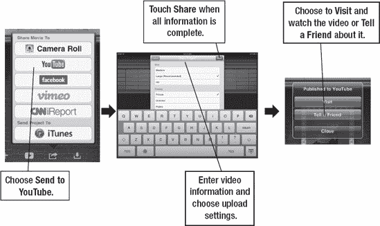

**图 17–6.** *将`iMovie`项目上传至 YouTube*

## 第 18 章

## FaceTime 视频通话与 Skype

你的 iPad 为生活带来了许多新功能，其中一些在几年前还像是科幻小说。例如，视频通话现在不仅成为可能，而且通过全新的`FaceTime`应用变得极为易用。

只要你与通话对方都使用 iOS 设备，并且都连接到 Wi-Fi 网络，就可以进行无限时的视频通话。在本章中，我们将向你展示如何启用和使用`FaceTime`程序，以及如何使用这一出色新功能开始享受乐趣。

通过`Skype`（许多人在电脑上使用的热门视频通话和聊天程序）也可以实现 Wi-Fi 通话。我们将向你展示如何在 iPad 上使用`Skype`应用。

### 视频通话

多年来，我们曾在电视节目和电影中目睹过此类未来技术的首次亮相。例如，许多节目和电影中的人们使用小巧的便携电话交谈并进行视频对话。甚至上世纪 70 年代的动画片《摩登原始人》也曾将此作为一个未来概念。

iPad 将这种未来构想变成了今天的现实。

#### 设置 FaceTime

在 iPad 上首次使用`FaceTime`时需要进行设置。该过程通常非常简单。由于 iPad 不是手机，`FaceTime`需要关联一个电子邮件地址才能正常工作。请按照以下步骤将`FaceTime`与电子邮件地址关联：

1.  轻触`FaceTime`图标（通常位于 iPad 的第一个`主屏幕`上）。
2.  使用你的`Apple ID`或`MobileMe`用户名和密码登录你的 Apple 账户。如果你没有账户（或想专门为`FaceTime`创建一个新账户），只需轻触`创建新账户`按钮（参见图 18–1）。
3.  账户设置完成后，你可以选择用于拨打`FaceTime`通话的电子邮件地址。你还可以添加其他电子邮件地址用于你的`FaceTime`账户。

**注意：** 一旦`FaceTime`设置完成，你随时可以进入`设置`，然后选择`FaceTime`标签进行调整或添加更多电子邮件地址。在此标签下，你可以选择添加更多电子邮件地址或更改`FaceTime`通话的来电显示。

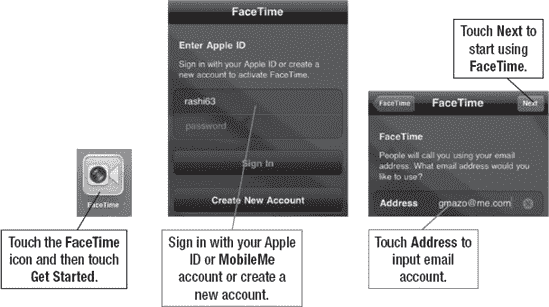

**图 18–1.** *在 iPad 上设置 FaceTime 账户*

#### 使用 FaceTime 进行视频通话

`FaceTime`是苹果众多 iPhone 和 iPad 广告中重点突出的应用。本质上，`FaceTime`是通过 Wi-Fi 进行免费通话，让你能够通过设备的前置摄像头看到通话另一端的对方。

**注意**：目前`FaceTime`仅适用于 Mac、新款 iPhone 4、iPod touch 以及运行 iOS 4.3 及更高版本的最新型号 iPad 2 设备；此外，它仅能在 Wi-Fi 网络下使用。

##### 在 iPad 上启用 FaceTime 通话功能

当你首次使用 iPad 时，`FaceTime`尚未启用。要启用 iPad 接收和拨打`FaceTime`通话，请按以下步骤操作：

1.  找到并轻触`设置`图标。
2.  向下滚动到`FaceTime`选项标签。
3.  将`FaceTime`开关切换到`开启`位置。

#### 使用 FaceTime

一旦`FaceTime`启用，你就可以从`FaceTime`应用或联系人页面底部的`FaceTime`按钮发起`FaceTime`通话。但`FaceTime`仅在对方也使用 iPad 2、iPod touch 或 iPhone 4，并且双方设备均启用了`FaceTime`功能时才能工作。

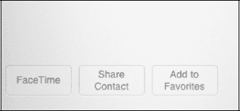

要发起`FaceTime`通话，请按以下步骤操作：

1.  轻触 iPad 上的`FaceTime`图标（最初位于第一个`主屏幕`上）。
2.  选择能够接收`FaceTime`通话的`个人收藏`、`最近通话`或`联系人`。应用会请求通话另一端的对方`接受`该`FaceTime`通话。

接听他人的来电也很简单。只需通过轻触`接听`按钮来`接受`对方的`FaceTime`通话；如果 iPod 处于`睡眠`模式，则通过`滑动来接听`（参见图 18–2）。

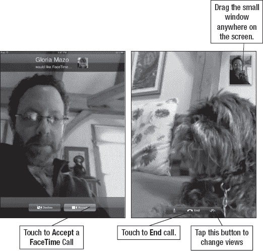

**图 18–2.** *接听`FaceTime`通话*

一旦`FaceTime`通话建立，按照以下步骤进行视频会议：

1.  将设备稍微拿远一些。
2.  确保自己在窗口中*取景*得当。
3.  你可以将显示自己的小图像拖到屏幕上的方便位置。
4.  轻触`切换摄像头`按钮，向`FaceTime`通话对方展示你所看到的画面。`切换摄像头`按钮此时将使用 iPad 背面的标准摄像头。在图 18–3 中，我能看到朋友女儿正在做什么，而她能在右下角看到她的妈妈和我。
5.  轻触`结束`按钮来结束`FaceTime`通话。
6.  轻触`静音`按钮可暂时将通话静音。

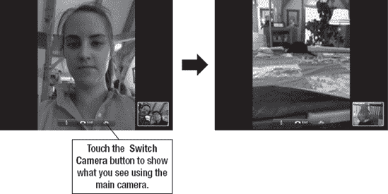

**图 18–3.** *在`FaceTime`通话中切换摄像头画面*

**注意**：你可以在 iPad 2 上以`竖屏`和`横屏`模式使用`FaceTime`。只需记住，当处于`横屏`模式时，摄像头会位于设备的一侧。

#### 在 FaceTime 中设置收藏

与使用 iPhone 时类似，您可以在 iPad 上为 `FaceTime` 通话设置`收藏`。您设置的收藏对象必须是拥有 iPad 2、iPod touch 或 iPhone 4 的用户，且这些用户也需要将设备设置为可进行 `FaceTime` 通话。请按照以下步骤将联系人添加到您的`收藏`中：

1. 像之前一样启动 `FaceTime` 应用。
2. 点击底部的`收藏`软键（请参见 图 18–4）。
3. 点击`加号` (`+`)，然后选择一个联系人添加到您的`收藏`中。

**注意**：选择联系人时，请选择该联系人的 iPhone 号码或与其 `FaceTime` 账户关联的电子邮件地址。

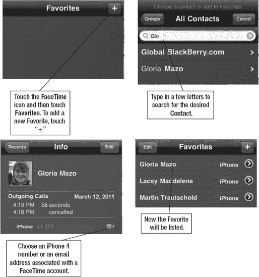

**图 18–4.** *在 `FaceTime` 中添加收藏*

#### 使用 FaceTime 进行多任务处理

新款 iPad 的一大特色是搭载了苹果最新的 iOS 软件，支持多任务处理（请参阅第 8 章：“多任务处理与语音控制”，了解更多关于如何在应用间切换的内容）。

当您正在进行 `FaceTime` 通话时，只需双击`主屏幕`按钮即可查看正在运行的其他应用。切换到另一个应用后，屏幕顶部会出现一个提示栏，显示“轻触以继续 FaceTime 通话”。部分用户反映，通过此方式操作后，有时难以返回 `FaceTime` 通话。

只需轻触该提示栏即可返回通话。

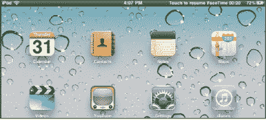

### 使用 Skype 拨打电话及更多功能

社交网络的核心在于与朋友、同事和家人保持联系。通过像 [`www.facebook.com`](http://www.facebook.com) 和 [`www.myspace.com`](http://www.myspace.com) 这样的网站进行被动交流固然不错，但有时，没有什么能替代亲耳听到对方声音的体验。

令人惊喜的是，您可以使用任何 iPad 上的 `Skype` 应用拨打电话。拨打给世界上任何其他 Skype 用户的电话都是免费的。Skype 的一大优点是它能在电脑和多种移动设备上运行，包括 iPhone 4、iPod touch、部分黑莓智能手机以及其他移动设备。拨打手机和座机电话会产生费用，但资费合理。

**注意**：只有当您拥有前置摄像头（例如 iPad 2、iPhone 4 或 iPod touch 上的那种）时，才能使用 `Skype` 应用进行视频通话。

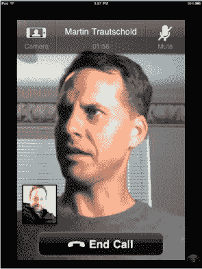

#### 将 Skype 下载到您的 iPad

您可以从 App Store 免费下载 `Skype` 应用，方法是搜索“Skype”并进行安装。如果您在操作过程中需要帮助，请查阅第 21 章：“神奇的 App Store”。不过，您应该注意到，与 `Facebook` 和其他应用类似，`Skype` 并没有原生的 iPad 版本，因此您将使用的是 iPhone 版应用。

#### 在 iPad 上创建 Skype 账户

如果您需要设置 Skype 账户，并且尚未在电脑上完成此操作（请参阅本章后面的“在电脑上使用 Skype”部分），请按照以下步骤在 iPad 上设置 `Skype`：

1. 在`主屏幕`上点击 `Skype` 图标。
2. 点击`创建账户`按钮。
3. 在弹出的`无法拨打紧急电话`警告窗口中点击`接受`。
4. 输入您的`全名`、`Skype 名称`、`密码`和`电子邮件`，然后通过设置底部的开关来决定是否要`接收新闻和优惠`。
5. 点击`完成`按钮以创建您的账户。

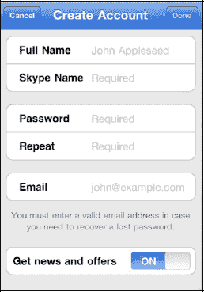

#### 登录 Skype 应用

创建账户后，您就可以在 iPad 上登录 `Skype` 了。请按照以下步骤操作：

1. 如果您尚未进入 `Skype`，请在`主屏幕`上点击 `Skype` 图标。
2. 输入您的`Skype 名称`和`密码`。
3. 点击右上角的`登录`按钮。
4. 您无需再次输入此登录信息；它已保存在 `Skype` 中。下次您点击 `Skype` 时，它将自动为您登录。

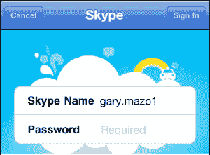

#### 查找并添加 Skype 联系人

一旦登录 `Skype` 应用，您就可以开始与他人沟通了。为此，您需要找到他们并将其添加到您的 `Skype` 联系人列表中：

1. 如果您尚未进入 `Skype`，请在`主屏幕`上点击 `Skype` 图标，如有提示则登录。
2. 点击底部的`联系人`软键。
3. 点击顶部的`搜索`窗口，然后输入某人的姓氏和名字或`SkypeName`。点击`搜索`以查找此人。
4. 当您看到要添加的人时，点击其姓名。

   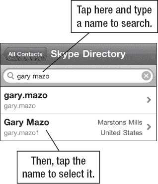

5. 如果您不确定此人是否正确，请点击`查看完整资料`按钮。
6. 点击底部的`添加联系人`。

   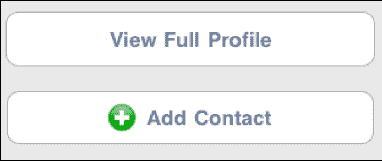

7. 适当调整邀请信息。
8. 点击`发送`按钮，向此人发送邀请，使其成为您的 `Skype` 联系人之一。

   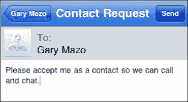

9. 重复此过程以添加更多联系人。
10. 完成后，点击底部的`联系人`软键。
11. 在`群组`屏幕中点击`所有联系人`，即可查看您添加的所有新联系人。
12. 一旦此人接受您为联系人，您将在`所有联系人`屏幕中看到其名字被列为联系人。

**提示：** 有时您可能需要删除某个 `Skype` 联系人。您可以通过在联系人列表中点击她的姓名来移除或屏蔽该联系人。点击`设置`图标（右上角），然后选择`从联系人中移除`或`屏蔽`。

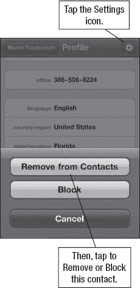

#### 在 iPad 上使用 Skype 拨打电话

到目前为止，您已经创建了账户并添加了联系人。现在，您终于可以在 iPad 上通过 `Skype` 拨打第一个电话了：

1. 如果您尚未进入 `Skype`，请在`主屏幕`上点击 `Skype` 图标，如有提示则登录。
2. 点击底部的`联系人`软键。
3. 点击`所有联系人`以查看您的联系人。
4. 点击您想要呼叫的联系人姓名（请参见 图 18–5）。
5. 点击`呼叫`按钮。
6. 您可能会看到 `Skype` 按钮和`手机`或其他电话按钮。按下 `Skype` 按钮即可拨打免费电话。拨打任何其他类型的电话都需要您使用 `Skype 点数` 付费。

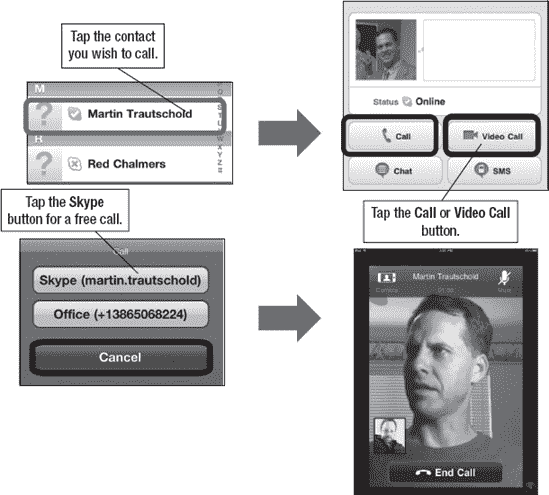

**图 18–5.** *在 iPad 上通过 `Skype` 拨打电话*

**注意：** 您可以使用 iPad 上的 `Skype Out` 免费拨打免费电话号码。以下通知来自 Skype 网站 [`www.skype.com`](http://www.skype.com)：

“以下国家和号码范围受支持，且对所有用户免费。我们正在努力覆盖世界其他地区。法国：+33 800、+33 805、+33 809 波兰：+48 800 英国：+44 500、+44 800、+44 808 美国：+1 800、+1 866、+1 877、+1 888 台湾：+886 80。”

#### 使用 Skype 切换摄像头

就像在 `FaceTime` 应用中一样，您可以通过“切换”到 iPad 的后置摄像头，向 `Skype` 通话对象展示您周围的环境。

只需点击左上角的`摄像头`软键，然后选择您希望在屏幕上显示`前置摄像头`、`后置摄像头`还是`无摄像头`。

如果您选择`无摄像头`，`Skype` 仍可正常工作，但您只能进行语音通话——没有视频画面。

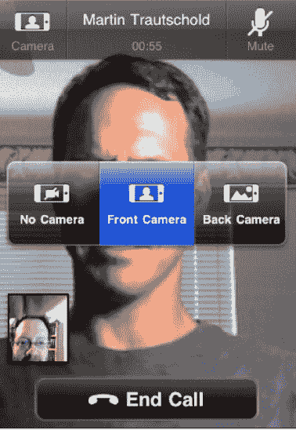

