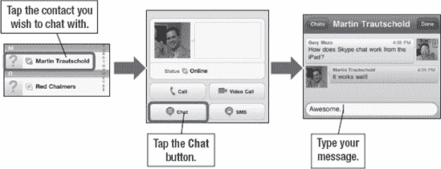

# 在 iPad 上使用 Skype 接听电话

Apple 的 `iOS` 系统原生支持后台网络语音 (VoIP) 通话。借助最新版本的 `Skype`，你可以让 `Skype` 在后台运行，并且仍然能够在有来电时接听 `Skype` 电话。你甚至（理论上）可以在一次语音通话中接听你的 `Skype` 电话！

**提示：** `Skype` 非常耗电。如果你想给某个在 iPad 上使用 `Skype` 的人打电话，只需给她发一封简短的邮件，或者快速打个电话提醒她，你想通过 `Skype` 应用和她通话。

## 购买 Skype 点数或月度订阅套餐

`Skype` 用户之间通话是免费的。但是，如果你想通过 `Skype` 拨打对方的座机或手机，则需要购买 Skype 点数或购买月度订阅套餐。如果你尝试在 `Skype` 应用内购买点数或订阅，它会跳转到 Skype 网站。因此，我们建议使用 iPad 上的 `Safari` 或电脑上的网页浏览器来购买这些点数。

**提示：** 你可能想先从少量的 Skype 点数开始，试用一下服务，然后再注册订阅套餐。如果你打算使用 `Skype` 应用与大量非 Skype 用户（例如，普通座机和手机）通话，那么订阅套餐会是更好的选择。

按照以下步骤使用 `Safari` 购买 Skype 点数：

1.  点击 `Safari` 图标。
2.  在顶部的地址栏中输入 [`www.skype.com`](http://www.skype.com)，然后点击 `Go`。
3.  点击页面顶部的 `Sign In` 链接。
4.  输入你的 `Skype Name` 和 `Password`，然后点击 `Sign me in`。
5.  如果你尚未进入 `Account` 界面，请点击顶部导航栏右侧的 `Account` 标签页。
6.  此时，你可以选择购买点数或订阅：
    *   点击 `Buy pre-pay credit` 按钮购买固定金额的点数。
    *   点击 `Get a subscription` 按钮购买月度订阅账户。
7.  最后，根据所选的购买类型完成付款指示。

## 使用 Skype 聊天

除了拨打电话，你还可以通过文本与 iPad 上的其他 `Skype` 用户聊天。开始聊天与开始通话非常相似；按照以下步骤操作：

1.  如果你还未进入 `Skype`，请从 `Home` 屏幕点击 `Skype` 图标，如有提示则登录。
2.  点击底部的 `Contacts` 软键。
3.  点击 `All Contacts` 查看你的联系人。
4.  点击你想聊天的联系人的名字（参见 图 18–6）。
5.  点击 `Chat` 按钮。
6.  输入你的聊天文本，然后按 `Send` 按钮。你的聊天内容将出现在屏幕顶部。

**图 18–6.** *在 iPad 上使用 `Skype` 聊天*

## 将 Skype 添加到你的电脑

你也可以在电脑上使用 `Skype` 应用。接下来我们将向你展示如何操作。如果你还连接了网络摄像头，还可以使用 `Skype` 在电脑上进行视频通话。

要创建 Skype 账户并为你的电脑下载 `Skype` 软件，请按照以下步骤操作：

1.  在你的电脑上打开网页浏览器。
2.  访问 [`www.skype.com`](http://www.skype.com)。
3.  点击页面顶部的 `Join` 链接。
4.  通过填写所有必填信息并点击 `Continue` 按钮来创建账户。请注意，你只需输入标记有星号的必填字段的信息。例如，你不需要输入性别、出生日期和手机号码。
5.  现在，账户设置过程就完成了。接下来，你会看到购买 Skype 点数的选项；不过，对于免费的 `Skype` 电话、视频通话和聊天来说，这不是必需的。

    **提示：** 只有当你想要给未使用 `Skype` 的人打电话时，才需要为 `Skype` 付费。例如，拨打座机或手机（未使用 `Skype`）的电话会产生费用。在本书出版时，即付即用费率约为每分钟 2.1 美分；月度订阅费用根据不同的通话套餐，大约在 3 到 14 美元之间。

6.  接下来，点击网站顶部导航栏中的 `Get Skype` 链接，将 `Skype` 下载到你的电脑。
7.  点击 `Get Skype for Windows` 按钮或 `Get Skype for Mac` 按钮。
8.  按照说明安装软件。
9.  软件安装完成后，启动它并使用你的 Skype 账户登录。
10.  你现在可以开始向任何使用 `Skype` 的人发起（或接听）电话、视频通话和聊天了，包括所有在 iPad 上使用 `Skype` 的朋友。

