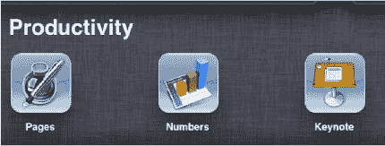
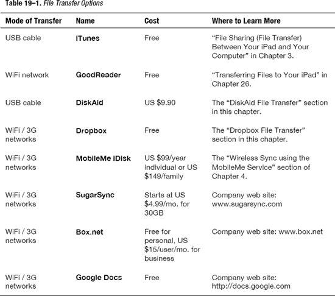

# 生产力与文件传输

你已经知道你的 iPad 非常适合消费或享受内容。它是你的音乐播放器、视频播放器和游戏机；它还能为你带来新闻、天气、体育等信息。不过，iPad 不仅仅用于娱乐和游戏。在本章中，我们将介绍 Apple 的三款生产力强效应用：`Pages`（与 `Microsoft Word` 兼容）、`Keynote`（与 `Microsoft PowerPoint` 兼容）和 `Numbers`（与 `Microsoft Excel` 兼容）。

如果你是一位 Mac 用户，你可能已经熟悉作为 `iWork for Mac` 套件一部分的 `Pages`、`Keynote` 和 `Numbers`。在你的 iPad 上使用这三个应用，你可以创建内容——而不仅仅是消费内容。

每个应用都内置了出色的创意工具，并且都能生成专业的、兼容 `Microsoft Office` 的文档，之后你可以通过电子邮件发送、上传到在线账户或在 iPad 上演示这些文档。

### 文件传输选项

一旦你开始在 iPad 上处理文件，你就会想知道如何传输你在 iPad 上创建的文件，或者如何将文件从电脑或其他地方传输到你的 iPad。在本章中，我们总结了一些文件传输选项（参见 表 19–1）。其中一些选项将在本书的其他地方详细描述，而另一些应用将在本章中进行介绍。

当然，你始终可以通过电子邮件将文件传入或传出 iPad，但这通常只适用于数量有限或体积较小的文件。有时，文件太大而无法作为电子邮件附件发送。这时，你就需要诸如 `DiskAid` 或 `Dropbox` 之类的文件传输解决方案。

接下来，我们将介绍两种文件传输选项：`DiskAid`，它通过 USB 数据线将 iPad 连接到电脑来工作；以及 `Dropbox`，它提供无线文件传输。

