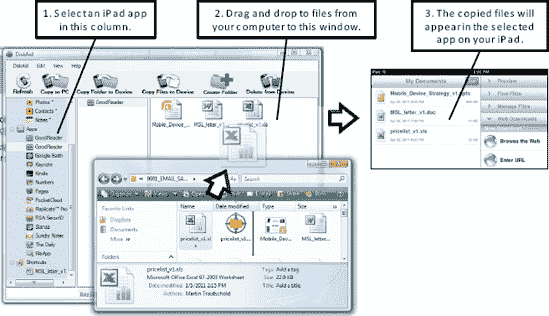

# DiskAid 文件传输

如果你更喜欢使用 USB 连接线，并且希望能够真正访问 iPad 上的所有文件，包括电子表格、文字处理文档、演示文稿文件、图片、视频，甚至是 FaceTime 通话记录、语音备忘录和备忘录等内容，那么 `DiskAid` 是一个不错的选择。

`DiskAid` 支持在 PC 和 Mac 上运行。在本文撰写时，你可以下载一个免费试用 14 天的版本。这个试用版让你在支付 9.90 美元购买之前，可以先对软件进行测试。

你可以直接从 DiskAid 网站获取该软件，网址是 [`www.digidna.net/products/diskaid/download`](http://www.digidna.net/products/diskaid/download)。

在你的电脑上运行 `DiskAid` 并通过 USB 线将 iPad 连接到电脑后，你应该会看到主屏幕，上面显示了你 iPad 上安装的应用程序（参见 图 19–1）。

要复制文件，你需要执行以下操作：

1.  在 `DiskAid` 的左侧栏中选择一个 iPad 应用。在本示例中，我们选择了 `GoodReader`。
2.  打开一个窗口浏览你电脑中的文件，然后将选中的文件拖放到 `DiskAid` 右侧的主窗口上。
3.  接着，断开 iPad 的连接并检查该应用（此处为 `GoodReader`）。你应该能看到刚刚拖放过来的文件。

**提示：** 要将文件从 iPad 复制到电脑，请执行相反的操作——将文件从 iPad 拖放到你的电脑文件夹中。你也可以通过选中 `DiskAid` 中的文件，然后按电脑键盘上的 `Delete` 键来删除 iPad 上的文件。

**图 19–1.** *使用 `DiskAid` 复制文件*

