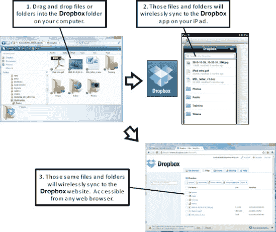

# Dropbox 文件传输

`Dropbox` 与 `DiskAid` 在一些方面有所不同。首先，它是无线的；无需 USB 连接线连接到电脑。其次，`Dropbox` 不仅允许你在 iPad 和电脑之间同步文件，还能在多台电脑（例如 Windows、Mac 和 Linux）以及 Dropbox 网站之间同步文件。第三，你需要在 iPad 和电脑上都安装一个应用。好处是你可以免费存储和传输最多 2 GB（千兆字节）的文件。如果你想存储多达 50 GB 的文件，价格是 9.99 美元/月或 99.00 美元/年。还有更大的存储方案可供选择。

**提示：** 使用 `Dropbox`，你还可以通过 PIN 码来保护你的文件，以进一步增强安全性。这意味着你可以在移动设备上安全地存储和访问个人信息、税务信息和个人照片。

请按照以下步骤在 iPad 上使用 `Dropbox`：

1.  注册一个免费账户，并从 [`www.dropbox.com`](http://www.dropbox.com) 下载电脑（PC 或 Mac）应用。
2.  接着，前往 iPad 上的 App Store，找到并下载免费的 `Dropbox` 应用。
3.  使用你首次设置账户时创建的用户名和密码登录 iPad 上的 `Dropbox`。
4.  你拖入电脑 `Dropbox` 文件夹的任何文件或文件夹，都将无线同步到 iPad 上的 `Dropbox` 应用（参见 图 19–2）。

**图 19–2.** *使用 `Dropbox` 复制文件*

放入 iPad 上 `Dropbox` 应用的文件，也会出现在电脑的 Dropbox 文件夹中，以及 [`www.dropbox.com`](http://www.dropbox.com) 网站上。换句话说，重要文件会在 [`www.dropbox.com`](http://www.dropbox.com) 上自动备份。

你甚至可以与其他人（比如同事、朋友或家人）分享你 Dropbox 账户中的特定文件夹。这是一种分享大小文件的绝佳方式，因为你无需担心发送电子邮件附件时有时会遇到的大小限制。

现在你已经了解了如何在 iPad 之间传输大小文件的基本知识，可以开始探索一些高效的办公应用了。

