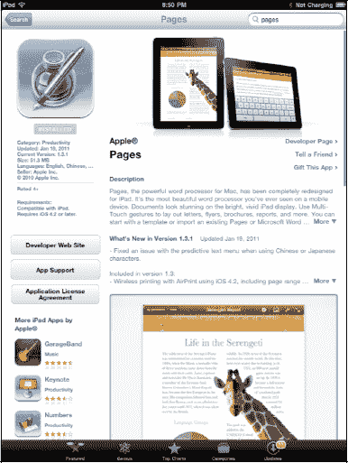

# 办公应用

正如我们之前提到的，使用 `Pages` 作为文字处理器，`Numbers` 作为电子表格，`Keynote` 进行演示，可以极大地提升你在 iPad 上的移动办公效率。

## 下载 Pages、Keynote 和 Numbers

`Pages`、`Keynote` 和 `Numbers` 都可以在 App Store 购买和下载。在本文撰写时，每个应用的价格为 9.99 美元。

最简便的方法可能是在右上角的 `Search`（搜索）窗口中输入 `Pages` 来查找。

接下来，在 `Pages` 下载页面中，通过查看左下角 `More iPad Apps by Apple`（更多 Apple 出品的 iPad 应用）部分来找到 `Keynote` 和 `Numbers`。

